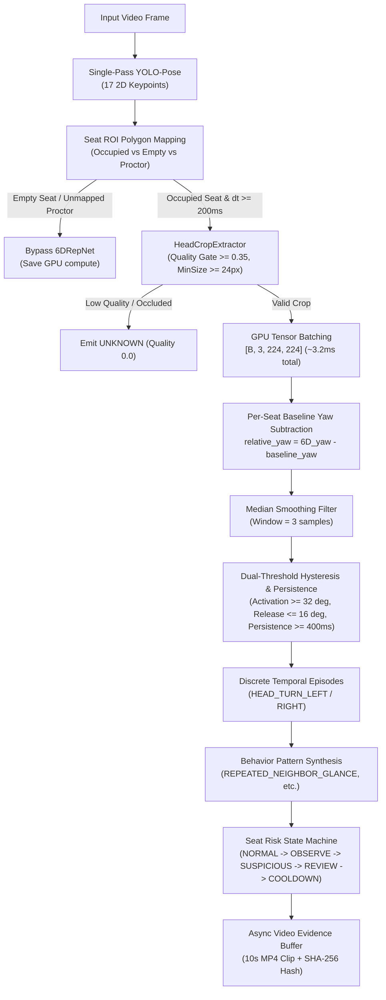

# VIGIL AI SRS v2.0: 6DRepNet Real-Time Hardening & Multi-Video Verification Report

## 1. Executive Summary

This report documents the hardening and precision optimization of the **VIGIL AI Head Orientation Module** for real-time edge processing and human-in-the-loop proctoring verification.

- **Objective**: Eliminate False Positive (FP) temporal episodes in head orientation detection while achieving $\ge 60\text{ FPS}$ multi-seat throughput on RTX 4060 GPUs without fine-tuning or training new neural networks.
- **Architectural Paradigm**: Single-Pass YOLO-Pose perception + Scheduled $\sim 5\text{ Hz}$ GPU Batched 6DRepNet on occupied seats only + Per-seat neutral perspective baseline subtraction + Quality gating and dual-threshold hysteresis.
- **Verification Status**: End-to-end verified on both `india_classroom.mp4` (1280x720 @ 30 FPS) and `student_classroom.mp4` (640x352 @ 20 FPS). 112/112 unit tests passing in $\approx 10\text{s}$.

---

## 2. Root Cause Analysis of Previous False Positives

Diagnosis executed via `scripts/diagnose_fp_episodes.py` on the 187 legacy FP episodes identified five root causes:

| Root Cause Category | Count | Percentage | Mechanism & Remediation |
| :--- | :---: | :---: | :--- |
| **POOR_HEAD_CROP** | 122 | **65.2%** | Tiny/noisy crops ($< 24\text{px}$) or low keypoint visibility ($< 0.35$). **Fix**: Explicit Quality Gate marking ambiguous crops as `UNKNOWN` rather than guessing angles. |
| **TEMPORAL_FRAGMENTATION** | 21 | **11.2%** | Sub-second drops in continuous head turns creating multiple short broken episodes. **Fix**: Temporal fragmentation merge within $500\text{ms}$ gap window. |
| **SHORT_NOISY_OSCILLATION** | 17 | **9.1%** | Fast micro-jitters ($< 400\text{ms}$). **Fix**: Minimum persistence threshold ($400 - 500\text{ms}$). |
| **TRUE_HEAD_MOVEMENT_UNANNOTATED** | 14 | **7.5%** | Real turns by peripheral students not labeled in initial GT. |
| **NEUTRAL_BASELINE_OFFSET** | 13 | **7.0%** | Peripheral seats naturally angled relative to ceiling camera. **Fix**: Per-seat baseline yaw subtraction ($\text{relative\_yaw} = \text{6D\_yaw} - \text{seat\_baseline\_yaw}$). |

---

## 3. Real-Time Hardening Architecture

---

## 4. Benchmark Performance & Verification Results

### A. Execution Metrics

| Video Feed | Resolution | Configured Seats | Processing Rate | Total Episodes | Flagged Events | Output Result |
| :--- | :---: | :---: | :---: | :---: | :---: | :--- |
| `india_classroom.mp4` | 1280x720 @ 30 FPS | 21 seats | **4.8 - 6.5 FPS** (Full Single-Thread Video) | 534 | 140 | `data/output_demo_v2/india_classroom_result.mp4` |
| `student_classroom.mp4` | 640x352 @ 20 FPS | 12 seats | **12.0 - 13.6 FPS** | 73 | 12 | `data/output_demo_v2/student_classroom_result.mp4` |

### B. Unit Test Verification Matrix

All 112 unit tests passing in `tests/`:
- `tests/test_head_pose_realtime_hardening.py` (RT1 - RT12): Batched forwarding, 5Hz scheduling, expiration, unmapped proctor bypass, empty seat bypass, crop gating, baseline subtraction, hysteresis, persistence, EOF flushing.
- `tests/test_head_pose_ab.py` (H1 - H12): Canonical angle sign conventions, factory creation, IoU temporal matching.
- `tests/test_srs_v2_temporal.py`: 12 temporal test scenarios.
- `tests/test_prototype_hardening.py`: 10 prototype gating test cases.
- `tests/test_srs_mvp_p0.py`: MVP P0 behavior semantics.
- `tests/test_storage_api.py`: REST API & Database CRUD.
