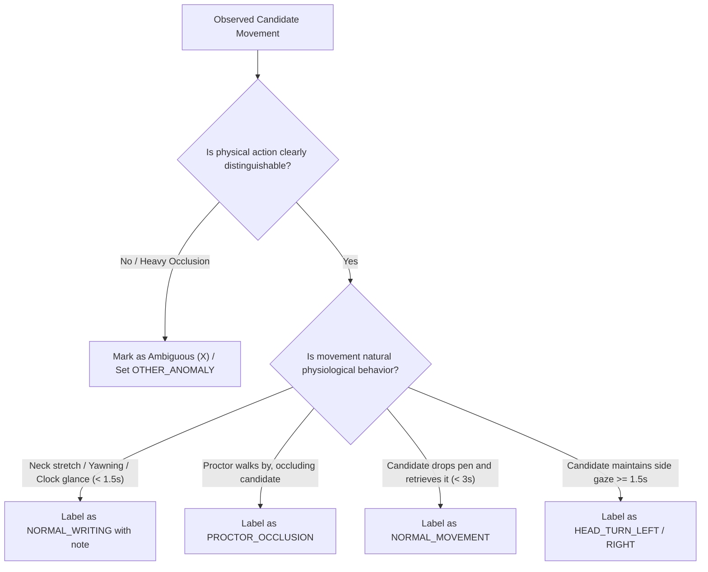

# VIGIL AI — Human Ground-Truth Annotation Guideline (v1.0)
## Standard Operating Procedure for Image Audit & Video Temporal Episode Labeling

**Target System:** VIGIL AI Enterprise Exam Proctoring Suite  
**Architecture Baseline:** SRS v2 Actor-Centric Temporal Pipeline  
**Version:** 1.0  
**Effective Date:** September 2026  
**Audience:** Human Annotators, AI/ML Engineers, Proctor Reviewers, Quality Assurance Leads

---

## 1. Core Annotation Philosophy: Observable vs. Inferential Semantics

> [!IMPORTANT]
> **Strict Rule of Observable Ground Truth**: Annotators must label **ONLY what is physically observable in the video or image frame**. Never annotate candidate psychological intent or legal conclusions.

### Prohibited vs. Required Semantic Terminology

| ❌ Prohibited Inferential Label | ✅ Required Observable Ground-Truth Label | Operational Definition |
|---|---|---|
| `CHEATING` / `COPYING` | `HEAD_TURN_LEFT` / `HEAD_TURN_RIGHT` | Candidate's head is rotated $\ge 35^\circ$ toward an adjacent candidate's desk area. |
| `CHEATING_USING_PHONE` | `PHONE_OR_DEVICE_INTERACTION` | A mobile handset, smartwatch, or electronic device is visually confirmed in hand or lap. |
| `HIDING_CONTRABAND` | `HAND_BELOW_DESK` | Hands are placed below table edge, under desk cavity, or into pockets for $\ge 2.0\text{s}$. |
| `LOOKING_AT_CHEAT_SHEET` | `PROLONGED_DOWN_GAZE` | Head is pitched downwards at an extreme angle ($\text{Pitch} \ge 40^\circ$) looking away from the desk surface into lap/groin area. |
| `NO_CHEATING` | `NORMAL_WRITING` | Candidate is sitting upright, facing their assigned desk, writing or reading the exam paper. |
| `EXCHANGE_ANSWERS` | `PAPER_PASSING` / `OBJECT_INTERACTION` | Physical transfer of scrap paper, calculator, or stationery between two candidates. |

---

## 2. Standardized Observable Action Taxonomy

### 2.1 Head & Gaze Dynamics

#### `NORMAL_WRITING`
- **Definition:** Candidate's head is oriented forward or downward within nominal writing range (Head Yaw $|\text{Yaw}| \le 25^\circ$, Pitch $-20^\circ \le \text{Pitch} \le 30^\circ$). Both hands are resting on the desk surface.
- **Duration:** Sustained baseline state.
- **Inclusion Criteria:** Candidate holds pen, writes, turns exam page, or briefly pauses to think while facing desk.
- **Exclusion Criteria:** Head turned toward neighbor desk or prolonged gaze outside assigned seat polygon.

#### `HEAD_TURN_LEFT` / `HEAD_TURN_RIGHT` (or generic `HEAD_TURN_SIDE`)
- **Definition:** Candidate rotates their head horizontally by $|\text{Yaw}| \ge 35^\circ$ toward the left or right neighbor desk.
- **Temporal Boundaries:**
  - **Start Timestamp ($t_{\text{start}}$):** Frame where head begins accelerating past $25^\circ$ toward neighbor.
  - **Peak Timestamp ($t_{\text{peak}}$):** Frame of maximum angular deviation / gaze fixation.
  - **End Timestamp ($t_{\text{end}}$):** Frame where head returns inside the nominal range ($|\text{Yaw}| < 25^\circ$).
- **Minimum Duration:** $\ge 800\text{ ms}$ (isolated rapid blinks or jerks $< 500\text{ ms}$ should be flagged as `NORMAL_MOVEMENT`).

#### `HEAD_TURN_BACK`
- **Definition:** Candidate twists upper body or neck $> 90^\circ$ backwards to look at candidates or activity behind them.

#### `HEAD_LEAN_FRONT`
- **Definition:** Candidate extends head forward and upward to gaze over the head or shoulder of the candidate seated in front.

---

### 2.2 Torso & Posture Dynamics

#### `TORSO_LEAN_LEFT` / `TORSO_LEAN_RIGHT`
- **Definition:** Upper torso laterally deviates by $\ge 25^\circ$ or crosses the virtual boundary into the aisle/neighbor seat zone.
- **Associated Signals:** Often co-occurs with `HEAD_TURN_SIDE` to gain direct line-of-sight to neighbor's test paper.

---

### 2.3 Hand & Object Interaction

#### `HAND_BELOW_DESK`
- **Definition:** One or both wrists/hands disappear below the desk horizontal line for $\ge 2.0\text{ s}$ while the candidate's gaze is directed downward into their lap.
- **Positive Example:** Candidate drops left hand between knees while eyes repeatedly glance down and back up.
- **Negative Example:** Candidate drops pen on floor and immediately bends down to pick it up ($< 3.0\text{ s}$, label as `OBJECT_RETRIEVAL` or `NORMAL_MOVEMENT`).

#### `PHONE_OR_DEVICE_INTERACTION`
- **Definition:** Visual confirmation of candidate holding, tapping, or concealing a smartphone, smartwatch, or earbud.

#### `PAPER_PASSING`
- **Definition:** Candidate extends hand across seat boundary holding a sheet of paper or calculator into neighbor's desk zone.

---

## 3. Edge Cases & Ambiguity Resolution Protocol

### Specific Edge Case Rules

1. **Looking at the Wall Clock / Whiteboard:**
   - If candidate raises head directly upward ($\text{Pitch} \le -25^\circ$, $|\text{Yaw}| \le 15^\circ$) toward the room clock for $1\text{--}4\text{ s}$ and returns to writing $\implies$ **`NORMAL_WRITING`** (add note: `LOOKING_AT_CLOCK`).
2. **Proctor Passing by / Interaction:**
   - If a proctor walks down the aisle and blocks candidate camera view $\implies$ **`PROCTOR_OCCLUSION`** (do not annotate as suspicious head turn).
   - If proctor is checking candidate ID card $\implies$ **`PROCTOR_INTERACTION`**.
3. **Candidate Asks for Extra Draft Paper:**
   - Candidate raises hand and looks toward front proctor desk $\implies$ **`NORMAL_WRITING`** (note: `RAISING_HAND`).
4. **Dropped Stationery:**
   - Candidate immediately looks down to pick up dropped pen on floor ($< 3\text{ s}$) $\implies$ **`NORMAL_MOVEMENT`**.
5. **Partial Desk Occlusion:**
   - If bottom desk area is dark/shadowed and annotator cannot verify whether hands are holding an object $\implies$ Check **`Flag as Ambiguous (X)`** in workbench and set notes `SHADOW_OCCLUSION`.

---

## 4. Video Temporal Episode Annotation Protocol

When annotating staged or demo videos in `/data-workbench`:

1. **Step 1: Select Seat ROI:**
   - Select the target candidate seat code (`SEAT-01`, `SEAT-02`, etc.) before setting timestamps.
2. **Step 2: Locate Start Timestamp ($t_{\text{start}}$):**
   - Play or scrub video to the exact frame where the physical movement initiates. Press `Mark Start [` or enter millisecond timestamp.
3. **Step 3: Locate Peak Timestamp ($t_{\text{peak}}$):**
   - Scrub to the apex of the movement (maximum neck rotation, maximum torso lean). Press `Mark Peak P`.
4. **Step 4: Locate End Timestamp ($t_{\text{end}}$):**
   - Scrub to the frame where candidate returns to baseline upright writing posture. Press `Mark End ]`.
5. **Step 5: Select Observable Label & Target Neighbor:**
   - Select the matching class and specify target neighbor seat code if applicable (`SEAT-02`).
6. **Step 6: Submit Ground-Truth Episode:**
   - Click `+ Add Ground-Truth Episode`. The system immediately renders the green ground-truth bar on the dual timeline and recomputes the **Temporal IoU** ($\text{IoU}_{\text{time}}$) against AI proposals.

---

## 5. Human-in-the-Loop AI Event Triage Decision Codes

When reviewing AI detection events in the `/data-workbench` Event Review Queue:

| Decision | Allowed Reason Codes | Action Taken by System |
|---|---|---|
| **`CONFIRMED`** | `TRUE_SUSPICIOUS`, `REPEATED_PEEKING`, `UNAUTHORIZED_DEVICE`, `COMMUNICATION_CONFIRMED` | Event is validated as an authentic review-worthy suspicious pattern; included in positive validation benchmark. |
| **`REJECTED`** | `NORMAL_BEHAVIOR`, `PROCTOR_OCCLUSION`, `NATURAL_STRETCH`, `LOOKING_AT_BOARD`, `LOW_IMAGE_QUALITY`, `SEAT_MAPPING_ERROR` | Event is logged as False Alarm; feedback is indexed for perception threshold calibration. |
| **`INCONCLUSIVE`**| `PARTIAL_OCCLUSION`, `EXTREME_CAMERA_ANGLE`, `INSUFFICIENT_RESOLUTION`, `UNRESOLVED_AMBIGUITY` | Event is flagged for secondary inspection by Lead Exam Inspector. |

---

## 6. Summary Checklist for Quality Assurance

- [x] All labels represent **observable physical movements**, never intent or accusations.
- [x] Every temporal episode has valid $t_{\text{start}} < t_{\text{peak}} \le t_{\text{end}}$ with duration $\ge 500\text{ ms}$.
- [x] Seat code and target neighbor are accurately assigned.
- [x] Ambiguous or occluded cases are flagged with `is_ambiguous = true` rather than forced into clean classes.
- [x] Original raw images and video files remain completely unmodified on disk.
