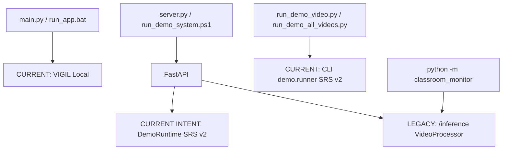
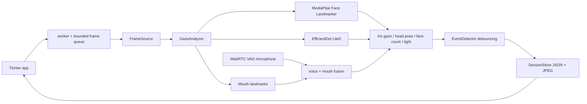
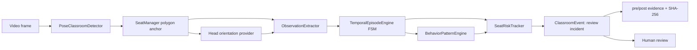
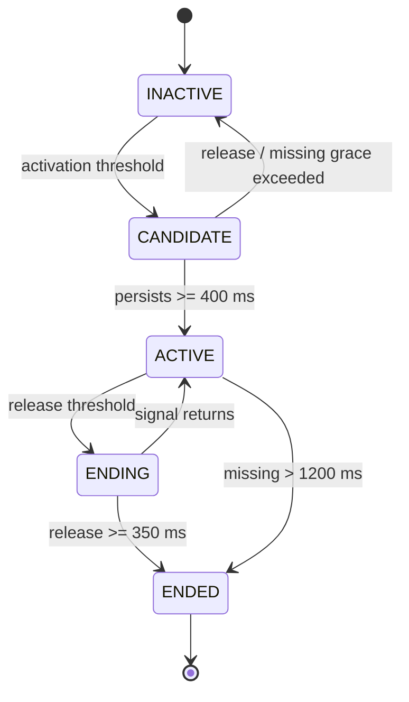
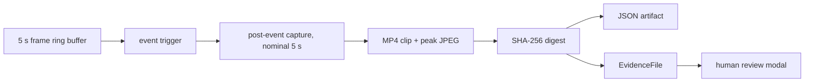
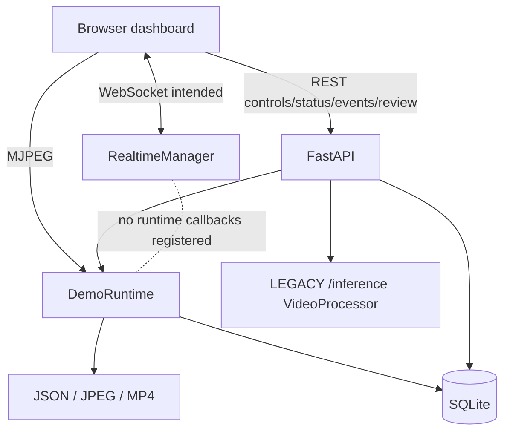
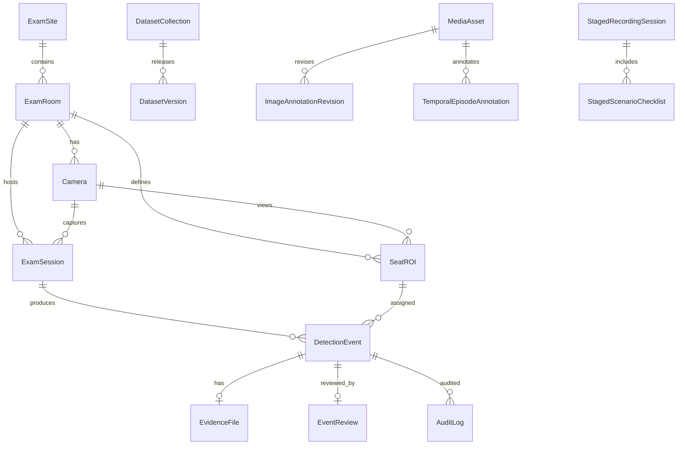
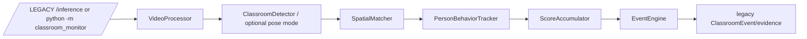
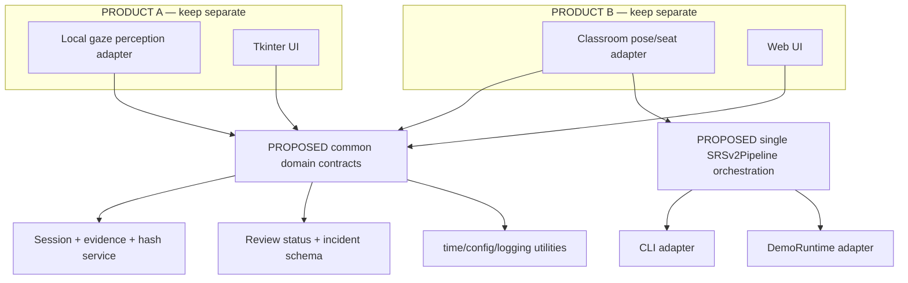

# VIGIL AI — Full Codebase Architecture, Correctness & Technical Debt Audit

> **SUPERSEDED AUDIT BASELINE (85d86c6).** Findings are retained for provenance. Current implementation facts and validation results are in `docs/PROTOTYPE_CURRENT_STATUS.md`.

**Audit date:** 2026-09-23  
**Target branch:** `feat/ictu-2026-prototype-final`  
**Audited commit:** `85d86c6cb7b280a32d3123dc77e7b2abec72c380`  
**Scope:** VIGIL Local/Gaze, VIGIL Classroom SRS v2, legacy classroom paths, API, dashboard, storage, training, data, tests and documentation.  
**Method:** read-only source/runtime-contract review plus the full automated test suite. No model benchmark was rerun and no functional source was changed.

## 1. Repository state and audit boundaries

| Item | Result |
|---|---|
| Local branch | `feat/ictu-2026-prototype-final` |
| Local HEAD before audit | `85d86c6cb7b280a32d3123dc77e7b2abec72c380` |
| `origin/feat/ictu-2026-prototype-final` after `git fetch origin` | `85d86c6cb7b280a32d3123dc77e7b2abec72c380` |
| Ahead / behind | `0 / 0` |
| Working tree before audit | Clean; no modified or untracked files |
| Test command | `.\venv\Scripts\python.exe -m pytest` |
| Test result | `237 passed`, `0 failed`, `1 SQLAlchemy warning`, 21.40 s |
| Accuracy conclusion | None. Passing code tests does not measure AI accuracy or field generalization. |

The committed tree contains 643 files. A large share of `data/` and `reports/visualizations/` is generated or historical evidence, not source. The only modifications authorized by this audit are the four new audit documents listed at the end.

## 2. Architectural inventory and classification

Classification follows runtime reachability, not filenames.

| Path/module | Classification | Runtime role / evidence |
|---|---|---|
| `main.py`, `exam_monitor/app.py`, `engine.py`, `events.py`, `audio.py`, `sources.py`, `models.py`, `storage.py`, `theme.py` | **ACTIVE — PRODUCT A** | Desktop Local/Gaze entry and complete local pipeline. |
| `eyes.py` | **COMPATIBILITY** | Earlier/local compatibility surface; `main.py` is the current desktop entry. |
| `server.py`, `api/main.py`, `api/routes/demo.py`, `dashboard/demo.html`, `dashboard/js/demo.js` | **ACTIVE — PRODUCT B WEB SHELL** | Intended unified SRS v2 web demo. Contains P0 runtime/realtime defects documented below. |
| `classroom_monitor/detector.py::PoseClassroomDetector` | **ACTIVE** | YOLO11 pose perception used by runner and runtime. |
| `seat_manager.py`, `scene_context.py`, `head_pose_provider.py`, `observation_extractor.py`, `temporal_episode_engine.py`, `behavior_pattern_engine.py`, `seat_risk_tracker.py` | **ACTIVE — SRS v2 CORE** | Current actor/seat/temporal pipeline. |
| `classroom_monitor/demo/runner.py` | **ACTIVE — CLI CANONICAL IMPLEMENTATION** | Drives both committed videos and produces artifacts successfully; currently the more internally coherent SRS v2 loop. |
| `classroom_monitor/demo/runtime.py` | **ACTIVE — WEB INTENDED, BROKEN AT INCIDENT BOUNDARIES** | Duplicates runner for web use; invalid evidence/event contracts fail at the first live or replay incident. |
| `demo/config.py`, `renderer.py`, `exporter.py` | **ACTIVE** | Presets, display and canonical JSON artifacts. |
| `video_buffer.py` | **ACTIVE** | Runner/runtime pre/post evidence clips; `reset()` deadlocks if called. |
| `async_evidence_writer.py` | **ACTIVE IN WORKER / TEST; PARTLY UNUSED IN DEMO** | Worker pipeline uses it; demo imports it mainly for hashing. It is a second evidence implementation. |
| `evaluation/temporal_matcher.py` | **ACTIVE TOOLING** | Strict seat/label/temporal benchmark and malformed-GT exclusion. |
| `api/routes/events.py`, `sessions.py`, `rooms.py`, `sites.py`, `cameras.py`, `seats.py`, `statistics.py`, `workers.py` | **ACTIVE ADMINISTRATIVE/REVIEW API** | CRUD/review/statistics surfaces; unauthenticated prototype endpoints. |
| `api/routes/data_workbench.py`, `storage/data_workbench_service.py` and dataset DB entities | **ACTIVE DATA WORKBENCH** | Human annotation, calibration validation and dataset export. |
| `api/routes/inference.py`, `classroom_monitor/__main__.py`, `video_processor.py`, `event_engine.py`, `behavior_tracker.py`, `score_accumulator.py`, `room_context.py`, `live_event.py` | **LEGACY BUT REACHABLE** | Semantic-classification pipeline remains exposed at `/inference` and `python -m classroom_monitor`; its API adapter has contract-breaking calls. |
| `detector.py::ClassroomDetector` | **LEGACY BUT REACHABLE** | Five semantic classes and synthetic fallback; selected by legacy config. |
| `spatial_matcher.py` | **LEGACY/REUSABLE** | Used by legacy `EventEngine`; current SRS v2 demo does not use it for actor identity. |
| `worker_node.py`, `rtsp_reader.py`, `behavior_signals.py` | **EXPERIMENTAL / ALTERNATE SRS MVP** | Used by scalability script/tests, not by unified web or CLI demo. |
| `classroom_training/` | **LEGACY TRAINING / EXPERIMENTAL** | Fine-tunes five semantic cheating classes; does not train current pretrained pose detector or 6DRepNet. |
| `configs/scenes/*.yaml` | **ACTIVE** | Seat polygons, baselines, desk boundaries, capabilities and inferred-neighbor inputs. |
| `validation/*.json` | **TEST/VALIDATION SOURCE** | Hand-authored expected patterns/timeline; not a current measured result. |
| `data/ground_truth/` | **SOURCE + AUDIT ARTIFACT** | Frozen India GT plus integrity report; one malformed head record remains intentionally excluded. |
| `data/prototype_final/`, `optimization/`, `head_orientation_ab/`, `output_demo_*`, `acceptance_verification/` | **GENERATED/HISTORICAL ARTIFACTS** | Results from different commits/configurations; must not be combined as a single current benchmark. |
| `data/*.db`, evidence clips/images, session JSON | **GENERATED RUNTIME DATA** | Includes personal/video evidence and database state; many are Git tracked. |
| `reports/` and most existing `docs/*REPORT*.md` | **HISTORICAL DOCUMENTATION** | Several numeric claims refer to older commits/configurations. |
| `tests/` | **TEST-ONLY** | Broad SRS v2 unit coverage, limited true web/runtime/concurrency/end-to-end coverage. |
| `Dockerfile`, `docker-compose.yml` | **COMPATIBILITY / DEPLOYMENT SCAFFOLD** | Starts FastAPI server, not the Tkinter application; GPU/media-device assumptions are not comprehensively encoded. |
| `__pycache__/`, `.pyc`, output media, screenshots | **GENERATED ARTIFACT** | Some generated artifacts are tracked and make source/data boundaries unclear. |

## 3. Executable entrypoints and execution graph

| Entry | Subsystem | AI pipeline | UI | Input | Output / DB | Status |
|---|---|---|---|---|---|---|
| `python main.py` / `run_app.bat` | Local | MediaPipe face/iris/head + EfficientDet + optional VAD | Tkinter | webcam/video/image/screen | local JSON + JPEG evidence under `data/` | Current Product A |
| `python main.py --demo` / `run_demo.bat` | Local | deterministic `DemoSource`, not real inference | Tkinter | synthetic frames/results | local session/evidence | Explicit local simulation |
| `python server.py` / `run_server.bat` | Web/API | depends on selected endpoint | browser REST/WS/MJPEG | demo video, upload, DB camera | SQLite + artifact folders | Current server shell |
| `scripts/run_demo_system.ps1` | Classroom web | `DemoRuntime` via `/demo` | `dashboard/demo.html` | India/student preset | DB + demo run artifacts | Intended competition entry; P0 blockers |
| `run_classroom_demo.bat` | Classroom CLI | `demo.runner` SRS v2 | console/output video | India video | canonical JSON/video/evidence | Current CLI |
| `run_demo_video.bat` | Classroom CLI | `demo.runner` SRS v2 | console + OpenCV window | India video | canonical artifacts | Current CLI |
| `scripts/run_demo_video.py` | Classroom CLI | `demo.runner` SRS v2 | optional OpenCV | selected preset | configured output | Current |
| `scripts/run_demo_all_videos.py` | Classroom CLI | `demo.runner` twice | console | both committed videos | per-video artifacts | Current |
| `scripts/run_prototype.ps1` | Classroom acceptance workflow | tests then CLI runner | console | both videos | artifacts | Current script, not a UI |
| `python -m classroom_monitor` | Classroom legacy | `VideoProcessor` → semantic detector → `EventEngine` | OpenCV/console | video | legacy evidence/events | Legacy, reachable |
| `POST /api/v1/inference/*` | Classroom legacy | same `VideoProcessor` | REST | camera/upload/file | legacy DB/evidence | Legacy and contract-broken |

## 4. System A — current Local/Gaze architecture

### 4.1 Perception and calibration

- Face backend: MediaPipe Face Landmarker task file, maximum five faces, detection/presence confidence `0.32`, tracking confidence `0.35`. Largest face is the primary face; all faces contribute to face count.
- Iris normalization uses the average pupil position within both eye bounds: `gaze_x = (ratio_x - 0.5) * 2.8`, `gaze_y = (ratio_y - 0.5) * 2.6`.
- Smoothing is `smoothed = 0.72 * previous + 0.28 * current`.
- Calibration takes 36 accepted samples and stores their median. A sample is accepted while `|raw iris x/y| < 0.9`, `|yaw| < 13°`, `|pitch| < 11°`.
- Head pose gates calibration sampling but has no calibrated head baseline. The `0.9` iris gate is wide enough for a consistently off-centre initial look to become the baseline. Movement after calibration has no drift correction or recalibration trigger.
- Eye alert score is an ellipse: `sqrt((x/0.30)^2 + (y/0.34)^2)`. Direction activates above `1.0`; horizontal and vertical thresholds are symmetric around the calibrated baseline.
- Head and eye signals remain independent. Head turn uses `|yaw| > 15°` or `|pitch| > 13°`; combined display direction prefers head direction.
- A lost face holds the previous result for 0.8 s with reduced confidence and `tracking_held=True`. `EventDetector` does not gate held eye/head values, so a held value can extend a pending LOOK_AWAY/HEAD_TURN episode.
- OpenCV Haar fallback changes semantics: face count remains available but gaze is unknown, direction is centre for one face, calibration is false and confidence is fixed near `0.55`. The backend label indicates fallback, but initialization/inference exceptions are broadly swallowed.

### 4.2 Local event rules

These are observable-signal alerts, not cheating verdicts.

| Event | Source / activation | Persistence | Cooldown / recovery | Severity | Principal FP/FN risks |
|---|---|---:|---:|---|---|
| `LOOK_AWAY` | calibrated eye direction non-centre, exactly one person | 1.6 s | 4.0 s / 0.8 s | MEDIUM | calibration pollution, glasses/iris noise, tracking hold; misses in fallback |
| `HEAD_TURN` | head direction non-centre, exactly one person | 1.4 s | 4.0 s / 0.8 s | MEDIUM | camera placement, natural stretch; solvePnP/landmark loss |
| `TALKING` | fused audio VAD + mouth score, or strict visual fallback | 1.0 s | 5.0 s / 1.0 s | MEDIUM | coughing, room/proctor speech plus lip motion, clipping; mic failure raises FN |
| `NO_FACE` | `face_count == 0` | 3.0 s | 5.0 s / 1.0 s | MEDIUM | occlusion/lighting; 0.8 s hold delays activation |
| `MULTIPLE_FACES` | max(face count, detected people) >= 2 | 0.8 s | 5.0 s / 1.0 s | HIGH | poster/false person/nearby invigilator; detector scheduling |
| `SUSPICIOUS_OBJECT` | cached phone or book label | 1.0 s | 6.0 s / 1.2 s | HIGH | every book is assumed prohibited; 1.4 s cache can turn one detection into persistence |
| `LOW_LIGHT` | low-light signal | 5.0 s | 9.0 s / 2.0 s | LOW | dark clothing/background; misses local glare problems |

`started_at` and `ended_at` are both written at emission wall time; the reported duration is the persistence value, not a true captured signal interval. The generic event confidence is eye-centric and is not semantically valid for every object/no-face/light event.

### 4.3 Audio and object cues

- VAD: WebRTC, 16 kHz, 20 ms frames, aggressiveness 2; a 0.65 s rolling window is active with at least four frames, at least three voiced frames in the last 12, recent voice within 0.35 s, and level above -55 dB.
- With a working microphone, talking requires `voice_active AND visual_mouth_score >= 0.26`. Without one, strict rhythmic mouth motion is used. Audio and mouth are therefore fused, but the microphone is not speaker-local.
- Microphone audio is not stored; only derived voice state/level is attached to analysis. Privacy notice and explicit retention behavior are still needed.
- EfficientDet Lite0 runs every eighth analyzed frame, minimum score `0.32`, allows `person`, `cell phone`, `book`, and holds detections 1.4 s. Labels are deduplicated, but object episodes are not independently temporally tracked.
- There is no allowed-material policy. Any detected `book` is automatically suspicious, which is unsuitable for open-book exams.

### 4.4 Desktop UI, concurrency, performance and privacy

- UI text generally states that alerts require review and are not automatic cheating conclusions. The score is a severity-weight sum capped at 100 (`LOW=8`, `MEDIUM=18`, `HIGH=32`), not a probability.
- Windows DPI awareness is set. Worker-to-Tk communication uses a frame queue of size two and drops the oldest frame, which is appropriate for responsiveness; the control queue is unbounded.
- Tk polling is on the main thread. No clear direct Tk mutation from the worker was found.
- `stop()` joins only 0.8 s, then saves and clears the session even if the daemon worker remains alive. `close()` releases shared source/analyzer without first proving worker termination. This can lose late events or race resource teardown.
- FaceLandmarker runs per analyzed frame. EfficientDet scheduling limits its load; Tk image conversion/rendering and microphone callback add CPU work. These are code inferences, not measured FPS results.
- Local storage retains candidate ID, session metadata, JPEG frames and event history indefinitely unless manually removed. There is no face recognition or identity verification: face landmarks/gaze are geometric signals only.

## 5. System B — current Classroom SRS v2 architecture

This flow is verified in `demo/runner.py` and duplicated in `demo/runtime.py`. `SpatialMatcher` is not in the current demo path; seat identity is the polygon/seat code, not a tracked person identity.

### 5.1 Perception, seat mapping and head pose

- Current detector: Ultralytics `yolo11n-pose.pt`, person pose, confidence `0.20`, default image size 1280 (640 for the student preset).
- Legacy `ClassroomDetector` predicts five semantic classes (`back peeking`, `front peeking`, `phone using`, `side peeking`, `no cheating`) from `models/classroom_best.pt` or YOLO fallback. It is not part of the current CLI/web SRS v2 loop, but remains reachable.
- If Pose YOLO import/load fails, `PoseClassroomDetector` silently emits a synthetic grid of people. Neither runtime nor UI checks `_is_mock`, so simulated detections can be presented as live AI. This is P0 demo-integrity debt.
- Seat anchor is near bbox bottom (`bottom - 15% height`) and uses first containing polygon. Overlapping polygons, perspective and a walking invigilator can misassign. There is no current track continuity: `Detection` has no `track_id`; event track normally becomes `0`.
- Seat states: OCCLUDED through 4 s, UNKNOWN between 4–5 s, EMPTY after 5 s; multiple anchors in one ROI become MULTIPLE_PERSON. Roaming detections are isolated.
- Pose heuristic and optional 6DRepNet providers subtract per-seat yaw/pitch baselines. 6DRepNet crop minimum is 24 px, quality gate `0.35`, scheduled at 5 Hz, cache max age 600 ms; median smoothing window is three in the temporal engine.
- Runtime/runner pass the scene baseline in batch requests. Parser correctness is covered; whether the human calibration is correct for each seat is not established.
- On small/far/low-quality heads 6DRepNet returns UNKNOWN. The pose heuristic can return numerical zero after some missing/exception paths, so its quality and visibility gates must be interpreted carefully.

### 5.2 Scene context and capabilities

- Both flat and nested `baseline_yaw`, `baseline_pitch` and desk fields are parsed; nested values take precedence in parser tests.
- Current YAML has only a desk boundary, while declaring desk hand interaction ENABLED. `SeatContext.__post_init__` correctly downgrades boundary-only geometry to **DEGRADED** at runtime.
- Observation extraction may still emit an under-desk observation under DEGRADED geometry, but both pattern and risk stages require exactly ENABLED before producing strong risk. Thus current code prevents that weak geometry from generating a strong below-desk incident.
- Neighbors are mostly auto-inferred from pixel distance/row heuristics when not explicit. Incorrect camera perspective or seat layout can therefore turn natural scanning into a neighbor-directed pattern. Such inferred capability should be treated as UNVALIDATED until visually reviewed.

### 5.3 Observation contract

| Observation | Source / unit | Gate and UNKNOWN behavior | Downstream |
|---|---|---|---|
| head yaw | provider relative to seat baseline, degrees | head capability, crop/visibility/quality; otherwise absent/UNKNOWN | left/right head episode |
| head pitch | provider relative baseline, degrees | same as yaw | pitch-down episode; weight 0 by default |
| torso lean | shoulder keypoints, degrees | both shoulders confidence >=0.3 | left/right torso episode |
| left/right wrist zone | keypoints vs writing/desk polygons | low confidence, no geometry or disabled → UNKNOWN | writing/below-desk episode |
| occupancy | `SeatManager` state | explicit EMPTY/OCCUPIED/OCCLUDED/MULTIPLE; UNKNOWN preserved | seat-empty/multi episodes |
| nearby person count | number assigned to ROI | spatial mapping only | multi-person episode |
| wrist velocity | pixel/second history | requires valid wrist history | currently no meaningful downstream consumer |

`TORSO_ORIENTATION` exists as an enum concept but is not emitted. Shoulder-line angle is sensitive to camera roll and perspective. Missing keypoints do not create wrist positives, which is correctly tested.

### 5.4 Temporal FSM

- Source timestamps are video timestamps in runner/runtime, not processing wall time. Runner uses `(frame_idx-1)/fps`; runtime uses `frame_idx/fps`, an off-by-one-frame drift.
- Yaw activation/release is ±28°/±16°; lean ±15°/±8°; pitch down 20°/12°. Median window is three and resets after a 1500 ms gap.
- The same 1200 ms missing-observation grace is applied to head, torso, wrists and occupancy, despite different physical and upstream state semantics. Occupancy already includes 4–5 s coasting, so this adds another grace layer.
- Completed episodes accumulate for the duration of a run; identity is stable by UUID. There is no cross-run retention in the engine.

### 5.5 Patterns and false-positive boundaries

| Pattern | Required context | Timing | Main correctness risks |
|---|---|---:|---|
| `REPEATED_NEIGHBOR_GLANCE` | >=2 same-direction head episodes + matching neighbor | rolling 25 s, cooldown 10 s | natural scanning, wrong neighbor graph; same historical component set can be re-emitted after cooldown |
| `NEIGHBOR_ORIENTED_LEAN` | torso lean toward configured neighbor | >=1 s, cooldown 8 s | perspective/shoulder roll, stretch; confidence can exceed 1 after multiplier |
| `SEAT_LEFT` | active SEAT_EMPTY episode | >=15 s, cooldown 20 s | code does not prove prior occupancy, so an initially empty seat can become “left” |
| `MULTI_PERSON_DWELL_NEAR_SEAT` | >=2 people in/bordering ROI | >=2.5 s, cooldown 15 s | invigilator crossing/overlapping ROI |
| `BELOW_DESK_INTERACTION` | wrist below desk and desk capability ENABLED | >=1.5 s, cooldown 12 s | requires calibrated polygons; current boundary-only scenes are gated out |

`REPEATED_NEIGHBOR_GLANCE` keeps historical episodes and only rate-limits by `(seat, pattern type)`. Once two episodes qualify, the identical components can produce a new UUID after every 10 s cooldown until they age out at 25 s. The risk tracker therefore sees them as new evidence. This is a correctness defect, not threshold tuning.

### 5.6 Risk mathematics and incidents

Default one-time episode weights: head turn 12, pitch 0, torso 14, below-desk wrist 18 only when ENABLED, empty 0, multiple person 20. Pattern weights: repeated glance 38, neighbor lean 32, seat-left 45, multi-person 40, below-desk 35. Decay is 2.5 points/s; state thresholds are OBSERVE 30, SUSPICIOUS 60, FLAGGED 80; post-event reset is 45.

Idealized examples at quality/confidence 1.0 and before time decay:

| Evidence | Score | State/result |
|---|---:|---|
| one `HEAD_TURN` episode | 12 | NORMAL; no incident |
| two distinct `HEAD_TURN` + first repeated-glance pattern | `12+12+38 = 62` | SUSPICIOUS; not yet review event |
| one multi-person episode + dwell pattern | `20+40 = 60` | SUSPICIOUS; not yet review event |
| enabled below-desk episode + pattern | `18+35 = 53` | OBSERVE; current scenes are DEGRADED so contribution is zero |
| torso episode + lean pattern | `14+32 = 46` | OBSERVE |

Actual increments multiply pattern weight by quality, confidence and diminishing-return factor; decay lowers values. Correlated active head+torso adds 3 points/s. Component + composite scoring is deliberate double contribution, but needs calibration because it can overstate correlated evidence.

Episode and pattern IDs are deduplicated per profile. However, regenerated pattern UUIDs bypass that defense. `peak_pattern` is the latest recognized pattern, not necessarily the largest contributor. Any newly ingested pattern updates an active incident's occurrence count before verifying the same behavior; this can merge heterogeneous evidence metadata. Recidivism adds 10 points on every update call while the predicate remains true, enabling frame-rate-dependent escalation.

One logical incident is held as `active_incident` plus an in-place `active_event`; exported JSON deduplicates by event ID. DB/API/dashboard consistency is incomplete, described below.

### 5.7 Evidence pipeline and integrity

- `demo.runner` correctly calls `EvidenceVideoBuffer.trigger_clip`, flushes at EOF, then hashes an existing clip and exports canonical artifacts.
- `video_buffer.reset()` acquires a non-reentrant lock and calls `flush_all()`, which acquires the same lock: deterministic self-deadlock.
- Async clip paths can be recorded before an encoder future finishes; write failures are logged but are not robustly propagated to event status.
- SHA-256 detects changes to a file when a trusted digest is available. It is **not** a legally guaranteed chain of custody: there is no signing key, authenticated timestamp, append-only custody ledger or access-control trail.

### 5.8 Runner versus web runtime — architecture drift

| Stage | `demo/runner.py` | `demo/runtime.py` | Finding |
|---|---|---|---|
| detector/scene/HPE | pose, scene, scheduled batch cache | mostly copied | duplicate setup |
| observations/episodes/patterns/risk | coherent current flow | copied | drift risk |
| evidence trigger | `trigger_clip(...)` with valid args | calls nonexistent `trigger_evidence_clip(...)` and nonexistent `event.risk_score` | P0 live crash at first incident |
| replay event | reads JSON for display | constructs `ClassroomEvent(session_id=..., risk_score=...)` | P0 TypeError at first replay incident |
| timestamp | `(frame_idx-1)/fps` | `frame_idx/fps` | one-frame drift |
| persistence | export plus file hashes | DB helper swallows exceptions | silent durability failure |
| lifecycle | process-local loop | singleton thread/callback state | additional race/leak surface |
| rendering | output video/optional window | output + JPEG every frame | extra CPU copies/encoding |

This is **dangerous architecture drift**, not harmless compatibility. The target should be one reusable `SRSv2Pipeline` orchestration core with thin CLI and web lifecycle/rendering adapters.

Runtime concurrency findings:

- Singleton creation is not locked. Callbacks append without a lock and cannot be unregistered, so repeated application/test setup can leak callbacks.
- `start()` sets stop, joins the old worker for only two seconds, then clears the same stop event and starts a new worker even if the old one is alive.
- `stop()` returns after a ten-second timeout without proving termination. Worker completion can overwrite a prior STOPPED state.
- Exceptions do not consistently run a resource-cleanup `finally` block.
- Event DB exceptions are debug-logged and swallowed, allowing an in-memory “success” with no durable record.

## 6. Web, API and storage integration

### 6.1 Route classification

| Route group | Classification | Notes |
|---|---|---|
| `/demo/*`, `/api/v1/demo/*`, `/api/demo/*` | Current intended SRS v2 | Same router is mounted three times. |
| `/inference/*` | Legacy | Uses `VideoProcessor`; callback calls `EventRepository.record_event` with obsolete kwargs and calls nonexistent `SessionRepository.update_metrics/end_session`. |
| `/events`, `/sessions`, `/rooms`, `/sites`, `/cameras`, `/seats`, `/statistics`, `/workers` | Administrative/review | Available under both `/api/v1` and compatibility `/api`. |
| `/data/*` | Data workbench/calibration | Mutable dataset and annotation endpoints; no auth. |
| `/ws/events`, `/ws/demo` | Realtime intended | Event/status integration is incomplete. |

### 6.2 Realtime and dashboard correctness

- `RealtimeManager.broadcast_threadsafe()` calls `asyncio.get_event_loop()` in whichever sync/background thread invokes it. That commonly raises `RuntimeError`, which is silently ignored. `_loop` exists but is never set.
- No production code registers `DemoRuntime` frame/event/status callbacks with `RealtimeManager`; only tests register callbacks. Therefore runtime incidents are not broadcast as `REVIEW_INCIDENT`.
- `dashboard/js/demo.js` polls only status every 1.5 s. It fetches events at page load and immediately after start, not periodically. With the broken WebSocket path, incident cards do not appear live.
- MJPEG cancellation handling catches cancellation/generator-exit, but also all exceptions, hiding real bugs. It polls/serves at ~30 Hz and can resend the same JPEG repeatedly, wasting CPU/network. JPEG quality is fixed at 80.
- Start-button debounce only disables for 1.5 s and does not check `response.ok`; it can re-enable while inference is running and trigger the runtime concurrent-start race.
- The evidence modal prints `SHA-256 Verified` when the hash is missing, a false integrity claim. Its default decision is CONFIRMED rather than neutral/unselected.
- Dashboard uses unsanitized `innerHTML` for API/artifact fields. With unauthenticated mutable data this is a stored/reflected XSS risk.
- `api/main.py::favicon()` references `Response` without importing it, so the recent favicon fix is incomplete.

### 6.3 Human review state flow

Required separation is conceptually present:

`AI observation → risk priority → FLAGGED_FOR_REVIEW/PENDING → human CONFIRMED|REJECTED|INCONCLUSIVE`

But contracts drift:

- Domain `EventStatus` values are lowercase and include `flagged_for_human_review`; exporter emits uppercase `FLAGGED_FOR_REVIEW`; DB comment/default uses `FLAGGED_FOR_HUMAN_REVIEW`/`PENDING`; dashboard uses uppercase review statuses.
- DB has both `status` and `review_status`; review code overwrites both with the human decision, losing the distinction between AI workflow state and human decision.
- `/demo/events/{id}/review` returns SUCCESS even if no DB event exists. Replay events are not persisted first, so replay reviews can remain memory-only with no `EventReview` or audit record.
- General `/events/{id}/review` uses `ReviewRepository` and an audit log; demo review implements a separate path and omits the audit log.

### 6.4 Review incident contract drift

| Meaning | Domain `ClassroomEvent` | JSON/runtime | DB | Pydantic/API | JS |
|---|---|---|---|---|---|
| ID | `event_id` | `event_id` | PK `id` + non-unique `event_id` | both `id`,`event_id` | `event_id` |
| seat | seat code in `seat_id` | seat code | FK expects Seat UUID | string | displayed directly |
| primary cause | `primary_pattern` or `behavior` | often metadata | `primary_pattern`, `primary_signal`, `behavior` | omits `primary_pattern` | expects `primary_pattern` |
| risk | only metadata | `risk_score` / `peak_risk_score` | integer `risk_score` | `risk_score` | accepts either |
| occurrence/time range | metadata | top-level synthesized fields | packed into note/JSON or absent | absent | expects top-level |
| review | no dedicated field | `review_status` injected | `status` + `review_status` | both | uppercase |
| evidence | paths | URL by basename | `EvidenceFile` | nested evidence/url | snapshot/video URLs |
| hash | metadata `sha256_hash` | `video_sha256` | `video_sha256` | `video_sha256` | `video_sha256` |

This drift directly caused the invalid `event.risk_score` and replay constructor calls.

### 6.5 Database entity map and constraints

- ORM cascades exist for primary child relationships, but SQLite foreign keys are not enabled through a PRAGMA. Runtime already writes `ExamSession.camera_id` using a camera code such as `CAM-CALIB-01` rather than a Camera UUID, so referential integrity is illusory.
- Missing DB uniqueness: `DetectionEvent.event_id`; one-to-one `EvidenceFile.event_id`; likely room code and `(room,camera,seat_code)` business keys. Repository idempotency is a query-then-insert race, not a constraint.
- Schema creation uses `create_all` plus ad-hoc SQLite `ALTER TABLE` and swallows every migration error. Migration default `primary_signal='NO_CHEATING'` conflicts with the ORM default.
- SQLite has neither WAL/busy timeout nor explicit lock retry; parallel demo/API writers can surface `database is locked`.
- Timestamps mix UTC datetimes, wall-clock seconds and video-relative milliseconds across layers.

## 7. Configuration sources and precedence

Observed sources:

1. `ClassroomConfig` defaults (legacy plus some shared current parameters).
2. `DemoVideoConfig` hardcoded presets and CLI overrides.
3. `configs/scenes/*.yaml` seat context and optional `thresholds`.
4. `resolve_runtime_config()` hardcoded SRS v2 fallback values.
5. Engine constructor defaults.
6. Environment: primarily `DATABASE_URL`; command-line options and launcher parameters.

Intended comment says `scene > demo/base > engine`. Actual HPE provider and Hz use `demo_config OR scene`, so demo wins over scene. Temporal/risk resolver values use hardcoded constants rather than several matching `ClassroomConfig` fields. Example conflict: base yaw activation 32° and persistence 500 ms versus resolver/engine 28° and 400 ms. Pose confidence/imgsz bypass the resolver and come directly from the demo preset. Existing `docs/THRESHOLD_SOURCE_AUDIT.md` is useful but does not eliminate these runtime duplicates.

No thresholds were tuned in this audit.

## 8. Training, data and benchmark audit

### 8.1 Training relevance

`classroom_training` trains a one-stage YOLO model with five semantic labels, 100 epochs by default, batch 8, image 640, patience 25, AMP, cosine LR, horizontal flip and mosaic. It copies `best.pt` to `models/classroom_best.pt`. Dataset YAML contains an absolute `H:/.../dataset` path, reducing reproducibility. Random seeds are not explicitly set in the training script.

The committed report inventories 707 images: 493/130/84 train/valid/test, 19,353 boxes and severe class imbalance. The leakage script reports zero overlap by canonical filename, while `docs/DATASET_707_AUDIT.md` says temporally adjacent frames from the same source recording cross splits. These statements measure different notions of leakage and require human/source grouping validation.

This training is relevant only to the legacy semantic detector or a future auxiliary posture experiment. It must not be described as training current `yolo11n-pose.pt` or 6DRepNet.

### 8.2 Artifact authority

| Artifact | Classification |
|---|---|
| `validation/expected_patterns.json`, `timeline_annotation.json` | Source expectations, not results |
| `data/ground_truth/india_classroom_gt.json` | Frozen human GT source; 13 records |
| `india_classroom_gt_integrity_report.json` | Current integrity audit: 10 head records, 9 valid, 1 malformed excluded; no automatic GT fix |
| `data/prototype_final/*/summary.json` | Latest named prototype-final generated snapshot, not rerun at audited HEAD |
| `data/acceptance_verification/*` | Historical commit `e04b371...`; not authoritative for HEAD |
| `output_demo_v1_frozen`, `output_demo_v2`, `optimization`, `head_orientation_ab` | Historical experiments/configurations |

The named prototype-final artifacts report 4.68 FPS/92 events for India and 6.93 FPS/3 events for student on an RTX 4060 Laptop GPU. This is evidence of a prior run, not a measurement made during this audit and not an accuracy metric. The stricter historical GT report states 9 valid head-turn records and, for one tested output, precision 1.37% and recall 33.33%; it must not be mixed with earlier “100% recall” claims.

## 9. Dependencies

- Runtime direct dependencies include NumPy, OpenCV, MediaPipe, Pillow/Tk, sounddevice/WebRTC VAD, Ultralytics, PyTorch, FastAPI/Uvicorn, Pydantic, SQLAlchemy, PyYAML and optional 6DRepNet.
- `requirements.txt` is an environment freeze containing many transitive/dev/database packages rather than separate runtime/dev extras. Pytest is mixed into runtime.
- Both `opencv-python` and `opencv-contrib-python` are pinned at different versions, which can overwrite the same `cv2` package.
- Torch/Torchvision are pinned to CUDA 12.4 builds, imposing a GPU/CUDA-specific installation source and poor CPU portability. Runtime does have some CPU fallbacks, but installation does not.
- MediaPipe 0.10.14 coexists with JAX/JAXlib; current app code does not directly import JAX. Polars, bcrypt and multiple DB drivers have no clear first-party runtime import and are unused candidates or transitive baggage.
- `requirements-hpe.txt` is correctly optional conceptually, but uses ranges rather than a tested lock and brings pandas/6DRepNet separately.
- No dependency updates were made.

## 10. Performance audit

Measured facts are restricted to committed artifacts and the test run. All other points are code-level inferences.

### Local

- Per-frame face landmark inference is the main compute path; EfficientDet every eighth analyzed frame reduces object cost.
- Frames are copied/resized/mirrored and converted to PIL/Tk images. The bounded queue prevents unbounded frame latency.
- VAD callback is lightweight; UI and model work remain on separate threads.

### Classroom

- YOLO-Pose processes full frames; 6DRepNet is batched/scheduled at 5 Hz and caches per seat, which avoids repeated per-seat forwards.
- Ring buffer copies frames; renderer creates annotated frames; runtime encodes a JPEG every processed frame; output MP4 adds another encode. These copies/encodes are material CPU/memory costs.
- MJPEG repeats unchanged frames. WebSocket is not carrying frame data but its current implementation does not deliver runtime events.
- Evidence video writing is threaded, while DB writes and commits are synchronous and sometimes multiple per incident.
- Runtime/runner do not share a processing core, so optimizations can land in one path only.

## 11. Security and privacy

### Fix before public demo

- No authentication/authorization exists for review decisions, destructive seat/data-workbench operations, uploads, evidence, camera/RTSP metadata or WebSockets. Server default is `0.0.0.0` and CORS is wildcard with credentials enabled.
- Upload endpoints read entire files into memory, do not enforce size/type, and compose storage names from the raw client filename. A filename containing separators can escape the intended upload/reference directory.
- Evidence and reference-file serving lack canonical path-containment checks. Demo evidence performs recursive basename/wildcard search and can return the wrong same-named artifact.
- `EvidenceStore.get_absolute_path` joins an untrusted relative path without resolving/validating containment. DB-held paths are served by other event endpoints without an evidence-root boundary.
- Unsanitized dashboard `innerHTML` can render malicious notes/metadata.

### Prototype-acceptable with disclosure

- SQLite local storage, no encrypted-at-rest evidence and no user accounts may be acceptable for an offline, isolated competition laptop only.
- Face frames, classroom video, candidate IDs, session history, review notes and derived pose/gaze are retained without a globally executed retention policy. `EvidenceStore.cleanup_old_evidence(90)` exists but is not scheduled and only prunes JPEGs.
- Local audio samples are processed but not stored. There is no biometric face recognition; facial landmarks/head pose are not identity matching.
- Git tracks databases and extensive evidence/artifacts. No obvious committed private key/token was found; RTSP URLs can still be stored in DB.

## 12. Failure and fallback matrix

| Failure | Current behavior | Safety assessment |
|---|---|---|
| MediaPipe/task model missing | Haar fallback, backend label changes | Degraded semantics visible but details insufficient |
| Local object model missing/error | object detections silently absent | Can appear healthy while object cue is disabled |
| microphone missing | visual-mouth fallback and UI note | Acceptable if note remains visible |
| webcam/video corrupt | source/open error surfaced by app/runner | Generally explicit |
| Pose model/import failure | synthetic grid detections | **Unsafe silent mock: P0** |
| 6DRepNet missing/CUDA absent | CPU or UNKNOWN depending failure | Needs persistent capability banner |
| malformed scene YAML/polygon | load/geometry errors may stop or degrade | Validation exists, startup gate incomplete |
| DB locked/write error | runtime debug log and continues | Silent persistence loss |
| evidence encoder failure | log/future state; event may still say READY | Integrity/status mismatch |
| WebSocket worker broadcast | event-loop lookup failure swallowed | UI looks connected but gets no incidents |
| browser/MJPEG disconnect | generator cancellation exits | Recent fix helps; broad catch hides unrelated defects |
| live incident | invalid evidence method/property | **Runtime ERROR: P0** |
| replay incident | invalid `ClassroomEvent` kwargs | **Runtime ERROR: P0** |

Every mock/synthetic mode found:

- Local `DemoSource`: explicitly labelled simulation in the desktop UI.
- Legacy `ClassroomDetector._mock_detect`: synthetic semantic classroom.
- Current `PoseClassroomDetector._mock_detect`: synthetic pose classroom, not surfaced in web/CLI UI.
- Camera reference-frame endpoint: generates a synthetic calibration image if every source fails, without a strong “synthetic” response field.
- Staged recording protocol: data-workbench feature, explicitly named staged/mock and not inference.

## 13. Test audit

The suite has 23 files and 237 passing tests. Coverage by concern:

- Local: event persistence/rearm, gaze directions, visual speech, source mirroring/demo, session round-trip; no real MediaPipe/EfficientDet/camera/microphone integration or stop/close race test.
- SRS v2: seat mapping, unknown safety, scene parser, HPE scheduling/cache/batch, temporal FSM, patterns, risk, incident merge, desk gating, renderer semantics and exporter infrastructure.
- API/storage: CRUD, review, workbench and shallow demo endpoints.
- Missing/high-value tests: first **real live incident** through `DemoRuntime`; first **replay incident**; no-model mock banner; runtime→RealtimeManager→WebSocket→JS queue; repeated historical component pattern after cooldown; initial-empty `SEAT_LEFT`; callback registration/unregistration; simultaneous start; forced non-terminating worker; `video_buffer.reset`; DB lock/evidence failure; upload/path traversal; browser-level dashboard; favicon.

Current runtime tests start only a few frames and accept RUNNING/COMPLETED/STOPPED without requiring an incident. Replay test likewise does not wait for an event timestamp. That is why all 237 tests pass despite the P0 contracts.

## 14. Documentation audit

| Claim/source | Classification |
|---|---|
| Human-in-loop / observable signal is not cheating verdict | **CURRENTLY SUPPORTED** in SRS v2 exporter/UI intent and local UI |
| Boundary-only desk becomes DEGRADED and cannot add strong risk | **CURRENTLY SUPPORTED** and tested |
| 237/237 tests at audited HEAD | **CURRENTLY SUPPORTED**, but not accuracy evidence |
| README usage/product overview | **MISSING/UNSUITABLE**; current README is an unrelated sentence/image |
| `acceptance_verification`: 68/68 and accepted | **HISTORICAL**, commit `e04b371...` |
| 112/112 tests in HPE report | **HISTORICAL** |
| 100% recall / 10 of 10 in optimization report | **HISTORICAL/CONFLICTING** with later strict result and malformed exclusion |
| >30, 59.4, 120+, 320 FPS claims | **HISTORICAL OR UNSUPPORTED FOR CURRENT END-TO-END PATH** |
| Product A 100% production-ready / Product B 95% | **UNSUPPORTED** |
| >90% / 98.6% alert reduction | **HISTORICAL SINGLE-ARTIFACT CLAIM**, not current field accuracy |
| SHA-256 “verified” with missing hash / legal evidence implication | **UNSUPPORTED**; hash only supports file-integrity comparison |
| Current demo runtime unified/complete | **STALE** due live/replay/realtime blockers |

## 15. Current, legacy and proposed architecture

### Legacy paths

### Recommended future architecture

The repository should remain two products because camera geometry, number of actors, calibration, perception, deployment and UI differ fundamentally. Shared contracts should cover event/incident, severity, evidence, review status, session, timestamps, hashing, config loading and terminology. Perception engines should not be forced into one giant AI engine.

## 16. Prioritized remediation plan for a one-week prototype

No remediation was implemented in this audit.

### Phase 1 — correctness and demo integrity

1. Fix `demo/runtime.py` evidence call and replay event construction; add incident-crossing tests.
2. Hard-stop with a visible `MOCK/DEGRADED` banner when pose/HPE is unavailable; never silently synthesize live results.
3. Wire runtime callbacks to a stored FastAPI event loop, add event polling fallback, and display only real hashes.
4. Add pattern component-set dedup and prior-occupancy gate; verify risk scores on both videos without threshold tuning.
5. Fix `Response` import, demo review persistence failure, and evidence READY semantics.

### Phase 2 — architecture/contracts

Extract one SRS v2 orchestration service from runner, make CLI/runtime adapters, and define a canonical `ReviewIncident`/`Evidence`/`ReviewDecision` schema. Keep Local and Classroom perception separate.

### Phase 3 — performance

Benchmark the repaired web path on the competition laptop; encode MJPEG only for changed frames/connected clients, avoid duplicate frame copies, batch DB commits where safe and measure stage latency.

### Phase 4 — cleanup/security

Disable legacy `/inference` in the demo profile, add isolated-laptop access controls, sanitize upload names/limits and evidence paths, enable SQLite FK/WAL/busy timeout, then archive generated/history artifacts under a clear policy.

### Phase 5 — documentation/validation

Replace README, mark historical reports, publish one HEAD-bound run manifest and report strict video GT separately from unit tests and static-dataset mAP.

## 17. Files created by this audit

- `docs/CODEBASE_ARCHITECTURE_AUDIT.md`
- `docs/TECHNICAL_DEBT_REGISTER.md`
- `docs/LEGACY_AND_DEAD_CODE_MAP.md`
- `docs/VIGIL_LOCAL_VS_CLASSROOM.md`
