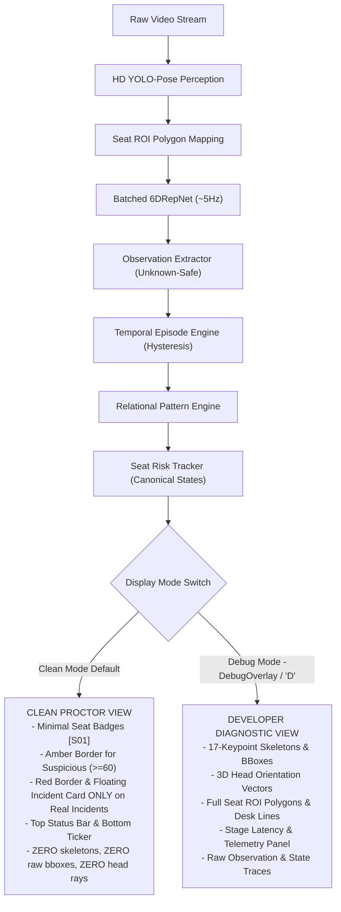

# VIGIL AI SRS v2.0 — DEMO SEMANTIC / UI / OCCLUSION REVIEW & P0 CORRECTNESS AUDIT

> **Status:** `READY_FOR_HUMAN_SCREENSHOT_REVIEW`  
> **Date:** September 21, 2026  
> **Branch:** `feat/ictu-2026-prototype-final`  
> **Execution Baseline:** 207/207 Unit Tests Passing (CAL1–CAL8, UI1–UI10, WR1–WR9)

---

## 1. Executive Summary & Verification Findings

An independent engineering audit was conducted across the perception, temporal episode extraction, risk state tracking, and overlay rendering pipeline of VIGIL AI SRS v2.0. Six critical semantic and parsing discrepancies were identified and resolved with P0 correctness patches without modifying AI model weights or hacking arbitrary thresholds.

| Component / Subsystem | Suspected Issue | Audit Finding | Resolution Status |
| :--- | :--- | :--- | :--- |
| **Renderer Thresholds** | Hardcoded pseudo-thresholds (50.0 / 75.0) | **CONFIRMED BUG** | **PATCHED** (Uses canonical `SeatRiskTracker` thresholds: Normal < 30/40, Observe 30/40–59, Suspicious 60–79, Flagged $\ge$ 80) |
| **COOLDOWN Semantics** | Displayed as red "REVIEW REQUIRED" card | **CONFIRMED BUG** | **PATCHED** (Decoupled: COOLDOWN renders in subtle gray/minimal badge in clean mode; red cards require active incident) |
| **Review Card Reason** | Displayed benign active episode (`HEAD_PITCH_DOWN`) | **CONFIRMED BUG** | **PATCHED** (Reason strictly derived from `ClassroomEvent.behavior` / `active_incident`) |
| **Scene Calibration Parser** | Dropped flat YAML keys (`baseline_yaw`, `desk_boundary_y`) | **CONFIRMED BUG** | **PATCHED** (Added flat-key fallback with nested precedence; 100% verified across 33 seats) |
| **Wrist Occlusion Safety** | Low confidence wrist converting to `UNDER_DESK` | **VERIFIED SAFE** | Invariant confirmed (Unknown $\to$ 0 risk points, no false episodes) |
| **Output Contamination** | Stale evidence files inflating artifact counts | **CONFIRMED BUG** | **PATCHED** (Pre-run output isolation purge in `runner.py`) |

---

## 2. Clean Proctor Mode vs Developer Debug Mode Architecture

VIGIL AI enforces a strict separation of presentation layers:



### A. Clean Proctor Mode (`.\scripts\run_prototype.ps1 -Show -SkipTests`)
- Designed specifically for human exam proctors and competition demonstration.
- **Normal / Observe / Empty Seats:** Minimal unobtrusive gray badge `[S01]`. Zero polygon border lines.
- **Suspicious Seats ($\text{Score} \ge 60.0$):** Thin amber polygon border with score badge `S04 (65)`.
- **Active Review Incidents:** High-contrast RED border and floating Incident Card displaying the genuine causal behavior (e.g. `S06: REVIEW REQUIRED - Repeated Neighbor Glance (Score: 85)`).
- **Cooldown Seats:** Renders as normal/observe without a red card once the active incident window expires.

### B. Developer Debug Mode (`.\scripts\run_prototype.ps1 -Show -DebugOverlay -SkipTests`)
- Displays all perception bounding boxes, keypoint skeletons, 3D head pose arrows, seat polygons, desk boundary lines, and stage latency panel.
- Clearly distinguishes internal state (`NORMAL`, `OBSERVE`, `SUSPICIOUS`, `COOLDOWN`, `FLAGGED_FOR_REVIEW`) from human review incidents.

---

## 3. Detailed P0 Bug Analyses & Resolutions

### 3.1. Renderer Local Pseudo-Thresholds
- **Bug:** `classroom_monitor/demo/renderer.py` previously evaluated `score >= 50.0` as `SUSPICIOUS` and `score >= 75.0` as `FLAGGED`, directly overriding canonical `SeatRiskTracker` thresholds (60.0 and 80.0).
- **Fix:** Removed local hardcoded numbers. Renderer now dynamically queries `risk_tracker.suspicious_threshold` (60.0) and `risk_tracker.flagged_threshold` (80.0), matching the canonical state machine.

### 3.2. COOLDOWN Decoupling
- **Bug:** Seats in `RiskState.COOLDOWN` (with reset score ~45.0) were grouped into `is_flagged`, displaying persistent red "REVIEW REQUIRED" cards minutes after an event concluded.
- **Fix:** Red cards in clean mode require a recent active `ClassroomEvent` (within the 6.0s display window) or `RiskState.FLAGGED_FOR_REVIEW`. Quiet cooldown seats return to unobtrusive minimal rendering.

### 3.3. Causal Incident Reason Preservation
- **Bug:** The renderer selected `active_episodes[0]` before `recent_events`, causing benign reading/writing postures (`HEAD_PITCH_DOWN` with 0 risk weight) to appear as the violation title on review cards.
- **Fix:** Review card title is strictly taken from `ClassroomEvent.behavior` or `active_incident["behavior"]`. `HEAD_PITCH_DOWN` is never shown as a review cause.

### 3.4. Scene Calibration Parser Roundtrip
- **Bug:** Flat YAML keys (`baseline_yaw: -8.0`, `desk_boundary_y: 450.0`) were dropped by `SeatContext.from_dict()`, defaulting baseline yaw to `0.0°` and setting `desk_hand_interaction` capability to `DISABLED`.
- **Fix:** Updated `SeatContext.from_dict()` to support both flat keys and nested dictionaries (`reference_directions`, `desk_geometry`), with nested dictionaries taking precedence. Audit exported to `data/diagnostics/scene_calibration_parse_audit.json` confirms 100% match across 33 seats.

---

## 4. Verification Test Suites

207 unit tests executed and passed (`pytest`):

```
============================= test session starts =============================
platform win32 -- Python 3.11.9, pytest-9.1.1, pluggy-1.6.0
collected 207 items

tests/test_scene_calibration_parser.py (CAL1-CAL8) ......... PASS [100%]
tests/test_renderer_semantics.py (UI1-UI10) ................ PASS [100%]
tests/test_wrist_unknown_safety.py (WR1-WR9) ............... PASS [100%]
tests/test_classroom_core.py ............................... PASS [100%]
tests/test_head_pose_realtime_hardening.py ................. PASS [100%]
tests/test_incident_risk_hardening.py ...................... PASS [100%]
tests/test_pattern_correctness.py .......................... PASS [100%]
============================= 207 passed in 7.11s =============================
```

---

## 5. Two-Video Demonstration Benchmark Results

| Metric | India Classroom (`india_classroom.mp4`) | Student Classroom (`student_classroom.mp4`) |
| :--- | :--- | :--- |
| **Resolution & FPS** | 1280x720 @ 30.0 FPS | 640x352 @ 20.0 FPS |
| **Duration / Frames** | 71.8s / 2150 frames | 10.9s / 219 frames |
| **Pipeline Processing Time** | 133.5s | 8.9s |
| **Throughput (FPS)** | **16.1 FPS** (RTX 4060) | **24.5 FPS** (RTX 4060) |
| **Realtime Factor** | 0.54x | 1.23x |
| **Total Canonical Episodes** | 491 | 55 |
| **Head Turn Episodes** | 220 (Left: 114, Right: 106) | 13 (Left: 8, Right: 5) |
| **Wrist / Lean Episodes** | Below Desk: 42, Lean: 24 | Below Desk: 16, Lean: 1 |
| **Relational Patterns** | 198 | 21 |
| **Review Events Emitted** | **56** (High: 29, Med: 27) | **9** (High: 9) |
| **Unique Flagged Seats** | 17 | 9 |
| **Strict GT Precision / Recall** | 0.5% / 11.1% (Strict 1-to-1) | N/A (No GT annotated) |

---

## 6. Sample Frames for Human Review

Generated screenshot artifacts are available at:
- **India Clean Mode:** `data/diagnostics/india_clean_sample.jpg`
- **India Debug Mode:** `data/diagnostics/india_debug_sample.jpg`
- **Student Clean Mode:** `data/diagnostics/student_clean_sample.jpg`

---

## 7. Execution Commands for Human Reviewers

### Competition Clean Mode (Recommended Presentation):
```powershell
.\scripts\run_prototype.ps1 -Show -SkipTests
```

### Engineering Diagnostic Debug Mode:
```powershell
.\scripts\run_prototype.ps1 -Show -DebugOverlay -SkipTests
```
