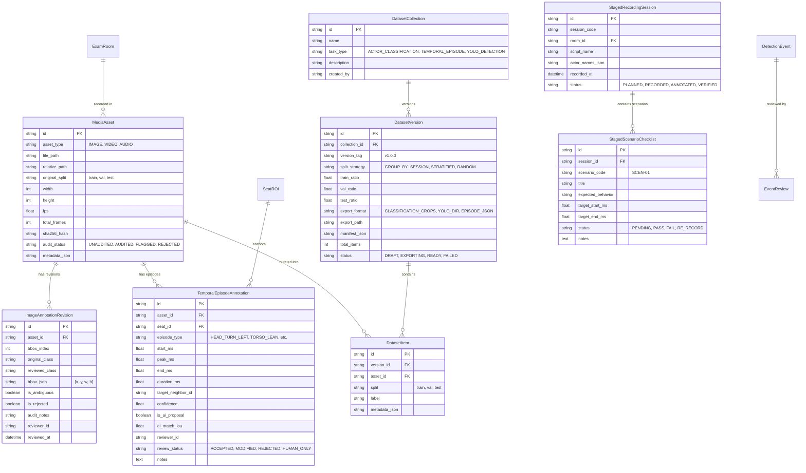

# VIGIL AI — Human Data Operations Workbench
## Gap Analysis & Architecture Specification (Sprint 2)

**Author:** VIGIL AI Core Engineering Team  
**Date:** September 2026  
**Status:** Approved for Implementation  
**Target Baseline:** SRS v2 Actor-Centric Temporal Pipeline (`VIGIL_AI_SRS_v2_ACTOR_CENTRIC_TEMPORAL.md`)  
**Route:** `/data-workbench`

---

## 1. Executive Summary & Objective

In **Sprint 1**, VIGIL AI successfully refactored its core behavior detection pipeline from single-stage heuristic frame bouncing to an **Actor-Centric Temporal Perception Architecture** (SRS v2). Under this architecture:
- Single-frame detections are treated strictly as atomic **Observations** ($O_t$).
- Persistent tracking across time forms **Episodes** ($E$).
- Multi-signal correlation forms **Behavior Patterns** ($P$).
- Patterns contribute to **Seat Risk Trackers** ($R_{\text{seat}}$) before generating **Events** ($Evt$).

In **Sprint 2**, the core AI behavior heuristics are **frozen**. The primary bottleneck in moving from a validated prototype to a production-grade enterprise system is **Observation Quality and Ground-Truth Validation Data**.

The **Human Data Operations Workbench** provides an integrated, non-destructive data engineering and annotation environment allowing human annotators, reviewers, and ML engineers to:
1. **Audit and normalize the legacy 707-image dataset** without corrupting raw files;
2. **Annotate ground-truth temporal episodes** on video recordings with millisecond timestamps;
3. **Compare human annotations against AI proposals** using Temporal Intersection-over-Union ($\text{IoU}_{\text{time}}$);
4. **Calibrate and validate spatial context geometry** (Seat ROIs, Writing Zones, Under-Desk Zones, Neighbor graphs);
5. **Review AI-generated events** with structured human-in-the-loop decision codes;
6. **Curate and export reproducible, versioned ML datasets** with strictly group-safe splits to eliminate data leakage.

---

## 2. Requirement Compliance & Gap Analysis Matrix

The following matrix maps the functional requirements of the Human Data Operations Workbench against the current codebase status and outlines the technical implementation strategy.

| ID | Requirement Category | Detailed Specification | Current Status in Codebase | Planned Implementation in Sprint 2 |
|---|---|---|---|---|
| **REQ-01** | **Dataset Integrity** | Non-destructive data store; raw 707 images and demo videos must remain completely untouched. | ⚠️ Partially Supported (Raw files present in `dataset/`, but edits risk overwriting files). | **`MediaAsset` & `ImageAnnotationRevision` DB entities**: All human reviews, corrections, and flags are saved as database revisions with audit provenance. |
| **REQ-02** | **Observable Labeling** | Ground-truth labels must describe observable posture/movement (`HEAD_TURN_LEFT`, `TORSO_LEAN`, `HAND_BELOW_DESK`), not intent (`CHEATING`). | ⚠️ Legacy YOLO used subjective intent labels (`side peeking`, `phone using`). | **Strict Observable Label Hierarchy**: Enforce normalized physical observation classes and posture tags in annotation tools. |
| **REQ-03** | **707 Image Audit** | Rapid review interface for 707 images with class filters, split filters, hotkey triage (`A` Accept, `X` Ambiguous, `S` Side, `F` Front, `B` Back, `N` Normal, `P` Phone). | ❌ Missing (Only CLI visualizer `classroom_training/visualize_data.py` existed). | **Interactive Web Audit Canvas**: Full-screen image audit view with dynamic bounding box editing, hotkeys, and revision logging. |
| **REQ-04** | **Dynamic Actor Crop** | Real-time actor crop generation on bounding boxes with configurable padding for classification datasets. | ❌ Missing in Web API (Only offline script snippets existed). | **`GET /api/v1/data/images/{id}/crop` endpoint**: Generates tightly bounded or padded actor crops on-the-fly with caching. |
| **REQ-05** | **Video Episode Annotation** | Millisecond-precision start/peak/end temporal annotation for video streams with seat binding and neighbor targeting. | ❌ Missing (Only frame-by-frame annotations or detection events existed). | **`TemporalEpisodeAnnotation` DB entity & Video Scrubber UI**: Interactive timeline player with keyboard markers (`[` start, `]` end, `P` peak) and seat selection. |
| **REQ-06** | **AI vs Human Diff** | Temporal IoU calculation ($\text{IoU}_{\text{time}} = \frac{T_{\text{human}} \cap T_{\text{AI}}}{T_{\text{human}} \cup T_{\text{AI}}}$) and confusion matrix visualization. | ❌ Missing. | **`GET /api/v1/data/videos/{id}/compare` API**: Computes temporal overlap, detection latency, precision, recall, and false-alarm rates. |
| **REQ-07** | **Spatial Calibration Audit** | Seat ROI boundary validation, overlap detection, desk/writing zone assignment, and neighbor adjacency graphs. | ⚠️ Basic 4-point polygon calibration existed in `/calibration`. | **Spatial Geometry Quality Checker API**: Validates polygon convexness, inter-seat overlap percentage, writing zone definitions, and graph connectivity. |
| **REQ-08** | **AI Event Review Queue** | Structured human-in-the-loop review workflow with standard reason codes (`NORMAL_BEHAVIOR`, `PROCTOR_OCCLUSION`, `TRUE_SUSPICIOUS`, etc.). | ⚠️ Basic review endpoint existed in `ReviewRepository`, but lacked detailed reason taxonomy and triage UI. | **Dedicated Event Review UI Tab**: Displays 10-second video evidence clip, SHA-256 verification, and quick triage action buttons. |
| **REQ-09** | **Dataset Versioning & Export** | Versioned dataset curation (v1.0.0, v1.1.0) with export to Actor-Crop Classification folders, YOLO format, and Episode JSON. | ❌ Missing. | **`DatasetCollection` & `DatasetVersion` Repositories**: 1-click exporter producing ML-ready datasets with `manifest.json`. |
| **REQ-10** | **Group-Safe Data Splitting** | Group splitting by video/room/session identifier to prevent split leakage across train/val/test partitions. | ❌ Legacy 707 dataset suffered from slight video-frame split leakage. | **Deterministic Hash-Based Group Splitter**: Partitions data by parent asset/session groups rather than random row sampling. |
| **REQ-11** | **Role-Based Access Control** | Explicit roles (`ADMIN`, `AI_ML_ENGINEER`, `ANNOTATOR`, `REVIEWER`) with immutable audit trails for data modifications. | ⚠️ Basic `AuditLog` table existed, but lacked role-level enforcement in data workbench. | **Workbench RBAC Decorators & Audit Logger**: Every annotation, revision, and export logs actor ID, role, and delta payloads. |
| **REQ-12** | **Staged Recording Protocol** | Standard operating procedure for recording scripted exam scenarios with actor checklists. | ❌ Missing. | **`StagedRecordingSession` & `StagedScenarioChecklist`**: Protocol manager and tracking UI for staged exam recordings. |

---

## 3. Database Schema Extensions

To support the Human Data Operations Workbench without modifying core frozen tables, 8 new relational entities are integrated:

---

## 4. API Endpoints Architecture

All endpoints are registered under `/api/v1/data/*` and `/api/data/*`:

| Method | Endpoint | Description |
|---|---|---|
| `GET` | `/api/v1/data/summary` | Global audit metrics, annotation counts, review backlog, dataset versions. |
| `GET` | `/api/v1/data/images` | Filtered list of 707 dataset images with audit status, split, and class tags. |
| `GET` | `/api/v1/data/images/{asset_id}` | Detailed image metadata with original and reviewed bounding boxes. |
| `POST` | `/api/v1/data/images/{asset_id}/review` | Submit non-destructive revision for bounding boxes on an image. |
| `GET` | `/api/v1/data/images/{asset_id}/crop` | Dynamically stream actor crop image (JPEG) with custom bounding box or padding. |
| `GET` | `/api/v1/data/videos` | List video assets available for temporal annotation and evaluation. |
| `GET` | `/api/v1/data/videos/{asset_id}/episodes` | List ground-truth human annotations and AI proposal episodes for a video. |
| `POST` | `/api/v1/data/videos/{asset_id}/episodes` | Create or update human-annotated temporal episode. |
| `DELETE`| `/api/v1/data/videos/{asset_id}/episodes/{episode_id}` | Delete human-annotated temporal episode. |
| `GET` | `/api/v1/data/videos/{asset_id}/compare` | Compute Temporal IoU, alignment metrics, precision/recall between Human and AI. |
| `POST` | `/api/v1/data/calibration/validate` | Automated geometric validation of seat polygons, desk zones, and overlaps. |
| `GET` | `/api/v1/data/datasets` | List curated dataset collections and released versions. |
| `POST` | `/api/v1/data/datasets` | Create a new dataset collection. |
| `POST` | `/api/v1/data/datasets/{collection_id}/export` | Trigger export of a versioned dataset with group-safe splits & manifest. |
| `GET` | `/api/v1/data/staged-sessions` | List staged recording sessions and scenario verification status. |
| `POST` | `/api/v1/data/staged-sessions` | Create/update staged recording session and checklist items. |

---

## 5. Temporal IoU & Group-Safe Split Formulations

### 5.1 Temporal Intersection-over-Union ($\text{IoU}_{\text{time}}$)

For a human ground-truth episode $E_H = [t_{s,H}, t_{e,H}]$ and an AI-detected proposal episode $E_A = [t_{s,A}, t_{e,A}]$ on seat $S$:

$$\text{Intersection}(E_H, E_A) = \max\left(0, \min(t_{e,H}, t_{e,A}) - \max(t_{s,H}, t_{s,A})\right)$$

$$\text{Union}(E_H, E_A) = \max(t_{e,H}, t_{e,A}) - \min(t_{s,H}, t_{s,A})$$

$$\text{IoU}_{\text{time}}(E_H, E_A) = \frac{\text{Intersection}(E_H, E_A)}{\text{Union}(E_H, E_A)}$$

- A proposal is classified as **Matched (True Positive)** if $\text{IoU}_{\text{time}} \ge 0.30$ and label semantics align.
- If $E_A$ has no matching $E_H$ with $\text{IoU} \ge 0.30 \implies$ **False Alarm (FP)**.
- If $E_H$ has no matching $E_A$ with $\text{IoU} \ge 0.30 \implies$ **Missed Detection (FN)**.

### 5.2 Deterministic Group-Safe Splitting

To guarantee zero data leakage between splits (preventing frames of the same video or student appearing across train and test sets):

$$\text{GroupHash}(g) = \text{MD5}(g) \pmod{100}$$

$$\text{Split}(g) = \begin{cases} 
\text{train}, & \text{if } \text{GroupHash}(g) < 100 \times r_{\text{train}} \\
\text{val}, & \text{if } 100 \times r_{\text{train}} \le \text{GroupHash}(g) < 100 \times (r_{\text{train}} + r_{\text{val}}) \\
\text{test}, & \text{otherwise}
\end{cases}$$

---

## 6. Implementation Milestones

1. **Database Entities & Repositories**: Extend `storage/db_models.py` and `storage/repositories.py`.
2. **REST API Services**: Implement `api/routes/data_workbench.py` and wire into `api/main.py`.
3. **Web Interface (`/data-workbench`)**: Build multi-tab interactive SPA with canvas renderer and video timeline scrubber.
4. **Data Ingestion & Seeding**: Index 707 dataset images and `india_classroom.mp4` video with baseline proposals.
5. **Documentation & Guidelines**: Deliver `ANNOTATION_GUIDELINE_v1.md` and `DATASET_EXPORT_GUIDE.md`.
6. **Automated Verification**: End-to-end integration tests verifying non-destructive audits, IoU comparisons, and group-safe exports.
