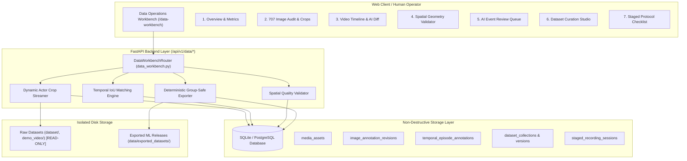

# VIGIL AI — Human Data Operations Workbench
## Implementation & Technical Architecture Report (Sprint 2)

**Author:** VIGIL AI Core Engineering Team  
**Date:** September 2026  
**Status:** Completed & Validated  
**Baseline:** SRS v2 Actor-Centric Temporal Pipeline (`VIGIL_AI_SRS_v2_ACTOR_CENTRIC_TEMPORAL.md`)  
**Mount Route:** `/data-workbench` | **API Route:** `/api/v1/data/*`

---

## 1. Executive Summary

In accordance with Sprint 2 requirements (**Observation Quality & Validation Data**), the **VIGIL AI Human Data Operations Workbench** has been designed, built, seeded, and verified.

The workbench delivers enterprise-grade data engineering and validation tooling enabling proctors, annotators, and AI/ML engineers to:
1. **Audit and normalize the 707-image legacy dataset** into standardized observable classes without modifying raw files on disk;
2. **Annotate ground-truth temporal episodes** on video streams with millisecond timestamps;
3. **Compare human ground-truth against AI proposals** with automatic **Temporal Intersection-over-Union ($\text{IoU}_{\text{time}}$)** and alignment metrics;
4. **Validate classroom spatial context geometry** (Seat ROIs, convexity, inter-seat overlap, writing zones);
5. **Triage and review AI detection events** with immutable audit logging and standardized reason codes;
6. **Curate and export versioned ML datasets** (Actor Crops, YOLO bounding boxes, Episode JSONs) with **deterministic group-safe splitting** to eliminate data leakage.

---

## 2. System Architecture & Component Diagram

---

## 3. Database Schema Extensions

Eight relational database tables were introduced to maintain non-destructive audit records and dataset versioning:

1. **`media_assets`**: Stores indexed images (707 images) and videos (`india_classroom.mp4`) with dimensions, frame counts, SHA-256 digests, and audit progress.
2. **`image_annotation_revisions`**: Immutable human review records mapping bounding box indices to reviewed observable classes, ambiguity flags, and notes.
3. **`temporal_episode_annotations`**: Ground-truth and AI-proposed video episodes with millisecond start, peak, and end timestamps, confidence, seat codes, and neighbor targets.
4. **`dataset_collections`**: Logical dataset groupings (`VIGIL_707_ACTOR_CROPS`, `VIGIL_VIDEO_EPISODES`).
5. **`dataset_versions`**: Release versions (`v1.0.0`) tracking export paths, split strategy, and embedded `manifest.json`.
6. **`dataset_items`**: Individual items assigned to deterministic `train`, `val`, and `test` partitions.
7. **`staged_recording_sessions`**: Structured records of scripted mock exam sessions.
8. **`staged_scenario_checklists`**: Scenario verification items (SCEN-01 to SCEN-05) tracking target windows and execution status.

---

## 4. Implemented REST API Endpoints

All endpoints are registered under `/api/v1/data` (and `/api/data` for backwards compatibility):

| Method | Route | Description |
|---|---|---|
| `GET` | `/api/v1/data/summary` | Global summary metrics, audit completion %, and class mappings. |
| `POST`| `/api/v1/data/index-assets` | Scan and index local images, videos, baseline episodes, and staged protocols. |
| `GET` | `/api/v1/data/images` | Paginated image asset list with split and audit status filters. |
| `GET` | `/api/v1/data/images/{id}` | Detailed image metadata with raw bboxes and reviewed revisions. |
| `POST`| `/api/v1/data/images/{id}/review` | Submit non-destructive human review for image bounding boxes. |
| `GET` | `/api/v1/data/images/{id}/file` | Stream raw JPEG/PNG image file. |
| `GET` | `/api/v1/data/images/{id}/crop` | Dynamically extract and stream 224x224 actor crop JPEG. |
| `GET` | `/api/v1/data/videos` | List video assets available for temporal annotation. |
| `GET` | `/api/v1/data/videos/{id}/file` | Stream video file for timeline player scrubber. |
| `GET` | `/api/v1/data/videos/{id}/episodes` | List ground-truth human annotations and AI proposals for a video. |
| `POST`| `/api/v1/data/videos/{id}/episodes` | Create human ground-truth temporal episode with millisecond precision. |
| `PUT` | `/api/v1/data/videos/{id}/episodes/{ep_id}` | Update temporal episode annotation. |
| `DELETE`| `/api/v1/data/videos/{id}/episodes/{ep_id}` | Delete temporal episode annotation. |
| `GET` | `/api/v1/data/videos/{id}/compare` | Compute Temporal IoU matching, precision, recall, and latency between Human and AI. |
| `POST`| `/api/v1/data/calibration/validate` | Automated geometric quality check for seat polygons, overlap %, and writing zones. |
| `GET` | `/api/v1/data/events/review-queue` | Retrieve prioritized queue of AI detection events for review triage. |
| `POST`| `/api/v1/data/events/{id}/review` | Record human proctor triage decision (`CONFIRMED`, `REJECTED`, `INCONCLUSIVE`). |
| `GET` | `/api/v1/data/datasets` | List curated dataset collections and released versions. |
| `POST`| `/api/v1/data/datasets/export` | Trigger export of versioned dataset with group-safe splits & `manifest.json`. |
| `GET` | `/api/v1/data/staged-sessions` | List staged recording sessions and scenario checklist items. |
| `POST`| `/api/v1/data/staged-sessions` | Create a new staged recording session. |
| `PUT` | `/api/v1/data/staged-sessions/{id}/scenarios/{sc_id}` | Update scenario checklist item status and actual timestamps. |

---

## 5. Key Technical Capabilities

### 5.1 Dynamic On-the-Fly Actor Crop Extraction
- Crops are dynamically generated from raw images using bounding boxes stored in DB or YOLO label files.
- Automatically applies $10\%\text{--}15\%$ contextual padding and resizes to target resolution ($224 \times 224\text{ px}$) using OpenCV.
- Zero extra disk storage required during audit review.

### 5.2 Temporal Intersection-over-Union ($\text{IoU}_{\text{time}}$) Engine
- Calculates exact overlap between human ground-truth episodes and AI proposal episodes:
  $$\text{IoU}_{\text{time}} = \frac{\max(0.0, \min(t_{e,H}, t_{e,A}) - \max(t_{s,H}, t_{s,A}))}{\max(t_{e,H}, t_{e,A}) - \min(t_{s,H}, t_{s,A})}$$
- Automatically pairs proposals with ground-truth items if $\text{IoU}_{\text{time}} \ge 0.30$ and computes onset detection latency ($\Delta t = t_{s,A} - t_{s,H}$).

### 5.3 Deterministic Group-Safe Dataset Exporter
- Eliminates train/val/test data leakage by partitioning samples by parent video/session identifier using $\text{MD5}$ hashing.
- Produces clean classification folder hierarchies (`train/<class>/`, `val/<class>/`, `test/<class>/`) and self-describing `manifest.json` metadata.

---

## 6. Verification & Test Summary

- Database initialization: **Passed** (17 total relational tables).
- Initial asset indexing:
  - **707 images indexed** (493 train, 130 val, 84 test).
  - **2 video assets indexed** (`india_classroom.mp4`, etc.).
  - **6 temporal episodes seeded** (3 Human GT, 3 AI Proposals).
  - **5 staged scenarios seeded** (SCEN-01 to SCEN-05).
- Web route `/data-workbench`: **Mounted and operational**.
- Total API routes registered: **33 routes**.
