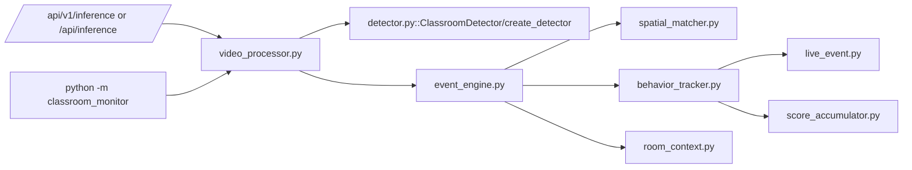

# VIGIL AI — Legacy, Compatibility and Dead-Code Map

**Audited commit:** `85d86c6cb7b280a32d3123dc77e7b2abec72c380`  
**Policy:** nothing was deleted. “Dead candidate” means no active product entrypoint was found; it does not prove that an external user or unpublished script does not depend on it.

## Reachability roots

The reachability analysis used these roots:

- Product A: `main.py` → `exam_monitor.app.run`.
- Product B web: `server.py` → `api.main` → `/demo` → `DemoRuntime`.
- Product B CLI: `scripts/run_demo_video.py`, `run_demo_all_videos.py` → `classroom_monitor.demo.runner`.
- Legacy public paths: `/inference`, `python -m classroom_monitor`, imports exported by `classroom_monitor/__init__.py`.
- Tooling: `scripts/`, `classroom_training/`, evaluation and the test suite.

## ACTIVE — retain

| Path | Purpose | Referenced by | Replacement | Safe to delete now? | Human decision required? |
|---|---|---|---|---|---|
| `main.py`, `exam_monitor/` | Local single-candidate gaze desktop product | local BAT launchers | none | No | No |
| `server.py`, `api/main.py` | FastAPI and dashboard host | web launchers/Docker | none | No | No |
| `classroom_monitor/detector.py::PoseClassroomDetector` | Current person pose perception | runner/runtime/scripts | none | No | No |
| `seat_manager.py` | Seat ROI assignment and occupancy/coasting | SRS v2 runner/runtime | none | No | No |
| `scene_context.py` | Scene/seat capability parser and graph | runner/runtime/tests | none | No | No |
| `head_pose_provider.py` | Pose heuristic/6DRepNet providers | runner/runtime/benchmarks | none | No | No |
| `observation_extractor.py` | Typed seat observations | runner/runtime | none | No | No |
| `temporal_episode_engine.py` | Current FSM | runner/runtime | none | No | No |
| `behavior_pattern_engine.py` | Current composite patterns | runner/runtime | none | No | No |
| `seat_risk_tracker.py` | Current seat priority/incident aggregation | runner/runtime | none | No | No |
| `demo/runner.py` | Current CLI SRS v2 loop | demo scripts/BAT | proposed shared core | No | No |
| `demo/runtime.py` | Intended web SRS v2 loop | `/demo` API | proposed shared core + web adapter | No; repair first | No |
| `demo/config.py`, `renderer.py`, `exporter.py` | Demo presets, rendering and artifacts | runner/runtime/tests | none | No | No |
| `video_buffer.py` | Evidence ring/post buffer | runner/runtime/legacy | unified evidence service later | No | No |
| `storage/*` | DB, repositories, evidence and workbench | API/runtime/scripts | common domain/storage later | No | No |
| `api/routes/demo.py` | Web competition demo controls | dashboard | none | No | No |
| `api/routes/events.py` | General event review | main dashboard/tests | unified review service later | No | No |
| `api/routes/data_workbench.py` | Annotation/calibration/dataset workbench | data workbench UI/tests | none | No | No |
| `evaluation/temporal_matcher.py` | Strict temporal benchmark | scripts/tests | none | No | No |
| `configs/scenes/*.yaml` | Current calibrated scene inputs | runner/runtime | versioned scene contract later | No | No |
| `validation/*.json` | Expected pattern/timeline fixtures | validation/docs | stronger human GT later | No | Yes, GT ownership |

## LEGACY — reachable compatibility surface

| Path | Original purpose | Referenced by | Current replacement | Safe to delete now? | Human decision required? |
|---|---|---|---|---|---|
| `classroom_monitor/video_processor.py` | Monolithic video processing loop | `/inference`, `__main__.py`, package exports | SRS v2 shared core/runner | No, still externally reachable | **Yes:** deprecate route/CLI first |
| `classroom_monitor/event_engine.py` | Track-based semantic event creation and legacy evidence | `VideoProcessor`, tests, package export | temporal + pattern + risk engines | No | **Yes** |
| `classroom_monitor/behavior_tracker.py` | Per-person score/state tracker | `EventEngine`, tests, export | seat actor + temporal/risk | No | **Yes** |
| `classroom_monitor/score_accumulator.py` | Sliding score for semantic labels | behavior tracker/tests/export | SeatRiskTracker | No | **Yes** |
| `classroom_monitor/live_event.py` | Mutable legacy active event | behavior tracker/tests/export | TemporalEpisode/ReviewIncident | No | **Yes** |
| `classroom_monitor/room_context.py` | Collective suppression/cluster context | EventEngine/tests | no direct SRS v2 equivalent | No | **Yes:** decide whether concept should be ported |
| `classroom_monitor/spatial_matcher.py` | Kalman/IoU track identity | EventEngine/tests; IoU helper used by detector | SeatManager in demo; possible reusable tracker | No | **Yes:** retain helper or split it |
| `detector.py::ClassroomDetector` | Custom five-class semantic detector | `create_detector` legacy path | PoseClassroomDetector | No | **Yes** |
| `classroom_monitor/__main__.py` | Legacy command-line processor | direct module execution | demo runner scripts | No until deprecation | **Yes** |
| `api/routes/inference.py` | Legacy REST inference | mounted under `/api` and `/api/v1` | `/demo` plus future common pipeline API | No until compatibility policy; currently broken | **Yes** |
| `classroom_monitor/__init__.py` legacy exports | Public import compatibility | external/unknown, tests | explicit subpackages | No | **Yes** |
| `eyes.py` | Earlier local compatibility entry/module | external/unknown | `main.py`/`exam_monitor` | Unknown | **Yes** |

The legacy API is not merely old: `api/routes/inference.py` calls the present repository/session APIs with signatures that no longer exist. It should be disabled or clearly return a deprecation response until repaired.

## EXPERIMENTAL / ALTERNATE PATHS

| Path | Purpose | Referenced by | Relationship to current demo | Safe to delete now? | Human decision required? |
|---|---|---|---|---|---|
| `worker_node.py` | Multi-camera RTSP worker prototype | scalability script, tests | alternate orchestration; not web/CLI demo | No | Yes, future multi-room roadmap |
| `rtsp_reader.py` | stale-frame-dropping RTSP reader | worker, script, tests | not used by DemoRuntime | No | Yes |
| `behavior_signals.py` | earlier SRS MVP raw signal layer | worker, benchmark, tests | overlaps ObservationExtractor | No | Yes |
| `async_evidence_writer.py` | package-level async evidence directory writer | worker/tests; demo imports hash helper | overlaps `video_buffer.py` + exporter | No | Yes, consolidate later |
| `scripts/benchmark_10_20_rooms.py` | simulated multi-room load benchmark | direct script | not competition execution | No | Yes, label assumptions |
| `scripts/run_head_orientation_ab_benchmark.py` | provider A/B evaluation | direct script | evaluation tooling | No | No |
| diagnostic/calibration/GT scripts | one-off audits and benchmarks | direct execution/docs | support tooling | No | No |
| `classroom_training/` | five-class semantic YOLO training/evaluation | direct scripts/notebook | feeds legacy model, not current pose/HPE | No | Yes, archive vs auxiliary research |

## TEST-ONLY OR EFFECTIVELY UNREFERENCED CANDIDATES

| Candidate | Evidence | Proposed disposition | Safe to delete now? | Human decision required? |
|---|---|---|---|---|
| Direct `AsyncEvidenceWriter` import in `demo/runner.py`/`runtime.py` | Neither demo constructs it; only `compute_file_sha256` is used | Import only hash helper after evidence consolidation | Not worth isolated deletion | No |
| `TORSO_ORIENTATION` observation enum | No production extractor emission found | Implement with semantics or remove in later cleanup | No | Yes |
| wrist velocity observation | Extracted/history maintained; no substantive pattern/risk consumer | Keep experimental or remove after roadmap decision | No | Yes |
| `RealtimeManager._loop` | Declared but never assigned/read for scheduling | Use it correctly in P0 fix or remove | No, needed for likely fix | No |
| legacy semantic labels in `ClassroomConfig` | Used only legacy detector/tracker | Move into `legacy` config namespace | No | Yes |
| `eyes.py` | No internal active import identified | Archive after external entrypoint check | Unknown | Yes |

No source module was designated “safe to delete immediately” because several legacy objects are still package exports or callable entrypoints. The safe sequence is: announce deprecation → add telemetry/warnings → remove mounts/exports → wait one release/competition freeze → delete.

## GENERATED / HISTORICAL ARTIFACT MAP

| Path/group | Classification | Current authority | Delete/archive guidance |
|---|---|---|---|
| `data/ground_truth/india_classroom_gt.json` | SOURCE | Human GT, with one malformed entry documented | Keep; human must resolve malformed item |
| `data/ground_truth/*integrity_report.json` | GENERATED AUDIT | Current integrity description | Keep with source/version |
| `validation/*.json` | SOURCE EXPECTATION | Hand-authored validation | Keep; do not call measured metrics |
| `data/prototype_final/` | GENERATED ARTIFACT | Latest directory naming, but not rerun at audit HEAD | Archive with commit/config manifest |
| `data/acceptance_verification/` | HISTORICAL ARTIFACT | Commit `e04b371...`, not current HEAD | Mark historical |
| `data/output_demo_v1_frozen/` | HISTORICAL/FROZEN | Old pipeline | Move to release/archive storage |
| `data/output_demo_v2/`, `optimization/`, `head_orientation_ab/`, `prototype_hardening/` | EXPERIMENT RESULTS | Run-specific | Keep only manifests/key results; archive bulky evidence |
| `data/demo_runs/`, `evidence/`, `evidence_clips/`, `sessions/` | RUNTIME GENERATED | None across runs | Git-ignore/retention after preserving required fixtures |
| `data/*.db` | RUNTIME GENERATED/SAMPLE STATE | Ambiguous | Decide one sanitized fixture or remove from Git; never ship personal data |
| `reports/visualizations/` | GENERATED QA IMAGES | Dataset snapshot | Archive/LFS if still needed |
| `__pycache__/`, `*.pyc` | GENERATED CACHE | None | Safe cleanup candidate, but no deletion done |

## Documentation status map

| File/group | Status | Reason |
|---|---|---|
| `docs/VIGIL_AI_SRS_v2_ACTOR_CENTRIC_TEMPORAL.md` | CURRENT DESIGN INTENT | Useful contract, but code deviations remain |
| `docs/ANNOTATION_GUIDELINE_v1.md` | CURRENT PRINCIPLE | Correct observable-ground-truth framing |
| `docs/THRESHOLD_SOURCE_AUDIT.md` | CURRENT SUPPORTING AUDIT | Runtime still has precedence/default conflicts |
| `docs/DATASET_707_AUDIT.md` | CURRENT STRATEGIC DATA AUDIT | Correctly separates semantic data from pose pipeline; leakage statement needs provenance validation |
| `docs/CORE_PIPELINE_VERIFICATION.md` | PARTLY STALE | Correct for CLI concept, overstates unified runtime health |
| `docs/FINAL_DEMO_EXECUTION_GUIDE.md` | STALE UNTIL P0 FIXES | Web runtime/evidence/realtime assumptions fail |
| `docs/DEMO_RUNBOOK.md` | HISTORICAL/SUPERSEDED | Already labelled; performance claims not current |
| `docs/CORE_OPTIMIZATION_REPORT.md` | HISTORICAL MIXED RESULTS | Contains both old 100% recall and later 1.37% precision/33.33% recall sections |
| `docs/6DREPNET_REALTIME_HARDENING_REPORT.md` | HISTORICAL | 112-test/FPS snapshot, not current test or full runtime |
| `reports/BAO_CAO_REVIEW_CODEBASE_TOAN_DIEN.md` | STALE/UNSUPPORTED | “Production-ready” and 120+ FPS projections exceed evidence |
| `reports/BAO_CAO_RESEARCH_CODEBASE_REVIEW.md` | HISTORICAL | 32 tests, old architecture |
| `README.md` | DEAD/UNSUITABLE DOCUMENTATION | Does not describe or launch VIGIL |

## Deprecation decision checklist

Before deleting legacy classroom code, a human owner should answer:

1. Will `/api/v1/inference` be part of the ICTU demonstration or any external integration?
2. Does anyone still invoke `python -m classroom_monitor` or import top-level legacy symbols?
3. Is `worker_node` the intended post-competition multi-room direction?
4. Is the five-class dataset/model retained as an auxiliary research asset, or fully archived?
5. Which generated evidence/DB files are mandatory judging fixtures versus accidental repository history?

Recommended one-week decision: hide/disable the broken legacy inference endpoint in the demo profile, keep files in place, and focus remediation on the current SRS v2 web/CLI paths. Deletion can wait until after the competition.

