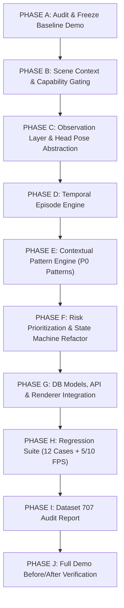

# VIGIL AI — SRS v2.0 IMPLEMENTATION GAP ANALYSIS

**Document Version:** 2.0.0  
**Target SRS:** [`docs/VIGIL_AI_SRS_v2_ACTOR_CENTRIC_TEMPORAL.md`](file:///H:/Code/MingKingLaser/laser_eyes/docs/VIGIL_AI_SRS_v2_ACTOR_CENTRIC_TEMPORAL.md)  
**System:** VIGIL AI / `laser_eyes`  
**Date:** 17/09/2026  
**Auditor:** Senior AI Systems Architect & Lead Engineer  

---

## 1. Executive Summary

This document audits the current production codebase of **VIGIL AI** against the superseding **SRS v2.0 (Actor-Centric Temporal Suspicious Pattern Detection & Evidence Prioritization)**. 

### Key Findings:
1. **Infrastructure Preservation:** Ingestion (RTSP/video), YOLO-Pose base perception, Seat Polygon matching, SQLite/PostgreSQL schemas, REST/WebSocket API, Async Evidence Writer with SHA-256, and Human-in-the-Loop review are solid and will be preserved.
2. **Core Architectural Shifts Required:**
   - **From Frame-Weighted Heuristics to 7-Layer Semantic Hierarchy:**
     $$\text{Perception} \rightarrow \text{Seat Actor} \rightarrow \text{Raw Observations} \rightarrow \text{Temporal Episodes} \rightarrow \text{Context/Relation} \rightarrow \text{Composite Patterns} \rightarrow \text{Risk Priority}$$
   - **Scene Context & Seat Graph:** Add `SeatContext` (Neighbor Graph, Camera-space reference directions, Desk Geometry with Writing Zone vs Under-Desk Zone) and Capability Gating (`ENABLED`, `DEGRADED`, `DISABLED`, `UNVALIDATED`).
   - **Observation Layer (`observation_extractor.py`):** Abstract observations (`HEAD_YAW_RELATIVE`, `HEAD_PITCH_RELATIVE_DOWN`, `TORSO_LEAN_X`, `WRIST_ZONE`) with `UNKNOWN-safe` guards; eliminate direct `LOOK_DOWN` risk accumulation and remove `LOW_HAND -> UNDER_DESK` misnomers.
   - **Temporal Episode Engine (`temporal_episode_engine.py`):** Convert observations into temporal episodes (`INACTIVE -> CANDIDATE -> ACTIVE -> ENDING -> ENDED`) using millisecond timestamps and hysteresis instead of frame counters.
   - **Contextual Pattern Engine (`behavior_pattern_engine.py`):** Implement P0 review-worthy patterns (`REPEATED_NEIGHBOR_GLANCE`, `NEIGHBOR_ORIENTED_LEAN`, `SEAT_LEFT`, `MULTI_PERSON_DWELL_NEAR_SEAT`) and P1 experimental gating (`BELOW_DESK_INTERACTION`).
   - **Risk Engine Refactor (`seat_risk_tracker.py`):** Compute Review Priority Score from episodes and patterns with exponential decay and diminishing returns. Eliminate any `CHEATING` state.
   - **Evidence Lifecycle & EOF Safety:** Fix edge-case flushing at video EOF and record incomplete post-buffer metadata.
   - **707 Dataset Role Shift:** Relegate to auxiliary posture/orientation exploration (Audit in `docs/DATASET_707_AUDIT.md`).

---

## 2. Comprehensive Requirement-to-Code Gap Matrix

| SRS Scope / Requirement | SRS Requirement Details | Current Implementation in Codebase | Implementation Gap | Target Files | Planned Action (Phases) |
|---|---|---|---|---|---|
| **Scope 01: Room & Session** (`FR-ROOM-001..005`) | Exam room, session lifecycle (`READY->RUNNING->STOPPING->COMPLETED`), no business events when not RUNNING | `storage/db_models.py`, `storage/repositories.py`, `api/routes/sessions.py` | None (Fully compliant) | `storage/db_models.py`, `api/routes/sessions.py` | Preserve infrastructure. |
| **Scope 02: Camera Ingestion** (`FR-CAM-001..005`) | RTSP & file ingestion, timestamping (`capture_ts`, `processing_ts`), stale frame drop, 3–5 inference FPS target | `api/routes/cameras.py`, `classroom_monitor/video_processor.py`, `scripts/run_classroom_demo.py` | Missing explicit `capture_ts` / `processing_ts` structured metadata contract per frame | `classroom_monitor/video_processor.py`, `scripts/run_classroom_demo.py` | Add structured `FrameMetadata` with ms timestamps. |
| **Scope 03: Person & Pose Perception** (`FR-PER-001..005`) | Single-pass YOLO-Pose, no suspicious/cheating verdict at detector level, `HeadOrientationProvider` abstraction, UNKNOWN on low-quality/missing keypoints | `classroom_monitor/detector.py` (`PoseClassroomDetector`) | Detector still outputs legacy class names (`"side peeking"`, `"phone using"`); lacks abstract `HeadOrientationProvider` interface | `classroom_monitor/detector.py`, `classroom_monitor/head_pose_provider.py` | Refactor detector to output raw `PersonDetection` / keypoints; create `HeadOrientationProvider` interface. |
| **Scope 04: Seat ROI & Identity** (`FR-SEAT-001..006`) | Multi-point polygon, bottom anchor matching, stable ID under proctor occlusion, unmapped persons tagged `UNMAPPED_PERSON` (never `PROCTOR`) | `classroom_monitor/seat_manager.py` | Stable ID works; unmapped persons are displayed correctly in demo HUD, but need formal enum & state tagging | `classroom_monitor/seat_manager.py` | Ensure `SeatState.OCCLUDED` vs `EMPTY` vs `UNMAPPED_PERSON` strictly match SRS v2. |
| **Scope 05: Scene Context & Seat Graph** (`FR-CTX-001..005`) | `SeatGraph` (left/right/front/back neighbors), camera-space reference directions, `DeskGeometry` (writing_zone, desk_boundary, under_desk_zone) | `classroom_monitor/seat_manager.py` has basic `desk_y` and `desk_polygon` | Missing formal `SeatGraph`, neighbor relationships, reference directions, and `SceneContext` container | `classroom_monitor/scene_context.py`, `classroom_monitor/seat_manager.py` | **Create `classroom_monitor/scene_context.py`** with `SeatContext`, `SeatGraph`, `DeskGeometry`, and backward-compatible loaders. |
| **Scope 06: Raw Observation Extraction** (`FR-OBSERV-001..005`) | Observable measurements (`HEAD_YAW_RELATIVE`, `HEAD_PITCH_RELATIVE_DOWN`, `TORSO_LEAN_X`, `WRIST_ZONE`), relative baseline per seat, UNKNOWN-safe wrist/head, `LOOK_DOWN` is pure context | `classroom_monitor/behavior_signals.py` (`BehaviorSignalExtractor`) | Mixed observation and legacy signals (`LOOK_DOWN_LONG`, `LOW_HAND_POSTURE`); lacking relative seat baseline subtraction | `classroom_monitor/observation_extractor.py`, `classroom_monitor/behavior_signals.py` | **Refactor into Observation Layer** (`observation_extractor.py`), enforce `UNKNOWN` on low confidence, suppress `WRIST_BELOW_DESK` if wrist in writing zone. |
| **Scope 07: Temporal Episode Engine** (`FR-EP-001..005`) | Converts observations into time-bounded episodes (`INACTIVE->CANDIDATE->ACTIVE->ENDING->ENDED`) using ms timestamps, hysteresis thresholds, min persistence; no frame spam | `classroom_monitor/score_accumulator.py` uses sliding window frame count; `classroom_monitor/seat_risk_tracker.py` uses deques | No formal stateful `EpisodeEngine` with candidate/active/ended lifecycle and timestamp hysteresis | `classroom_monitor/temporal_episode_engine.py` | **Create `temporal_episode_engine.py`** supporting `Episode` dataclass, duration ms, hysteresis activation/release. |
| **Scope 08: Pattern Engine & P0 Patterns** (`FR-PAT-001..009`) | Synthesizes episodes + Seat Graph + context into review-worthy patterns (`REPEATED_NEIGHBOR_GLANCE`, `NEIGHBOR_ORIENTED_LEAN`, `SEAT_LEFT`, `MULTI_PERSON_DWELL_NEAR_SEAT`, P1 `BELOW_DESK_INTERACTION`) | Rudimentary multi-cue composite logic in `behavior_signals.py` | Missing standalone `PatternEngine`, neighbor glance repetition over rolling window, and lean-toward-neighbor verification | `classroom_monitor/behavior_pattern_engine.py` | **Create `behavior_pattern_engine.py`** implementing all 4 P0 patterns + P1 below-desk experimental gating. |
| **Scope 09: Capability Gating** (`FR-CAP-001..005`) | Per-camera/seat capability state (`ENABLED`, `DEGRADED`, `DISABLED`, `UNVALIDATED`) for HEAD_ORIENTATION, BODY_LEAN, DESK_HAND_INTERACTION, PAIRWISE_RELATION | None (Always implicitly enabled) | Missing capability evaluation engine and graceful degradation to UNKNOWN | `classroom_monitor/capability.py` (or within `scene_context.py`) | Implement capability gating rules (e.g. missing desk geometry -> `DESK_HAND_INTERACTION = DISABLED`). |
| **Scope 10: Risk Prioritization** (`FR-RISK-001..009`) | Review Priority Score (0–100), inputs are Episodes & Patterns, exponential decay, diminishing returns on repeat evidence, canonical states (NORMAL, OBSERVE, SUSPICIOUS, FLAGGED_FOR_REVIEW), NO `CHEATING` state | `classroom_monitor/seat_risk_tracker.py` accumulates raw signal weights per frame with component suppression | Risk adds weights per frame rather than consuming episodes/patterns; lacks diminishing returns curve | `classroom_monitor/seat_risk_tracker.py` | **Refactor Risk Engine** to consume `Episode` and `Pattern` events, apply diminishing returns, remove all direct `LOOK_DOWN` weights. |
| **Scope 11: Event & Evidence Engine** (`FR-EVT-001..008`, `FR-EVI-001..008`) | Events describe patterns (`primary_pattern`, `supporting_patterns`, `observation_quality`), 10s pre/post buffer, EOF flush handling, SHA-256 integrity | `classroom_monitor/video_buffer.py`, `classroom_monitor/async_evidence_writer.py`, `classroom_monitor/event_engine.py` | Event schema still uses legacy `behavior` string; video buffer flush at EOF needs explicit test and incomplete buffer metadata | `classroom_monitor/models.py`, `classroom_monitor/event_engine.py`, `classroom_monitor/video_buffer.py` | Update `ClassroomEvent` model with pattern metadata; ensure EOF flush records incomplete post-buffer without dropping events. |
| **Scope 12: Web Dashboard & Calibration** (`FR-DASH-001..006`, `FR-CAL-001..005`) | Multi-room grid, live telemetry, evidence review modal (SHA-256, CONFIRM/REJECT/INCONCLUSIVE), calibration UI for Seat polygon + optional Desk geometry + neighbor relations | `dashboard/index.html`, `dashboard/calibration.html`, `dashboard/js/calibration.js`, `dashboard/js/app.js` | Calibration UI only creates seat polygons; needs optional neighbor relation & desk boundary assignment | `dashboard/calibration.html`, `dashboard/js/calibration.js` | Extend calibration UI with optional desk line / neighbor selector without breaking existing workflows. |
| **Scope 13: Human Review & Dataset Feedback** (`FR-REV-001..003`) | Immutable AI metadata, reason codes (`NORMAL_WRITING`, `SHORT_NATURAL_GLANCE`, etc.), dataset feedback record generation | `storage/db_models.py`, `api/routes/events.py`, `dashboard/index.html` | Reason codes present; need structured feedback export format for future dataset curation | `storage/repositories.py`, `api/routes/events.py` | Add review feedback record export capability. |
| **Scope 14: Database Models & Migrations** | Tables: `seats` (context_json), `seat_context`, `behavior_episodes`, `behavior_patterns`, `events` (pattern fields) | `storage/db_models.py` has `SeatROI`, `ClassroomEventDB`, `ReviewDB` | Missing `BehaviorEpisodeDB`, `BehaviorPatternDB`, and extended context columns | `storage/db_models.py`, `storage/repositories.py` | Add models for episodes, patterns, and context metadata while preserving backward compatibility. |
| **Scope 15: Auxiliary Dataset 707 & Regression Suite** (`Section 30-33`) | Dataset audit report (`docs/DATASET_707_AUDIT.md`), 12 required regression test cases, 5 FPS vs 10 FPS invariance test | `tests/test_classroom_core.py`, `tests/test_srs_mvp_p0.py` | Missing comprehensive dataset audit and 12-case temporal regression suite | `docs/DATASET_707_AUDIT.md`, `tests/test_srs_v2_temporal.py`, `validation/` | Write audit report, create validation timeline JSONs, and implement 12 regression test cases. |

---

## 3. Implementation Phasing Strategy

---

## 4. Detailed Component Migration Plan

### 4.1. Module Additions & Refactorings
1. **`classroom_monitor/scene_context.py` (NEW):**
   - `SeatContext`: Holds `seat_id`, `neighbors` (`SeatNeighbors`), `reference_directions` (`SeatReferenceDirections`), `desk_geometry` (`DeskGeometry`), and `capability_status` (`CapabilityStatus`).
   - `SeatGraph`: Directed/undirected spatial graph connecting neighboring seats in the exam room.
   - `CapabilityEvaluator`: Determines per-seat/camera capability (`ENABLED`, `DEGRADED`, `DISABLED`, `UNVALIDATED`).
2. **`classroom_monitor/head_pose_provider.py` (NEW):**
   - Abstract base class `HeadOrientationProvider`.
   - `PoseHeuristicHeadOrientationProvider`: Refactored from YOLO-Pose facial keypoints with confidence weighting, quality estimation, and relative baseline support.
3. **`classroom_monitor/observation_extractor.py` (NEW / REFACTORED from `behavior_signals.py`):**
   - Extracts atomic observations: `HEAD_YAW_RELATIVE`, `HEAD_PITCH_RELATIVE_DOWN`, `TORSO_LEAN_X`, `TORSO_ORIENTATION`, `LEFT_WRIST_ZONE`, `RIGHT_WRIST_ZONE`, `WRIST_VELOCITY`, `SEAT_OCCUPANCY`.
   - Guaranteed `UNKNOWN` handling for missing keypoints.
   - Enforces Writing Zone suppression (`WRIST in WRITING_ZONE => BELOW_DESK = False`).
4. **`classroom_monitor/temporal_episode_engine.py` (NEW):**
   - Manages stateful temporal tracking of atomic signals per seat.
   - Converts raw observations into `TemporalEpisode` objects with timestamps (`start_ts`, `peak_ts`, `end_ts`, `duration_ms`), confidence, and observation quality.
   - Implements activation/release hysteresis to eliminate frame flickering.
5. **`classroom_monitor/behavior_pattern_engine.py` (NEW):**
   - Implements P0 Patterns:
     - `REPEATED_NEIGHBOR_GLANCE`: Multi-episode head turns toward neighbor within rolling window with baseline returns.
     - `NEIGHBOR_ORIENTED_LEAN`: Persistent torso lean toward neighbor.
     - `SEAT_LEFT`: Verified absence exceeding timeout without proctor occlusion.
     - `MULTI_PERSON_DWELL_NEAR_SEAT`: Dwell time of multiple persons in/near seat ROI.
   - Implements P1 Experimental Pattern:
     - `BELOW_DESK_INTERACTION`: Active only when desk geometry is calibrated and wrist crosses boundary with persistence.
6. **`classroom_monitor/seat_risk_tracker.py` (REFACTORED):**
   - Computes Review Priority Score (0–100) exclusively from `TemporalEpisode` and `BehaviorPattern` inputs.
   - Implements exponential time decay, correlation bonus, and diminishing returns curve for repeated identical patterns.
   - Enforces canonical state machine: `NORMAL -> OBSERVE -> SUSPICIOUS -> FLAGGED_FOR_REVIEW -> COOLDOWN -> NORMAL`.
   - Completely removes direct `LOOK_DOWN` risk accumulation and any reference to `CHEATING`.
7. **`storage/db_models.py` & `storage/repositories.py`:**
   - Add optional `context_json` to `SeatROI`.
   - Add `BehaviorEpisodeDB` and `BehaviorPatternDB`.
   - Update `ClassroomEventDB` with `primary_pattern`, `supporting_patterns_json`, and `observation_quality`.
8. **`scripts/run_classroom_demo.py` & `scripts/evaluate_demo_v2.py`:**
   - Update renderer for clean, compact HUD showing Seat, State, Risk, and active Pattern.
   - Export structured `events.json`, `episodes.json`, `patterns.json`, and `demo_summary.json` into `data/output_demo_v2/`.

---

## 5. Risk & Mitigation Matrix

| Identified Engineering Risk | Severity | Mitigation in Refactor |
|---|---|---|
| **Look Down Saturation:** Normal writing triggers high risk | Critical | `HEAD_PITCH_RELATIVE_DOWN` is strictly an observation with 0 direct risk weight. Writing Zone suppresses below-desk conclusions. |
| **Frame Spamming:** Hundreds of duplicate events emitted | High | Episode Engine clusters observations into time-bounded episodes; Pattern Engine deduplicates across rolling windows. |
| **Missing Keypoints False Trigger:** Blurry/occluded subjects trigger false suspicion | High | Quality Gating forces low confidence keypoints to `UNKNOWN`; `UNKNOWN` never triggers risk or state transitions. |
| **EOF Video Truncation:** Events near the end of video lose post-evidence buffer | Medium | Explicit `flush_all_pending_jobs()` on `EvidenceVideoBuffer` with `incomplete_post_buffer=True` metadata flag. |
| **Backward Compatibility:** Existing DB seats and API routes break | Medium | All context fields are optional with graceful fallbacks; old seats load cleanly as `DEFAULT_DEGRADED_CONTEXT`. |

---

*This gap analysis serves as the blueprint for Phase B through Phase J execution.*
