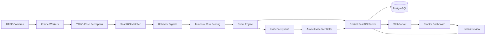

# SOFTWARE REQUIREMENTS SPECIFICATION (SRS)
## VIGIL AI — Hệ thống Trợ lý Giám sát Thi cử bằng AI
### Phiên bản Prototype cấp trường — 10–20 phòng thi đồng thời

**Phiên bản tài liệu:** 1.1.0  
**Ngày lập:** 16/09/2026  
**Trạng thái:** Behavior Detection Semantic Revision (v1.1)  
**Hệ thống:** VIGIL AI / `laser_eyes`  
**Mục tiêu triển khai:** Nguyên mẫu thử nghiệm trong phạm vi cấp trường, hỗ trợ 10–20 phòng thi đồng thời  
**Định vị sản phẩm:** AI-assisted Exam Monitoring / Proctoring Risk Detection & Evidence System

---

## LỊCH SỬ THAY ĐỔI

| Phiên bản | Ngày | Nội dung | Trạng thái |
|---|---|---|---|
| 1.0.0 | 16/09/2026 | Khởi tạo SRS cho prototype 10–20 phòng thi, đóng băng phạm vi theo kiến trúc khả thi trong 10 ngày | Baseline |
| 1.1.0 | 16/09/2026 | **Behavior Detection Semantic Revision:** Thực nghiệm trên classroom video cho thấy `LOOK_DOWN_LONG` có activation rate rất cao vì tư thế cúi viết bài là behavior hợp lệ phổ biến. Do đó hạ `LOOK_DOWN_LONG` & `LOW_HAND_POSTURE` từ independent suspicious evidence xuống Context/Observation; bổ sung composite signal `SUSPICIOUS_BELOW_DESK_ACTIVITY` (P0) kết hợp đa manh mối (head pitch, hand below desk, motion, desk geometry); chuẩn hóa cơ chế chống double-counting risk | Revised |

---

# 1. GIỚI THIỆU

## 1.1. Mục đích tài liệu

Tài liệu này đặc tả yêu cầu phần mềm cho phiên bản **VIGIL AI School Prototype**, tập trung vào việc triển khai một nguyên mẫu có thể vận hành thực tế trong môi trường cấp trường với **10–20 phòng thi đồng thời**.

Tài liệu được xây dựng trên hiện trạng codebase VIGIL AI, trong đó hệ thống đã có các thành phần nền tảng gồm:

- Phát hiện người / khung xương bằng YOLO/YOLO-Pose.
- Theo dõi đa đối tượng.
- Tích lũy tín hiệu theo thời gian.
- Máy trạng thái hành vi.
- Bộ đệm video bằng chứng.
- FastAPI REST API.
- WebSocket realtime.
- SQLAlchemy storage.
- Bộ unit test cho các thành phần lõi.

Mục tiêu của SRS này không phải biến hệ thống thành sản phẩm thương mại hoàn chỉnh trong 10 ngày, mà là **đóng băng một phạm vi có thể triển khai, đo kiểm, trình diễn và tiếp tục mở rộng** mà không phải viết lại kiến trúc sau prototype.

---

## 1.2. Bối cảnh

Hệ thống hiện có hai luồng nghiệp vụ:

1. **Personal Proctoring** — giám sát cá nhân qua webcam.
2. **Classroom Surveillance** — giám sát nhiều thí sinh trong phòng thi tập trung.

Phiên bản SRS này chỉ tập trung vào **Classroom Surveillance** cho kỳ thi tập trung trong phạm vi trường.

Các hạn chế chính của baseline hiện tại:

- Mô hình 1-stage custom bị domain shift mạnh khi đổi phòng, góc camera, đồng phục, ánh sáng.
- YOLO-Pose tìm người tốt hơn nhưng heuristic từ keypoint có recall hành vi thấp và false positive cao.
- Phát hiện trực tiếp điện thoại dưới gầm bàn không khả thi ở khoảng cách xa và độ phân giải nhỏ.
- Multi-object tracking dựa trên IoU/Centroid dễ nhảy ID sau che khuất dài.
- CPU decode RTSP, GPU inference, network bandwidth và disk I/O là các bottleneck khi tăng số phòng.
- AI không được sử dụng như cơ chế tự động kết luận vi phạm; cần Human-in-the-loop.

Do đó prototype được tái định vị thành:

> **Hệ thống phát hiện rủi ro và hành vi đáng ngờ, tự động cắt bằng chứng, ưu tiên sự kiện và hỗ trợ giám thị xác nhận.**

---

## 1.3. Mục tiêu sản phẩm

### Mục tiêu chính

Hệ thống phải:

1. Kết nối và xử lý đồng thời tối thiểu 10 luồng camera phòng thi.
2. Có kiến trúc scale lên 20 phòng bằng cách bổ sung inference worker.
3. Xác định vị trí thí sinh theo **Seat ID** thay vì phụ thuộc hoàn toàn vào Track ID động.
4. Phát hiện một tập nhỏ các **suspicious behavior signals** có tính khả thi.
5. Tích lũy tín hiệu theo thời gian để giảm cảnh báo nhiễu.
6. Tạo sự kiện kèm snapshot và video bằng chứng.
7. Đẩy sự kiện thời gian thực tới dashboard giám thị.
8. Cho phép giám thị xác nhận hoặc bác bỏ cảnh báo AI.
9. Ghi nhận audit trail của toàn bộ vòng đời sự kiện.
10. Giữ độ trễ đủ thấp để giám thị có thể can thiệp trong thời gian thi.

### Mục tiêu không bao gồm

Prototype **không cam kết**:

- Tự động xác định thí sinh “gian lận” hay “không gian lận”.
- Nhận diện chắc chắn điện thoại bị che dưới bàn.
- Xử lý kỷ luật tự động.
- Nhận diện danh tính bằng khuôn mặt.
- Re-ID ngoại hình đầy đủ giữa các camera.
- Phân tích hành vi phức tạp bằng ST-GCN / VideoMAE trong bản 10 ngày.
- Scale production 50–100 phòng trên một node duy nhất.

---

## 1.4. Thuật ngữ

| Thuật ngữ | Định nghĩa |
|---|---|
| **Room** | Một phòng thi có một hoặc nhiều camera giám sát |
| **Camera Stream** | Luồng RTSP/video của một camera |
| **Seat ROI** | Vùng không gian định nghĩa vị trí một chỗ ngồi/thí sinh |
| **Seat ID** | Định danh logic cố định của chỗ ngồi trong phòng |
| **Detection** | Kết quả phát hiện người/keypoint tại một frame |
| **Track ID** | ID tạm thời của object tracker |
| **Suspicious Signal** | Tín hiệu hành vi bất thường do AI/heuristic phát hiện |
| **Risk Score** | Điểm rủi ro tích lũy của Seat trong một khoảng thời gian |
| **Event** | Sự kiện đã vượt điều kiện phát cảnh báo |
| **Evidence** | Snapshot/video/timestamp/metadata đi kèm event |
| **Human Review** | Giám thị xác nhận hoặc bác bỏ cảnh báo AI |
| **Inference Worker** | Tiến trình/node thực hiện decode, inference và behavior analysis |
| **Central Server** | FastAPI + DB + WebSocket + event management |
| **Stale Frame** | Frame cũ không còn giá trị realtime và phải bỏ |
| **Cooldown** | Khoảng thời gian ngăn một seat phát lặp cảnh báo quá dày |

---

# 2. PHẠM VI PHIÊN BẢN PROTOTYPE

## 2.1. Scope tổng thể

Prototype được chia thành 12 scope chức năng chính:

1. Quản lý phòng thi và phiên thi.
2. Kết nối camera và thu nhận RTSP.
3. Phát hiện người / Pose Perception.
4. Seat ROI Mapping và Seat-based Identity.
5. Phát hiện suspicious behavior signals.
6. Temporal Risk Scoring và State Machine.
7. Event Engine và Evidence Generation.
8. Dashboard giám sát thời gian thực.
9. Human-in-the-loop Review.
10. Multi-room Worker Orchestration và Scalability.
11. Health Monitoring, Logging và Observability.
12. Security, Audit và Evidence Integrity.

---

## 2.2. Nguyên tắc đóng băng phạm vi

Trong thời gian 10 ngày, mọi yêu cầu mới phải được đánh giá theo quy tắc:

- Nếu ảnh hưởng trực tiếp tới khả năng chạy 10–20 phòng: ưu tiên.
- Nếu ảnh hưởng trực tiếp tới bằng chứng, review hoặc audit: ưu tiên.
- Nếu chỉ cải thiện accuracy cục bộ nhưng tăng đáng kể độ phức tạp: hoãn.
- Nếu yêu cầu retrain mô hình lớn / dataset lớn / nghiên cứu dài: out of scope.
- Nếu có thể giải quyết bằng cấu hình hoặc geometry ổn định hơn AI phức tạp: ưu tiên giải pháp đơn giản.

---

# 3. CÁC BÊN LIÊN QUAN VÀ VAI TRÒ

## 3.1. System Administrator

Quyền:

- Tạo/sửa/xóa phòng thi.
- Khai báo camera.
- Cấu hình Seat ROI.
- Khởi tạo và kết thúc exam session.
- Xem health của inference worker.
- Truy cập logs và cấu hình hệ thống.

## 3.2. Proctor / Giám thị

Quyền:

- Xem danh sách phòng được phân công.
- Theo dõi trạng thái phòng.
- Nhận cảnh báo realtime.
- Mở snapshot/video bằng chứng.
- Confirm / Reject event.
- Ghi chú đánh giá.

## 3.3. Technical Operator

Quyền:

- Cấu hình RTSP.
- Kiểm tra camera connectivity.
- Điều chỉnh FPS inference.
- Điều chỉnh worker allocation.
- Kiểm tra GPU/CPU/RAM/network.

## 3.4. AI/ML Engineer

Quyền:

- Cấu hình model path/version.
- Điều chỉnh confidence threshold.
- Điều chỉnh behavior thresholds.
- Chạy benchmark.
- Xuất metrics offline.

## 3.5. Auditor / Examiner Committee

Quyền read-only:

- Xem event đã review.
- Xem evidence integrity hash.
- Xem reviewer, timestamp và action history.

---

# 4. KIẾN TRÚC TỔNG THỂ

## 4.1. Logical Architecture



---

## 4.2. Deployment Architecture

### Cấu hình tối thiểu cho 10 phòng

```text
10 RTSP Streams
      ↓
Inference Worker A
      ↓ events
Central FastAPI + PostgreSQL + Dashboard
```

### Cấu hình mục tiêu cho 20 phòng

```text
Rooms 01–10 → Worker A ┐
                       ├→ Central Server → Dashboard
Rooms 11–20 → Worker B ┘
```

Yêu cầu kiến trúc:

- Worker phải có thể đăng ký với Central Server.
- Room/Camera phải được assign cho một worker.
- Central Server không thực hiện AI inference nặng.
- Worker failure không được làm Central Server crash.
- Việc thêm worker mới không yêu cầu thay đổi schema API chính.

---

# 5. SCOPE 01 — QUẢN LÝ PHÒNG THI VÀ PHIÊN THI

## 5.1. Mục tiêu

Cung cấp thực thể quản lý ổn định để tất cả event, evidence và Seat ID được gắn đúng bối cảnh kỳ thi.

## 5.2. Functional Requirements

### FR-ROOM-001 — Tạo phòng thi

Hệ thống phải cho phép Admin tạo phòng với:

- `room_id`
- `room_code`
- `room_name`
- `building`
- `floor`
- `capacity`
- `status`
- `created_at`
- `updated_at`

### FR-ROOM-002 — Quản lý camera của phòng

Mỗi room phải hỗ trợ:

- 1..N cameras.
- RTSP URL.
- Camera name.
- Resolution metadata.
- Target FPS.
- Inference FPS.
- Enabled/disabled.
- Assigned worker.

### FR-ROOM-003 — Session thi

Admin phải có thể tạo một exam session gồm:

- `session_id`
- `exam_name`
- `subject_code`
- `start_time`
- `end_time`
- `room_id`
- `status`

### FR-ROOM-004 — Trạng thái session

Trạng thái tối thiểu:

```text
DRAFT → READY → RUNNING → STOPPING → COMPLETED
                       ↘ FAILED
```

### FR-ROOM-005 — Không inference ngoài session

Worker không được phát event nghiệp vụ nếu room không có session ở trạng thái `RUNNING`.

### FR-ROOM-006 — Session isolation

Event của session A không được xuất hiện trong session B kể cả khi cùng room/camera.

## 5.3. Acceptance Criteria

- Có thể tạo ít nhất 20 rooms.
- Mỗi room có thể lưu cấu hình camera độc lập.
- Start/Stop session không yêu cầu restart server.
- Event luôn chứa `session_id` và `room_id` hợp lệ.

---

# 6. SCOPE 02 — CAMERA INGESTION & RTSP PIPELINE

## 6.1. Mục tiêu

Thu nhận video ổn định và đảm bảo pipeline ưu tiên realtime thay vì xử lý đầy đủ mọi frame.

## 6.2. Functional Requirements

### FR-CAM-001 — Kết nối RTSP

Worker phải kết nối được RTSP camera theo cấu hình.

### FR-CAM-002 — Auto reconnect

Nếu RTSP mất kết nối:

- Worker chuyển camera sang `DEGRADED`.
- Retry theo backoff.
- Không crash worker.
- Gửi health event về Central Server.

### FR-CAM-003 — Stale frame dropping

Mỗi camera queue phải giới hạn nhỏ, khuyến nghị:

```text
queue size = 1 hoặc 2
```

Nếu queue đầy:

- Bỏ frame cũ.
- Giữ frame mới nhất.

### FR-CAM-004 — Inference sampling

Hệ thống phải tách:

- Capture FPS.
- Inference FPS.
- Preview FPS.

Baseline prototype:

- Capture: theo camera.
- Inference: 3–5 FPS.
- Preview dashboard: 1–2 FPS khi cần.

### FR-CAM-005 — Timestamp

Mỗi frame phải có:

- capture timestamp.
- processing timestamp.
- camera ID.
- monotonically increasing local sequence.

### FR-CAM-006 — Latency protection

Nếu frame age vượt cấu hình `max_frame_age_ms`, frame phải bị bỏ.

### FR-CAM-007 — Per-camera metrics

Phải ghi:

- capture FPS.
- inference FPS.
- dropped frames.
- reconnect count.
- average frame age.
- current queue size.

## 6.3. Failure Handling

| Lỗi | Hành vi |
|---|---|
| RTSP timeout | reconnect |
| Codec error | log + reconnect |
| Queue full | drop oldest |
| Camera offline | health alert |
| Worker overload | giảm inference sampling / drop frame |

## 6.4. Acceptance Criteria

- Một camera offline không làm các camera khác dừng.
- Reconnect camera không yêu cầu restart worker.
- Không tồn tại backlog video kéo dài hàng chục giây.
- End-to-end realtime latency không tăng không giới hạn sau 1–2 giờ chạy.

---

# 7. SCOPE 03 — PERSON / POSE PERCEPTION

## 7.1. Mục tiêu

Sử dụng YOLO-Pose như lớp perception để:

- tìm người;
- lấy bounding box;
- lấy keypoint khi khả dụng;
- cung cấp tín hiệu đầu vào cho Seat Matcher và behavior logic.

Không sử dụng YOLO-Pose như bằng chứng duy nhất để kết luận cheating.

## 7.2. Functional Requirements

### FR-PER-001 — Person detection

Mỗi inference frame phải trả về:

```json
{
  "bbox": [x1, y1, x2, y2],
  "confidence": 0.0,
  "keypoints": [],
  "camera_id": "...",
  "timestamp": "..."
}
```

### FR-PER-002 — Configurable thresholds

Phải cấu hình được:

- model path.
- model version.
- input resolution.
- person confidence threshold.
- keypoint threshold.
- NMS threshold.

### FR-PER-003 — Missing keypoints

Nếu keypoint thiếu:

- Không fallback mặc định thành “normal”.
- Signal phụ thuộc keypoint phải trả trạng thái `UNKNOWN` hoặc `INSUFFICIENT_DATA`.

### FR-PER-004 — No hard cheating label

Perception layer không được xuất `CHEATING=true`.

### FR-PER-005 — Batch/multi-stream readiness

Thiết kế inference API nội bộ không được khóa cứng vào một camera duy nhất.

## 7.3. Output Contract

```python
PoseDetection:
    bbox
    confidence
    keypoints
    keypoint_confidences
    center
    timestamp
    camera_id
```

## 7.4. Acceptance Criteria

- Phát hiện ổn định phần lớn thí sinh nhìn thấy rõ trong room test.
- Keypoint thiếu không tạo ra góc quay giả 0° và kết luận normal sai.
- Model version được ghi vào event metadata.

---

# 8. SCOPE 04 — SEAT ROI MAPPING & SEAT-BASED IDENTITY

## 8.1. Mục tiêu

Thay dependency vào Track ID động bằng một định danh ổn định theo chỗ ngồi.

## 8.2. Khái niệm

Mỗi phòng có tập Seat ROI:

```text
ROOM_A101
├── SEAT_A01
├── SEAT_A02
├── ...
└── SEAT_A30
```

Mỗi Seat ROI là polygon trong không gian ảnh camera.

## 8.3. Functional Requirements

### FR-SEAT-001 — Cấu hình Seat ROI

Admin phải khai báo được:

- `seat_id`
- `room_id`
- `camera_id`
- polygon coordinates.
- seat label.
- enabled.

### FR-SEAT-002 — Mapping person → seat

Person được map vào seat dựa trên một hoặc nhiều tiêu chí:

1. bbox center.
2. bottom-center / torso anchor.
3. overlap ratio với polygon.
4. lịch sử seat trước đó.

### FR-SEAT-003 — Stable identity

Nếu person bị occlusion ngắn rồi xuất hiện lại trong cùng seat, behavior history phải tiếp tục trên cùng `seat_id`.

### FR-SEAT-004 — Multiple candidates in one seat

Nếu >1 person hợp lệ trong một Seat ROI:

- đánh dấu `SEAT_OCCUPANCY_ANOMALY`.
- không tự động kết luận cheating.

### FR-SEAT-005 — Empty seat

Nếu không có person trong Seat ROI vượt `empty_timeout_ms`:

- seat chuyển trạng thái `EMPTY`.

### FR-SEAT-006 — Unknown region

Person không map được seat phải gắn `seat_id = null` và không được làm hỏng pipeline.

### FR-SEAT-007 — Manual calibration

Phải có cách lưu cấu hình Seat ROI theo từng camera/phòng.

## 8.4. Seat State

```text
UNKNOWN
EMPTY
OCCUPIED
OCCLUDED
MULTIPLE_PERSON
```

## 8.5. Acceptance Criteria

- Giám thị đi qua che người 3–5 giây không làm thay Seat ID.
- Seat history không phụ thuộc Track ID cũ/mới.
- Có thể cấu hình ít nhất 40 seat/phòng.
- Polygon được lưu persistent.

---

# 9. SCOPE 05 — SUSPICIOUS BEHAVIOR SIGNALS (v1.1 REVISION)

## 9.1. Mục tiêu và Nguyên tắc phân tầng mới

Phân biệt rõ ràng giữa 3 tầng tín hiệu:
1. **Observation / Context Signals:** Tín hiệu quan sát tư thế cơ thể (như cúi đầu đọc/viết bài, hạ tay). Bản thân các tín hiệu này KHÔNG đồng nghĩa với gian lận và chỉ đóng góp trọng số rủi ro rất thấp hoặc bằng 0 khi đứng độc lập.
2. **Context Geometry Signals:** Vị trí tương đối của cổ tay/đầu so với mặt bàn (Desk Line / Writing Zone / Under-Desk Zone) của từng Seat.
3. **Primary & Suspicious Composite Signals:** Các hành vi đáng ngờ thực sự (Quay đầu kéo dài, Nghiêng người sang bàn bên, Rời chỗ, hoặc Chuỗi hoạt động bất thường dưới gầm bàn kết hợp đa manh mối).

Chỉ phát hiện **tín hiệu đáng ngờ và mức độ rủi ro**, không tự động kết luận “gian lận” theo nghĩa pháp lý.

## 9.2. Phân loại Tín hiệu Hành vi (Behavior Taxonomy)

### A. Primary Suspicious Signals (P0)

#### BEH-01 — PROLONGED_HEAD_TURN
- **Điều kiện:** Đầu quay lệch khỏi baseline (Yaw $\ge 35^\circ$); duy trì vượt thời gian tối thiểu; đủ observation quality ($>0.20$).
- **Mục đích:** Phát hiện hành vi liếc nhìn bài của thí sinh bên cạnh.

#### BEH-02 — BODY_LEAN_SIDE
- **Điều kiện:** Torso/cột sống nghiêng rõ rệt sang trái/phải ($\ge 18^\circ$) kéo dài.
- **Mục đích:** Phát hiện rướn người/nghiêng sang bàn bên để nhìn trộm hoặc trao đổi.

#### BEH-05 — SEAT_LEFT
- **Điều kiện:** Thí sinh rời khỏi Seat ROI vượt quá timeout cấu hình (mặc định 5.0s).

#### BEH-06 — MULTIPLE_PERSON_NEAR_SEAT
- **Điều kiện:** Xuất hiện $\ge 2$ người trong hoặc giáp ranh Seat ROI bất thường.

#### BEH-07 — SUSPICIOUS_BELOW_DESK_ACTIVITY (New P0 Composite Signal)
- **Mục đích:** Phát hiện chuỗi hành vi biểu thị tương tác bất thường với khu vực dưới mặt bàn/gầm bàn (ví dụ: dùng phao thi, thiết bị di động giấu kín).
- **Nguyên tắc tổng hợp (Multi-cue Synthesis):** Được tổng hợp từ sự kết hợp có tương quan thời gian giữa:
  - `LOW_HAND_POSTURE` (Cổ tay nằm dưới mặt bàn hoặc vùng hộc bàn);
  - `LOOK_DOWN_LONG` (Đầu cúi gập sâu về phía hộc bàn);
  - `REPEATED_HAND_INTERACTION` (Chuyển động/dao động cổ tay lặp lại trong vùng dưới bàn);
  - `BODY_LEAN_SIDE` (Nghiêng người che chắn hành động dưới bàn).
- **Lưu ý:** Không gọi là `PHONE_USAGE` vì camera góc xa không thể khẳng định bản chất vật thể.

---

### B. Context & Observation Signals

#### BEH-03 — LOOK_DOWN_LONG (Demoted to Context Observation)
- **Định nghĩa v1.1:** Thí sinh duy trì tư thế nhìn/cúi đầu xuống dưới bàn trong một khoảng thời gian.
- **Quy tắc rủi ro:** Trong phòng thi, cúi đầu viết bài và đọc đề là hành vi bình thường, phổ biến và hợp lệ. `LOOK_DOWN_LONG` **KHÔNG** được xem là bằng chứng đáng ngờ độc lập và có mức đóng góp rủi ro mặc định xấp xỉ 0 (hoặc rất thấp $\le 3.0$ pts/sec). Signal này chỉ đóng vai trò là **ngữ cảnh kích hoạt (Context Multiplier)** cho `SUSPICIOUS_BELOW_DESK_ACTIVITY`.

#### BEH-04 — LOW_HAND_POSTURE (Context Observation)
- **Định nghĩa v1.1:** Một hoặc hai cổ tay nằm ở vùng thấp hoặc dưới mặt bàn/hộc bàn khi keypoint đủ độ tin cậy.
- **Quy tắc rủi ro:** Là bằng chứng thành phần. Nhãn UI hiển thị là `Low-hand posture` / `UNMAPPED context`, không tự ý gọi là `PHONE_DETECTED`.

---

### C. P1 / Advanced Context Signals

- **BEH-08 — REPEATED_HAND_INTERACTION:** Chuyển động/vận tốc cổ tay dao động liên tục trong vùng dưới mặt bàn qua cửa sổ thời gian.
- **BEH-09 — HEAD_HAND_CORRELATION:** Sự tương quan đồng thời giữa góc cúi đầu và chuyển động hạ tay xuống gầm bàn.
- **BEH-10 — REPEATED_SIDE_INTERACTION:** Chuỗi hành động quay đầu liếc bài lặp đi lặp lại nhiều đợt ngắn.
- **BEH-11 — GROUP_ANOMALY:** Hiện tượng dị thường nhóm hoặc triệt tiêu tập thể (Collective Suppression).

---

## 9.3. Functional Requirements

### FR-BEH-001 — Signal Contract
Mọi signal phải tuân thủ schema chuẩn:
```json
{
  "room_id": "ROOM_101",
  "session_id": "SES_01",
  "camera_id": "CAM_01",
  "seat_id": "SEAT_101_01",
  "signal_type": "SUSPICIOUS_BELOW_DESK_ACTIVITY",
  "raw_score": 0.85,
  "confidence": 0.90,
  "quality": 0.88,
  "timestamp_ms": 12500.0,
  "metadata": {
    "evidence_components": ["LOOK_DOWN_LONG", "LOW_HAND_POSTURE", "REPEATED_HAND_INTERACTION"]
  }
}
```

### FR-BEH-002 — Unknown-Safe Behavior
- Nếu keypoint cổ tay/đầu có confidence $< \text{min\_kp\_conf}$ (bị che khuất hoặc không rõ ràng), hệ thống phải trả về `UNKNOWN / INSUFFICIENT_DATA`.
- Tuyệt đối không suy diễn việc mất keypoint cổ tay sau mặt bàn là bằng chứng gian lận.

### FR-BEH-003 — Per-Room / Per-Seat Thresholds
Tất cả các ngưỡng góc đầu, góc nghiêng, khoảng cách tay và thời lượng kích hoạt phải được cấu hình hóa tập trung trong `ClassroomConfig`.

### FR-BEH-004 — No Single-Frame Event
Một frame đơn lẻ không được phép tạo sự kiện `FLAGGED_FOR_REVIEW`. Mọi quyết định cảnh báo phải trải qua tích lũy thời gian thực (`dt_sec`).

### FR-BEH-005 — Composite Below-Desk Activity Synthesis
Bộ trích xuất tín hiệu hoặc Risk Engine phải hỗ trợ cơ chế ghép nối đa manh mối:
$$\text{Score}_{\text{composite}} = f(\text{LowHand}, \text{LookDown}, \text{HandMotion}, \text{Persistence})$$

### FR-BEH-006 — Component Risk Suppression (Anti-Double-Counting)
Khi tín hiệu tổ hợp `SUSPICIOUS_BELOW_DESK_ACTIVITY` được kích hoạt cho một Seat, Risk Engine phải tự động triệt tiêu việc cộng điểm lặp lại của các tín hiệu thành phần (`LOOK_DOWN_LONG`, `LOW_HAND_POSTURE`) trong cùng cửa sổ thời gian để tránh hiện tượng thổi phồng điểm rủi ro.

### FR-BEH-007 — Seat Desk Geometry Awareness & Fallback
- Mỗi `SeatDefinition` hỗ trợ lưu trữ siêu dữ liệu hình học bàn thi (Desk Line / Writing Zone / Under-Desk Zone).
- Nếu dữ liệu Desk Geometry chưa được cấu hình (các Seat cũ trong DB), hệ thống phải tự động fallback sang ước lượng hình học cơ thể (tỉ lệ cổ tay so với vai/khuỷu tay) mà không làm gián đoạn pipeline.

## 9.4. Acceptance Criteria

- `LOOK_DOWN_LONG` độc lập trong 10 giây làm bài bình thường KHÔNG làm Seat vượt ngưỡng `OBSERVE` ($< 30$ điểm Risk).
- `SUSPICIOUS_BELOW_DESK_ACTIVITY` kích hoạt chính xác khi có sự kết hợp kéo dài giữa cúi đầu và giấu tay/chuyển động dưới bàn.
- Không có nhãn `CHEATING` hay `PHONE_DETECTED` ở bất kỳ tầng nào của hệ thống.

---

# 10. SCOPE 06 — TEMPORAL RISK SCORING & STATE MACHINE

## 10.1. Mục tiêu

Giảm false positive do frame đơn và biến chuỗi signal thành risk có ngữ cảnh thời gian.

## 10.2. Risk State

Prototype dùng trạng thái:

```text
NORMAL
  ↓
OBSERVE
  ↓
SUSPICIOUS
  ↓
FLAGGED_FOR_REVIEW
  ↓
COOLDOWN
  ↓
NORMAL
```

## 10.3. Functional Requirements

### FR-RISK-001 — Millisecond-based window

Không dựa vào frame count cứng.

Phải dùng timestamp để tính cửa sổ thời gian.

### FR-RISK-002 — Configurable window

Cấu hình được:

- `window_ms`.
- `min_observation_ms`.
- signal decay.
- threshold transitions.

### FR-RISK-003 — Score range

Risk score chuẩn hóa:

```text
0–100
```

### FR-RISK-004 — Baseline state bands

Baseline đề xuất ban đầu:

```text
0–29   NORMAL
30–59  OBSERVE
60–79  SUSPICIOUS
80–100 FLAGGED_FOR_REVIEW
```

Các giá trị trên là cấu hình prototype và phải có khả năng tune.

### FR-RISK-005 — Contextual & Composite Weighting (v1.1)

Mỗi tầng tín hiệu có trọng số đóng góp theo giây riêng biệt:

- **Primary Suspicious Signals:**
  - `PROLONGED_HEAD_TURN`: $+18.0\text{ pts/sec}$
  - `BODY_LEAN_SIDE`: $+15.0\text{ pts/sec}$
  - `MULTIPLE_PERSON_NEAR_SEAT`: $+20.0\text{ pts/sec}$
  - `SUSPICIOUS_BELOW_DESK_ACTIVITY`: $+25.0\text{ pts/sec}$
- **Context & Observation Signals:**
  - `LOOK_DOWN_LONG` (độc lập): $+0.5\text{ đến }+3.0\text{ pts/sec}$ (rất thấp, không tự gây bão hòa khi viết bài).
  - `LOW_HAND_POSTURE` (độc lập): $+4.0\text{ pts/sec}$ (bằng chứng thành phần).
- **Anti-Double-Counting Rule:** Khi `SUSPICIOUS_BELOW_DESK_ACTIVITY` được kích hoạt, điểm của `LOOK_DOWN_LONG` và `LOW_HAND_POSTURE` bị triệt tiêu để tránh cộng dồn lặp lại.

Tất cả trọng số đều được cấu hình trong `ClassroomConfig`.

### FR-RISK-006 — Normal decay

Khi signal không còn tồn tại, risk phải giảm dần thay vì reset ngay.

### FR-RISK-007 — Cooldown

Sau event:

- vào `COOLDOWN`.
- vẫn tiếp tục theo dõi background.
- tránh spam event.

### FR-RISK-008 — Recidivism

Nếu suspicious behavior quay lại ngay sau cooldown, hệ thống có thể tăng severity.

### FR-RISK-009 — Missing observations

Nếu seat bị occlusion:

- không áp dụng normal penalty quá mạnh.
- không reset lịch sử ngay.

## 10.4. Acceptance Criteria

- Flicker 1–2 frame không tạo cảnh báo.
- Behavior kéo dài tạo score tăng hợp lý.
- Khi behavior dừng, score decay từ từ.
- Cooldown ngăn event spam.

---

# 11. SCOPE 07 — EVENT ENGINE

## 11.1. Mục tiêu

Biến trạng thái `FLAGGED_FOR_REVIEW` thành sự kiện nghiệp vụ có ID, metadata và evidence lifecycle.

## 11.2. Event Schema

```json
{
  "event_id": "uuid",
  "room_id": "ROOM_A101",
  "session_id": "SESSION_001",
  "camera_id": "CAM_01",
  "seat_id": "SEAT_A12",
  "event_type": "SUSPICIOUS_BEHAVIOR",
  "primary_signal": "PROLONGED_HEAD_TURN",
  "risk_score": 83,
  "severity": "HIGH",
  "start_timestamp": "...",
  "peak_timestamp": "...",
  "end_timestamp": "...",
  "model_version": "...",
  "config_version": "...",
  "review_status": "PENDING"
}
```

## 11.3. Functional Requirements

### FR-EVT-001 — Unique Event ID

Mỗi event phải có UUID duy nhất.

### FR-EVT-002 — Event deduplication

Trong cùng cooldown:

- không tạo hàng loạt event giống nhau cho cùng seat.

### FR-EVT-003 — Peak snapshot

Event phải cố gắng lưu frame có risk score cao nhất trong cửa sổ.

### FR-EVT-004 — Event lifecycle

```text
DETECTED
↓
EVIDENCE_PENDING
↓
READY_FOR_REVIEW
↓
CONFIRMED / REJECTED / INCONCLUSIVE
```

### FR-EVT-005 — Failure state

Nếu evidence tạo thất bại:

```text
EVIDENCE_FAILED
```

nhưng event metadata vẫn phải tồn tại.

### FR-EVT-006 — Idempotency

Retry gửi event tới Central Server không được tạo duplicate nếu cùng `event_id`.

## 11.4. Acceptance Criteria

- Mỗi event có ID duy nhất.
- Không duplicate do network retry.
- Event được gửi tới dashboard kể cả khi video evidence đang encode.

---

# 12. SCOPE 08 — EVIDENCE CAPTURE & ASYNC WRITER

## 12.1. Mục tiêu

Tạo snapshot và clip bằng chứng mà không block inference pipeline.

## 12.2. Evidence Package

Tối thiểu:

```text
event_id/
├── snapshot.jpg
├── evidence.mp4
└── metadata.json
```

## 12.3. Functional Requirements

### FR-EVI-001 — Ring buffer

Worker phải giữ circular buffer frame/video đủ để lấy pre-event evidence.

Baseline:

- 5 giây trước event.
- 5 giây sau event.
- tổng clip ~10 giây.

### FR-EVI-002 — Async encoding

Inference thread không trực tiếp encode MP4 đồng bộ.

### FR-EVI-003 — Evidence queue

Event gửi yêu cầu tới evidence queue.

### FR-EVI-004 — Dedicated worker

Sử dụng:

- ThreadPoolExecutor; hoặc
- dedicated process.

Prototype không bắt buộc Celery/Redis.

### FR-EVI-005 — File integrity hash

Sau khi đóng file:

```text
SHA-256(evidence.mp4)
```

phải được tính và lưu.

### FR-EVI-006 — Metadata

`metadata.json` tối thiểu chứa:

- event ID.
- room/session/camera/seat.
- timestamps.
- model version.
- config version.
- risk score.
- SHA-256.

### FR-EVI-007 — Failure isolation

Lỗi encode một clip không được làm inference worker crash.

### FR-EVI-008 — Concurrent alerts

Nếu nhiều event cùng lúc:

- evidence queue phải giới hạn concurrency.
- disk write không được block main AI loop.

## 12.4. Acceptance Criteria

- ≥99% event trong bài test mục tiêu tạo được snapshot.
- Mục tiêu ≥99% event tạo được video evidence khi storage bình thường.
- Hash file được lưu.
- 10 event cùng lúc không làm worker dừng.

---

# 13. SCOPE 09 — DASHBOARD GIÁM SÁT

## 13.1. Mục tiêu

Dashboard ưu tiên tình huống cần chú ý, không phải hiển thị 20 video full-HD cùng lúc.

## 13.2. Room Overview

Mỗi room hiển thị:

- room name.
- session.
- camera health.
- worker health.
- active alert count.
- latest event time.
- status.

Ví dụ:

```text
A101  ● NORMAL
A102  ● NORMAL
A103  ⚠ 2 ALERTS
A104  ● NORMAL
```

## 13.3. Event Card

Event card tối thiểu:

- room.
- seat.
- event type.
- primary signal.
- risk score.
- timestamp.
- snapshot.
- evidence availability.
- review status.

## 13.4. Functional Requirements

### FR-UI-001 — Realtime event push

Dashboard nhận event bằng WebSocket.

### FR-UI-002 — Alert sorting

Mặc định sắp theo:

1. chưa review.
2. severity.
3. mới nhất.

### FR-UI-003 — Event detail

Cho phép mở:

- snapshot.
- clip.
- signal breakdown.
- risk history tối giản.

### FR-UI-004 — Room drill-down

Chỉ khi user chọn room mới mở preview video.

### FR-UI-005 — Preview throttling

Không bắt buộc stream full resolution/full FPS lên dashboard.

### FR-UI-006 — Connection status

Hiển thị rõ:

- camera offline.
- worker offline.
- WebSocket disconnected.

### FR-UI-007 — Review actions

Các nút:

- `CONFIRM`
- `REJECT`
- `INCONCLUSIVE`

### FR-UI-008 — Note

Reviewer có thể nhập ghi chú.

## 13.5. Acceptance Criteria

- Event hiển thị trong mục tiêu <2–3 giây từ khi được flag.
- Dashboard không cần tải 20 full-HD video cùng lúc.
- Review cập nhật ngay trạng thái event.

---

# 14. SCOPE 10 — HUMAN-IN-THE-LOOP REVIEW

## 14.1. Mục tiêu

AI chỉ làm trợ lý phát hiện và ưu tiên sự kiện. Con người là bên đánh giá kết quả cuối cùng trong prototype.

## 14.2. Review Status

```text
PENDING
CONFIRMED
REJECTED
INCONCLUSIVE
```

## 14.3. Functional Requirements

### FR-REV-001 — Reviewer identity

Mọi review phải lưu reviewer.

### FR-REV-002 — Review timestamp

Lưu thời điểm review.

### FR-REV-003 — Immutable AI metadata

Review không được sửa:

- original risk score.
- model version.
- original timestamp.
- evidence hash.

### FR-REV-004 — Review reason

Có thể lưu reason code:

```text
TRUE_SUSPICIOUS
NORMAL_BEHAVIOR
PROCTOR_OCCLUSION
LOW_IMAGE_QUALITY
SEAT_MAPPING_ERROR
OTHER
```

### FR-REV-005 — No automatic disciplinary action

Không có API tự động đình chỉ thi hoặc tạo biên bản kỷ luật dựa duy nhất vào AI event.

## 14.4. Acceptance Criteria

- Mọi event có thể được review.
- Review có audit trail.
- AI score không bị thay đổi sau review.

---

# 15. SCOPE 11 — BACKEND API & WEBSOCKET

## 15.1. REST API Baseline

### Rooms

```http
GET    /api/v1/rooms
POST   /api/v1/rooms
GET    /api/v1/rooms/{room_id}
PATCH  /api/v1/rooms/{room_id}
```

### Cameras

```http
GET    /api/v1/cameras
POST   /api/v1/cameras
PATCH  /api/v1/cameras/{camera_id}
POST   /api/v1/cameras/{camera_id}/test
```

### Seats

```http
GET    /api/v1/rooms/{room_id}/seats
POST   /api/v1/rooms/{room_id}/seats
PUT    /api/v1/seats/{seat_id}
DELETE /api/v1/seats/{seat_id}
```

### Sessions

```http
POST /api/v1/sessions
POST /api/v1/sessions/{session_id}/start
POST /api/v1/sessions/{session_id}/stop
GET  /api/v1/sessions/{session_id}
```

### Events

```http
GET   /api/v1/events
GET   /api/v1/events/{event_id}
POST  /api/v1/events/{event_id}/review
```

### Worker

```http
POST /api/v1/workers/register
POST /api/v1/workers/heartbeat
GET  /api/v1/workers
```

## 15.2. WebSocket Channels

Tối thiểu:

```text
/ws/events
/ws/rooms/{room_id}
/ws/system/health
```

## 15.3. Functional Requirements

### FR-API-001 — Validation

Mọi input phải qua Pydantic validation.

### FR-API-002 — API versioning

Prefix `/api/v1`.

### FR-API-003 — Pagination

Event listing phải hỗ trợ pagination.

### FR-API-004 — Filtering

Filter theo:

- room.
- session.
- seat.
- status.
- severity.
- time range.

### FR-API-005 — Worker auth token

Worker phải có token/credential để gửi heartbeat/event.

### FR-API-006 — Idempotent event ingest

`event_id` trùng phải update/no-op có kiểm soát, không duplicate.

---

# 16. SCOPE 12 — DATABASE & DATA MODEL

## 16.1. Database

- Dev/Test: SQLite cho phép.
- Prototype multi-room: PostgreSQL khuyến nghị.

## 16.2. Core Tables

### `rooms`

```text
id
code
name
building
floor
capacity
status
created_at
updated_at
```

### `cameras`

```text
id
room_id
name
rtsp_url_encrypted_or_protected
resolution
capture_fps
inference_fps
worker_id
enabled
status
```

### `seats`

```text
id
room_id
camera_id
seat_code
polygon_json
enabled
```

### `exam_sessions`

```text
id
room_id
exam_name
subject_code
start_time
end_time
status
```

### `events`

```text
id
session_id
room_id
camera_id
seat_id
event_type
primary_signal
risk_score
severity
start_timestamp
peak_timestamp
end_timestamp
model_version
config_version
review_status
created_at
```

### `evidence`

```text
id
event_id
snapshot_path
video_path
video_sha256
created_at
status
error_message
```

### `reviews`

```text
id
event_id
reviewer_id
decision
reason_code
note
reviewed_at
```

### `workers`

```text
id
hostname
gpu_name
status
last_heartbeat
active_camera_count
version
```

### `audit_logs`

```text
id
actor_id
action
resource_type
resource_id
metadata_json
timestamp
```

## 16.3. Data Retention

Prototype phải cấu hình được retention của:

- raw preview cache.
- evidence clips.
- logs.
- events.

Không yêu cầu chính sách retention production trong SRS này nhưng không được hardcode vĩnh viễn.

---

# 17. SCOPE 13 — MULTI-ROOM WORKER ORCHESTRATION

## 17.1. Mục tiêu

Scale 10–20 phòng bằng cách bổ sung worker thay vì ép một GPU xử lý toàn bộ.

## 17.2. Functional Requirements

### FR-WRK-001 — Worker registration

Worker phải đăng ký:

- ID.
- hostname.
- GPU name.
- GPU memory.
- software version.

### FR-WRK-002 — Heartbeat

Worker gửi heartbeat định kỳ.

### FR-WRK-003 — Assignment

Mỗi camera thuộc một worker tại một thời điểm.

### FR-WRK-004 — Capacity limit

Worker phải có:

```text
max_active_streams
```

### FR-WRK-005 — Reject over-allocation

Không assign camera vượt capacity trừ khi Admin override.

### FR-WRK-006 — Failure detection

Nếu mất heartbeat vượt timeout:

- worker = OFFLINE.
- rooms liên quan = DEGRADED.
- dashboard cảnh báo.

### FR-WRK-007 — Horizontal scaling

Thêm Worker B không yêu cầu thay API event hay DB schema.

## 17.3. Prototype Capacity Policy

Baseline ban đầu:

```text
Worker A: Rooms 01–10
Worker B: Rooms 11–20
```

Số camera thực tế trên worker phải được quyết định bằng benchmark D1/D7, không hardcode dựa trên lý thuyết.

---

# 18. SCOPE 14 — HEALTH MONITORING & OBSERVABILITY

## 18.1. Metrics bắt buộc

### Per worker

- CPU %.
- RAM.
- GPU utilization.
- VRAM.
- inference latency.
- active streams.
- evidence queue length.

### Per camera

- online/offline.
- capture FPS.
- inference FPS.
- dropped frames.
- reconnect count.
- frame age.

### System

- events/minute.
- pending review.
- evidence failures.
- WebSocket clients.
- API error rate.

## 18.2. Logging

Log phải có:

```text
timestamp
level
service
worker_id
room_id
camera_id
session_id
event_id (nếu có)
message
```

## 18.3. Functional Requirements

### FR-OBS-001 — Structured logging

Ưu tiên JSON/structured format.

### FR-OBS-002 — Health endpoint

```http
GET /health
GET /ready
```

### FR-OBS-003 — Worker metrics endpoint

Cho phép Central Server đọc health snapshot.

### FR-OBS-004 — Threshold alert

Cảnh báo nếu:

- VRAM gần đầy.
- inference latency tăng bất thường.
- RTSP offline.
- evidence queue quá dài.

---

# 19. SCOPE 15 — SECURITY, PRIVACY & AUDIT

## 19.1. Security Requirements

### FR-SEC-001 — Authentication

Dashboard và API quản trị phải yêu cầu đăng nhập trong môi trường triển khai thực tế.

### FR-SEC-002 — Role-based access

Tối thiểu:

- ADMIN.
- PROCTOR.
- AUDITOR.
- TECHNICAL_OPERATOR.

### FR-SEC-003 — Protect RTSP credentials

Không log plaintext RTSP password.

### FR-SEC-004 — Evidence access control

Không cho anonymous truy cập evidence.

### FR-SEC-005 — Audit log

Các hành động phải audit:

- login.
- session start/stop.
- review event.
- seat config modification.
- camera config modification.

## 19.2. Evidence Integrity

Prototype yêu cầu:

- SHA-256 evidence file.
- timestamp.
- model version.
- reviewer history.

Không yêu cầu trong 10 ngày:

- blockchain.
- WORM storage.
- PKI digital signature production.

---

# 20. NON-FUNCTIONAL REQUIREMENTS

## 20.1. NFR-PERF — Hiệu năng

### NFR-PERF-001

Hỗ trợ tối thiểu 10 camera/phòng stream đồng thời trong bài test mục tiêu.

### NFR-PERF-002

Kiến trúc phải hỗ trợ 20 camera/phòng bằng ít nhất 2 worker nếu cần.

### NFR-PERF-003

Target inference sampling:

```text
3–5 FPS / camera
```

### NFR-PERF-004

Target event-to-dashboard latency:

```text
< 2–3 giây
```

trong điều kiện benchmark mục tiêu.

### NFR-PERF-005

Hệ thống ưu tiên drop stale frame thay vì tăng backlog latency.

---

## 20.2. NFR-REL — Reliability

### NFR-REL-001

Một camera crash không làm worker crash.

### NFR-REL-002

Một worker offline không làm Central Server crash.

### NFR-REL-003

Prototype 10 phòng phải chạy liên tục mục tiêu ≥2 giờ mà không crash.

### NFR-REL-004

Không có memory growth không kiểm soát trong stability test.

---

## 20.3. NFR-SCAL — Scalability

### NFR-SCAL-001

Scale bằng worker ngang.

### NFR-SCAL-002

Central Server không phụ thuộc GPU inference.

### NFR-SCAL-003

DB schema không gắn cứng một worker.

---

## 20.4. NFR-MAIN — Maintainability

### NFR-MAIN-001

Các module phải tiếp tục tách biệt:

- ingestion.
- perception.
- seat mapping.
- behavior.
- risk.
- event.
- evidence.
- API.

### NFR-MAIN-002

Threshold/config không hardcode rải rác.

### NFR-MAIN-003

Model phải có version metadata.

---

## 20.5. NFR-USE — Usability

### NFR-USE-001

Proctor phải nhận biết nhanh:

- room nào có cảnh báo.
- seat nào bị flag.
- bằng chứng nào cần xem.

### NFR-USE-002

Review event không quá 3 thao tác chính:

1. mở event;
2. xem evidence;
3. chọn decision.

---

## 20.6. NFR-TEST — Testability

### NFR-TEST-001

Logic risk/seat/event phải unit-test được bằng dữ liệu synthetic.

### NFR-TEST-002

Pipeline phải hỗ trợ chạy bằng video file thay RTSP cho regression test.

### NFR-TEST-003

Mọi regression nghiêm trọng của unit test hiện có phải được xử lý trước demo.

---

# 21. CONFIGURATION REQUIREMENTS

## 21.1. Global Config

```yaml
system:
  environment: prototype
  event_latency_target_ms: 3000

inference:
  target_fps: 5
  input_size: 1280
  person_confidence: 0.35

frame_queue:
  max_size: 2
  max_frame_age_ms: 800

evidence:
  pre_seconds: 5
  post_seconds: 5
  max_parallel_writers: 2

risk:
  window_ms: 1500
  cooldown_ms: 5000
```

Giá trị trên là baseline khởi tạo, không phải giá trị cuối cùng.

## 21.2. Per-room Config

- Seat polygons.
- Behavior thresholds.
- camera orientation metadata.
- exclusion zones.
- room calibration version.

---

# 22. FAILURE MODES & FALLBACK

## 22.1. Camera Failure

```text
RTSP lost
↓
Camera DEGRADED
↓
Reconnect loop
↓
Dashboard warning
↓
Recover → ONLINE
```

## 22.2. GPU Overload

Hành động ưu tiên:

1. Drop stale frames.
2. Giảm effective inference FPS.
3. Không tăng queue vô hạn.
4. Emit health warning.

## 22.3. Evidence Writer Overload

1. Queue request.
2. Limit concurrency.
3. Event vẫn tới dashboard.
4. Evidence status hiển thị `PENDING`.

## 22.4. Database Temporarily Unavailable

Prototype nên:

- retry có giới hạn.
- ghi lỗi rõ.
- không crash worker AI nếu Central Server ngắt ngắn hạn.

## 22.5. Missing Keypoints

- Signal = UNKNOWN.
- Không suy diễn nhìn thẳng.
- Không cộng/không trừ score vô căn cứ.

---

# 23. OUT OF SCOPE CHÍNH THỨC CHO DEADLINE 10 NGÀY

Các hạng mục sau **không được coi là blocker** của prototype:

1. ST-GCN.
2. PoseC3D.
3. VideoMAE.
4. 6DRepNet production integration.
5. Full appearance Re-ID.
6. Cross-camera Re-ID.
7. Face recognition.
8. Auto disciplinary decision.
9. Direct phone-under-desk classification.
10. Large-scale retraining dataset.
11. TensorRT bắt buộc.
12. NVDEC bắt buộc.
13. Celery/Redis bắt buộc.
14. Blockchain evidence.
15. Mobile application.
16. Production-grade HA cluster.
17. 50–100 room scale benchmark.

Các nội dung này được đưa vào roadmap sau prototype.

---

# 24. ACCEPTANCE TEST PLAN

## 24.1. AT-01 — 1 camera baseline

Mục tiêu:

- xác nhận perception.
- seat mapping.
- signal.
- event.
- evidence.
- dashboard.

Pass nếu:

- Event end-to-end hoạt động.
- Clip tạo thành công.
- Review lưu DB.

---

## 24.2. AT-02 — Proctor occlusion

Kịch bản:

- Thí sinh tại Seat A07.
- Giám thị che hoàn toàn 3–5 giây.
- Thí sinh xuất hiện lại.

Pass nếu:

- Seat ID vẫn A07.
- Risk history không nhảy sang seat khác.

---

## 24.3. AT-03 — Stale frame protection

Kịch bản:

- Cố tình tạo load lớn.

Pass nếu:

- dropped frame tăng.
- latency không tăng không giới hạn.

---

## 24.4. AT-04 — Multi-event evidence

Kịch bản:

- 5–10 seat phát event gần đồng thời.

Pass nếu:

- inference không freeze.
- evidence queue hoạt động.
- event vẫn tới dashboard.

---

## 24.5. AT-05 — 10-room stability

Thời gian:

```text
≥ 2 giờ
```

Theo dõi:

- CPU.
- GPU.
- VRAM.
- RAM.
- dropped frame.
- event latency.

Pass nếu:

- không crash.
- không memory leak rõ rệt.
- dashboard duy trì realtime usable.

---

## 24.6. AT-06 — 20-room stress

Mục tiêu:

- chứng minh kiến trúc scale ngang.

Cấu hình mong muốn:

```text
Worker A → ~10 streams
Worker B → ~10 streams
```

Thời gian stress ban đầu:

```text
30–60 phút
```

Pass nếu:

- Central Server xử lý event từ cả hai worker.
- không duplicate.
- room-worker mapping đúng.

---

## 24.7. AT-07 — Human review

Pass nếu:

- reviewer nhận event.
- xem được evidence.
- Confirm/Reject/Inconclusive.
- audit ghi đúng.

---

# 25. KPI CỦA PROTOTYPE

## 25.1. KPI hệ thống

| KPI | Target Prototype |
|---|---:|
| Concurrent rooms | 10 bắt buộc, 20 mục tiêu scale ngang |
| Stability | ≥2 giờ cho bài test 10 phòng |
| Event latency | <2–3 giây mục tiêu |
| Evidence snapshot success | ≥99% mục tiêu |
| Evidence video success | ≥99% khi storage bình thường |
| Worker crash isolation | Bắt buộc |
| Camera reconnect | Bắt buộc |
| Human review | 100% event có khả năng review |

## 25.2. KPI AI

Không sử dụng một chỉ số “overall cheating accuracy” duy nhất trong prototype.

Phải đánh giá riêng:

- person coverage.
- seat assignment accuracy.
- signal precision/recall theo từng loại hành vi.
- event false positive rate.
- missed event rate trên scripted test set.

---

# 26. TEST DATA STRATEGY

## 26.1. Không xây dataset lớn trong sprint 10 ngày

Thay vào đó tạo evaluation set nhỏ tại chính môi trường trường học.

## 26.2. Điều kiện cần quay

Tối thiểu các điều kiện:

- ánh sáng tốt.
- ánh sáng yếu.
- camera cao/góc chéo.
- phòng đông.
- giám thị đi lại.

## 26.3. Scripted behaviors

- viết bài bình thường.
- nhìn ngang ngắn.
- nhìn ngang kéo dài.
- cúi đầu.
- nghiêng người.
- tay thấp dưới bàn.
- rời chỗ.
- giám thị che camera.
- nhiều người gần một seat.

## 26.4. Ground truth

Mỗi clip cần annotation tối thiểu:

```text
room
seat
start_time
end_time
behavior_type
expected_signal
```

---

# 27. KẾ HOẠCH TRIỂN KHAI 10 NGÀY

## Day 1 — Freeze & Benchmark

Deliverables:

- Freeze SRS v1.0.
- Benchmark 1/5/10 streams.
- Ghi CPU/GPU/VRAM/FPS/latency.
- Quyết định capacity per worker.

## Day 2 — Seat ROI

Deliverables:

- Seat config format.
- Seat matcher.
- Visualization/debug overlay.
- Seat persistence.

## Day 3 — Behavior Signals

Deliverables:

- 3–5 signal P0.
- Missing-keypoint safe logic.
- Per-room threshold config.

## Day 4 — Risk Engine

Deliverables:

- Temporal score.
- State machine.
- Cooldown.
- Recidivism.

## Day 5 — Evidence

Deliverables:

- Ring buffer.
- Async writer.
- snapshot.
- MP4.
- SHA-256.

## Day 6 — Backend + Dashboard

Deliverables:

- event API.
- WebSocket.
- event list/card.
- review actions.

## Day 7 — Multi-room

Deliverables:

- worker registration.
- heartbeat.
- 10 concurrent cameras.

## Day 8 — Stability

Deliverables:

- 2-hour 10-room test.
- fix memory/queue/reconnect issues.

## Day 9 — 20-room Stress

Deliverables:

- 2-worker test.
- capacity tuning.
- failure simulation.

## Day 10 — Rehearsal

Deliverables:

- full school demo flow.
- frozen configuration.
- demo checklist.
- known limitations report.

---

# 28. DEFINITION OF DONE — PROTOTYPE

Prototype được coi là hoàn thành khi thỏa tất cả điều kiện P0 sau:

- [ ] Có thể tạo room/camera/session.
- [ ] Kết nối RTSP và reconnect.
- [ ] YOLO-Pose perception chạy realtime sampling.
- [ ] Có Seat ROI mapping.
- [ ] Có ít nhất 3 suspicious signals hoạt động.
- [ ] Có temporal risk scoring.
- [ ] Có state machine + cooldown.
- [ ] Có event engine.
- [ ] Có snapshot.
- [ ] Có 10s evidence clip.
- [ ] Evidence writer async.
- [ ] Có SHA-256 evidence.
- [ ] Event realtime lên dashboard.
- [ ] Proctor Confirm/Reject/Inconclusive.
- [ ] Có audit trail.
- [ ] 10-room test ≥2h không crash.
- [ ] Chứng minh được phương án scale 20 room bằng worker ngang.
- [ ] Known limitations được công bố rõ ràng.

---

# 29. TRACEABILITY MATRIX

| Business Goal | Requirement Groups |
|---|---|
| Chạy 10–20 phòng | CAM, WRK, PERF, OBS |
| Không backlog realtime | CAM-003, CAM-006, PERF-005 |
| Không nhảy định danh do occlusion | SEAT-002, SEAT-003 |
| Giảm false positive | BEH, RISK |
| Có bằng chứng | EVT, EVI |
| Không để AI tự kết luận | REV, SEC |
| Giám thị phản ứng nhanh | UI, API, WebSocket |
| Có thể mở rộng sau prototype | WRK, modular architecture |
| Kiểm soát tranh chấp evidence | EVI-005, REV, Audit |

---

# 30. ROADMAP SAU PROTOTYPE

## Phase 2 — Accuracy Improvement

Có thể nghiên cứu:

- 6DRepNet / deep head pose.
- face/head crop model.
- improved hand/body features.
- camera geometry calibration.

## Phase 3 — Temporal Action Recognition

- ST-GCN.
- PoseC3D.
- Lightweight VideoMAE.

Điều kiện trước khi triển khai:

- dataset thật đủ lớn.
- annotation temporal rõ.
- đánh giá cross-room.

## Phase 4 — Infrastructure Optimization

- NVDEC.
- TensorRT FP16.
- batch inference.
- dedicated inference server.
- message broker.
- object storage.

## Phase 5 — Production Governance

- retention policy.
- stronger evidence signing.
- HA deployment.
- backup/restore.
- permission hardening.
- privacy/legal review.

---

# 31. RỦI RO VÀ BIỆN PHÁP

| Risk | Mức | Biện pháp |
|---|---|---|
| Domain shift | Cao | Không dùng custom classifier cũ làm core; dùng perception + seat + temporal |
| False positive | Cao | Human review + temporal score |
| ID switch | Cao | Seat-based identity |
| Phone hidden | Cao | Đổi thành low-hand posture signal |
| GPU overload | Cao | 3–5 FPS + drop stale frame + multi-worker |
| CPU decode overload | Trung/Cao | benchmark, giới hạn streams/worker, roadmap NVDEC |
| Disk I/O spike | Cao | async evidence writer |
| Camera disconnect | Trung | reconnect + health state |
| Dashboard bandwidth | Trung | room overview + on-demand preview |
| Scope creep | Cao | Out-of-scope freeze |

---

# 32. KẾT LUẬN SRS

Phiên bản VIGIL AI School Prototype được định nghĩa là một **hệ thống trợ lý giám sát thi cử bằng AI**, không phải một hệ thống tự động kết luận gian lận.

Trong phạm vi deadline 10 ngày, hệ thống phải chứng minh được 5 năng lực cốt lõi:

1. **Realtime multi-room processing** ở quy mô ít nhất 10 phòng và kiến trúc scale lên 20 phòng.
2. **Seat-based identity** đủ ổn định để duy trì lịch sử hành vi dù Track ID thay đổi.
3. **Suspicious behavior detection** theo hướng tín hiệu rủi ro, không gán nhãn pháp lý.
4. **Evidence-first workflow** với snapshot, video, hash và metadata.
5. **Human-in-the-loop decision** qua dashboard giám thị.

Mọi công nghệ AI nâng cao như Deep 3D Head Pose, ST-GCN, PoseC3D, VideoMAE, TensorRT hoặc full Re-ID được giữ trong roadmap và không được phép trở thành blocker của prototype.

Tiêu chí thành công của phiên bản này không phải là một con số accuracy tuyệt đối, mà là:

> **Hệ thống chạy ổn định, có khả năng phát hiện và ưu tiên tình huống đáng ngờ, tạo được bằng chứng đúng chỗ/đúng thời điểm, và hỗ trợ giám thị phản ứng hiệu quả trong môi trường 10–20 phòng thi.**

---

# PHỤ LỤC A — DANH SÁCH YÊU CẦU P0

| ID | Requirement | Priority |
|---|---|---|
| P0-01 | RTSP connect/reconnect | P0 |
| P0-02 | Stale frame dropping | P0 |
| P0-03 | YOLO-Pose person perception | P0 |
| P0-04 | Seat ROI configuration | P0 |
| P0-05 | Seat-based identity | P0 |
| P0-06 | Primary & Composite Behavior Signals (BEH-01..07) + Context Demotion | P0 |
| P0-07 | Temporal risk score | P0 |
| P0-08 | State machine + cooldown | P0 |
| P0-09 | Event engine | P0 |
| P0-10 | Snapshot evidence | P0 |
| P0-11 | Video evidence | P0 |
| P0-12 | Async evidence writer | P0 |
| P0-13 | FastAPI event API | P0 |
| P0-14 | WebSocket realtime | P0 |
| P0-15 | Dashboard overview | P0 |
| P0-16 | Human review | P0 |
| P0-17 | Worker heartbeat | P0 |
| P0-18 | 10-room stability test | P0 |

---

# PHỤ LỤC B — EVENT EXAMPLE

```json
{
  "event_id": "1d312ad3-1f39-4ff7-aab5-bb6427d65d45",
  "room_id": "A101",
  "session_id": "MIDTERM_2026_A101",
  "camera_id": "A101_CAM01",
  "seat_id": "A101_S17",
  "event_type": "SUSPICIOUS_BEHAVIOR",
  "primary_signal": "PROLONGED_HEAD_TURN",
  "risk_score": 82,
  "severity": "HIGH",
  "start_timestamp": "2026-09-16T09:10:21.140+07:00",
  "peak_timestamp": "2026-09-16T09:10:23.625+07:00",
  "model_version": "yolo11n-pose",
  "config_version": "school-prototype-v1",
  "review_status": "PENDING",
  "evidence": {
    "snapshot": "/evidence/.../snapshot.jpg",
    "video": "/evidence/.../evidence.mp4",
    "sha256": "..."
  }
}
```

---

# PHỤ LỤC C — REVIEW EXAMPLE

```json
{
  "event_id": "1d312ad3-1f39-4ff7-aab5-bb6427d65d45",
  "decision": "REJECTED",
  "reason_code": "NORMAL_BEHAVIOR",
  "note": "Thí sinh cúi xuống nhặt bút, không có dấu hiệu trao đổi bài.",
  "reviewed_at": "2026-09-16T09:10:45+07:00"
}
```

---

# PHỤ LỤC D — DEMO CHECKLIST

## Trước giờ demo

- [ ] Central Server healthy.
- [ ] PostgreSQL healthy.
- [ ] Worker A online.
- [ ] Worker B online nếu chạy 20 phòng.
- [ ] Camera connectivity green.
- [ ] Seat ROI loaded.
- [ ] Model loaded.
- [ ] Disk còn đủ dung lượng.
- [ ] Evidence folder writable.
- [ ] Dashboard WebSocket connected.

## Trong demo

- [ ] Normal seat không bị spam cảnh báo.
- [ ] Head turn kéo dài tạo signal.
- [ ] Event xuất hiện trên dashboard.
- [ ] Snapshot đúng seat.
- [ ] Video mở được.
- [ ] Confirm/Reject lưu thành công.
- [ ] Proctor occlusion không làm đổi Seat ID.

## Sau demo

- [ ] Export metrics.
- [ ] Export event count.
- [ ] Kiểm tra evidence hash.
- [ ] Lưu known issues.
- [ ] Không thay đổi threshold ngay trước nghiệm thu nếu chưa retest.

