# SOFTWARE REQUIREMENTS SPECIFICATION (SRS)

## VIGIL AI — AI-assisted Exam Monitoring, Suspicious Pattern Detection & Evidence System

**Phiên bản tài liệu:** 2.0.0  
**Ngày cập nhật:** 17/09/2026  
**Trạng thái:** Revised Baseline — Actor-Centric Temporal Prototype  
**Hệ thống:** VIGIL AI / `laser_eyes`  
**Phạm vi triển khai:** Prototype cấp trường, mục tiêu 10–20 phòng thi đồng thời  
**Định vị sản phẩm:** AI-assisted Exam Monitoring / Suspicious Pattern Detection / Evidence Prioritization  
**Nguyên tắc quyết định:** AI không kết luận gian lận; AI phát hiện chuỗi hành vi đáng chú ý và ưu tiên sự kiện để giám thị xem lại.

---

# 0. LỊCH SỬ THAY ĐỔI

| Phiên bản | Ngày | Nội dung | Trạng thái |
|---|---|---|---|
| 1.0.0 | 16/09/2026 | Baseline prototype: Pose → Seat → Behavior Signals → Temporal Risk → Event → Evidence | Superseded |
| 2.0.0 | 17/09/2026 | Chuyển Behavior Architecture sang Actor-Centric Temporal Episode + Context/Relation + Review-Worthy Pattern | Current |

## 0.1. Thay đổi kiến trúc chính từ v1.0

Phiên bản 2.0 thay đổi semantics của lớp Behavior:

**v1.0:**

```text
Frame
→ Pose heuristic
→ Suspicious Signal
→ Weighted Risk
→ Event
```

**v2.0:**

```text
Frame
→ Perception
→ Seat Actor
→ Raw Observation
→ Temporal Episode
→ Context / Relation
→ Composite Review-Worthy Pattern
→ Risk Prioritization
→ Event + Evidence
→ Human Review
```

Các thay đổi bắt buộc:

1. `LOOK_DOWN_LONG` không còn là suspicious behavior độc lập.
2. `LOW_HAND_POSTURE` không còn được phép suy ra `UNDER_DESK_ACTIVITY`.
3. Risk không được tăng liên tục chỉ vì một raw observation tồn tại ở nhiều frame.
4. Hành vi phải được biểu diễn theo **episode có start/end**, không phải frame-label lặp.
5. Hệ thống phải sử dụng **Seat Context / Neighbor Graph / Desk Geometry** khi hành vi phụ thuộc không gian.
6. Missing observation phải trở thành `UNKNOWN/INSUFFICIENT_DATA`, không được suy diễn là normal hoặc suspicious.
7. Event phải mô tả **review-worthy pattern**, không mô tả kết luận `CHEATING`.
8. Review của giám thị phải được lưu như nguồn dữ liệu để tạo dataset thực tế trong các giai đoạn sau.

---

# 1. GIỚI THIỆU

## 1.1. Mục đích

Tài liệu này đặc tả phiên bản mới của VIGIL AI theo hướng:

> **Theo dõi từng Seat theo thời gian, trích xuất các quan sát có thể kiểm chứng từ camera, tạo các episode hành vi, suy luận quan hệ không gian/thời gian, và chỉ đưa những chuỗi đủ đáng chú ý cho giám thị xem lại.**

Prototype không nhằm trả lời câu hỏi:

```text
"Thí sinh có gian lận hay không?"
```

Prototype nhằm trả lời:

```text
"Có chuỗi hành vi nào đủ bất thường / lặp lại / có ngữ cảnh
để giám thị nên xem lại bằng chứng hay không?"
```

## 1.2. Cơ sở từ baseline hiện có

Codebase hiện có các nền tảng:

- YOLO/YOLO-Pose person perception.
- Seat ROI.
- Seat-based identity.
- Behavior/risk modules.
- Event Engine.
- Circular evidence buffer.
- Async evidence writer.
- FastAPI.
- WebSocket.
- SQLAlchemy.
- Dashboard.
- Human review.
- Unit/integration tests.

Phiên bản 2.0 **không viết lại toàn bộ hệ thống**. Các lớp hạ tầng, Seat, Event, Evidence, API và Human Review được giữ lại; trọng tâm refactor là:

```text
Behavior
Risk
Scene Context
Validation
```

## 1.3. Hiện trạng dữ liệu

Prototype hiện có:

### Nguồn A — Dataset ảnh bbox

Khoảng 707 ảnh, 5 class:

```text
back peeking
front peeking
no cheating
phone using
side peeking
```

Dataset này không được xem là đủ để huấn luyện một hệ thống temporal behavior tổng quát.

Trong v2.0, dataset này chỉ được dùng cho:

- audit label;
- actor crop experiments;
- orientation/posture auxiliary experiments;
- kiểm tra khả năng transfer learning;
- không được coi là ground truth duy nhất cho production behavior.

### Nguồn B — Một video classroom demo

Video classroom hiện tại được dùng cho:

- regression engineering;
- calibration;
- trích các behavior episode quan sát được;
- kiểm tra false positive;
- kiểm tra Seat/Temporal/Event/Evidence.

Video này **không được dùng để tuyên bố generalization hoặc overall accuracy**.

## 1.4. Giới hạn vật lý

Hệ thống phải thừa nhận:

- Camera không thể nhận diện chắc chắn object bị che hoàn toàn.
- Điện thoại/tài liệu dưới gầm bàn có thể quá nhỏ hoặc không có pixel quan sát được.
- Pose keypoint ở xa có thể nhiễu/mất.
- Head orientation ở người quá nhỏ có thể không đủ tin cậy.
- Một tư thế không phải là bằng chứng đầy đủ cho một hành vi gian lận.

---

# 2. MỤC TIÊU SẢN PHẨM

## 2.1. Mục tiêu chính

Hệ thống phải:

1. Kết nối và xử lý realtime tối thiểu 10 camera, có kiến trúc scale 20 camera bằng worker ngang.
2. Map person vào Seat ID ổn định.
3. Duy trì lịch sử theo `seat_id`, không phụ thuộc Track ID.
4. Trích xuất **raw observations** có thể giải thích.
5. Gom observation thành **temporal episodes**.
6. Sử dụng **Seat Context / Neighbor Relation / Desk Geometry** khi phù hợp.
7. Phát hiện một tập nhỏ **review-worthy patterns**.
8. Tạo risk để **ưu tiên review**, không để kết luận kỷ luật.
9. Tạo snapshot/video evidence.
10. Đẩy event realtime tới dashboard.
11. Cho giám thị Confirm / Reject / Inconclusive.
12. Lưu human-review feedback để tạo nguồn dữ liệu cho giai đoạn ML sau.
13. Có validation suite để ngăn regression hành vi.
14. Có capability gating để behavior không đủ điều kiện quan sát có thể bị disable thay vì phát hiện sai.

## 2.2. Không thuộc cam kết của Prototype

Prototype không cam kết:

- overall cheating accuracy;
- tự động xác định vi phạm;
- gaze estimation chính xác từ mắt ở camera xa;
- phone-under-desk detection khi object không nhìn thấy;
- cheat-sheet-under-desk detection chắc chắn;
- face recognition;
- cross-camera Re-ID;
- learned temporal model production;
- zero-shot anomaly detector làm core;
- production-grade HA;
- 50–100 camera trên một inference node.

---

# 3. NGUYÊN TẮC KIẾN TRÚC

## 3.1. Observable First

Mỗi layer chỉ được kết luận những gì input cho phép.

Ví dụ:

```text
head_pitch_down
```

chỉ có nghĩa:

```text
"Đầu đang có xu hướng cúi so với baseline"
```

Không được tự suy ra:

```text
"Đang dùng điện thoại"
```

## 3.2. Observation ≠ Behavior ≠ Review Event

```text
Raw Observation
≠
Temporal Episode
≠
Composite Pattern
≠
Cheating
```

## 3.3. Temporal First

Behavior phải được mô hình hóa theo khoảng thời gian:

```text
start_timestamp
peak_timestamp
end_timestamp
duration
```

Không dùng frame count cứng làm semantics.

## 3.4. Actor-Centric

Đơn vị phân tích chính:

```text
Seat Actor = seat_id + time window
```

Không phân loại toàn classroom frame thành một hành vi.

## 3.5. Relation-Aware

Một số hành vi chỉ có ý nghĩa khi biết quan hệ:

```text
toward left neighbor
toward right neighbor
toward front seat
toward aisle
inside writing zone
below desk boundary
```

## 3.6. Unknown-Safe

Không đủ dữ liệu:

```text
UNKNOWN / INSUFFICIENT_DATA
```

Không được fallback:

```text
NORMAL
```

và cũng không được fallback:

```text
SUSPICIOUS
```

## 3.7. Evidence First

Event tồn tại để:

```text
ưu tiên review
+
cung cấp bằng chứng
```

không phải để đưa verdict.

---

# 4. THUẬT NGỮ

| Thuật ngữ | Định nghĩa |
|---|---|
| Room | Phòng thi |
| Camera Stream | RTSP/video của camera |
| Seat ROI | Polygon đại diện vị trí chỗ ngồi |
| Seat ID | Định danh logic ổn định |
| Seat Actor | Thí sinh được quan sát tại một Seat trong một time window |
| Seat Graph | Quan hệ không gian giữa các Seat |
| Desk Geometry | Writing zone / desk boundary / under-desk zone |
| Raw Observation | Đại lượng quan sát trực tiếp/ước lượng từ perception |
| Atomic Signal | Trạng thái đơn giản sinh từ observation |
| Episode | Khoảng thời gian một atomic signal tồn tại |
| Composite Pattern | Chuỗi/tổ hợp episode có ngữ cảnh |
| Review-Worthy Pattern | Pattern đủ điều kiện đóng góp mạnh vào review priority |
| Observation Quality | Chất lượng dữ liệu đầu vào 0..1 |
| Risk Score | Điểm ưu tiên review 0..100 |
| Event | Sự kiện được flag để review |
| Evidence | Snapshot/video/metadata |
| Human Review | Đánh giá của giám thị |
| Capability | Khả năng hành vi được enable cho camera/room sau calibration |

---

# 5. PHẠM VI CHỨC NĂNG

Prototype v2.0 gồm 15 scope:

1. Room & Exam Session.
2. Camera Ingestion.
3. Person/Pose Perception.
4. Seat ROI & Seat Identity.
5. Scene / Seat / Desk Context.
6. Raw Observation Extraction.
7. Temporal Episode Engine.
8. Contextual & Relational Pattern Engine.
9. Risk Prioritization & State Machine.
10. Event & Evidence.
11. Dashboard.
12. Human Review & Feedback Dataset.
13. Backend / Database.
14. Multi-room Worker & Observability.
15. Security / Audit / Evidence Integrity.

---

# 6. KIẾN TRÚC TỔNG THỂ

## 6.1. Logical Architecture

```mermaid
flowchart LR
    CAM[RTSP / Video] --> ING[Frame Ingestion]
    ING --> PER[Person / Pose Perception]
    PER --> SEAT[Seat Matcher]
    SEAT --> OBS[Raw Observation Extractor]

    CTX[Seat Graph / Desk Geometry / Camera Calibration] --> OBS
    CTX --> REL[Context & Relation Engine]

    OBS --> EP[Temporal Episode Engine]
    EP --> REL
    REL --> PAT[Composite Pattern Engine]

    PAT --> RISK[Risk Prioritization]
    RISK --> EVT[Event Engine]

    EVT --> EVID[Async Evidence]
    EVT --> API[Central API]
    EVID --> API

    API --> DB[(DB)]
    API --> WS[WebSocket]
    WS --> UI[Proctor Dashboard]
    UI --> REV[Human Review]
    REV --> API
    REV --> DATA[Reviewed Episode Dataset]
```



## 6.2. Nguyên tắc module boundary

Các module phải tách:

```text
ingestion
perception
seat_mapping
scene_context
observations
episodes
patterns
risk
event
evidence
api
review
```

Không nhét Risk business logic trực tiếp vào pose extractor.

---

# 7. SCOPE 01 — ROOM & EXAM SESSION

Giữ tương thích với v1.0.

## FR-ROOM-001 — Room

Room tối thiểu:

```text
room_id
room_code
room_name
building
floor
capacity
status
```

## FR-ROOM-002 — Camera

Camera tối thiểu:

```text
camera_id
room_id
rtsp_url
resolution
capture_fps
inference_fps
worker_id
enabled
```

## FR-ROOM-003 — Exam Session

```text
session_id
room_id
exam_name
subject_code
start_time
end_time
status
```

## FR-ROOM-004 — Session State

```text
DRAFT
→ READY
→ RUNNING
→ STOPPING
→ COMPLETED

FAILED
```

## FR-ROOM-005

Không phát event nghiệp vụ khi session không `RUNNING`.

---

# 8. SCOPE 02 — CAMERA INGESTION

## FR-CAM-001 — RTSP/File input

Hỗ trợ:

- RTSP realtime.
- File video cho regression.

## FR-CAM-002 — Auto reconnect

Camera lỗi không crash worker.

## FR-CAM-003 — Stale frame dropping

Queue nhỏ:

```text
1–2 frames
```

Ưu tiên frame mới.

## FR-CAM-004 — Sampling

Tách:

```text
capture_fps
inference_fps
preview_fps
```

Prototype target:

```text
3–5 inference FPS / camera
```

Behavior semantics phải dùng timestamp, không dùng frame count.

## FR-CAM-005 — Timestamp

Mỗi frame có:

```text
capture_ts
processing_ts
sequence
camera_id
```

---

# 9. SCOPE 03 — PERSON / POSE PERCEPTION

## 9.1. Mục tiêu

Perception cung cấp:

- person bbox;
- pose keypoints;
- per-keypoint confidence;
- optional head crop/head orientation provider;
- observation quality metadata.

Không xuất suspicious verdict.

## FR-PER-001 — Person Detection Contract

```json
{
  "bbox": [0, 0, 0, 0],
  "person_confidence": 0.0,
  "keypoints": [],
  "keypoint_confidences": [],
  "timestamp": "...",
  "camera_id": "..."
}
```

## FR-PER-002 — Missing Keypoint

Keypoint thiếu:

```text
UNKNOWN
```

Không đặt tọa độ giả hoặc góc giả bằng 0.

## FR-PER-003 — Head Orientation Provider

Head orientation phải được abstract bằng interface:

```text
HeadOrientationProvider
```

Output nếu khả dụng:

```json
{
  "yaw": null,
  "pitch": null,
  "roll": null,
  "quality": 0.0,
  "source": "pose_heuristic|pretrained_hpe|unknown"
}
```

Provider có thể là:

- pose-based baseline;
- pretrained head-pose estimator;
- provider khác trong roadmap.

SRS không khóa implementation vào một model cụ thể.

## FR-PER-004 — Quality Gate

Nếu head region quá nhỏ/mờ/occluded:

```text
head_orientation = UNKNOWN
```

Không suy diễn nhìn thẳng.

## FR-PER-005 — No Legal Label

Không output:

```text
CHEATING
PHONE_USING_CONFIRMED
COPYING_CONFIRMED
```

---

# 10. SCOPE 04 — SEAT ROI & SEAT IDENTITY

Giữ các yêu cầu ổn định của v1.0.

## FR-SEAT-001 — Seat Polygon

Lưu:

```text
seat_id
room_id
camera_id
seat_code
polygon
enabled
```

## FR-SEAT-002 — Person → Seat

Matcher có thể dùng:

- bbox center;
- torso/bottom anchor;
- polygon overlap;
- previous-seat history.

## FR-SEAT-003 — Stable Seat Identity

Occlusion ngắn không thay business identity.

## FR-SEAT-004 — Unmapped Person

```text
seat_id = null
role = UNMAPPED_PERSON
```

Không được suy ra:

```text
PROCTOR
```

chỉ từ việc không nằm trong configured Seat.

## FR-SEAT-005 — Occupancy State

```text
UNKNOWN
EMPTY
OCCUPIED
OCCLUDED
MULTIPLE_PERSON
```

## FR-SEAT-006 — Occlusion

Person mất do foreground/proctor crossing phải ưu tiên `OCCLUDED/UNKNOWN` trước khi kết luận `EMPTY`.

---

# 11. SCOPE 05 — SCENE / SEAT CONTEXT

Đây là scope mới bắt buộc của v2.0.

## 11.1. Seat Graph

Mỗi Seat có thể lưu:

```text
left_neighbor
right_neighbor
front_neighbor
back_neighbor
aisle_direction
```

Không bắt buộc mọi relation tồn tại.

## FR-CTX-001 — Neighbor Graph

Admin/calibration phải cho phép lưu relation giữa các Seat.

## FR-CTX-002 — Camera-space Direction

Mỗi Seat có thể lưu hướng tham chiếu:

```text
front_direction
left_neighbor_direction
right_neighbor_direction
```

để chuyển raw head/body direction sang room-relative semantics.

## 11.2. Desk Geometry

Mỗi Seat hỗ trợ optional:

```text
writing_zone
desk_boundary
under_desk_zone
```

## FR-CTX-003 — Writing Zone

Nếu wrist nằm rõ trong `writing_zone`, hệ thống phải suppress kết luận `WRIST_BELOW_DESK`.

## FR-CTX-004 — Under-Desk Capability

`BELOW_DESK_INTERACTION` chỉ được enable mạnh nếu có:

```text
desk geometry calibrated
+
wrist observation usable
```

Nếu không:

```text
capability = DEGRADED/DISABLED
```

## FR-CTX-005 — Backward Compatibility

Seat cũ chưa có desk geometry vẫn load được.

---

# 12. SCOPE 06 — RAW OBSERVATION EXTRACTION

## 12.1. Mục tiêu

Observation layer chỉ mô tả dữ liệu có thể quan sát.

## 12.2. Observation Types

Baseline:

```text
HEAD_YAW_RELATIVE
HEAD_PITCH_RELATIVE
HEAD_ORIENTATION_QUALITY

TORSO_LEAN_X
TORSO_ORIENTATION

LEFT_WRIST_ZONE
RIGHT_WRIST_ZONE
LEFT_WRIST_QUALITY
RIGHT_WRIST_QUALITY
WRIST_VELOCITY
WRIST_ZONE_TRANSITION

SEAT_OCCUPANCY
PERSON_COUNT_NEAR_SEAT

NEIGHBOR_DIRECTION
```

## FR-OBSERV-001 — Relative Baseline

Head/torso measurement ưu tiên:

```text
current - seat_baseline
```

thay vì global threshold tuyệt đối khi camera có perspective.

## FR-OBSERV-002 — LOOK DOWN Semantics

`HEAD_PITCH_RELATIVE_DOWN` là observation/context.

Không được tự tạo risk đáng kể.

## FR-OBSERV-003 — Low Hand Semantics

`LOW_HAND_POSTURE` nếu giữ tên legacy chỉ là observation.

Không được map trực tiếp:

```text
LOW_HAND_POSTURE
→ BELOW_DESK_INTERACTION
```

## FR-OBSERV-004 — Wrist Zone

Nếu desk geometry có:

```text
WRITING
DESK_EDGE
UNDER_DESK
UNKNOWN
```

## FR-OBSERV-005 — Observation Contract

```json
{
  "seat_id": "S01",
  "timestamp": "...",
  "observation_type": "HEAD_YAW_RELATIVE",
  "value": 31.2,
  "quality": 0.81,
  "source": "head_pose_provider",
  "metadata": {}
}
```

---

# 13. SCOPE 07 — TEMPORAL EPISODE ENGINE

## 13.1. Mục tiêu

Chuyển raw observations thành episode có temporal boundary.

## 13.2. Episode Lifecycle

```text
INACTIVE
→ CANDIDATE
→ ACTIVE
→ ENDING
→ ENDED
```

## FR-EP-001 — Timestamp Based

Không dùng:

```text
N frames
```

làm điều kiện chính.

Dùng:

```text
duration_ms
```

## FR-EP-002 — Hysteresis

Mỗi episode có thể có:

```text
activation_threshold
release_threshold
```

với release threshold thấp hơn để tránh flicker.

## FR-EP-003 — Minimum Persistence

Observation ngắn phải được suppress hoặc chỉ tạo candidate.

## FR-EP-004 — Episode Contract

```json
{
  "episode_id": "uuid",
  "seat_id": "S01",
  "episode_type": "HEAD_TURN_RIGHT",
  "start_timestamp": "...",
  "peak_timestamp": "...",
  "end_timestamp": "...",
  "duration_ms": 1700,
  "confidence": 0.79,
  "quality": 0.84,
  "metadata": {}
}
```

## FR-EP-005 — No Frame Spam

Một episode 10 giây không được trở thành hàng trăm independent behavior events.

---

# 14. SCOPE 08 — CONTEXTUAL & RELATIONAL PATTERN ENGINE

## 14.1. Mục tiêu

Pattern Engine kết hợp:

```text
Episode
+
Seat Context
+
Neighbor Relation
+
Recurrence
+
Temporal Overlap
```

để tạo pattern review-worthy.

---

## 14.2. P0 Pattern — REPEATED_NEIGHBOR_GLANCE

### Semantic

Seat Actor lặp lại nhiều episode quay đầu về cùng một Seat lân cận trong một rolling window.

### Required

- head orientation usable;
- Seat Graph có target direction;
- episode engine ổn định.

### Positive cases

- nhiều head-turn episode về cùng phía neighbor;
- mỗi episode đủ persistence;
- có return-to-baseline giữa các episode.

### Negative / Suppression

- một glance ngắn;
- head turn nhưng không hướng về configured neighbor;
- observation quality thấp;
- jitter quanh threshold.

### Unknown

- head orientation unavailable;
- head crop quá nhỏ;
- occlusion.

### Output

```text
REPEATED_NEIGHBOR_GLANCE
```

Không output `COPYING`.

---

## 14.3. P0 Pattern — NEIGHBOR_ORIENTED_LEAN

### Semantic

Torso dịch chuyển/nghiêng có persistence về hướng Seat lân cận.

### Required

- torso observation quality đủ;
- Seat Graph.

### Stronger Evidence

Nếu overlap:

```text
BODY_LEAN_TOWARD_NEIGHBOR
+
HEAD_TURN_TOWARD_SAME_NEIGHBOR
```

confidence có thể tăng.

### Suppression

- nghiêng ngắn để viết;
- chuyển posture;
- torso lean không hướng về neighbor;
- low quality.

---

## 14.4. P0 Pattern — SEAT_LEFT

### Semantic

Seat đang occupied chuyển sang không quan sát được candidate quá timeout.

### Required

Phải phân biệt:

```text
EMPTY
```

với:

```text
OCCLUDED
```

### Suppression

Giám thị/người khác che foreground không được tự tạo Seat Left nếu hệ thống xác định được occlusion.

---

## 14.5. P0 Pattern — MULTI_PERSON_DWELL_NEAR_SEAT

### Semantic

Nhiều person cùng tồn tại trong/giáp Seat ROI đủ lâu.

### Không đủ để kết luận

```text
interaction
cheating
```

### Suppression

Người đi ngang trong dwell ngắn.

---

## 14.6. P1 / Experimental — BELOW_DESK_INTERACTION

### Trạng thái

```text
EXPERIMENTAL
```

cho tới khi desk geometry + regression cases chứng minh đủ ổn định.

### Required

- desk boundary/zone calibrated;
- wrist quality đủ;
- zone transition usable.

### Positive conceptual sequence

```text
WRIST in WRITING/DESK zone
→ crosses desk boundary
→ WRIST in UNDER_DESK
→ persists
→ meaningful motion
→ optionally returns to desk
```

### Stronger context

```text
head follows downward
+
repeated hand interaction
```

chỉ làm tăng confidence.

### Mandatory suppression

```text
wrist in WRITING_ZONE
→ NOT BELOW_DESK
```

### Unknown

- wrist missing;
- desk geometry unavailable;
- heavy occlusion.

Không được suy diễn:

```text
missing wrist = under desk
```

---

## 14.7. P1 — CROSS_SEAT_REACH

### Semantic

Hand/wrist trajectory từ Seat actor đi về vùng boundary/neighbor Seat trong thời gian đủ lâu.

Không suy ra vật thể được trao.

---

## 14.8. P1 — MUTUAL_ORIENTATION

### Semantic

Hai Seat actors đồng thời có orientation tương đối hướng về nhau.

Phải yêu cầu overlap duration và quality.

---

## 14.9. P1 — REPEATED_SIDE_INTERACTION

Composite từ:

```text
REPEATED_NEIGHBOR_GLANCE
NEIGHBOR_ORIENTED_LEAN
MUTUAL_ORIENTATION
CROSS_SEAT_REACH
```

không bắt buộc tất cả.

---

# 15. BEHAVIOR CAPABILITY GATING

## FR-CAP-001

Mỗi camera/room phải có capability status:

```text
HEAD_ORIENTATION
BODY_LEAN
DESK_HAND_INTERACTION
SEAT_OCCUPANCY
PAIRWISE_RELATION
```

Trạng thái:

```text
ENABLED
DEGRADED
DISABLED
UNVALIDATED
```

## FR-CAP-002

Behavior không đủ prerequisite phải được disable hoặc degrade.

Ví dụ:

```text
desk geometry missing
→ BELOW_DESK_INTERACTION = DISABLED
```

thay vì chạy heuristic yếu và tạo false positive.

## FR-CAP-003

Dashboard/Admin phải nhìn thấy capability trạng thái.

---

# 16. SCOPE 09 — RISK PRIORITIZATION & STATE MACHINE

## 16.1. Mục tiêu mới

Risk không đo “xác suất gian lận”.

Risk là:

> **Review Priority Score**

## 16.2. State

Giữ:

```text
NORMAL
→ OBSERVE
→ SUSPICIOUS
→ FLAGGED_FOR_REVIEW
→ COOLDOWN
→ NORMAL
```

## 16.3. Không cộng Risk từ raw frame

Cấm:

```text
LOOK_DOWN active every frame
→ +weight mỗi frame
```

## 16.4. Episode / Pattern Contribution

Conceptual:

```text
Risk =
Decay(previous_risk)
+ NewEpisodeContribution
+ CorrelationBonus
+ RecurrenceBonus
+ EvidenceDiversityBonus
```

Mỗi contribution phải nhân/chỉnh theo:

```text
confidence
quality
capability
```

## 16.5. Diminishing Return

Lặp lại cùng một evidence loại yếu phải có diminishing return.

Ví dụ:

```text
HEAD_TURN × 10
```

không được mạnh tương đương vô hạn.

## 16.6. Evidence Diversity

Nhiều nguồn evidence độc lập:

```text
head relation
+
torso relation
+
cross-seat reach
```

có thể đóng góp mạnh hơn một evidence lặp.

## 16.7. Context Observation Weight

Mặc định:

```text
HEAD_PITCH_DOWN / LOOK_DOWN
→ 0 hoặc near-zero direct contribution
```

## 16.8. State Bands

Giữ baseline configurable:

```text
0–29   NORMAL
30–59  OBSERVE
60–79  SUSPICIOUS
80–100 FLAGGED_FOR_REVIEW
```

Nhưng các band là config prototype, không phải scientific constant.

## 16.9. Frame-Rate Independence

Cùng một sequence ở 5 FPS và 10 FPS phải cho:

- episode boundary gần tương đương;
- pattern gần tương đương;
- risk không khác quá lớn chỉ do sampling.

---

# 17. SCOPE 10 — EVENT ENGINE

## 17.1. Event Semantics

Event đại diện:

```text
REVIEW_REQUIRED
```

không phải verdict.

## 17.2. Event Schema

```json
{
  "event_id": "uuid",
  "room_id": "A101",
  "session_id": "SESSION_01",
  "camera_id": "CAM01",
  "seat_id": "S17",
  "event_type": "REVIEW_WORTHY_PATTERN",
  "primary_pattern": "REPEATED_NEIGHBOR_GLANCE",
  "supporting_patterns": [
    "NEIGHBOR_ORIENTED_LEAN"
  ],
  "risk_score": 82,
  "severity": "HIGH",
  "observation_quality": 0.83,
  "start_timestamp": "...",
  "peak_timestamp": "...",
  "end_timestamp": "...",
  "model_version": "...",
  "config_version": "...",
  "review_status": "PENDING"
}
```

## FR-EVT-001 — Dedup

Một ongoing pattern không tạo event spam.

## FR-EVT-002 — Episode References

Event metadata nên tham chiếu:

```text
episode_ids
pattern_ids
```

để explainability.

## FR-EVT-003 — Lifecycle

```text
DETECTED
→ EVIDENCE_PENDING
→ READY_FOR_REVIEW
→ CONFIRMED / REJECTED / INCONCLUSIVE
```

---

# 18. EVIDENCE

Giữ baseline v1.0.

## FR-EVI-001

Ring buffer hỗ trợ khoảng:

```text
5s pre + 5s post
```

configurable.

## FR-EVI-002

Encode async.

## FR-EVI-003

Snapshot ưu tiên peak/review-relevant frame.

## FR-EVI-004

Nếu event gần EOF/file end:

- writer phải flush;
- metadata phải ghi clip incomplete nếu thiếu post-buffer;
- event không được mất im lặng.

## FR-EVI-005

SHA-256 evidence.

## FR-EVI-006

Metadata phải chứa:

- event;
- pattern;
- supporting episodes;
- capability status;
- model/config version;
- risk;
- quality;
- hash.

---

# 19. DASHBOARD

## 19.1. Nguyên tắc

Dashboard trả lời nhanh:

```text
Room nào?
Seat nào?
Pattern nào?
Vì sao bị flag?
Evidence ở đâu?
AI có chắc quan sát được không?
```

## FR-UI-001 — Event Card

Hiển thị:

```text
room
seat
primary pattern
risk
quality
timestamp
snapshot
review status
```

Không ưu tiên raw observation như `LOOK_DOWN`.

## FR-UI-002 — Explanation

Event detail hiển thị:

```text
Pattern:
REPEATED_NEIGHBOR_GLANCE

Evidence:
- 3 head-turn episodes toward S18
- total window: 18s
- head observation quality: 0.86
- supporting torso lean: yes
```

## FR-UI-003 — Unknown / Degraded

UI phải phân biệt:

```text
NO SIGNAL
```

với:

```text
INSUFFICIENT VISIBILITY
```

## FR-UI-004 — Review

```text
CONFIRM
REJECT
INCONCLUSIVE
```

## FR-UI-005 — Normal Overlay

Overlay production/demo chỉ hiển thị:

```text
Seat
State
Rounded Risk
Primary active pattern
```

Raw observation chỉ hiển thị trong debug mode.

---

# 20. HUMAN REVIEW & FEEDBACK DATASET

## 20.1. Review Status

```text
PENDING
CONFIRMED
REJECTED
INCONCLUSIVE
```

## 20.2. Review Reason

Tối thiểu:

```text
REVIEW_WORTHY
NORMAL_BEHAVIOR
SHORT_NATURAL_GLANCE
NORMAL_WRITING
NORMAL_POSTURE_CHANGE
PROCTOR_OCCLUSION
LOW_IMAGE_QUALITY
HEAD_ORIENTATION_ERROR
HAND_ZONE_ERROR
SEAT_MAPPING_ERROR
OTHER
```

## FR-REV-001 — Immutable AI Metadata

Review không được sửa original:

```text
risk
pattern
episodes
timestamps
model version
config version
evidence hash
```

## FR-REV-002 — Dataset Feedback Record

Mỗi review phải có thể sinh record:

```json
{
  "event_id": "...",
  "seat_id": "...",
  "review_decision": "REJECTED",
  "reason": "NORMAL_WRITING",
  "clip_path": "...",
  "pattern": "BELOW_DESK_INTERACTION",
  "model_version": "...",
  "config_version": "..."
}
```

## FR-REV-003 — No Auto-Retrain

Prototype không tự retrain từ review data.

Review data chỉ được lưu để:

```text
curate
audit
build future dataset
```

---

# 21. BACKEND API / WEBSOCKET

Giữ API v1 hiện có, mở rộng context/pattern.

## Seats

```http
GET    /api/v1/rooms/{room_id}/seats
POST   /api/v1/rooms/{room_id}/seats
PUT    /api/v1/seats/{seat_id}
DELETE /api/v1/seats/{seat_id}
```

## Context

Đề xuất:

```http
GET /api/v1/seats/{seat_id}/context
PUT /api/v1/seats/{seat_id}/context
```

Context gồm:

```text
neighbor relations
desk geometry
camera-space reference directions
capability config
```

## Events

```http
GET  /api/v1/events
GET  /api/v1/events/{event_id}
POST /api/v1/events/{event_id}/review
```

## Calibration

Giữ UI `/calibration`, mở rộng optional:

- Seat polygon.
- Desk boundary.
- Writing zone.
- Under-desk zone.
- Neighbor relation.

## WebSocket

```text
/ws/events
/ws/rooms/{room_id}
/ws/system/health
```

---

# 22. DATABASE

Các bảng v1.0 được giữ.

Bổ sung/extend:

## `seats`

```text
id
room_id
camera_id
seat_code
polygon_json
context_json
calibration_version
enabled
```

## `seat_context`

Có thể tách riêng:

```text
seat_id
left_neighbor_id
right_neighbor_id
front_neighbor_id
back_neighbor_id
writing_zone_json
under_desk_zone_json
desk_boundary_json
reference_direction_json
capability_json
```

## `behavior_episodes`

```text
id
session_id
room_id
camera_id
seat_id
episode_type
start_timestamp
peak_timestamp
end_timestamp
confidence
quality
metadata_json
```

## `behavior_patterns`

```text
id
session_id
seat_id
pattern_type
start_timestamp
end_timestamp
confidence
quality
component_episode_ids_json
metadata_json
```

## `events`

Bổ sung:

```text
primary_pattern
supporting_patterns_json
observation_quality
```

## `reviews`

Giữ:

```text
decision
reason_code
note
reviewer_id
reviewed_at
```

---

# 23. MULTI-ROOM WORKERS

Giữ v1.0:

```text
Rooms 01–10 → Worker A
Rooms 11–20 → Worker B
Central Server → Event/Review
```

Không hardcode số stream thực tế; quyết định bằng benchmark.

## FR-WRK-001

Worker heartbeat.

## FR-WRK-002

Worker failure không crash Central Server.

## FR-WRK-003

Không để scene/episode state của Room A nhiễm Room B.

---

# 24. OBSERVABILITY

## Per Camera

- capture FPS;
- inference FPS;
- dropped frames;
- frame age;
- person count;
- Seat mapped count;
- unknown observation rate.

## Per Behavior

- episode count;
- pattern count;
- pattern/minute;
- unknown count;
- suppressed candidate count;
- capability status.

## System

- events/minute;
- false-review estimate sau human review;
- evidence failures;
- pending reviews;
- event latency.

---

# 25. SECURITY / PRIVACY / AUDIT

Giữ yêu cầu v1.0:

- authenticated dashboard;
- RBAC;
- protected RTSP credentials;
- protected evidence;
- audit log;
- SHA-256 evidence;
- reviewer identity;
- config/model version.

Không có automatic disciplinary API.

---

# 26. NON-FUNCTIONAL REQUIREMENTS

## NFR-PERF-001

Tối thiểu 10 streams trong benchmark mục tiêu.

## NFR-PERF-002

Kiến trúc scale 20 streams bằng nhiều worker.

## NFR-PERF-003

Target inference:

```text
3–5 FPS / camera
```

## NFR-PERF-004

Event-to-dashboard mục tiêu:

```text
< 2–3s
```

sau khi pattern đạt điều kiện flag.

## NFR-REL-001

1 camera lỗi không crash worker.

## NFR-REL-002

10-room stability target ≥2h.

## NFR-MAIN-001

Không hardcode threshold rải rác.

## NFR-MAIN-002

Observation/Episode/Pattern/Risk phải test độc lập được.

## NFR-TEST-001

Pipeline chạy được với video file.

## NFR-TEST-002

Behavior regression cases phải chạy tự động được ở mức logic/episode/pattern.

---

# 27. CONFIGURATION

Ví dụ conceptual:

```yaml
inference:
  target_fps: 5

observation:
  head:
    quality_min: 0.55
  wrist:
    quality_min: 0.45

episodes:
  head_turn:
    activation_deviation_deg: configurable
    activation_ms: configurable
    release_deviation_deg: configurable

patterns:
  repeated_neighbor_glance:
    rolling_window_ms: configurable
    minimum_episodes: configurable
    same_target_required: true

  neighbor_oriented_lean:
    minimum_duration_ms: configurable

  below_desk_interaction:
    enabled: false
    require_desk_geometry: true
    require_wrist_quality: true

risk:
  bands:
    normal_max: 29
    observe_max: 59
    suspicious_max: 79
  decay: configurable
  cooldown_ms: configurable
  diminishing_return: true
  evidence_diversity_bonus: configurable
```

SRS không đóng băng numeric threshold cuối cùng khi chưa có validation data.

---

# 28. FAILURE MODES & SAFE FALLBACK

## Head orientation unavailable

```text
HEAD = UNKNOWN
```

Không:

```text
yaw = 0
```

## Wrist unavailable

```text
WRIST_ZONE = UNKNOWN
```

Không:

```text
UNDER_DESK
```

## Desk geometry missing

```text
BELOW_DESK_CAPABILITY = DISABLED
```

## Seat mapping ambiguous

```text
seat_id = null / UNKNOWN
```

Không chuyển history nhầm sang seat khác.

## Camera overload

Drop stale frames.

## Evidence failure

Event vẫn tồn tại với:

```text
EVIDENCE_FAILED
```

---

# 29. DATA STRATEGY

## 29.1. 707-image bbox dataset

### Bắt buộc audit

- class count;
- bbox size;
- duplicates;
- near-duplicates;
- augmentation leakage;
- label ambiguity;
- split leakage;
- source-domain concentration.

### Được phép sử dụng

```text
bbox → actor crop → auxiliary classifier experiment
```

Các class orientation có thể được reinterpret cho experiment:

```text
side peeking  → side-oriented pose
back peeking  → back-oriented pose
front peeking → front-oriented pose
no cheating   → normal pose sample
```

`phone using` phải được tách khỏi orientation experiment.

### Không được phép

- coi confidence cao trên dataset cũ là bằng chứng production;
- train/test leakage từ cùng source/augmentation;
- gọi 5-class YOLO output là cheating verdict.

---

## 29.2. Demo Video Regression Set

Video hiện có phải được annotate theo episode đại diện.

File đề xuất:

```text
validation/
├── timeline_annotation.json
├── clips/
└── expected_patterns.json
```

Ground truth phải là **observable behavior**, ví dụ:

```text
HEAD_TURN_LEFT
HEAD_TURN_RIGHT
TORSO_LEAN_LEFT
WRIST_IN_WRITING_ZONE
WRIST_BELOW_DESK
SEAT_EMPTY
PROCTOR_OCCLUSION
```

Không label bắt buộc:

```text
CHEATING
```

## 29.3. Validation Split Limitation

Nếu tất cả clip lấy từ cùng một video:

- chỉ gọi là regression set;
- không gọi independent validation set;
- không báo generalization accuracy.

---

# 30. BEHAVIOR DECISION SPEC — TEST CASES BẮT BUỘC

## CASE-N01 — Normal Writing

```text
head down
wrists in writing zone
torso within normal range
```

Expected:

```text
NO review-worthy pattern
```

## CASE-N02 — Page Turn

Hand motion trên bàn.

Expected:

```text
NO below-desk
```

## CASE-N03 — Short Side Glance

Head turn ngắn rồi về baseline.

Expected:

```text
atomic episode candidate/short
NO repeated-neighbor pattern
NO FLAG
```

## CASE-P01 — Repeated Neighbor Glance

Nhiều head-turn episode về cùng neighbor.

Expected:

```text
REPEATED_NEIGHBOR_GLANCE
```

nếu quality đủ và config threshold thỏa.

## CASE-P02 — Neighbor Lean

Torso lean về neighbor có persistence.

Expected:

```text
NEIGHBOR_ORIENTED_LEAN
```

## CASE-P03 — Seat Left

Occupied → absent quá timeout, không occluded.

Expected:

```text
SEAT_LEFT
```

## CASE-U01 — Head Too Small

Expected:

```text
HEAD_ORIENTATION UNKNOWN
```

không normal giả.

## CASE-U02 — Wrist Missing

Expected:

```text
WRIST UNKNOWN
```

không under-desk.

## CASE-H01 — Hand On Desk False Positive Guard

Wrists vẫn trong writing zone dù head down.

Expected:

```text
NO BELOW_DESK_INTERACTION
```

## CASE-H02 — Under-Desk Candidate

Wrist cross desk boundary + persistence.

Expected:

```text
BELOW_DESK candidate/episode
```

nếu feature enabled.

## CASE-O01 — Proctor Occlusion

Foreground occlusion 3–5s.

Expected:

- Seat ID stable.
- Không tạo false `SEAT_LEFT`.
- Observation liên quan có thể UNKNOWN.

---

# 31. KPI PROTOTYPE v2

Không dùng `overall cheating accuracy`.

## System KPI

| KPI | Target |
|---|---|
| Concurrent streams | 10 bắt buộc; 20 theo scale ngang |
| Stability | ≥2h cho 10 streams |
| Event latency | <2–3s mục tiêu |
| Snapshot success | ≥99% mục tiêu |
| Video evidence success | ≥99% khi storage bình thường |
| Human-review availability | 100% events |

## Behavior KPI

Ưu tiên:

```text
false review events / seat-hour
episode precision trên annotated regression cases
episode recall trên annotated regression cases
pattern precision
duplicate event rate
UNKNOWN coverage
detection latency
```

### KPI quan trọng nhất về UX

```text
False Review Events / Seat-Hour
```

vì event spam làm dashboard mất giá trị.

---

# 32. ACCEPTANCE TEST PLAN

## AT-01 — Normal Writing Guard

Chạy đoạn normal writing.

Pass nếu:

- LOOK_DOWN không tự làm Risk saturation.
- Wrist trong writing zone không tạo below-desk.
- Không spam review event.

## AT-02 — Short Head Turn

Pass nếu short glance không auto flag.

## AT-03 — Repeated Neighbor Direction

Pass nếu multiple episodes được gom thành pattern, không count theo frame.

## AT-04 — Head Quality Failure

Pass nếu low-quality head → UNKNOWN.

## AT-05 — Wrist Quality Failure

Pass nếu missing wrist → UNKNOWN.

## AT-06 — Desk Geometry Guard

Pass nếu desk capability disabled khi chưa calibration.

## AT-07 — Proctor Occlusion

Pass nếu Seat ID không đổi và không false Seat Left.

## AT-08 — Frame-Rate Independence

Chạy cùng video ở:

```text
5 FPS
10 FPS
```

Pass nếu episode/pattern timing gần tương đương và không sinh chênh lệch event vô lý.

## AT-09 — Evidence EOF Flush

Event gần cuối video.

Pass nếu:

- event không mất;
- writer flush;
- incomplete post-buffer được ghi rõ nếu xảy ra.

## AT-10 — 10-room Stability

≥2h.

## AT-11 — Human Review

Event → evidence → review → dataset feedback record.

---

# 33. DEFINITION OF DONE

Prototype v2 DONE khi:

- [ ] RTSP/file ingestion hoạt động.
- [ ] Stale frame protection hoạt động.
- [ ] YOLO-Pose perception hoạt động.
- [ ] Seat ROI / Seat identity hoạt động.
- [ ] Unmapped person không tự thành Proctor.
- [ ] Có Seat Graph tối thiểu cho các Seat demo.
- [ ] Observation Layer tách khỏi Pattern Layer.
- [ ] Có Episode Engine timestamp-based.
- [ ] `LOOK_DOWN` không còn là direct suspicious trigger mạnh.
- [ ] `LOW_HAND` không map thẳng thành under-desk.
- [ ] Có ít nhất 3 review-worthy pattern P0 hoạt động/được validate.
- [ ] Behavior không đủ capability có thể disable.
- [ ] Risk tính theo episode/pattern, không cộng mỗi frame.
- [ ] Không có `CHEATING` state.
- [ ] Event dedup/cooldown hoạt động.
- [ ] Evidence snapshot/video/hash hoạt động.
- [ ] Human Review hoạt động.
- [ ] Review feedback được lưu.
- [ ] Regression cases pass.
- [ ] 10-room stability test pass.
- [ ] Known limitations được công bố.

---

# 34. ƯU TIÊN P0 / P1

## P0

1. Person/Pose Perception.
2. Seat Mapping.
3. Seat Graph.
4. Observation quality.
5. Episode Engine.
6. `REPEATED_NEIGHBOR_GLANCE` nếu head orientation capability pass.
7. `NEIGHBOR_ORIENTED_LEAN`.
8. `SEAT_LEFT`.
9. `MULTI_PERSON_DWELL_NEAR_SEAT`.
10. Episode/pattern-based Risk.
11. Event + Evidence.
12. Human Review.
13. Regression suite.
14. Multi-room infrastructure.

## P1 / Experimental

1. `BELOW_DESK_INTERACTION`.
2. `CROSS_SEAT_REACH`.
3. `MUTUAL_ORIENTATION`.
4. `REPEATED_SIDE_INTERACTION`.
5. Actor-crop auxiliary classifier từ dataset 707 ảnh.
6. Optional pretrained head-pose estimator integration.

---

# 35. ROADMAP SAU PROTOTYPE

## Phase 2 — Better Observation Models

Khi có nhu cầu:

- pretrained/deep head pose;
- better hand keypoints;
- camera calibration;
- actor crop classifier;
- improved occlusion model.

## Phase 3 — Reviewed Dataset

Từ Human Review:

```text
reviewed events
+
negative false-positive clips
+
observable episode annotations
```

xây dataset đa phòng/đa camera.

## Phase 4 — Learned Temporal Model

Chỉ khi có dataset đủ:

- TCN/GRU nhẹ;
- PoseC3D;
- ST-GCN;
- SlowFast;
- VideoMAE hoặc model video phù hợp.

Model học có thể thay dần Pattern Engine nhưng rule/context layer vẫn giữ cho explainability và safety.

## Phase 5 — Actor-Centric Relation Learning

Khi có dữ liệu pairwise:

- actor-to-neighbor relation;
- actor-to-object relation;
- actor-to-scene relation.

## Phase 6 — Production Infrastructure

- TensorRT;
- NVDEC;
- message broker;
- object storage;
- HA;
- stronger security/governance.

---

# 36. RỦI RO & BIỆN PHÁP

| Risk | Mức | Biện pháp |
|---|---|---|
| Domain shift | Cao | pretrained perception + calibration + per-room context |
| Head-turn false positive | Cao | relative baseline + quality + episode + neighbor context |
| Head-turn false negative | Cao | pluggable HPE + UNKNOWN + capability validation |
| Under-desk false positive | Rất cao | desk geometry + writing-zone suppression + P1 gating |
| Phone hidden | Rất cao | không claim direct detection |
| Frame signal saturation | Cao | episode/pattern risk, no frame accumulation |
| Event spam | Cao | dedup + cooldown + diminishing return |
| Occlusion | Cao | UNKNOWN/OCCLUDED state |
| Data insufficiency | Rất cao | regression-only claims + human feedback dataset |
| Dataset leakage | Cao | audit split/augmentation/source |
| GPU overload | Cao | sampling + stale drop + horizontal workers |
| Evidence mismatch | Cao | async flush + lifecycle status |
| Scope creep | Cao | P0/P1 gating |

---

# 37. RESEARCH-INFORMED DESIGN RATIONALE — NON-NORMATIVE

Phần này giải thích hướng thiết kế, không phải requirement độc lập.

## 37.1. Actor-Centric Context

Nhiều action khó phân biệt chỉ từ cropped appearance của actor; quan hệ với người khác, object và scene có giá trị để hiểu action.

VIGIL áp dụng nguyên lý này ở mức rule/context trước:

```text
Seat Actor
+
Neighbor Relation
+
Desk Context
```

thay vì triển khai relation neural network ngay.

## 37.2. Temporal Localization

Action trong video có temporal boundaries. Vì vậy VIGIL sử dụng:

```text
Episode(start, peak, end)
```

thay vì xem mọi frame active là một independent violation.

## 37.3. Video Models là Roadmap

Các kiến trúc video như SlowFast cho thấy temporal motion có thể được học hiệu quả khi đủ video training data.

VIGIL chưa sử dụng learned temporal model làm core vì hiện không có dataset temporal đủ đa dạng.

## 37.4. Head Pose

Dedicated head-pose models là một lựa chọn nâng cấp khi 2D pose heuristic không đủ tin cậy.

VIGIL v2 chỉ yêu cầu `HeadOrientationProvider` có abstraction và quality gating; model cụ thể không bị khóa trong SRS.

---

# 38. TRACEABILITY MATRIX

| Business Goal | Requirement |
|---|---|
| Không spam normal writing | OBSERV-002/003, EP, PATTERN, RISK |
| Nhìn sang neighbor theo chuỗi | CTX + EP + REPEATED_NEIGHBOR_GLANCE |
| Không bắt nhầm tay trên bàn | CTX-003 + BELOW_DESK suppression |
| Không suy diễn khi keypoint mất | PER-002/004 + UNKNOWN-safe |
| Giảm frame-based false positive | EP-005 + Risk Episode Contribution |
| Explainable event | Event episode/pattern references |
| Human là người quyết định | REV + no disciplinary API |
| Tạo dataset thật dần theo thời gian | REV feedback record |
| Scale 10–20 phòng | CAM + Worker + NFR |
| Evidence đáng tin | EVI + Hash + Audit |

---

# 39. MIGRATION TỪ CODEBASE v1

Thứ tự migration:

```text
1. Freeze current demo outputs
2. Add SceneContext / SeatGraph schema
3. Add Observation contract
4. Refactor behavior_signals → observation extractors
5. Add Episode Engine
6. Add Pattern Engine
7. Refactor Risk to episode/pattern contribution
8. Remove direct LOOK_DOWN risk
9. Gate below-desk by desk geometry
10. Update renderer
11. Update event schema/explainability
12. Create regression timeline annotations
13. Run 5/10 FPS consistency tests
14. Re-run full demo
```

Không rewrite API/Evidence/Seat subsystems nếu không cần.

---

# 40. KẾT LUẬN

VIGIL AI v2 được định nghĩa là:

> **Actor-Centric Temporal Suspicious Pattern Detection & Evidence Prioritization System.**

Lõi của prototype không phải:

```text
YOLO → cheating class
```

mà là:

```text
Camera
→ Person/Pose
→ Seat Actor
→ Observable Measurements
→ Temporal Episodes
→ Spatial/Relational Context
→ Review-Worthy Patterns
→ Risk Priority
→ Evidence
→ Human Review
```

Tiêu chí thành công không phải “AI biết ai gian lận”, mà là:

> **Hệ thống giảm được cảnh báo vô nghĩa từ hành vi bình thường, nhận ra được một số chuỗi hành vi có tính lặp/quan hệ/ngữ cảnh đủ đáng chú ý, tạo bằng chứng đúng Seat/đúng thời điểm, và giúp giám thị tập trung sự chú ý hiệu quả hơn.**
