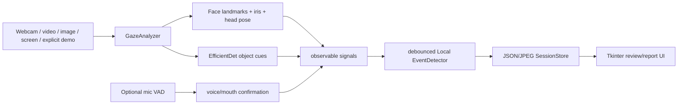
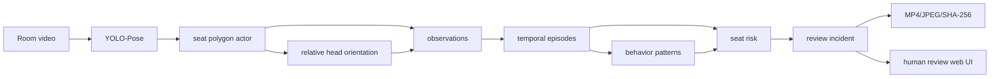

# VIGIL Local vs VIGIL Classroom SRS v2

**Decision:** retain two applications with separate perception adapters and UIs; converge only on shared domain, evidence, session, review and operational contracts.

## 1. Functional comparison

| Dimension | VIGIL Local / Gaze | VIGIL Classroom / SRS v2 | Relationship / decision |
|---|---|---|---|
| Target environment | One candidate at a PC | Many candidates in a room | Different products |
| Camera geometry | close webcam/screen capture | distant fixed room camera | Incompatible perception assumptions |
| Actors | primary face, with face/person count | many pose detections mapped to seats | Keep separate |
| Identity | user-entered candidate metadata; primary largest face | seat code as business identity | Share identity field contract, not tracking implementation |
| Perception | MediaPipe face landmarks/iris/solvePnP | YOLO-Pose keypoints + optional 6DRepNet | Independent adapters |
| Calibration | per-user 36-sample iris baseline | per-scene/per-seat yaw/pitch and polygons | Independent calibration UX/schema sections |
| Eye gaze | yes, close-range iris | no reliable iris gaze at room distance | Local only |
| Head orientation | face landmark solvePnP | pose heuristic or 6DRepNet crop | Shared concept, incompatible estimator |
| Occupancy | face count / person detector | seat state with occlusion/coasting | Classroom-specific |
| Spatial relationship | none beyond multiple people | seat graph/neighbors/desk geometry | Classroom-specific |
| Audio | microphone WebRTC VAD + mouth motion | none | Local-only privacy capability |
| Object cues | EfficientDet phone/book/person | no current dedicated object detector | Potential future adapter, do not reuse local assumptions blindly |
| Temporal reasoning | per-event persistence/cooldown/recovery | FSM episodes → patterns → risk/incident | Shared time utilities possible; engines remain separate |
| Risk | simple severity-weight sum for session UI | per-seat decay, composite weights, incident aggregation | Same meaning needed (“review priority”), different algorithms |
| Event semantics | LOOK_AWAY/HEAD_TURN/etc. signals | relational pattern review incidents | Shared envelope, different taxonomy |
| Evidence | single JPEG at event | pre/post MP4, snapshot, digest, JSON/DB | Classroom service is richer; common interface is reusable |
| UI | Tkinter desktop | browser dashboard/MJPEG/WS | Keep separate |
| Storage | JSON session folders | SQLite + JSON artifacts + media | Share contract/adapter, not necessarily backend |
| Deployment | Windows workstation with local devices | server/GPU/web clients | Different lifecycle/performance/security |
| Human review | local report/alert review wording | review queue and CONFIRMED/REJECTED/INCONCLUSIVE | Unify decision/status meaning |
| Face recognition | none | none | Make this explicit in both products |

## 2. Verified current architectures

### Product A — Local



Strengths:

- Tailored to close-range webcam geometry and individualized iris baseline.
- Explicitly keeps eye and head cues separate.
- Bounded frame queue preserves UI responsiveness.
- UI generally says alerts are review signals, not automatic cheating verdicts.
- Local demo source is visibly labelled as simulation.

Limitations:

- Calibration can absorb an off-centre initial gaze and does not adapt to posture drift.
- Haar fallback removes gaze semantics; object failures can silently remove a capability.
- Any book is treated as suspicious; no per-exam allowed-material policy.
- VAD is room-level, not speaker-local. Coughing, proctor speech/noise plus lip motion can produce speech-like alerts.
- Worker shutdown/session save can race; evidence has no digest/retention policy.

### Product B — Classroom



Strengths:

- Correctly shifts from frame-level “cheating classes” to observable pose/seat/time evidence.
- Unknown-safe wrist handling and strong desk capability gating are implemented and tested.
- Per-seat baseline reaches HPE runtime; scheduled batching/cache reduce redundant forwards.
- Temporal persistence/hysteresis and incident ID dedup are substantially tested.
- Evidence and human review are first-class concepts.

Limitations:

- Seat identity is geometric; no current MOT continuity and no `track_id` on raw Detection.
- Auto-inferred neighbors and shoulder-angle lean are camera-perspective sensitive.
- Same historical glance components can produce new patterns after cooldown; initially empty seats can become SEAT_LEFT.
- Web runtime is a divergent copy of CLI runner and fails at first live/replay incident until repaired.
- Pose model failure silently changes to synthetic people.
- Current web realtime connection is not wired to runtime incidents.

## 3. Capability reuse decision

| Capability/concept | Shared concept? | Same implementation reusable? | Compatibility | Recommendation |
|---|---:|---:|---|---|
| raw frame source | Yes | Partial | Different source/lifecycle requirements | Common small `FramePacket`/timestamp interface only |
| gaze | No for classroom | No | Room heads too small for iris | Local only |
| head orientation | Yes | No | Different landmarks/crop/baseline geometry | Common observation name/unit/quality contract |
| face/person count | Broadly | No | Local face vs room pose/seat | Separate adapters |
| microphone/talking | No current classroom need | No | privacy and attribution mismatch | Local only |
| object detection | Potential | No | scale/material policy differs | Common object observation schema later, separate detector/policy |
| temporal persistence | Yes | Not directly | Local event debounce vs classroom FSM | Share clock/timestamp utilities and test patterns, not engine |
| severity | Yes | Yes | Enum values currently drift | Unify enum and semantics |
| review status | Yes | Yes | Current casing/status drift | Unify immediately |
| incident envelope | Yes | Yes | Field drift causes runtime errors | Introduce canonical versioned schema |
| session | Yes | Yes conceptually | Local JSON vs classroom DB | Common domain model with storage adapters |
| evidence reference | Yes | Yes conceptually | JPEG-only vs clip package | Common optional snapshot/video/hash schema |
| hashing | Yes | Yes | Local currently lacks it | One streaming SHA-256 utility/service |
| review decision | Yes | Yes | Local lacks structured durable review | Common CONFIRMED/REJECTED/INCONCLUSIVE record |
| logging/health | Yes | Yes | fallback health inconsistent | Common capability health model |
| configuration loading | Yes | Partial | settings differ | Shared loader/version/precedence conventions |
| UI | No | No | desktop vs web | Separate |

## 4. Duplicate and conflicting concepts

| Concept | Local representation | Classroom/domain representation | DB/API/UI representation | Conflict |
|---|---|---|---|---|
| event type | local event strings/enums in `exam_monitor` | `behavior`, `primary_pattern`, episode/pattern enums | `event_type`, `primary_signal`, `behavior`, `primary_pattern` | Multiple names for cause/taxonomy |
| severity | local severity enum/string | `SeverityLevel` | DB/UI uppercase strings | Values similar, definitions/weights differ |
| status | local emitted alert/session record | `EventStatus` lowercase; risk state | uppercase AI and review status mixed | AI state is conflated with human outcome |
| risk | sum of local severities | decaying per-seat priority | DB integer, JSON `risk_score`/`peak_risk_score` | Must be called priority, never probability |
| time | monotonic debounce + wall datetime | video-relative milliseconds | DB UTC datetime + JS milliseconds | Need explicit clock/units |
| session ID | local session folder/JSON | runtime-generated UUID | DB FK, API string | Similar concept, separate stores |
| evidence path | local JPEG path | event snapshot/video path and metadata hash | DB paths, URL by basename | No canonical root/ID/status |
| incident identity | each emitted local event | active incident/event UUID | DB PK + event ID + card map | DB uniqueness not enforced |
| review | explanatory local report | `requires_human_review` | `review_status`, `EventReview`, demo memory | Local workflow not structurally shared |

## 5. Recommended shared contracts

The proposed layer is small and domain-focused; it does not perform perception.

```text
common/
  domain/
    observation.py       # timestamp, source, unit, confidence, quality, capability
    review_incident.py   # canonical incident envelope
    review_decision.py   # PENDING / CONFIRMED / REJECTED / INCONCLUSIVE
    severity.py
    session.py
    evidence.py          # snapshot/video refs, state, hash metadata
  infrastructure/
    clocks.py            # monotonic, wall UTC, video-relative types
    hashing.py
    config.py            # version and precedence
    capability_health.py # ENABLED/DEGRADED/DISABLED/MOCK/ERROR
```

Suggested `ReviewIncident` semantics:

| Field | Meaning |
|---|---|
| `incident_id` | globally unique, DB-enforced idempotency key |
| `session_id` | domain session ID |
| `subject_ref` | candidate metadata ID for Local or seat code for Classroom, explicitly typed |
| `source_product` | `LOCAL_GAZE` or `CLASSROOM_SRS_V2` |
| `primary_signal` | observable cause/pattern, never a cheating verdict |
| `supporting_signals` | typed references to components |
| `severity` | triage severity enum |
| `review_priority_score` | 0–100 prioritization, explicitly not probability |
| `first_seen`, `last_seen` | timestamp value plus clock/units |
| `occurrence_count` | merged logical occurrences |
| `ai_status` | e.g. `FLAGGED_FOR_REVIEW`, separate from human decision |
| `review_decision` | `PENDING/CONFIRMED/REJECTED/INCONCLUSIVE` |
| `evidence` | immutable IDs/refs, readiness, digest algorithm/value |
| `capability_health` | model/fallback/mock state used to produce incident |
| `model_config_versions` | reproducibility metadata |

## 6. What must stay separate

1. Face/iris gaze and room pose/HPE inference. Their image scale and geometry make a shared estimator harmful.
2. Calibration workflows. Local calibration is person/session-specific; classroom calibration is scene/seat-specific.
3. Audio. It is a Local-only optional cue unless a separate classroom audio privacy/attribution design is approved.
4. Seat/neighbor/desk logic. It has no meaningful Local analogue.
5. Rendering and lifecycle. Tkinter/device ownership and FastAPI/browser streaming require different adapters.
6. Performance scheduling. Local latency prioritizes one close face; classroom throughput prioritizes full-frame pose plus batched head crops.

## 7. What should be unified

1. Vocabulary: “observable signal,” “review incident,” “review priority,” and “human decision.”
2. Severity and human-review enums, casing and transitions.
3. Incident/evidence/session JSON contracts and API mapping.
4. SHA-256 implementation and exact claim: integrity digest, not legal chain of custody.
5. Timestamp types and conversion utilities.
6. Capability/fallback health surfaced to both UIs.
7. Retention configuration and evidence-path containment.
8. Structured logging and run manifests.
9. For Classroom specifically, runner/runtime orchestration must be one source of truth.

## 8. One-week prototype architecture choice

Do not undertake a repository-wide common-layer migration before the competition. The safe sequence is:

1. Repair web runtime incident contracts, explicit model health and live review delivery.
2. Freeze one canonical Classroom artifact/event schema and map the current DB/API/JS to it.
3. Keep Product A stable except for any demo-blocking shutdown/material-policy wording.
4. After the competition, extract shared contracts and the single Classroom pipeline core behind tests.

The goal for the deadline is a defensible, reproducible prototype with visible capability limits—not a large unified platform.

