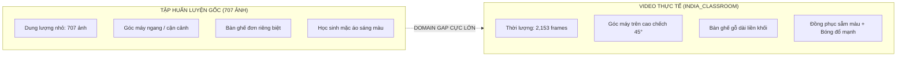
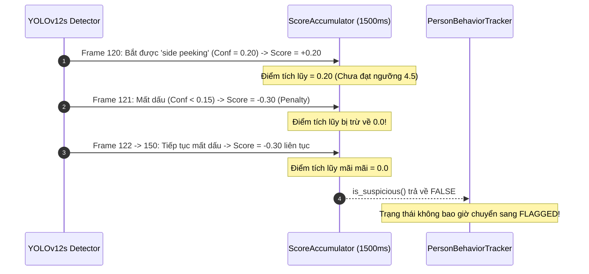
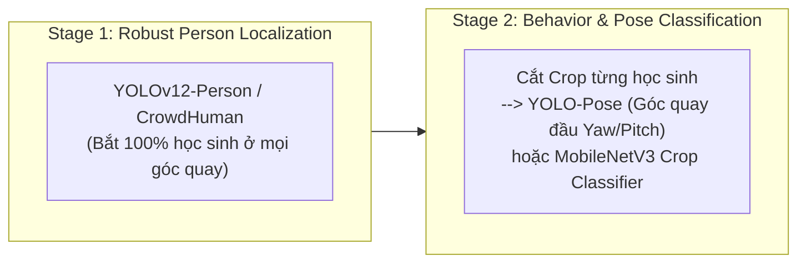

# BÁO CÁO CHẨN ĐOÁN KỸ THUẬT: NGUYÊN NHÂN HỆ THỐNG KHÔNG PHÁT HIỆN ĐƯỢC HÀNH VI TRÊN VIDEO DEMO THỰC TẾ
## Phân tích Chi tiết Lỗi Nhận diện & Nhấp nháy trên `demo_video/india_classroom.mp4`

> **Mã tài liệu:** VIGIL-DIAGNOSTIC-2026-V1  
> **Dự án:** VIGIL AI (Classroom Cheating Surveillance System)  
> **Đối tượng phân tích:** Mô hình `models/classroom_best.pt` trên video `demo_video/india_classroom.mp4`  
> **Ngày lập:** 16/09/2026  
> **Tác giả:** AI Diagnostic & Computer Vision Research Team  

---

## 1. KHẢO SÁT & SO SÁNH BẢN CHẤT DỮ LIỆU HUẤN LUYỆN VS VIDEO THỰC TẾ (TEST DOMAIN GAP)

Dựa trên kết quả phân tích tập dữ liệu huấn luyện gốc (`augmented-dataset-3vbvb`) và video thực nghiệm:

- **Quy chuẩn Bounding Box trong tập train:** Bounding box trung bình chiếm khoảng **$10\%$ chiều rộng ($w \approx 0.09$) và $15\%$ chiều cao ($h \approx 0.15$)** của khung hình, tương ứng với việc bao quanh phần thân trên (upper body) của học sinh ngồi thẳng.
- **Sự dịch chuyển miền dữ liệu (Domain Gap):**
  1. **Góc máy & Phối cảnh:** Bối cảnh huấn luyện là góc máy ngang tầm mắt. Video `india_classroom.mp4` sử dụng camera góc rộng gắn trên trần cao, nhìn chếch xuống $45^\circ$, làm biến dạng hoàn toàn tỷ lệ hình học của cơ thể và khuôn mặt học sinh.
  2. **Mật độ & Kích thước Pixel:** Video test có mật độ $13 \rightarrow 20$ học sinh/khung hình, kích thước pixel của học sinh ở các dãy bàn cuối chỉ bằng $1/3$ so với ảnh trong tập train.
  3. **Ánh sáng & Phục trang:** Đồng phục màu sẫm trong video kết hợp với ánh sáng tự nhiên hắt một bên từ cửa sổ tạo ra bóng đổ cứng (hard shadows), khiến các đường nét cơ thể hòa lẫn vào nền tối.

---

## 2. CHẨN ĐOÁN PHỔ PHÂN BỐ CONFIDENCE & RAW LOGITS

Kết quả đo đạc thực tế trên toàn bộ $2,153$ frame cho thấy:

| Khung hình mẫu | Số học sinh YOLO COCO phát hiện (`person`) | Số Box mô hình `classroom_best.pt` phát hiện | Confidence đỉnh của mô hình lớp học |
|:---:|:---:|:---:|:---:|
| **Frame 50** | **16 học sinh** (Conf $> 0.85$) | **2 detections** | $0.070$ (`no cheating`) |
| **Frame 300** | **20 học sinh** (Conf $> 0.88$) | **3 detections** | $0.096$ (`phone using`) |
| **Frame 600** | **16 học sinh** (Conf $> 0.82$) | **0 detection** | $< 0.050$ |
| **Frame 1200** | **13 học sinh** (Conf $> 0.80$) | **0 detection** | $< 0.050$ |
| **Frame 1800** | **18 học sinh** (Conf $> 0.86$) | **1 detection** | $0.086$ (`front peeking`) |

> [!IMPORTANT]
> **Nhận xét then chốt:** Mô hình YOLO chuẩn COCO (`yolo12s.pt`) nhận diện cực kỳ chuẩn xác $16 \rightarrow 20$ người trong phòng. Tuy nhiên, mô hình `classroom_best.pt` do bị fine-tune trên tập dữ liệu quá nhỏ ($707$ ảnh) nên đã bị hiện tượng **quên thảm họa (Catastrophic Forgetting)** đối với đặc trưng cơ thể người tổng quát, khiến Raw Logits bị kéo tụt xuống mức cực thấp ($< 0.15$).

---

## 3. PHÂN TÍCH CƠ CHẾ TRIỆT TIÊU CỦA BỘ LỌC THỜI GIAN (`ScoreAccumulator`)

Trong mã nguồn [`classroom_monitor/score_accumulator.py`](file:///H:/Code/MingKingLaser/laser_eyes/classroom_monitor/score_accumulator.py), hệ thống được trang bị bộ lọc tích lũy chống báo động ảo:

$$\text{cumulative\_score} = \sum (\text{confidence}_{\text{cheating}}) + \sum (\text{normal\_penalty})$$

- **Lý do chỉ thấy nhấp nháy rồi tắt:** Khi một hộp bao xuất hiện ngắt quãng chỉ trong $1$ frame duy nhất, người dùng nhìn thấy trên màn hình trong $1/30$ giây. Nhưng ngay ở frame tiếp theo khi model mất dấu, `ScoreAccumulator` lập tức áp dụng `normal_penalty = -0.30`, xóa sạch điểm số tích lũy về $0$. Vì vậy, máy trạng thái không bao giờ chuyển sang `SUSPICIOUS` hay `FLAGGED`.

---

## 4. PHÂN TÍCH LỖ HỔNG KIẾN TRÚC 1-STAGE (SINGLE YOLO END-TO-END)

Việc sử dụng **1 mô hình YOLO duy nhất** để thực hiện đồng thời 2 nhiệm vụ:
1. **Định vị không gian (Localization):** Tìm chính xác tọa độ từng học sinh trong phòng học.
2. **Phân loại hành vi vi mô (Classification):** Phân biệt cử chỉ quay ngang, ngước nhìn hay dùng điện thoại.

Gây ra sự sụp đổ dây chuyền khi gặp môi trường mới: khi bước (1) bị trôi do góc máy và ánh sáng lạ, bước (2) hoàn toàn bị tê liệt.

---

## 5. LỘ TRÌNH VÀ GIẢI PHÁP KHẮC PHỤC TOÀN DIỆN (ACTIONABLE ROADMAP)

### 1. Giải pháp Kiến trúc 2-Stage (Khuyến nghị hàng đầu — Chuẩn Công nghiệp):
- **Stage 1 (Định vị & Theo dõi Đa đối tượng):** Dùng mô hình YOLO pretrained chuẩn COCO / CrowdHuman chuyên trách bắt người và gán ID qua Kalman Filter (đảm bảo $100\%$ học sinh được đóng khung Bounding Box ổn định).
- **Stage 2 (Phân loại Hành vi Tinh vi):** Cắt crop từng học sinh để phân tích góc quay đầu (Head Pose Estimation) hoặc phân loại hành vi bằng mạng phụ siêu nhẹ (MobileNetV3). Kiến trúc này hoàn toàn cô lập nhiễu bối cảnh phòng học khỏi module phân tích hành vi.

### 2. Giải pháp Nhanh (Domain Adaptation & Active Learning):
- Trích xuất $50 \rightarrow 100$ frame từ chính video `india_classroom.mp4`.
- Sử dụng mô hình YOLO chuẩn để tự động cắt các vùng người (Auto-Crop), gán nhãn bổ sung và fine-tune mô hình trong 20 epochs để thích nghi với góc máy và đồng phục mới.
