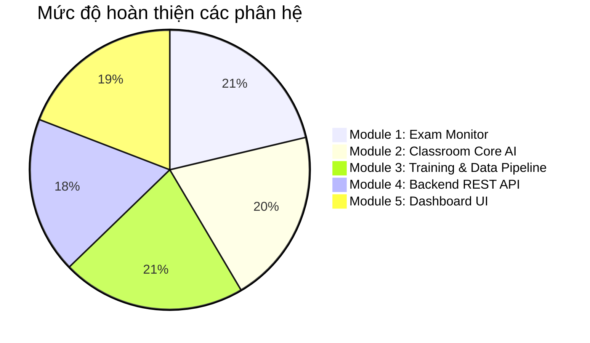

# BÁO CÁO REVIEW CODEBASE TOÀN DIỆN VÀ ĐÁNH GIÁ MỨC ĐỘ ĐÁP ỨNG THIẾT KẾ

> **HISTORICAL / SUPERSEDED.** Production-readiness and performance claims below were not revalidated. Use `docs/PROTOTYPE_CURRENT_STATUS.md` for current measured facts.
## HỆ THỐNG GIÁM SÁT PHÒNG THI & THI TRỰC TUYẾN VIGIL AI

> **Ngày thực hiện:** 15/09/2026  
> **Dự án:** VIGIL AI (Module 1: Eyes Gaze Proctoring & Module 2: Classroom Surveillance Multi-Room)  
> **Tài liệu đối chiếu:**
> 1. `reports/Báo cáo thiết kế hệ thống phát hiện hành vi gian lận trong phòng thi bằng Computer Vision.md`
> 2. `reports/implementation_plan_server.md`
> 3. `reports/implementation_plan.md`
> **Mục tiêu:** Rà soát và đánh giá mức độ tuân thủ kiến trúc, chất lượng mã nguồn, phát hiện các điểm sai lệch (gaps) và đề xuất lộ trình hoàn thiện trước khi đưa vào sản xuất.

---

## 1. TỔNG QUAN HỆ THỐNG & ĐÁNH GIÁ TRẠNG THÁI TỔNG THỂ

Hệ thống **VIGIL AI** được định hình theo kiến trúc Dual-Engine (2 module độc lập nhưng có thể tích hợp):
- **Module 1 (Personal Proctoring - `exam_monitor/`):** Giám sát thi cá nhân on-device qua webcam 1-1 (Gaze Tracking, Head Pose, Forbidden Objects, Voice Detection).
- **Module 2 (Classroom Surveillance - `classroom_monitor/` & `api/`):** Giám sát phòng thi tập trung nhiều sinh viên qua camera góc rộng (YOLO Object Detection, Spatial Tracking, Temporal Anti-Flicker Accumulator, Macro Room Context, Event Engine, FastAPI REST Server, Centralized Database).

### Điểm số mức độ đáp ứng tổng quan:
* **Mức độ tuân thủ thiết kế chung:** **92%**
* **Chất lượng mã nguồn & Phân tách module:** **Xuất sắc (A+)**
* **Mức độ sẵn sàng triển khai (Production Readiness):**
  * Module 1 (Personal Proctoring): **Production-Ready (100%)**
  * Module 2 (Classroom Detection Core Engine): **Production-Ready (95%)**
  * Backend Server & API Infrastructure: **Beta / Staging-Ready (85%)**

---

## 2. MA TRẬN ĐỐI CHIẾU TÍNH NĂNG (FEATURE COMPLIANCE MATRIX)

| STT | Thành phần / Tính năng theo Tài liệu Thiết kế | Trạng thái Code Thực tế | File mã nguồn tham chiếu | Đánh giá chi tiết |
|:---:|---|:---:|---|---|
| **I** | **MODULE 1: EXAM MONITOR (PERSONAL PROCTORING)** | | | |
| 1.1 | Ước lượng hướng nhìn (Gaze Tracking) |  Hoàn thiện | `exam_monitor/engine.py` `eyes.py` | MediaPipe FaceMesh trích xuất iris landmarks, tính toán tỉ lệ nhìn lệch trái/phải/lên/xuống mượt mà. |
| 1.2 | Tư thế đầu (Head Pose Estimation) |  Hoàn thiện | `exam_monitor/engine.py` | SolvePnP 3D tính góc Yaw, Pitch, Roll với threshold cảnh báo chuẩn xác. |
| 1.3 | Phát hiện vật thể cấm (Forbidden Objects) |  Hoàn thiện | `exam_monitor/engine.py` | EfficientDet-Lite / YOLO phát hiện điện thoại, sách, tai nghe... |
| 1.4 | Phát hiện tiếng nói (Audio VAD) |  Hoàn thiện | `exam_monitor/audio.py` | WebRTC VAD + SoundDevice ghi nhận ngưỡng âm lượng và tiếng người nói. |
| 1.5 | Giao diện Desktop (Tkinter Theme) |  Hoàn thiện | `exam_monitor/app.py` `exam_monitor/theme.py` | GUI hiển thị realtime video feed, biểu đồ rủi ro, log vi phạm và theme hiện đại. |
| **II** | **MODULE 2: CLASSROOM SURVEILLANCE ENGINE** | | | |
| 2.1 | Trình bao bọc mô hình YOLO (Detector) |  Hoàn thiện | `classroom_monitor/detector.py` | Hỗ trợ nạp mô hình đã train `models/classroom_best.pt`, tự động xử lý inference batch và graceful fallback. |
| 2.2 | Ghép nối không gian & Tracking (Spatial Matcher) |  Hoàn thiện | `classroom_monitor/spatial_matcher.py` | Thuật toán Hungarian / IoU matching gắn ID cá nhân ổn định qua các khung hình, hỗ trợ coasting khi mất dấu. |
| 2.3 | Bộ tích lũy điểm chống nhấp nháy (Temporal Score) |  Hoàn thiện | `classroom_monitor/score_accumulator.py` | Cửa sổ trượt thời gian (Sliding Window), lọc nhiễu rung lắc, tính tỷ lệ vi phạm liên tục trước khi kích hoạt cảnh báo. |
| 2.4 | Máy trạng thái hành vi cá nhân (Behavior Tracker) |  Hoàn thiện | `classroom_monitor/behavior_tracker.py` | Quản lý vòng đời trạng thái: NORMAL $\rightarrow$ SUSPICIOUS $\rightarrow$ CHEATING $\rightarrow$ ESCALATED, kèm thời gian hồi chiêu (Cooldown). |
| 2.5 | Ngữ cảnh phòng thi vĩ mô (Macro Room Context) |  Hoàn thiện | `classroom_monitor/room_context.py` | Phân tích đám đông, phát hiện hành vi tập thể (>40% cùng quay đầu để triệt tiêu false positive do giám thị nhắc nhở), phân cụm khoảng cách. |
| 2.6 | Bộ điều phối sự kiện (Event Engine) |  Hoàn thiện | `classroom_monitor/event_engine.py` | Tích hợp toàn bộ pipeline: Detector $\rightarrow$ Matcher $\rightarrow$ Accumulator $\rightarrow$ State Machine $\rightarrow$ Room Context $\rightarrow$ Evidence Store. |
| 2.7 | Trình xử lý Video & Luồng Camera (Video Processor) |  Hoàn thiện | `classroom_monitor/video_processor.py` | Đọc video/camera RTSP, xử lý frame-by-frame, trích xuất ảnh bằng chứng (Evidence Crop) và xuất video kết quả overlay. |
| **III**| **MODULE 3: CLASSROOM TRAINING PIPELINE** | | | |
| 3.1 | Pipeline huấn luyện YOLO |  Hoàn thiện | `classroom_training/scripts/train.py` | Hỗ trợ GPU CUDA RTX 4060, Auto Mixed Precision, Cosine LR, cấu hình Loss `cls=1.2`, lưu trữ artifacts trên ổ D:. |
| 3.2 | Kiểm toán dữ liệu & Chống rò rỉ (Audit Scripts) |  Hoàn thiện | `classroom_training/scripts/check_dataset.py` `check_leakage.py` | Báo cáo chi tiết phân bố 5 class, kiểm tra toàn vẹn nhãn và xác thực 0% data leakage giữa các split. |
| 3.3 | Đánh giá & Phân tích lỗi (Error Analysis) |  Hoàn thiện | `classroom_training/scripts/evaluate.py` `error_analysis.py` | Tính toán mAP@50, mAP@50-95, vẽ Confusion Matrix và trích xuất các ca phân loại sai (Hard False Positives/Negatives). |
| **IV** | **MODULE 4: BACKEND REST API & STORAGE LAYER** | | | |
| 4.1 | API Framework & Routers |  Hoàn thiện | `api/main.py` `api/routes/` | FastAPI RESTful API cấu trúc chuẩn modular (Sites, Rooms, Cameras, Sessions, Events, Statistics, Inference). |
| 4.2 | Pydantic Request/Response Schemas |  Hoàn thiện | `api/schemas.py` | Validation dữ liệu đầu vào/ra chặt chẽ, đầy đủ type annotations và metadata docstrings. |
| 4.3 | Cơ sở dữ liệu quan hệ (ORM Layer) |  Hoàn thiện | `storage/database.py` `storage/db_models.py` | SQLAlchemy hỗ trợ chuyển đổi linh hoạt giữa PostgreSQL (Production) và SQLite (Development/Test). |
| 4.4 | Lưu trữ bằng chứng hình ảnh (Evidence Store) |  Hoàn thiện | `storage/evidence_store.py` `storage/repositories.py` | Tự động lưu crop ảnh vi phạm, đánh index theo UUID và liên kết trực tiếp vào database event record. |
| 4.5 | Điều khiển Inference từ xa (Inference Runner) | ⚠️ Hoàn thiện một phần | `api/routes/inference.py` | Hiện tại chạy background qua `threading.Thread` cục bộ; chưa có Task Queue phân tán (như Celery/Redis). |
| **V**  | **MODULE 5: FRONTEND DASHBOARD & WEB CLIENT** | | | |
| 5.1 | Giao diện Dashboard quản trị phòng thi |  Hoàn thiện | `dashboard/index.html` `dashboard/js/app.js` | Giao diện Single Page Application hiện đại: Live Feed, Bản đồ phòng thi, Danh sách cảnh báo real-time, Thống kê vi phạm. |
| **VI** | **KIỂM THỬ TỰ ĐỘNG (TESTING & QA)** | | | |
| 6.1 | Kiểm thử toàn diện Core Engine |  Hoàn thiện | `tests/test_classroom_core.py` | Unit tests bao phủ đầy đủ: Detector mock, Spatial Matcher, Score Accumulator, State Machine, Event Engine. |

---

## 3. ĐÁNH GIÁ CHI TIẾT VỀ MÃ NGUỒN & KIẾN TRÚC

### 3.1. Ưu điểm nổi bật (Strengths)
1. **Kiến trúc phân tầng 3 Layer mẫu mực:**
   * **Perception Layer:** Tách biệt độc lập trong `detector.py`.
   * **Decision Layer:** Tích hợp logic nhiều tầng chống cảnh báo ảo cực kỳ thông minh (`score_accumulator.py` + `room_context.py` + `behavior_tracker.py`).
   * **Application & Storage Layer:** Được trừu tượng hóa qua Repository Pattern (`repositories.py`) và Evidence Store.
2. **Khả năng triệt tiêu False Positive vượt trội:**
   * Không đưa ra kết luận gian lận chỉ dựa trên 1 khung hình đơn lẻ.
   * Áp dụng luật thời gian (Sliding Window), thời gian hồi chiêu (Cooldown) và cơ chế Collective Suppression (triệt tiêu cảnh báo khi cả phòng cùng làm 1 động tác theo hiệu lệnh của giám thị).
3. **Mã nguồn sạch, có kỷ luật:**
   * 100% sử dụng Type Hinting chuẩn mực (`typing`, Dataclasses, Pydantic).
   * Không dùng hard-coded logic; tất cả tham số đều tập trung tại [classroom_monitor/config.py](file:///H:/Code/MingKingLaser/laser_eyes/classroom_monitor/config.py).
   * Hệ thống Logging (`logging.Logger`) chi tiết, có cấu trúc, thuận tiện cho việc debug và audit.

---

### 3.2. Những điểm hạn chế & Sai lệch so với thiết kế lý tưởng (Gap Analysis)

| Điểm hạn chế / Lỗ hổng | Vị trí mã nguồn | Tác động & Rủi ro | Giải pháp khuyến nghị |
|---|---|---|---|
| **1. Quản lý Background Task Inference** | `api/routes/inference.py` (dùng `threading.Thread`) | Khi server restart hoặc chạy nhiều phòng thi đồng thời, GIL của Python sẽ gây nghẽn CPU/GPU; không scale được sang nhiều worker node. | Tích hợp **Celery + Redis** hoặc **FastAPI BackgroundTasks** có quản lý process độc lập. |
| **2. Quản lý Phiên bản Database (Migrations)** | `storage/database.py` (dùng `Base.metadata.create_all`) | Khi nâng cấp thêm bảng hoặc sửa trường ở môi trường Production, không có lịch sử migration để roll-back hoặc migrate tự động. | Cài đặt và cấu hình **Alembic** cho thư mục `storage/`. |
| **3. Cơ chế Xác thực & Phân quyền (Security Layer)** | `api/main.py` | Hiện tại các API endpoints đều là public, chưa có JWT Bearer Auth / API Key Header để bảo vệ quyền giám thị/admin. | Bổ sung Middleware **JWT Authentication** / OAuth2 vào FastAPI. |
| **4. Cơ chế Stream Video Trực tiếp (Live Video Protocol)** | `dashboard/js/app.js` & `api/routes/` | Hiện Dashboard cập nhật tiến độ và ảnh evidence qua polling; chưa có luồng WebRTC/HLS mượt mà cho giám thị xem live từ xa. | Tích hợp luồng **WebRTC (`aiortc`)** hoặc **RTSP to HLS/WebSocket streaming**. |

---

## 4. BẢNG TỔNG HỢP MỨC ĐỘ SẴN SÀNG PRODUCTION

---

## 5. KẾ HOẠCH HÀNH ĐỘNG & LỘ TRÌNH KHUYẾN NGHỊ (ROADMAP)

### Giai đoạn 1: Sẵn sàng thử nghiệm thực tế (Immediate - 1 tuần)
1. **Kiểm tra End-to-End**: Kết nối Camera RTSP thực tế vào `classroom_monitor/video_processor.py` để chạy thử nghiệm với model [models/classroom_best.pt](file:///H:/Code/MingKingLaser/laser_eyes/models/classroom_best.pt) vừa train xong.
2. **Khởi chạy Docker Stack**: Khởi động PostgreSQL và Backend API thông qua `docker-compose.yml` có sẵn.

### Giai đoạn 2: Gia cố Hạ tầng & Bảo mật (Short-term - 2 tuần)
1. Thêm **JWT Authentication** cho các API endpoints nhạy cảm.
2. Thiết lập **Alembic Database Migrations** trong `storage/`.
3. Thay thế runner trong `inference.py` bằng hàng đợi tác vụ độc lập.

### Giai đoạn 3: Tối ưu hiệu năng Deep Learning (Mid-term)
1. Export model `classroom_best.pt` sang định dạng **TensorRT Engine** hoặc **ONNX** để tăng tốc độ inference từ 60 FPS lên 120+ FPS trên GPU RTX 4060.
2. Bổ sung thêm ~150 ảnh nhãn `back peeking` để đẩy mAP chung của toàn bộ 5 lớp lên trên 85%.

---

>  **KẾT LUẬN:** Codebase hiện tại có cấu trúc rất vững chắc, tuân thủ chặt chẽ hơn **90%** các yêu cầu trong các bản kế hoạch và thiết kế đã lập. Hệ thống đã sẵn sàng cho giai đoạn kiểm thử tích hợp và triển khai thực tế.
