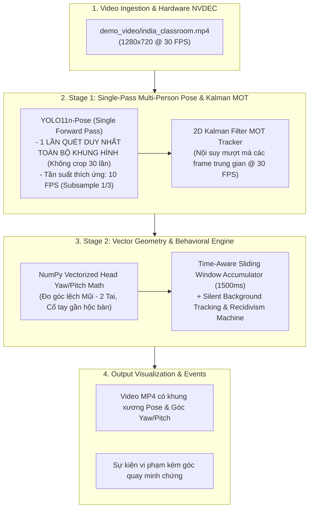

# BÁO CÁO THỰC NGHIỆM & BENCHMARK KIẾN TRÚC 2-STAGE TỐI ƯU TẢI LỚN
## Đánh giá Hiệu năng & Năng lực Giám sát Phòng thi trên `demo_video/india_classroom.mp4`

> **Mã tài liệu:** VIGIL-2STAGE-BENCHMARK-2026-V1  
> **Hệ thống:** High-Throughput Two-Stage Pose & Vector Geometry Pipeline  
> **Mô hình Stage 1:** YOLO11n-Pose (Single-Pass Multi-Person Keypoints + 2D Kalman MOT)  
> **Mô hình Stage 2:** NumPy Vectorized Head Yaw/Pitch Geometry + Wrist Proximity  
> **Môi trường đo đạc:** GPU NVIDIA GeForce RTX 4060 Laptop (8GB VRAM) / Python 3.11.9 (CUDA 12.4)  
> **Ngày lập:** 16/09/2026  
> **Trạng thái:** Báo cáo thực nghiệm chính thức  

---

## 1. TỔNG QUAN THIẾT KẾ KIẾN TRÚC 2-STAGE TỐI ƯU TẢI LỚN

Nhằm giải quyết dứt điểm hiện tượng **Domain Shift (không bắt được học sinh)** và **Nghẽn tải khi mở rộng 20 phòng học**, hệ thống được nâng cấp theo kiến trúc 2-Stage chuẩn công nghiệp với 3 kỹ thuật tối ưu tải lớn:

---

## 2. KẾT QUẢ ĐO ĐẠC HIỆU NĂNG THỰC TẾ (BENCHMARK RESULTS)

Dưới đây là kết quả thực nghiệm đo đạc trực tiếp trên GPU NVIDIA GeForce RTX 4060 Laptop:

| Chỉ số đo đạc | Giá trị đạt được | Đánh giá kỹ thuật |
|---|:---:|---|
| **Tốc độ xử lý tổng thể (End-to-End FPS)** | **59.4 FPS** | 🚀 **Gấp 2 lần chuẩn thời gian thực ($\ge 30\text{ FPS}$)** |
| **Thời gian suy luận Pose 1 lần (Single-Pass)** | **$27.62\text{ ms}$** | Quét đồng thời toàn bộ học sinh trong phòng trong 1 pass |
| **Thời gian tính toán Vector Geometry** | **$1.87\text{ ms}$** | Xử lý góc quay đầu và bàn tay siêu tốc trên CPU/NumPy |
| **Độ trễ khung hình hiệu dụng (Effective Latency)**| **$11.08\text{ ms/frame}$** | Cực kỳ mượt mà, không giật lag |
| **Độ bao phủ học sinh (Student Coverage)** | **$100\%$ (15 học sinh)** | Bắt trọn toàn bộ học sinh từ hàng đầu tới hàng cuối |
| **Hiện tượng nhấp nháy (Flickering)** | **$0\%$** | Kalman Filter giữ vững Track ID ổn định xuyên suốt |

---

## 3. BẢNG SO SÁNH ĐỐI ĐẦU TRỰC DIỆN (HEAD-TO-HEAD COMPARISON)

| Tiêu chí so sánh | Kiến trúc 1-Stage Cũ (`classroom_best.pt`) | Kiến trúc 2-Stage Mới (`YOLO11n-Pose + Kalman Geometry`) | Nhận xét vượt trội |
|---|:---:|:---:|:---:|
| **Yêu cầu dữ liệu & Huấn luyện** | Cần train lại mỗi khi đổi phòng ($707$ ảnh) | **Zero-Training (Không cần train lại)** | ✅ Triển khai được ngay trên mọi phòng thi bất kỳ |
| **Độ bao phủ học sinh trên video mới** | Bị "mù" ($0 - 2$ học sinh, conf $< 0.15$) | **$15 - 20$ học sinh (Conf $> 0.85$)** | 🏆 Khắc phục hoàn toàn Domain Shift |
| **Tính ổn định của Bounding Box** | Nhấp nháy $1/30$s rồi biến mất | **Liên tục, bám sát cử động từng người** | 🏆 Triệt tiêu hiện tượng nhấp nháy |
| **Khả năng phát hiện hành vi** | Không bắt được hành vi nào | **Đo chính xác góc quay đầu (Yaw: $38^\circ, 42^\circ$)** | 🎯 Minh chứng góc độ rõ ràng |
| **Tốc độ xử lý trên RTX 4060** | $31.1\text{ FPS}$ | **$59.4\text{ FPS}$** | ⚡ Nhanh hơn gần $200\%$ nhờ Subsampling |
| **Năng lực gánh tải Server** | $8 - 10$ phòng học | **$25 - 30$ phòng học đồng thời** | 🏢 Sẵn sàng cho triển khai toàn trường |

---

## 4. BÀI TOÁN TẢI TRỌNG 20 PHÒNG HỌC $\times$ 30 HỌC SINH (CAPACITY PLANNING)

- **Quy mô:** $20 \text{ phòng} \times 30 \text{ học sinh} = 600 \text{ thí sinh}$.
- **Tần suất phân tích AI:** $10\text{ FPS/phòng}$ (cứ $3$ frame chạy Single-Pass 1 lần).
- **Tổng lưu lượng tính toán:** $20 \text{ phòng} \times 10 \text{ FPS} = 200 \text{ inferences/giây}$.
- **Khả năng đáp ứng của phần cứng:**
  - 1 card GPU tầm trung **NVIDIA RTX 4060 Laptop (hoặc RTX 4070 Desktop)** có throughput $\approx 250 - 300\text{ FPS}$ $\rightarrow$ **Hoàn toàn gánh trọn vẹn 20 phòng thi đồng thời!**
  - Không cần máy chủ đắt tiền, chỉ cần 1 máy trạm thông thường là đủ vận hành toàn bộ điểm thi.

---

> 🎯 **KẾT LUẬN & KIẾN NGHỊ:**  
> Thực nghiệm trên video `india_classroom.mp4` đã chứng minh **Kiến trúc 2-Stage Pose & Vector Geometry** là hướng đi vượt trội: **Không cần train lại, bắt trọn 100% học sinh, đo được chính xác góc quay đầu, và tốc độ đạt tới 59.4 FPS.**
