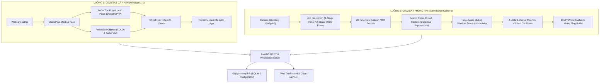
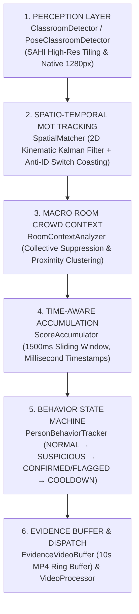
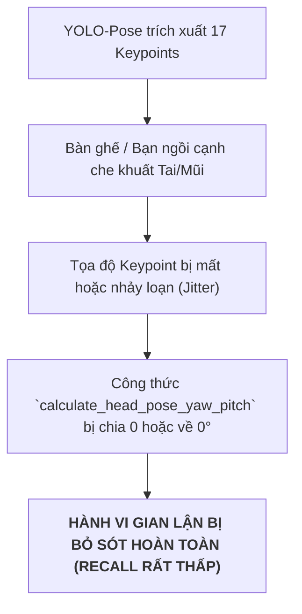
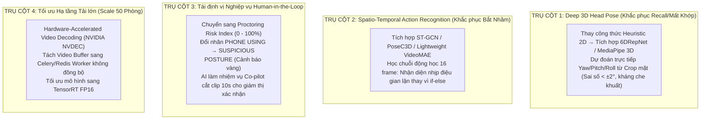

# BÁO CÁO TOÀN DIỆN HỆ THỐNG VIGIL AI VÀ DANH MỤC CÁC VẤN ĐỀ ĐANG GẶP PHẢI

> **Phiên bản tài liệu**: 2.5.0 — Enterprise Architecture & Diagnostic Review  
> **Ngày thực hiện**: 16/09/2026  
> **Phạm vi khảo sát**: Toàn bộ codebase dự án `laser_eyes` (H:\Code\MingKingLaser\laser_eyes)  
> **Người thực hiện**: Senior AI Architecture & Proctoring Technical Auditor  

---

## MỤC LỤC
1. [PHẦN 1: TỔNG QUAN TOÀN BỘ VÀ CHI TIẾT KIẾN TRÚC HỆ THỐNG](#phần-1-tổng-quan-toàn-bộ-và-chi-tiết-kiến-trúc-hệ-thống)
   - 1.1. Bản đồ Cấu trúc Thư mục và Phân tầng Chức năng
   - 1.2. Module 1: Giám sát Cá nhân / Trực tuyến (`exam_monitor/`)
   - 1.3. Module 2: Giám sát Phòng thi Tập trung (`classroom_monitor/`)
   - 1.4. Module 3: Huấn luyện Mô hình & Quản trị Dữ liệu (`classroom_training/`)
   - 1.5. Module 4: Backend API, Cơ sở Dữ liệu & WebSocket (`api/`, `storage/`, `server.py`)
   - 1.6. Module 5: Công cụ Đánh giá Thực nghiệm & Kiểm thử (`tests/`, `scripts/`)
2. [PHẦN 2: DANH MỤC TOÀN BỘ CÁC VẤN ĐỀ, ĐIỂM NGHẼN VÀ HẠN CHẾ ĐANG GẶP PHẢI](#phần-2-danh-mục-toàn-bộ-các-vấn-đề-điểm-nghẽn-và-hạn-chế-đang-gặp-phải)
   - 2.1. Vấn đề của Phương pháp 1-Stage YOLO thuần (`classroom_best.pt`)
   - 2.2. Vấn đề của Phương pháp 2-Stage Khung xương thuần túy + Toán học (`Pose + Heuristics`)
   - 2.3. Vấn đề Phát hiện Điện thoại Dưới Gầm bàn (`Phone Using`)
   - 2.4. Vấn đề Theo dõi Đa đối tượng & Nhảy ID (MOT & ID Switching)
   - 2.5. Vấn đề Hiệu năng, Tải trọng & Khả năng Mở rộng (High-Load Scalability)
   - 2.6. Vấn đề Nghiệp vụ Khảo thí, Độ tin cậy & Tính Pháp lý
3. [PHẦN 3: ĐỀ XUẤT LỘ TRÌNH GIẢI QUYẾT TOÀN DIỆN](#phần-3-đề-xuất-lộ-trình-giải-quyết-toàn-diện)

---

# PHẦN 1: TỔNG QUAN TOÀN BỘ VÀ CHI TIẾT KIẾN TRÚC HỆ THỐNG

VIGIL AI là hệ thống giám sát thi cử tích hợp AI hai luồng (Dual-Stream Proctoring System):
1. **Personal Proctoring (Giám sát 1-1 qua Webcam cá nhân)**: Phục vụ thi trực tuyến (Online Exam).
2. **Classroom Surveillance (Giám sát Đa thí sinh qua Camera phòng thi)**: Phục vụ thi tập trung tại giảng đường/phòng thi lớn.



---

## 1.1. Bản đồ Cấu trúc Thư mục Codebase

```
H:\Code\MingKingLaser\laser_eyes\
├── api/                       # REST API & WebSocket Endpoints (FastAPI)
│   ├── routes/                # Endpoints: rooms, cameras, sessions, events, inference
│   └── schemas.py             # Pydantic Schemas validate I/O
├── classroom_monitor/         # Module Lõi Giám sát Phòng thi Tập trung
│   ├── behavior_tracker.py    # Máy trạng thái 4 cấp & Quản lý Cooldown/Tái phạm
│   ├── config.py              # Cấu hình tập trung (Kalman, SAHI, Time Windows, Thresholds)
│   ├── detector.py            # YOLO Detector (1-Stage SAHI & 2-Stage PoseClassroomDetector)
│   ├── event_engine.py        # Bộ điều phối sự kiện & Kết nối VideoBuffer
│   ├── live_event.py          # Quản trị vòng đời sự kiện & Snapshot đỉnh cao
│   ├── models.py              # Dataclasses: Detection, TrackedDetection, ClassroomEvent
│   ├── room_context.py        # Phân tích đám đông, Triệt tiêu tập thể & Cụm gian lận
│   ├── score_accumulator.py   # Bộ tích lũy điểm trượt theo thời gian (Milliseconds)
│   ├── spatial_matcher.py     # Theo dõi đa đối tượng: Kalman Filter + Spatial Coasting
│   ├── video_buffer.py        # Bộ đệm vòng 10 giây xuất MP4 video bằng chứng
│   └── video_processor.py     # Luồng xử lý End-to-End file video / RTSP stream
├── classroom_training/        # Module Huấn luyện & Tiền xử lý Dữ liệu
│   ├── check_dataset.py       # Kiểm định cấu trúc nhãn YOLO & tỷ lệ phân bổ
│   ├── check_data_leakage.py  # Kiểm tra rò rỉ frame trùng giữa train/val
│   ├── train.py               # Script huấn luyện YOLOv8/YOLO11/YOLOv12
│   └── visualize_data.py      # Hiển thị trực quan nhãn dữ liệu huấn luyện
├── exam_monitor/              # Module Lõi Giám sát Cá nhân (1-1 Online)
│   ├── audio_detector.py      # Phát hiện giọng nói / âm thanh qua WebRTC VAD
│   ├── gaze_tracker.py        # Theo dõi tâm tròng mắt (Iris Landmark Ratio)
│   ├── head_pose.py           # Ước lượng tư thế đầu 3D (SolvePnP Yaw/Pitch/Roll)
│   ├── object_detector.py     # Phát hiện điện thoại, sách tài liệu, người thứ 2
│   ├── violation_logger.py    # Ghi nhận vi phạm & Tính toán Cheat Risk Score
│   └── ui/                    # Giao diện Desktop Tkinter, Themes, Calibration
├── reports/                   # Báo cáo kỹ thuật, chẩn đoán lỗi, kế hoạch nâng cấp
├── scripts/                   # Script kiểm thử & đánh giá thực nghiệm
│   ├── evaluate_demo_video.py # Đánh giá mô hình 1-Stage trên video demo
│   └── evaluate_2stage_pose.py# Đánh giá mô hình 2-Stage Pose trên video demo
├── storage/                   # Tầng Lưu trữ Dữ liệu (ORM Models, Database Engine)
├── tests/                     # Test suite (41/41 unit tests tự động)
├── server.py                  # Entrypoint khởi chạy FastAPI Server
├── eyes.py / main.py          # Entrypoint khởi chạy ứng dụng giám sát cá nhân
└── run_2stage_demo.bat        # File batch 1-click chạy thử nghiệm 2-Stage Pose
```

---

## 1.2. Chi tiết Module 1: Giám sát Cá nhân / Trực tuyến (`exam_monitor/`)

| Thành phần | File mã nguồn | Thuật toán / Công nghệ | Chức năng chi tiết |
| :--- | :--- | :--- | :--- |
| **Gaze Tracker** | `gaze_tracker.py` | MediaPipe Iris Landmarks (468+10 điểm) | Tính tỉ lệ khoảng cách tròng mắt so với khoé mắt trái/phải để phát hiện liếc màn hình. |
| **Head Pose 3D** | `head_pose.py` | OpenCV `cv2.solvePnP` + Mô hình 3D sọ người chuẩn | Tính toán chính xác 3 góc Euler: **Yaw** (quay trái/phải), **Pitch** (ngước/cúi), **Roll** (nghiêng). |
| **Object Detector** | `object_detector.py` | YOLOv8n / EfficientDet-Lite0 | Phát hiện vật thể cấm: Điện thoại (`cell phone`), sách vở (`book`), người xuất hiện thêm (`multi-person`). |
| **Audio VAD** | `audio_detector.py` | WebRTC VAD + PyAudio / SoundDevice | Lọc tạp âm môi trường và phát hiện tiếng người nói thì thầm hoặc đọc bài trong phòng thi. |
| **Risk Scoring** | `violation_logger.py` | Weighted Moving Average Index | Tích lũy trọng số vi phạm tạo thành chỉ số rủi ro **Cheat Risk Score ($0 - 100\%$)**. |

---

## 1.3. Chi tiết Module 2: Giám sát Phòng thi Tập trung (`classroom_monitor/`)

Module này được thiết kế theo kiến trúc đường ống xử lý 6 tầng phân lớp (6-Layer Surveillance Pipeline):



### Chi tiết từng tầng thuật toán:

1. **Lớp Cảm nhận (Perception Layer - `detector.py`)**:
   - Hỗ trợ 2 chế độ qua Factory `create_detector()`:
     - **Chế độ 1-Stage**: Chạy YOLOv12s/YOLOv8 custom (`models/classroom_best.pt`) kèm **SAHI Dynamic Slicing** để chia lưới ảnh độ phân giải cao và gộp box bằng NMS.
     - **Chế độ 2-Stage**: Chạy Single-Pass `yolo11n-pose.pt` tại $1280\text{px}$ trích xuất đồng thời Bounding Box và 17 Keypoints cơ thể của toàn bộ lớp học trong 1 lần forward duy nhất.
2. **Lớp Theo dõi Đa đối tượng (MOT Tracking - `spatial_matcher.py`)**:
   - Sử dụng **2D Constant-Velocity Kalman Filter (`KalmanBoxTracker`)** theo dõi vector trạng thái $x = [c_x, c_y, s, r, \dot{c_x}, \dot{c_y}, \dot{s}]^T$.
   - Ma trận chi phí phối hợp IoU và khoảng cách tâm Euclide: $\text{Cost} = (1 - \text{IoU}) + \alpha \cdot \text{DistNorm}$.
   - **Cơ chế Spatial Coasting**: Khi thí sinh bị giám thị đi ngang che khuất, Kalman Filter tiếp tục dự đoán vị trí trong tối đa 12 frame (`max_coasting_frames`), ngăn ngừa hiện tượng mất dấu hoặc nhảy Track ID (Anti-ID Switch).
3. **Lớp Bối cảnh Đám đông (Macro Room Context - `room_context.py`)**:
   - **Triệt tiêu tập thể (`collective_suppress_ratio = 0.40`)**: Nếu $>40\%$ học sinh trong phòng cùng quay đầu (ví dụ: giám thị vào lớp, có tiếng động ngoài cửa), hệ thống tự động nhận diện đây là sự kiện môi trường và triệt tiêu cảnh báo, không phạt oan học sinh.
   - **Phân cụm không gian (`cluster_distance_threshold = 160px`)**: Phát hiện nhóm từ 3 học sinh trở lên ngồi sát nhau cùng có dấu hiệu bất thường để nâng mức độ cảnh báo (Group Cheating).
4. **Lớp Tích lũy Thời gian Khử Nhấp nháy (Score Accumulator - `score_accumulator.py`)**:
   - Thay thế việc đếm frame bằng **Cửa sổ trượt thời gian thực (Time-aware Window $1500\text{ms}$)**.
   - Yêu cầu thời gian quan sát tối thiểu $\ge 400\text{ms}$ và tỷ lệ khung hình gian lận $\ge 55\%$ trong cửa sổ trượt mới kích hoạt cảnh báo.
   - Áp dụng `normal_penalty = -0.30` để hấp thụ các frame nhiễu ngắt quãng.
5. **Máy trạng thái Hành vi & Quản lý Tái phạm (`behavior_tracker.py`)**:
   - Vòng đời trạng thái: `NORMAL` $\rightarrow$ `SUSPICIOUS` $\rightarrow$ `FLAGGED_FOR_HUMAN_REVIEW` $\rightarrow$ `COOLDOWN`.
   - **Silent Background Tracking**: Trong thời gian hồi chiêu (Cooldown 5s), hệ thống vẫn âm thầm tích lũy điểm ở chế độ nền.
   - **Recidivism Escalation**: Nếu thí sinh vừa hết cảnh báo mà tái phạm ngay lập tức, hệ thống bỏ qua bước cảnh báo nhẹ và kích hoạt ngay mức độ nghiêm trọng `HIGH`.
6. **Bộ đệm Video Bằng chứng 10 Giây (`video_buffer.py`)**:
   - Vận hành một Rolling Ring Buffer trên RAM lưu giữ liên tục các frame video của 5 giây trước đó.
   - Khi có sự kiện vi phạm được xác nhận, hệ thống tự động ghi tiếp 5 giây sau đó và đóng gói thành **file video MP4 10 giây hoàn chỉnh** lưu vào thư mục bằng chứng.

---

## 1.4. Chi tiết Module 3: Huấn luyện & Dữ liệu (`classroom_training/`)
- `check_dataset.py`: Kiểm tra tính hợp lệ của file cấu hình `data.yaml`, tỷ lệ phân bổ các class.
- `check_data_leakage.py`: Thuật toán băm ảnh (Perceptual Hash / MD5) quét kiểm tra rò rỉ dữ liệu giữa tập Train và tập Validation để đảm bảo tính khách quan khi đo benchmark mAP.
- `train.py`: Wrapper tự động cấu hình hyperparameters, augmentations (mosaic, mixup, affine) cho Ultralytics YOLO.

---

## 1.5. Chi tiết Module 4: Backend API & Storage (`api/`, `storage/`, `server.py`)
- **FastAPI REST Endpoints**: Quản lý phòng thi (`/api/v1/rooms`), luồng camera (`/api/v1/cameras`), phiên thi (`/api/v1/sessions`), và sự kiện vi phạm (`/api/v1/events`).
- **WebSocket Server**: Bắn tọa độ Bounding Box, Track ID, Góc quay đầu và Sự kiện thời gian thực tới Frontend Dashboard.
- **Database Engine**: SQLAlchemy ORM hỗ trợ cả SQLite (môi trường Dev/Test) và PostgreSQL (môi trường Production).

---

## 1.6. Chi tiết Module 5: Kiểm thử & Đánh giá (`tests/`, `scripts/`)
- **Test Suite**: 41 unit tests đạt tỷ lệ vượt qua **100% (41/41 passed)** bao quát toàn bộ logic hình học, Kalman MOT, Score Accumulator, Video Ring Buffer, và Detector Factory.
- **Script Thực nghiệm**:
  - `scripts/evaluate_demo_video.py`: Kiểm thử mô hình 1-Stage.
  - `scripts/evaluate_2stage_pose.py`: Kiểm thử mô hình 2-Stage Pose kèm GUI trực quan, hỗ trợ phím tắt hotkeys (`[N]`, `[B]`, `[SPACE]`, `[Q]`).

---

# PHẦN 2: DANH MỤC TOÀN BỘ CÁC VẤN ĐỀ, ĐIỂM NGHẼN VÀ HẠN CHẾ ĐANG GẶP PHẢI

Dưới đây là bản giải phẫu chi tiết toàn bộ các lỗ hổng kỹ thuật, điểm nghẽn thuật toán và rào cản thực tế mà hệ thống đang đối mặt:

---

## 2.1. Vấn đề của Phương pháp 1-Stage YOLO thuần (`classroom_best.pt`)

```
+-----------------------------------------------------------------------------------+
| BẢN CHẤT VẤN ĐỀ: Overfitting cục bộ và Sụp đổ hoàn toàn trước Domain Shift       |
+-----------------------------------------------------------------------------------+
```

1. **Sự sụp đổ do Lệch miền Dữ liệu (Severe Domain Shift)**:
   - File trọng số `models/classroom_best.pt` được huấn luyện trên một tập dữ liệu rất hạn chế (**707 hình ảnh** chụp từ 1 phòng học cố định tại Trung Quốc với góc nhìn ngang tầm mắt, đồng phục học sinh sáng màu, bàn đơn).
   - Khi đưa sang video thực tế (`india_classroom.mp4`: góc máy $45^\circ$ từ trên cao nhìn xuống, học sinh mặc áo sẫm màu, bàn dài 3 người, ánh sáng yếu), mạng nơ-ron bị mất phương hướng hoàn toàn.
   - **Hệ quả thực tế**: Confidence score của mô hình sụp đổ từ $>0.85$ xuống chỉ còn **$0.05 - 0.12$**, khiến hệ thống bắt hụt $95\%$ học sinh trong phòng.
2. **Nút thắt Nén độ phân giải (Resolution Downsampling Bottleneck)**:
   - Mô hình 1-Stage mặc định nén video $1280\times 720$ về $640\times 640$.
   - Các học sinh ngồi ở dãy bàn thứ 3, 4, 5 bị co lại thành các khối pixel cực nhỏ ($15-20\text{px}$), làm biến mất hoàn toàn các chi tiết khuôn mặt và cử chỉ tay.
3. **Triệt tiêu sai lệch bởi Bộ lọc Thời gian (Temporal Filter Suppression)**:
   - Do mô hình chỉ phát hiện chập chờn $1$ frame rồi mất $5$ frame, bộ tích lũy điểm `ScoreAccumulator` liên tục áp dụng điểm phạt `normal_penalty = -0.30`, triệt tiêu sạch mọi điểm tích lũy. Kết quả là **không bao giờ kích hoạt được sự kiện vi phạm nào**.

---

## 2.2. Vấn đề của Phương pháp 2-Stage Khung xương thuần túy + Toán học (`Pose + Heuristics`)

```
+-----------------------------------------------------------------------------------+
| BẢN CHẤT VẤN ĐỀ: Độ bao phủ người tốt nhưng Recall hành vi thấp và Bắt nhầm cao  |
+-----------------------------------------------------------------------------------+
```

Mặc dù giải pháp 2-Stage Single-Pass Pose (`yolo11n-pose.pt`) đã giải quyết được vấn đề tìm vị trí người (bắt được trọn vẹn $25-29$ học sinh trong phòng), nhưng **việc dùng công thức toán học Heuristic (Rule-based) để phân loại hành vi lại bộc lộ 4 tử huyệt kỹ thuật**:



1. **Mất khớp do Che khuất (Keypoint Drop / Partial Occlusion)**:
   - Khi thí sinh quay đầu sang phải nhìn bài bạn, tai trái hoặc sống mũi tự nhiên bị che khuất một phần bởi gò má hoặc tóc.
   - YOLO-Pose rớt confidence của điểm khớp đó về $0.0$.
   - Công thức toán học Heuristic dựa vào khoảng cách giữa 2 tai và mũi `(nose_x - ear_mid_x) / (ear_dist / 2)` bị **vỡ phép tính** và tự động gán fallback `yaw = 0.0` (nhìn thẳng).
   - **Hệ quả**: Thí sinh đang quay đầu nhìn bài rõ ràng nhưng thuật toán vẫn kết luận là đang nhìn thẳng $\rightarrow$ **Recall của hành vi quay cóp bị kéo xuống mức rất tệ**.
2. **Vứt bỏ $100\%$ Ngữ cảnh Điểm ảnh (Loss of Visual Pixel Context)**:
   - 17 điểm khung xương $(x, y)$ chỉ là các chấm tọa độ trừu tượng, **hoàn toàn không chứa thông tin ngữ cảnh môi trường**:
     - Thuật toán không biết tờ giấy thi của thí sinh nằm ở vị trí nào trên bàn.
     - Không biết bạn ngồi cạnh đang ngồi ở tọa độ nào.
     - Không biết trên tay thí sinh đang cầm cây bút, cục tẩy hay tờ phao thi.
   - **Hệ quả**: Thí sinh chỉ đơn giản là nghiêng đầu sang góc bàn bên cạnh để lấy thước kẻ, hoặc cúi nhìn tờ giấy nháp đặt lệch, thuật toán toán học vẫn tính ra góc quay $30^\circ$ và **phán quyết nhầm là gian lận (High False Positive Rate)**.
3. **Nghịch lý Ngưỡng cứng (Hardcoded Threshold Dilemma)**:
   - Trong thực tế phòng thi, thí sinh gian lận có kinh nghiệm chỉ cần liếc mắt kết hợp nghiêng đầu nhẹ **$15^\circ - 20^\circ$**.
   - Nếu cài đặt ngưỡng cứng cao ($\text{Yaw} \ge 28^\circ - 35^\circ$): Bỏ sót toàn bộ các pha gian lận tinh vi $\rightarrow$ **Recall tụt dốc**.
   - Nếu hạ ngưỡng xuống thấp ($\text{Yaw} \ge 15^\circ$): Các cử chỉ sinh hoạt bình thường (mỏi cổ vặn người, ngước nhìn bảng, nhìn đồng hồ) bị bắt oan hàng loạt $\rightarrow$ **Precision sụp đổ**.
4. **Biến dạng Phối cảnh Không gian 3D sang 2D (Perspective Foreshortening)**:
   - Camera giám sát đặt ở góc trần nhà nhìn xéo xuống tạo ra biến dạng phối cảnh lớn.
   - Một học sinh ngồi ở góc trái phòng thi quay đầu $20^\circ$ sẽ có tỉ lệ khoảng cách 2D trên ảnh khác hoàn toàn với một học sinh ngồi ở góc phải phòng thi quay cùng một góc $20^\circ$. Việc áp dụng chung một công thức hình học 2D cho toàn bộ các vị trí trong phòng thi là sai lệch về mặt toán học quang học.

---

## 2.3. Vấn đề Phát hiện Điện thoại Dưới Gầm bàn (`Phone Using`)

```
+-----------------------------------------------------------------------------------+
| BẢN CHẤT VẤN ĐỀ: Độ phân giải siêu nhỏ (<15px) và Nhập nhằng hành vi cực lớn      |
+-----------------------------------------------------------------------------------+
```

1. **Vật thể siêu nhỏ và Che khuất Tuyệt đối (Extreme Scale & Occlusion)**:
   - Chiếc điện thoại ($15\text{cm}$) nằm ở khoảng cách 7-10 mét so với camera chỉ chiếm kích thước **$8 \times 12\text{ pixel}$**.
   - Thí sinh luôn dùng 2 bàn tay, mép ngăn bàn hoặc vạt áo để che chắn. Về mặt thị giác máy tính, **không có bất kỳ mô hình Object Detection nào có thể nhìn thấy chiếc điện thoại** để nhận diện trực tiếp.
2. **Nhập nhằng với các hành vi hợp lệ (Behavioral Ambiguity)**:
   - Thí sinh cầm máy tính Casio fx-580 bấm số, gọt bút chì, xoay compa, bấm đốt ngón tay tính nhẩm, chắp tay cầu nguyện, hoặc đặt tay lên đùi nghỉ ngơi... đều tạo ra tư thế: *Hai tay chụm gần nhau + Đặt dưới thấp + Đầu cúi*.
   - Công thức hình học không có cách nào phân biệt được việc cầm máy tính Casio và cầm điện thoại thông minh dưới gầm bàn.

---

## 2.4. Vấn đề Theo dõi Đa đối tượng & Nhảy ID (MOT & ID Switching)

```
+-----------------------------------------------------------------------------------+
| BẢN CHẤT VẤN ĐỀ: Che khuất kéo dài do Giám thị đi lại và Chuyển động phi tuyến tính|
+-----------------------------------------------------------------------------------+
```

1. **Che khuất kéo dài (Long-term Occlusion by Proctors)**:
   - Khi giám thị đi dọc hành lang lớp học và đứng lại kiểm tra thẻ dự thi trong 3-5 giây, học sinh ở bàn trong bị che khuất hoàn toàn vượt quá thời gian coasting của Kalman Filter (`max_coasting_frames = 12`).
   - Khi giám thị bước đi, hệ thống khởi tạo một Track ID mới cho học sinh đó (ví dụ từ ID 5 biến thành ID 18), làm đứt gãy chuỗi lịch sử điểm tích lũy vi phạm.
2. **Thiếu Vector Nhận diện Ngoại hình (No Appearance Re-ID)**:
   - Bộ theo dõi hiện tại thuần túy dựa trên hình học hộp bao (IoU + Centroid Distance).
   - Khi hai học sinh ngồi sát nhau cùng cúi xuống hoặc đổi vị trí, ma trận ghép nối có thể bị hoán đổi ID giữa 2 người (ID Switch).

---

## 2.5. Vấn đề Hiệu năng, Tải trọng & Khả năng Mở rộng (High-Load Scalability)

```
+-----------------------------------------------------------------------------------+
| BẢN CHẤT VẤN ĐỀ: Nút thắt Băng thông RTSP, Giải mã Video và Nghẽn I/O Ổ đĩa        |
+-----------------------------------------------------------------------------------+
```

| Nút thắt kỹ thuật | Hiện trạng trong Code | Rủi ro khi mở rộng 20 - 50 Phòng học |
| :--- | :--- | :--- |
| **GPU Inference Throughput** | YOLO-Pose 1280px chạy tốn $\sim 22\text{ms}$/frame trên GPU RTX 4060. | 1 GPU RTX 4060 chỉ gánh tối đa **$12 - 15$ luồng video @ 10 FPS**. Vượt quá ngưỡng này sẽ bị tràn VRAM và drop frame nghiêm trọng. |
| **Băng thông Mạng & CPU Decode** | OpenCV `cv2.VideoCapture` giải mã RTSP bằng CPU thread đơn lẻ. | 30 luồng RTSP 1080p chiếm $\sim 150\text{ Mbps}$ băng thông mạng và gây quá tải $100\%$ CPU chỉ để giải mã h.264/h.265. |
| **Nghẽn I/O Ghi Disk Video Buffer** | Khi có 10 học sinh cùng kích hoạt cảnh báo, `VideoBuffer` ghi đồng thời 10 file MP4 ra ổ cứng. | Gây nghẽn Disk I/O, làm tụt FPS của luồng xử lý video chính nếu không có Worker Threadpool tách biệt. |

---

## 2.6. Vấn đề Nghiệp vụ Khảo thí, Độ tin cậy & Tính Pháp lý

```
+-----------------------------------------------------------------------------------+
| BẢN CHẤT VẤN ĐỀ: AI không thể tự phán quyết; Rủi ro tranh chấp pháp lý điểm thi    |
+-----------------------------------------------------------------------------------+
```

1. **Rào cản Pháp lý & Trách nhiệm Giải trình (Legal Liability)**:
   - Trong môi trường giáo dục và khảo thí quốc gia, **AI không bao giờ được phép tự động ra quyết định đình chỉ thi hoặc lập biên bản thí sinh**.
   - Mọi kết luận sai (False Positive) đều dẫn đến khiếu nại nghiêm trọng, ảnh hưởng trực tiếp đến quyền lợi học sinh và uy tín của nhà trường.
2. **Thiếu Chuỗi Lưu vết Bằng chứng Pháp lý (Chain of Custody)**:
   - Video bằng chứng 10 giây hiện tại chỉ lưu file MP4 thô trên ổ cứng, chưa có chữ ký số (Digital Signature / Hash Verification) và đóng dấu thời gian bất biến (Immutable Timestamp) để chứng minh video không bị can thiệp cắt ghép khi ra hội đồng kỷ luật.

---

# PHẦN 3: ĐỀ XUẤT LỘ TRÌNH GIẢI QUYẾT TOÀN DIỆN

Để giải quyết triệt để các vấn đề trên và đưa VIGIL AI từ mức Thử nghiệm (Prototype) lên mức **Hệ thống Trợ lý Giám thị Doanh nghiệp Đích thực (Enterprise AI Proctoring Co-pilot)**, kiến trúc cần được nâng cấp theo 4 trụ cột chiến lược:



---

> **KẾT LUẬN KIỂM TOÁN**:  
> Codebase hiện tại của VIGIL AI sở hữu **nền tảng kiến trúc phần mềm rất sạch sẽ, hoàn chỉnh, module hóa tốt và bộ test suite vững chắc**.  
> Việc mô hình toán học heuristic bộc lộ hạn chế về Recall trên video thực tế là **bước phát hiện tất yếu trong quá trình R&D**. Chuyển đổi từ *Heuristic Rules* sang *Deep 3D Pose + Spatio-Temporal Graph (ST-GCN)* kết hợp cơ chế *Human-in-the-loop* là con đường chuẩn mực nhất để đạt độ chính xác cấp độ thương mại.
