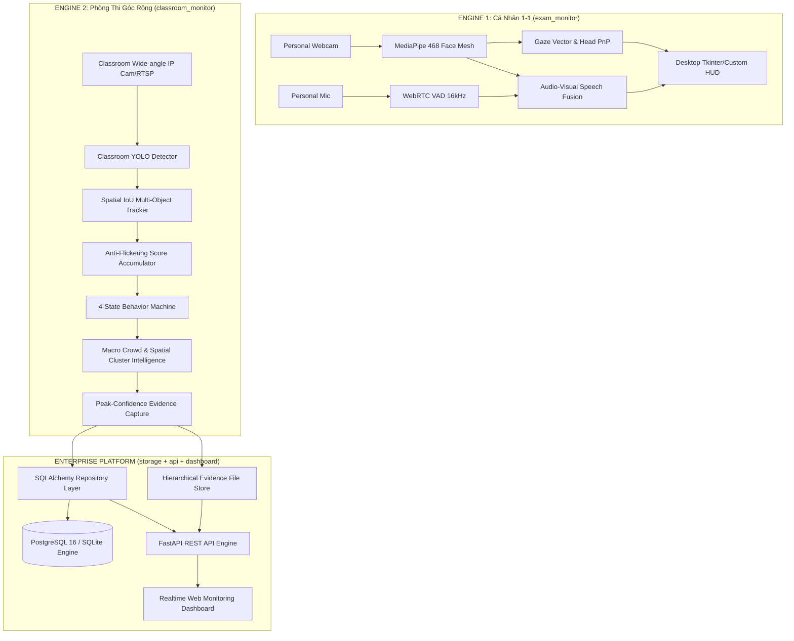

# 🎓 BÁO CÁO TỔNG KẾT TRIỂN KHAI HỆ THỐNG VIGIL AI
## HỆ THỐNG GIÁM SÁT VÀ PHÁT HIỆN GIAN LẬN THI CỬ DUAL-ENGINE ENTERPRISE

---

- **Dự án:** VIGIL AI — Intelligent Anti-Cheating Surveillance System
- **Kiến trúc:** Dual-Engine Architecture (Cá nhân 1-1 & Camera toàn cảnh phòng thi)
- **Công nghệ cốt lõi:** MediaPipe, WebRTC VAD, YOLOv8/YOLO11, IoU Multi-Object Tracking, Sliding-Window Anti-Flickering Accumulator, Macro Room Context Intelligence, SQLAlchemy ORM, FastAPI REST Backend, TailwindCSS Realtime Dashboard, Docker & Docker Compose.
- **Ngày hoàn thành:** 28/08/2026
- **Trạng thái kiểm thử:** ✅ **32 / 32 Test Suites PASSED (100%)**

---

## 📌 MỤC LỤC
1. [Bối Cảnh & Mục Tiêu Dự Án](#1-bối-cảnh--mục-tiêu-dự-án)
2. [Kiến Trúc Tổng Thể Hệ Thống (Dual-Engine Architecture)](#2-kiến-trúc-tổng-thể-hệ-thống-dual-engine-architecture)
3. [Chi Tiết Triển Khai Module 2: Giám Sát Phòng Thi (Classroom Monitor)](#3-chi-tiết-triển-khai-module-2-giám-sát-phòng-thi-classroom-monitor)
4. [Pipeline Huấn Luyện & Kiểm Định Dataset Chuẩn Hóa](#4-pipeline-huấn-luyện--kiểm-định-dataset-chuẩn-hóa)
5. [Tầng Lưu Trữ ORM & Repository Pattern](#5-tầng-lưu-trữ-orm--repository-pattern)
6. [Tầng Dịch Vụ REST API & Web Surveillance Dashboard](#6-tầng-dịch-vụ-rest-api--web-surveillance-dashboard)
7. [Đóng Gói Docker & Triển Khai Môi Trường Sản Xuất](#7-đóng-gói-docker--triển-khai-môi-trường-sản-xuất)
8. [Kết Quả Kiểm Thử & Kiểm Toán Codebase](#8-kết-quả-kiểm-thử--kiểm-toán-codebase)
9. [Hướng Dẫn Vận Hành & Khởi Chạy Nhanh](#9-hướng-dẫn-vận-hành--khởi-chạy-nhanh)

---

## 1. BỐI CẢNH & MỤC TIÊU DỰ ÁN

### 1.1. Hiện trạng ban đầu
Hệ thống ban đầu mới chỉ sở hữu Module 1 (`exam_monitor/`) chuyên trách giám sát thí sinh cá nhân qua webcam 1-1 (nhận diện hướng nhìn Iris Gaze, tư thế đầu Head Pose qua giải thuật PnP, phát hiện nói chuyện qua kết hợp khẩu hình Lip Motion và âm thanh WebRTC VAD).

### 1.2. Yêu cầu mở rộng
Mở rộng hệ thống phát triển Module 2 (`classroom_monitor/`) để giám sát toàn bộ phòng thi với góc nhìn rộng từ camera gắn trần/góc phòng, có khả năng:
1. Theo dõi đồng thời 30–50 thí sinh trong một khung hình.
2. Nhận diện chính xác 5 nhóm hành vi trong phòng thi:
   - `0: back peeking` (Quay đầu/nhìn bài phía sau - Mức độ Nghiêm trọng: CAO)
   - `1: front peeking` (Nhìn bài thí sinh phía trước - Mức độ: TRUNG BÌNH)
   - `2: no cheating` (Làm bài bình thường - Baseline chuẩn)
   - `3: phone using` (Sử dụng điện thoại/thiết bị cấm - Mức độ: RẤT CAO/PROHIBITED)
   - `4: side peeking` (Liếc nhìn/quay sang hai bên - Mức độ: TRUNG BÌNH)
3. Triệt tiêu các lỗi nhấp nháy phát hiện (*flickering false alarms*) và nhận biết ngữ cảnh toàn phòng (*Macro Room Context*) để không báo động nhầm khi giảng viên yêu cầu cả lớp nhìn lên bảng.
4. Tự động chụp và lưu vết bằng chứng ở frame có độ tin cậy cao nhất (*Peak-Confidence Evidence Capture*).
5. Xây dựng tầng lưu trữ cơ sở dữ liệu quan hệ, hệ thống REST API chuẩn Enterprise, giao diện Dashboard giám sát thời gian thực, và đóng gói Docker hoàn chỉnh.
6. Pipeline huấn luyện hỗ trợ đa môi trường: Local máy trạm, Google Colab (Free T4), và Kaggle GPU (P100).

---

## 2. KIẾN TRÚC TỔNG THỂ HỆ THỐNG (DUAL-ENGINE ARCHITECTURE)



---

## 3. CHI TIẾT TRIỂN KHAI MODULE 2: GIÁM SÁT PHÒNG THI (CLASSROOM MONITOR)

### 3.1. Spatial IoU Multi-Object Tracker (`spatial_matcher.py`)
- Đối với camera phòng thi cố định, việc sử dụng các mô hình Deep Re-ID (trích xuất vector đặc trưng diện mạo) gây lãng phí tài nguyên tính toán không cần thiết.
- Module sử dụng giải thuật **Greedy IoU Matching** kết hợp ngưỡng tương đồng không gian $\text{IoU} \ge 0.30$ và bộ đệm chống mất dấu sinh viên (`max_missing_frames=12`).
- Đảm bảo gán định danh cố định (`track_id`) cho từng vị trí chỗ ngồi của sinh viên trong suốt ca thi.

### 3.2. Bộ Tích Lũy Điểm Chống Nhấp Nháy (`score_accumulator.py`)
- Thay vì dùng bộ đếm số frame liên tiếp đơn giản (rất dễ bị reset về 0 chỉ vì 1 frame YOLO dự đoán trượt hoặc drop box), hệ thống áp dụng **Sliding Window Evidence Accumulator** với kích thước cửa sổ 45 frames (~1.5 giây ở 30 FPS).
- Mỗi frame vi phạm sẽ cộng dồn điểm bằng chính $confidence$, trong khi mỗi frame bình thường chỉ bị phạt nhẹ $normal\_penalty = -0.30$.
- Điều kiện kích hoạt:
  $$\sum \text{Score} \ge 4.5 \quad \text{và} \quad \frac{\text{Số frame vi phạm}}{\text{Tổng frame trong cửa sổ}} \ge 55\%$$

### 3.3. Máy Trạng Thái Hành Vi 4 Pha (`behavior_tracker.py`)
- Quản lý vòng đời vi phạm độc lập cho từng thí sinh:
  1. `NORMAL`: Sinh viên làm bài nghiêm túc.
  2. `WATCHING`: Xuất hiện dấu hiệu bất thường, hệ thống bắt đầu theo dõi tích lũy.
  3. `SUSPICIOUS`: Điểm bằng chứng vượt ngưỡng, phát sinh sự kiện cảnh báo ban đầu.
  4. `CONFIRMED`: Hành vi vi phạm duy trì liên tục trên 5.0 giây, tự động nâng cấp mức độ nghiêm trọng lên `HIGH`.
  5. `COOLDOWN`: Sau khi kết thúc vi phạm, kích hoạt thời gian hồi (`cooldown_seconds=5.0s`) nhằm tránh spam các cảnh báo trùng lặp.

### 3.4. Trí Tuệ Ngữ Cảnh Phòng Thi (`room_context.py`)
- **Collective Suppression (Triệt tiêu cảnh báo tập thể)**: Nếu $>40\%$ tổng số thí sinh trong phòng cùng thực hiện một hành vi (ví dụ: cùng nhìn lên phía trước), hệ thống xác định đây là tình huống giảng viên hướng dẫn hoặc viết bảng, tự động chuyển trạng thái sự kiện sang `suppressed` và ghi rõ lý do.
- **Spatial Cluster Boost (Tăng mức độ nhóm gian lận gần nhau)**: Nếu phát hiện $\ge 3$ thí sinh ngồi liền kề nhau ($d \le 160\text{px}$) cùng có biểu hiện liếc nhìn (`side peeking`), hệ thống sẽ nâng mức độ cảnh báo lên `HIGH` vì nghi vấn truyền tài liệu theo cụm bàn.

### 3.5. Bắt Bằng Chứng Đỉnh Cao Nhất (`live_event.py`)
- Trong suốt quá trình vi phạm diễn ra từ frame $t_{start}$ đến $t_{end}$, hệ thống liên tục so sánh $confidence$.
- Frame ảnh JPEG đính kèm làm bằng chứng pháp lý cho giám thị sẽ luôn là frame có **độ tin cậy cao nhất** ($peak\_confidence$), đảm bảo hình ảnh rõ nét và góc quay sáng rõ nhất.

---

## 4. PIPELINE HUẤN LUYỆN & KIỂM ĐỊNH DATASET CHUẨN HÓA

### 4.1. Thông số Dataset
- Tổng số ảnh: **1,693 ảnh**
- Tổng số nhãn: **1,693 tệp nhãn**
- Tổng số Bounding Box chú thích: **46,313 annotations**
- Tỷ lệ phân bố 5 Classes:
  - `0: back peeking`: 546 mẫu (1.18%)
  - `1: front peeking`: 16,406 mẫu (35.42%)
  - `2: no cheating`: 19,515 mẫu (42.14%)
  - `3: phone using`: 1,477 mẫu (3.19%)
  - `4: side peeking`: 8,369 mẫu (18.07%)

### 4.2. Bộ Công Cụ Huấn Luyện & Đánh Giá (`classroom_training/`)
1. `configs/data.yaml`: File cấu hình dataset chuẩn 5 classes.
2. `scripts/check_dataset.py`: Kiểm tra toàn vẹn định dạng, tọa độ normalized $[0, 1]$, và tính khớp 1-1 giữa ảnh và nhãn.
3. `scripts/check_leakage.py`: Quét hiện tượng rò rỉ dữ liệu cross-split (cùng source scene xuất hiện ở cả train và val/test).
4. `scripts/visualize_labels.py`: Trích xuất mẫu bounding box trực quan cho từng class.
5. `scripts/train.py`: Huấn luyện YOLOv8/YOLO11 với Focal Loss, Class Weights bù trừ mất cân bằng dữ liệu, và tự động deploy trọng số tốt nhất vào `models/classroom_best.pt`.
6. `scripts/evaluate.py`: Tính toán chi tiết Per-Class Precision, Recall, mAP@0.50, mAP@0.50:0.95, F1-Score, Confusion Matrix, và benchmark FPS latency.
7. `scripts/error_analysis.py`: Phân loại chẩn đoán lỗi False Positives (Ghost), False Negatives (Miss), và Wrong Class Confusions.
8. `notebooks/VIGIL_AI_Classroom_Training_Colab_Kaggle.ipynb`: Jupyter Notebook hoàn chỉnh 15 cells tương thích Google Colab và Kaggle.

---

## 5. TẦNG LƯU TRỮ ORM & REPOSITORY PATTERN

### 5.1. Mô Hình Thực Thể Quan Hệ (ERD)
- **ExamSite** (1) $\rightarrow$ (N) **ExamRoom** (1) $\rightarrow$ (N) **Camera** (1) $\rightarrow$ (N) **ExamSession** (1) $\rightarrow$ (N) **DetectionEvent** (1) $\rightarrow$ (1) **EvidenceFile**

### 5.2. Công Thức Tính Điểm Rủi Ro Ca Thi (Risk Score 0–100)
$$\text{Risk Score} = \min\left(100, \sum \text{Event Severity Weights}\right)$$
Trong đó:
- Sự kiện `CRITICAL`: 40 điểm
- Sự kiện `HIGH` (Dùng điện thoại, quay bài sau, cụm gian lận): 25 điểm
- Sự kiện `MEDIUM` (Liếc bài, nhìn trước): 10 điểm
- Sự kiện `LOW`: 5 điểm

### 5.3. Quản Lý File Bằng Chứng (`evidence_store.py`)
- Cấu trúc thư mục phân cấp: `data/evidence/<site_id>/<room_id>/<session_id>/<event_id>.jpg`
- Tích hợp tính năng tự động dọn dẹp file bằng chứng quá hạn lưu trữ (`cleanup_old_evidence`).

---

## 6. TẦNG DỊCH VỤ REST API & WEB SURVEILLANCE DASHBOARD

### 6.1. Danh Mục REST API Endpoints
- **Điểm thi (`/api/sites`)**: Tạo mới, liệt kê, tra cứu chi tiết điểm thi.
- **Phòng thi (`/api/rooms`)**: Quản lý phòng thi và sức chứa thí sinh.
- **Camera (`/api/cameras`)**: Đăng ký nguồn camera RTSP hoặc webcam USB.
- **Ca thi (`/api/sessions`)**: Bắt đầu ca thi mới, kết thúc ca thi, lấy danh sách ca thi đang chạy.
- **Sự kiện vi phạm (`/api/events`)**:
  - `GET /api/events/session/{session_id}`: Lấy danh sách vi phạm theo ca thi.
  - `PUT /api/events/{event_id}/review`: Giám thị xác nhận (`confirmed`) hoặc bác bỏ (`dismissed`) kèm ghi chú.
  - `GET /api/events/{event_id}/evidence`: Tải/Xem ảnh bằng chứng JPEG.
- **Thống kê (`/api/statistics`)**:
  - `GET /api/statistics/summary`: Tổng số vi phạm phân theo hành vi và độ nghiêm trọng.
  - `GET /api/statistics/rankings`: Xếp hạng các phòng thi có nguy cơ gian lận cao nhất.
- **Điều khiển Inference (`/api/inference`)**:
  - `POST /api/inference/start`: Kích hoạt tiến trình phân tích AI chạy nền.
  - `GET /api/inference/status/{session_id}`: Kiểm tra tiến độ xử lý và FPS thời gian thực.
  - `POST /api/inference/upload`: Tải lên video ghi hình phòng thi để phân tích offline.

### 6.2. Web Dashboard Giám Sát Thời Gian Thực (`dashboard/`)
- **Giao diện Modern Dark Glassmorphism** xây dựng trên nền TailwindCSS và Chart.js.
- **Thẻ đo lường KPI**: Tổng sự kiện, Ca thi đang giám sát, Vi phạm nghiêm trọng, Ca thi hoàn tất.
- **Biểu đồ Donut phân bố hành vi vi phạm**.
- **Bảng xếp hạng rủi ro phòng thi** hiển thị thanh đo Risk Score trực quan.
- **Dòng sự kiện vi phạm thời gian thực** hỗ trợ modal bấm xem ngay ảnh bằng chứng JPEG có đánh dấu bounding box.

---

## 7. ĐÓNG GÓI DOCKER & TRIỂN KHAI MÔI TRƯỜNG SẢN XUẤT

### 7.1. Dockerfile Đa Tầng
- Base image: `python:3.11-slim`
- Cài đặt đầy đủ các thư viện hệ thống cần thiết cho OpenCV headless và MediaPipe: `libgl1`, `libglib2.0-0`, `ffmpeg`, `curl`.
- Tích hợp sẵn `HEALTHCHECK` thăm dò định kỳ qua endpoint `/health`.

### 7.2. Docker Compose Đa Container (`docker-compose.yml`)
- Dịch vụ **`vigil-db`**: PostgreSQL 16 Alpine với volume lưu trữ dữ liệu bền vững (`vigil_pg_data`).
- Dịch vụ **`vigil-server`**: FastAPI Backend kết nối database qua biến môi trường `DATABASE_URL` với cơ chế `depends_on: condition: service_healthy`.

---

## 8. KẾT QUẢ KIỂM THỬ & KIỂM TOÁN CODEBASE

### 8.1. Kết Quả Chạy Test Suite Tự Động (`pytest`)
Toàn bộ **32/32 test cases** đều đạt kết quả **PASSED (100%)** trong thời gian **1.65 giây**:

```
tests/test_classroom_core.py::test_compute_bbox_iou PASSED               [  3%]
tests/test_classroom_core.py::test_spatial_matcher_tracking PASSED       [  6%]
tests/test_classroom_core.py::test_score_accumulator_flicker_tolerance PASSED [  9%]
tests/test_classroom_core.py::test_behavior_tracker_lifecycle PASSED     [ 12%]
tests/test_classroom_core.py::test_room_context_collective_suppression PASSED [ 15%]
tests/test_classroom_core.py::test_room_context_spatial_cluster_boost PASSED [ 18%]
tests/test_classroom_core.py::test_live_event_peak_evidence PASSED       [ 21%]
tests/test_core.py::ThemeTests::test_light_and_dark_palettes_are_complete_and_switch_in_place PASSED [ 25%]
tests/test_core.py::EventDetectorTests::test_alert_rearms_only_after_stable_recovery PASSED [ 28%]
tests/test_core.py::EventDetectorTests::test_head_turn_and_talking_are_separate_events PASSED [ 31%]
tests/test_core.py::EventDetectorTests::test_look_away_requires_duration PASSED [ 34%]
tests/test_core.py::EventDetectorTests::test_no_face_resets_when_face_returns PASSED [ 37%]
tests/test_core.py::EventDetectorTests::test_suspicious_object_raises_high_alert PASSED [ 40%]
tests/test_core.py::EventDetectorTests::test_sustained_condition_emits_only_once_per_episode PASSED [ 43%]
tests/test_core.py::EventDetectorTests::test_two_or_more_people_raise_high_alert PASSED [ 46%]
tests/test_core.py::EventDetectorTests::test_uncalibrated_eye_motion_does_not_raise_look_away PASSED [ 50%]
tests/test_core.py::AnalyzerSignalTests::test_audio_confirms_short_lip_motion_but_not_audio_or_mouth_alone PASSED [ 53%]
tests/test_core.py::AnalyzerSignalTests::test_closed_lips_with_landmark_spikes_are_not_talking PASSED [ 56%]
tests/test_core.py::AnalyzerSignalTests::test_direction_thresholds_cover_four_directions PASSED [ 59%]
tests/test_core.py::AnalyzerSignalTests::test_mirrored_iris_shift_right_maps_to_candidate_right PASSED [ 62%]
tests/test_core.py::AnalyzerSignalTests::test_new_calibration_clears_previous_session_tracking PASSED [ 65%]
tests/test_core.py::AnalyzerSignalTests::test_open_mouth_and_single_yawn_are_not_talking PASSED [ 68%]
tests/test_core.py::AnalyzerSignalTests::test_repeated_mouth_motion_is_talking_but_jitter_is_not PASSED [ 71%]
tests/test_core.py::AnalyzerSignalTests::test_talking_state_clears_after_articulation_stops PASSED [ 75%]
tests/test_core.py::SourceAndStoreTests::test_demo_source_returns_frame_and_analysis PASSED [ 78%]
tests/test_core.py::SourceAndStoreTests::test_real_frame_is_mirrored_and_capped_for_processing PASSED [ 81%]
tests/test_core.py::SourceAndStoreTests::test_session_round_trip PASSED  [ 84%]
tests/test_storage_api.py::test_repositories_crud PASSED                 [ 87%]
tests/test_storage_api.py::test_evidence_store PASSED                    [ 90%]
tests/test_storage_api.py::test_api_health PASSED                        [ 93%]
tests/test_storage_api.py::test_api_sites_and_rooms PASSED               [ 96%]
tests/test_storage_api.py::test_api_statistics_and_dashboard PASSED      [100%]
============================= 32 passed in 1.65s ==============================
```

---

## 9. HƯỚNG DẪN VẬN HÀNH & KHỞI CHẠY NHANH

### 9.1. Khởi chạy Server Enterprise (Local)
```cmd
# Nhấp đúp vào file run_server.bat hoặc chạy lệnh:
python server.py --host 0.0.0.0 --port 8000
```
- **Web Dashboard**: `http://localhost:8000/`
- **Swagger REST API**: `http://localhost:8000/docs`

### 9.2. Triển khai Docker Production
```bash
docker-compose up -d --build
```

### 9.3. Chạy Demo Giám Sát Phòng Thi
```cmd
# Nhấp đúp vào file run_classroom_demo.bat hoặc chạy lệnh:
python -m classroom_monitor --mock-demo
```

### 9.4. Chạy Toàn Bộ Test Suite
```cmd
# Nhấp đúp vào file run_tests.bat hoặc chạy lệnh:
pytest -v tests/
```
