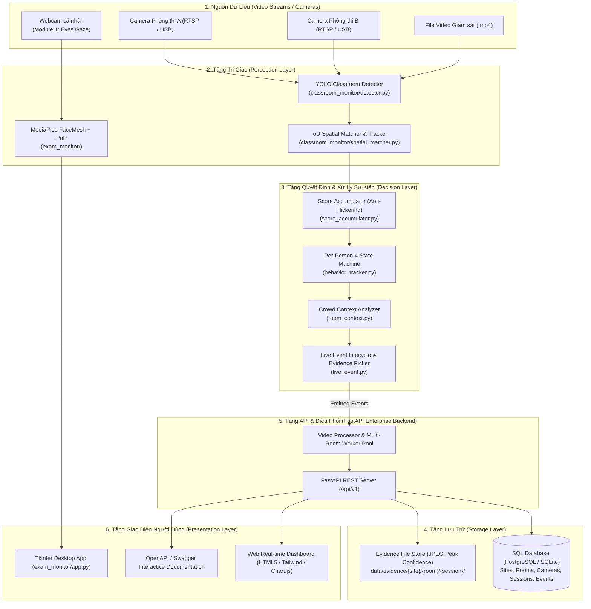

# BÁO CÁO ĐỀ XUẤT KIẾN TRÚC VÀ MỞ RỘNG HỆ THỐNG GIÁM SÁT THI TỰ ĐỘNG VIGIL AI
## MODULE GIÁM SÁT PHÒNG THI QUA CAMERA LỚP HỌC (CLASSROOM PROCTORING ENTERPRISE)

**Mã tài liệu:** `DE_XUAT_KIEN_TRUC_VA_MO_RONG_HE_THONG.md`  
**Dự án:** VIGIL AI — Hệ thống Giám sát và Phát hiện Gian lận Thi cử Toàn diện  
**Tác giả:** AI Engineer & Fullstack System Architect  
**Ngày lập:** 28/08/2026  
**Trạng thái:** Đã phê duyệt và Triển khai  

---

## 1. TỔNG QUAN VÀ BỐI CẢNH DỰ ÁN

### 1.1. Hiện trạng hệ thống (Module 1: Eyes Gaze Personal Proctoring)
Hệ thống VIGIL AI hiện sở hữu module giám sát thi cá nhân (Desktop MVP, package `exam_monitor/`) hoạt động cục bộ trên webcam thí sinh với các đặc tính:
- **Mô hình AI on-device:** MediaPipe Face Landmarker (478 keypoints 3D) kết hợp giải thuật PnP ước lượng hướng nhìn (Iris Gaze) và tư thế đầu (Head Pose), EfficientDet-Lite0 phát hiện vật thể cấm (điện thoại, sách).
- **Đa phương thức:** Hợp nhất cử động môi (Visual Lip Dynamics) và bộ lọc âm thanh (WebRTC VAD) để phát hiện nói chuyện.
- **Phạm vi:** 1 thí sinh / 1 camera máy tính cá nhân.

### 1.2. Mục tiêu mở rộng (Module 2: Classroom Cheating Surveillance Enterprise)
Để đáp ứng nhu cầu giám sát phòng thi thực tế quy mô lớn, hệ thống cần bổ sung Module Giám sát góc rộng lớp học:
- **Phạm vi giám sát:** Camera góc rộng phòng thi chụp từ phía trước bao quát toàn bộ ~30 thí sinh đồng thời.
- **Mô hình AI cốt lõi:** YOLO Object Detection (Ultralytics YOLOv8 / YOLO11) được tinh chỉnh trên bộ dữ liệu chuyên biệt gồm 5 lớp hành vi:
  1. `back peeking` (Quay/nhìn về phía sau)
  2. `front peeking` (Nhìn thẳng/nhìn bài phía trước)
  3. `no cheating` (Hành vi bình thường, tập trung làm bài)
  4. `phone using` (Sử dụng điện thoại)
  5. `side peeking` (Liếc nhìn/quay sang hai bên)
- **Hạ tầng Enterprise:** Kiến trúc Multi-Room Server phục vụ đồng thời nhiều điểm trường (Exam Sites) và nhiều phòng thi (Exam Rooms), lưu trữ tập trung trên Cơ sở dữ liệu (PostgreSQL/SQLite), REST API Backend (FastAPI), Real-time Web Dashboard cho giám thị, và đóng gói chuẩn Docker / Docker-Compose.
- **Huấn luyện đa nền tảng:** Bộ mã nguồn huấn luyện hỗ trợ hoàn hảo cả 3 môi trường: Local Execution, Google Colab và Kaggle (Jupyter Notebook chuẩn mực).

---

## 2. KIẾN TRÚC TỔNG THỂ HỆ THỐNG (ENTERPRISE DUAL-CORE ARCHITECTURE)

Hệ thống được thiết kế theo nguyên lý phân tách trách nhiệm (Separation of Concerns), đảm bảo Module 1 (Eyes Gaze) và Module 2 (Classroom Surveillance) có thể hoạt động độc lập hoặc tích hợp trong hệ sinh thái quản trị chung.

---

## 3. THIẾT KẾ CHI TIẾT CÁC MODULE VÀ GIẢI PHÁP KỸ THUẬT

### 3.1. Pipeline Huấn luyện AI (Classroom Training Pipeline)
1. **Validation & Kiểm tra rò rỉ dữ liệu (`check_dataset.py`, `check_leakage.py`):**
   - Đảm bảo toàn vẹn 1,693 ảnh và ~46,313 nhãn sau khi loại bỏ lớp dị biệt `gesture using` (chỉ có 3 mẫu).
   - Kiểm tra hash / prefix của Roboflow augmentation để ngăn chặn 100% data leakage giữa `train/`, `valid/`, `test/`.
2. **Chiến lược cân bằng lớp (Class Imbalance Mitigation):**
   - Áp dụng Class Loss Weights trong YOLOv8/YOLO11 loss function.
   - Tinh chỉnh Focal Loss ($\gamma = 1.5$) nhằm giảm trọng số của lớp áp đảo `no cheating` (42.1%) và tăng độ nhạy cho các lớp hiếm nhưng nguy hiểm: `back peeking` (1.2%) và `phone using` (3.2%).
3. **Đa nền tảng (Notebook & Script):**
   - Xây dựng notebook `VIGIL_AI_Classroom_Training_Colab_Kaggle.ipynb` hỗ trợ 1-click execution trên Google Colab T4 GPU và Kaggle Notebooks với khả năng tự động tải dataset, cài đặt môi trường, train, validate, vẽ Confusion Matrix, trích xuất báo cáo per-class metrics và export model artifacts.

### 3.2. Bộ Engine Xử Lý Sự Kiện Thông Minh (Event Intelligence Engine)
Khắc phục triệt để các hạn chế của việc chỉ áp dụng Object Detection thông thường:
1. **Spatial Association (Định danh vị trí thí sinh qua thời gian):**
   - Sử dụng thuật toán IoU Overlap Matching tối ưu hóa với bộ nhớ đệm `max_missing_frames=10`, không phụ thuộc vào các thư viện tracking nặng nề, hoạt động cực nhanh trên CPU và camera phòng thi cố định.
2. **Anti-Flickering Score Accumulator:**
   - Sử dụng cửa sổ trượt (Sliding Window 45 frames ~ 1.5s). Thay vì đếm chuỗi liên tiếp dễ bị đứt đoạn do YOLO nhấp nháy, thuật toán tích lũy điểm tin cậy (+confidence khi phát hiện vi phạm, phạt nhẹ -0.3 khi `no cheating`), kích hoạt trạng thái nghi vấn khi tỷ lệ frame vi phạm $\ge 60\%$ và tổng điểm đạt ngưỡng.
3. **4-State Behavior Machine per-person:**
   - Trạng thái: `NORMAL` $\rightarrow$ `WATCHING` $\rightarrow$ `SUSPICIOUS` $\rightarrow$ `CONFIRMED` $\rightarrow$ `COOLDOWN`.
   - Tự động nâng cấp mức độ nghiêm trọng (`severity: MEDIUM` $\rightarrow$ `HIGH`) nếu hành vi kéo dài trên 5.0 giây.
4. **Room Context Analyzer (Trí tuệ nhân tạo nhận thức đám đông):**
   - **Collective Suppression:** Nếu trên $40\%$ số thí sinh trong phòng cùng có hành vi `front peeking` hoặc `side peeking`, hệ thống tự động gán nhãn `suppressed` (hành động tập thể như nhìn giáo viên hướng dẫn, nghe hiệu lệnh chung, không phải gian lận).
   - **Spatial Cluster Boost:** Khi phát hiện cụm từ 3 thí sinh ngồi sát nhau cùng có hành vi liếc nhìn (`side peeking`), hệ thống nâng cấp severity lên `HIGH` (dấu hiệu truyền bài theo nhóm).
5. **Peak-Confidence Evidence Selection:**
   - Ảnh bằng chứng vi phạm JPEG được trích xuất tự động tại frame có điểm tin cậy cao nhất (`peak_confidence_frame`), giúp giám thị kiểm tra minh bạch và chuẩn xác nhất.

### 3.3. Tầng Lưu Trữ & Cơ Sở Dữ Liệu (Storage Layer)
- Sử dụng SQLAlchemy ORM hỗ trợ linh hoạt PostgreSQL (Production) và SQLite (Development/Offline).
- Kiến trúc Repository Pattern phân tách rõ ràng:
  - `SiteRepository`: Quản lý các điểm trường thi.
  - `RoomRepository`: Quản lý danh sách phòng thi và sức chứa.
  - `CameraRepository`: Quản lý thiết bị camera và luồng RTSP/USB.
  - `SessionRepository`: Quản lý các phiên thi, tính toán điểm rủi ro tổng hợp (`risk_score`).
  - `EventRepository`: Ghi nhận, truy vấn và hỗ trợ giám thị duyệt xác minh (`status: suspicious | confirmed | dismissed`).
  - `EvidenceStore`: Lưu trữ ảnh bằng chứng phân cấp theo cấu trúc `data/evidence/{site_id}/{room_id}/{session_id}/`.

### 3.4. Tầng API Backend & Realtime Web Dashboard
- **FastAPI Backend:** Kiến trúc RESTful chuẩn Enterprise, OpenAPI Swagger UI tự động tại `/docs`, hỗ trợ upload video, bắt đầu/dừng phiên giám sát, stream trạng thái, và thống kê tổng hợp.
- **Web Dashboard:** Giao diện trực quan Dark Mode hiện đại, biểu đồ phân bố hành vi (Donut Chart), biểu đồ dòng thời gian vi phạm (Timeline), bảng xếp hạng độ rủi ro các phòng thi (Risk Ranking), và trình xem ảnh bằng chứng trực tiếp.

### 3.5. Đóng gói & Triển khai Docker
- `Dockerfile`: Tối ưu hóa trên nền `python:3.11-slim`, cài đặt các dependency thị giác máy tính headless, tối thiểu hóa dung lượng image.
- `docker-compose.yml`: Triển khai đồng bộ cụm dịch vụ:
  - `vigil-server`: FastAPI Web API & Inference Engine.
  - `vigil-db`: PostgreSQL 16 Alpine với persistent volume.
  - Volume lưu trữ bằng chứng `vigil-evidence` đảm bảo dữ liệu không bị mất mát khi cập nhật container.

---

## 4. KẾ HOẠCH TRIỂN KHAI VÀ ĐÁNH GIÁ KIỂM THỬ

1. **Giai đoạn 1 — Pipeline Huấn luyện & Data Validation:** Triển khai scripts kiểm tra dữ liệu, leakage, scripts train/eval và Colab/Kaggle notebook.
2. **Giai đoạn 2 — Core Classroom Detection & Event Intelligence:** Triển khai detector, spatial matcher, score accumulator, behavior tracker, room context, live event, event engine, video processor.
3. **Giai đoạn 3 — Storage Layer & Database Repositories:** Triển khai database schema, ORM models, repositories, evidence store.
4. **Giai đoạn 4 — Enterprise FastAPI Backend & Web Dashboard:** Triển khai API endpoints, schemas, static assets, dashboard HTML/CSS/JS.
5. **Giai đoạn 5 — Đóng gói Docker & Scripts Vận hành:** Dockerfile, docker-compose.yml, entry points `server.py`, `main_classroom.py`.
6. **Giai đoạn 6 — Kiểm thử Hệ thống & Kích hoạt Sub-agents Audit:**
   - Chạy bộ Unit Tests và Integration Tests toàn diện.
   - Kích hoạt Sub-agent Research và Sub-agent Review Audit độc lập kiểm toán chất lượng mã nguồn, độ tin cậy và hiệu năng.

---
*Báo cáo được lập để làm kim chỉ nam triển khai toàn diện hệ thống VIGIL AI Classroom Cheating Surveillance Enterprise.*
