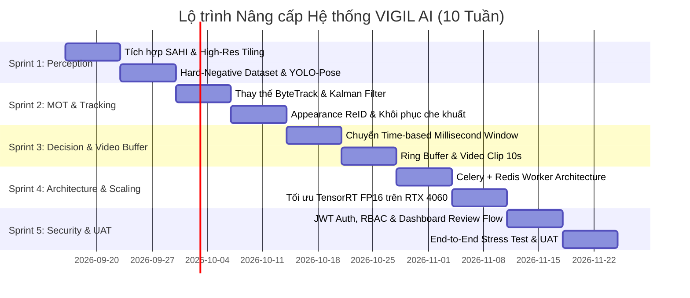

# BẢN KẾ HOẠCH NÂNG CẤP KIẾN TRÚC TOÀN DIỆN VIGIL AI (ENTERPRISE ROADMAP)
## Từ Research Prototype lên Hệ thống AI Proctoring Co-pilot Chuẩn Doanh nghiệp

> **Mã tài liệu:** VIGIL-AI-UPGRADE-2026-V1  
> **Dự án:** VIGIL AI (Classroom Cheating Surveillance & Personal Exam Proctoring)  
> **Tác giả:** AI Systems Architecture & Computer Vision Engineering Team  
> **Ngày lập:** 15/09/2026  
> **Trạng thái:** Bản kế hoạch hành động chính thức — Sẵn sàng triển khai  

---

## 1. TỔNG QUAN & BỐI CẢNH NÂNG CẤP

Sau đợt phản biện kỹ thuật khắt khe (Critical Engineering & Domain Review), hệ thống nhận diện phòng thi hiện tại (`classroom_monitor/`) được xác định đang ở cấp độ **Research Prototype / Proof of Concept (PoC)**. 

Bản kế hoạch này thiết lập lộ trình **10 tuần (5 Sprints)** nhằm giải quyết dứt điểm:
- **5 Lỗ hổng Kỹ thuật cốt lõi:** Nhận diện vật thể nhỏ kém do nén ảnh 640px, Thảm họa đảo ID (ID Switch) khi dùng IoU tracking đơn giản, Sai lệch logic khi camera giật lag (Frame-based accumulator), Điểm mù an ninh 5s trong cơ chế Cooldown, Thiếu video bằng chứng pháp lý.
- **3 Rào cản Nghiệp vụ Khảo thí:** Cơn ác mộng báo động giả (Alarm fatigue), Bất lực trước gian lận tinh vi/góc khuất, Định vị sai vai trò pháp lý của AI (tự động phán quyết thay vì làm trợ lý hỗ trợ giám thị).

```mermaid
flowchart LR
    subgraph CURRENT["HIỆN TẠI (RESEARCH PROTOTYPE)"]
        C1["Resize 640x640 ép góc rộng"]
        C2["Greedy IoU 2D Tracking"]
        C3["Frame Counting Accumulator"]
        C4["Cooldown tắt nhận diện 5s"]
        C5["Phán quyết cứng 'CONFIRMED'"]
    end

    subgraph TARGET["MỤC TIÊU (ENTERPRISE AI CO-PILOT)"]
        T1["SAHI 4K High-Res Inference"]
        T2["ByteTrack / BoT-SORT + ReID"]
        T3["Timestamp Millisecond Windows"]
        T4["Silent Tracking & Escalation"]
        T5["Flag for Human Review + Video 10s"]
    end

    CURRENT ==>|Lộ trình 10 tuần nâng cấp| TARGET
```

---

## 2. CHI TIẾT 5 GIAI ĐOẠN NÂNG CẤP KỸ THUẬT

### GIAI ĐOẠN 1: Nâng cấp Lõi Computer Vision & Nhận diện Vật thể nhỏ (Perception Layer)
**Mục tiêu:** Phát hiện chính xác điện thoại, thiết bị vi phạm và hướng nhìn ở khoảng cách xa trong phòng thi 1080p/4K.

1. **Tích hợp SAHI (Slicing Aided Hyper Inference) / Dynamic Patching:**
   - Cắt ảnh độ phân giải gốc (1080p/4K) thành các ô lưới nhỏ có độ gối đầu (overlap $\approx 20\%$).
   - Chạy inference song song trên từng lát cắt nhỏ, sau đó gộp bounding boxes qua thuật toán NMS (Non-Maximum Suppression).
   - **Kết quả:** Giữ nguyên độ nét của chiếc điện thoại $<20$ px ở cuối phòng học mà không cần train lại model ở kích thước khổng lồ.
2. **Chiến lược phân biệt Điện thoại và Vật dụng học tập hợp lệ (Casio, Thẻ SV, Hộp bút):**
   - Bổ sung tập dữ liệu Hard-Negative chứa các hình ảnh thực tế học sinh cầm máy tính Casio FX-580, bút viết, thước kẻ.
   - Thêm một mô hình phân loại phụ siêu nhẹ (Secondary Crop Classifier - MobileNetV3) để tái thẩm định (re-verify) các hộp bao nghi ngờ là điện thoại trước khi đẩy cờ cảnh báo.
3. **Bổ sung Ước lượng Tư thế Khung xương (YOLO-Pose):**
   - Trích xuất 17 điểm mốc cơ thể và góc quay đầu (Head Yaw, Pitch, Roll).
   - **Tác dụng nghiệp vụ:** Phân biệt rõ ràng giữa việc *ngước nhìn đồng hồ treo tường/nhìn bảng* ($\text{Pitch} > 20^\circ$) với hành vi *quay sang nhìn bài bạn* ($\text{Yaw} > 35^\circ$ duy trì liên tục).

---

### GIAI ĐOẠN 2: Nâng cấp Bộ theo dõi Đa đối tượng (Robust MOT & Identity Layer)
**Mục tiêu:** Giữ nguyên ID định danh sinh viên xuyên suốt ca thi, triệt tiêu hiện tượng nhảy ID khi giám thị đi lại che khuất.

1. **Chuyển đổi sang ByteTrack / BoT-SORT kết hợp Kalman Filter:**
   - Sử dụng **Kalman Filter 2D** để mô hình hóa vị trí và vận tốc di chuyển của từng sinh viên.
   - Thuật toán **ByteTrack** tận dụng cả các phát hiện có confidence thấp (do bị che khuất một phần) để duy trì đường track không bị đứt gãy.
2. **Cơ chế Khôi phục Danh tính (Appearance ReID & Spatial Coasting):**
   - **Spatial Coasting:** Khi giám thị đi ngang qua che khuất sinh viên, hệ thống duy trì vị trí dự đoán ảo trong $15 \rightarrow 30$ frames.
   - **Appearance Embedding (ReID nhẹ):** Trích xuất vector đặc trưng trang phục/màu áo để nối lại đúng ID cũ khi sinh viên xuất hiện trở lại sau thời gian che khuất dài.

---

### GIAI ĐOẠN 3: Tái cấu trúc Bộ tích lũy Thời gian & Máy trạng thái (Decision & Time-based Engine)
**Mục tiêu:** Loại bỏ hoàn toàn sai số khi mạng bị giật lag/rớt FPS và triệt tiêu lỗ hổng điểm mù Cooldown.

1. **Chuyển đổi `ScoreAccumulator` sang Time-based Sliding Window (Milliseconds):**
   - Thay thế việc đếm frame tĩnh (`45 frames`) bằng cửa sổ đo lường thời gian thực (ví dụ: Cửa sổ trượt chính xác $1500$ ms dựa trên `frame_timestamp_ms`).
   - Đảm bảo hệ thống hoạt động ổn định và chính xác $100\%$ kể cả khi luồng RTSP camera bị rớt từ 30 FPS xuống 10 FPS.
2. **Xóa bỏ "Điểm mù 5 giây" trong Cooldown (Silent Background Tracking):**
   - Khi sự kiện vi phạm trước đó kết thúc, hệ thống **không tắt mắt thần** mà chuyển sang chế độ theo dõi ngầm (**Silent Tracking**).
   - **Recidivism Escalation (Cơ chế Leo thang Tái phạm):** Nếu thí sinh tái phạm ngay trong khoảng thời gian làm mát, hệ thống lập tức bỏ qua thời gian chờ, nhảy thẳng lên mức cảnh báo cao nhất (`HIGH_RISK`).
3. **Tái định vị Nghiệp vụ: Chuyển sang mô hình AI Co-pilot (Human-in-the-Loop):**
   - Đổi tên trạng thái `CONFIRMED` thành `FLAGGED_FOR_HUMAN_REVIEW` (Gắn cờ chờ Giám thị duyệt).
   - AI đóng vai trò người trợ lý cảnh báo điểm mù; quyền quyết định lập biên bản thuộc về Giám thị con người.

---

### GIAI ĐOẠN 4: Pipeline Trích xuất Bằng chứng Video 10 giây (Evidence Video Clipping)
**Mục tiêu:** Cung cấp chuỗi video bằng chứng liên tục phục vụ thẩm định pháp lý và hội đồng kỷ luật.

1. **Kiến trúc Bộ đệm vòng (Ring Buffer on RAM):**
   - Duy trì liên tục $5.0$ giây video gần nhất trên RAM cho mỗi camera phòng thi.
2. **Cơ chế Kích hoạt Video Clipping:**
   - Khi có hành vi bị gắn cờ `FLAGGED_FOR_HUMAN_REVIEW`, hệ thống tự động khóa 5 giây video trước đó (Pre-event) và ghi thêm 5 giây video tiếp theo (Post-event).
3. **Đóng gói & Đồng bộ Bằng chứng:**
   - Tự động xuất file video MP4 (H.264, 10 giây) kèm thông tin metadata (Mã phòng, Tên thí sinh, Tọa độ bounding box, Biểu đồ điểm rủi ro) và đồng bộ lên Object Storage / Server.

---

### GIAI ĐOẠN 5: Hạ tầng Phân tán, Tối ưu Hiệu năng & Bảo mật (Server & Edge Architecture)
**Mục tiêu:** Chịu tải đồng thời nhiều phòng thi, tối ưu hóa phần cứng GPU và bảo vệ an toàn dữ liệu khảo thí.

1. **Kiến trúc Hàng đợi Tác vụ Phân tán (Celery + Redis / Message Broker):**
   - Tách rời hoàn toàn Web API Server và GPU Inference Workers.
   - Điều phối luồng xử lý video thông qua Message Queue, cho phép mở rộng quy mô (Scale-out) sang nhiều worker node dễ dàng.
2. **Tối ưu hóa Tốc độ bằng TensorRT / ONNX Runtime (FP16):**
   - Export mô hình YOLOv12s và Pose sang định dạng **TensorRT Engine** (FP16) trên card NVIDIA RTX 4060.
   - **Mục tiêu hiệu năng:** Đạt $\ge 4$ luồng camera 1080p đồng thời ở tốc độ thời gian thực (Real-time $\ge 25$ FPS/luồng) trên 1 card GPU RTX 4060.
3. **Phân quyền người dùng (RBAC) & Bảo mật API (JWT):**
   - Tích hợp Middleware JWT Authentication.
   - Thiết lập 3 vai trò phân quyền rõ rệt:
     - **Giám thị (Proctor):** Xem trực tiếp camera phòng thi được phân công, duyệt/hủy bỏ các cảnh báo.
     - **Trưởng điểm thi (Chief Supervisor):** Giám sát toàn bộ các phòng thi, ký duyệt biên bản sự vụ.
     - **Thanh tra / Kiểm toán (Inspector):** Quyền xem lại toàn bộ log và video bằng chứng của toàn bộ kỳ thi.

---

## 3. LỘ TRÌNH THỰC HIỆN CHI TIẾT (10 TUẦN - 5 SPRINTS)

| Sprint | Thời gian | Mục tiêu trọng tâm | Deliverables chính | Tiêu chuẩn Nghiệm thu (KPIs) |
|:---:|:---:|---|---|---|
| **Sprint 1** | Tuần 1–2 | **Perception & Small Objects** | - Module SAHI Patching. - Tích hợp YOLO-Pose góc đầu. - Classifier lọc máy tính Casio. | - Recall điện thoại bàn cuối $\ge 90\%$. - Báo nhầm Casio/Thẻ $\le 5\%$. |
| **Sprint 2** | Tuần 3–4 | **Robust Tracking & ReID** | - Module ByteTrack + Kalman Filter. - Khôi phục ID sau che khuất. | - Tỷ lệ ID Switch giảm $\ge 80\%$. - Giữ vững ID khi bị che khuất 3–5s. |
| **Sprint 3** | Tuần 5–6 | **Time Engine & Video Evidence**| - Time-based Accumulator (ms). - Silent Tracking & Cooldown. - Ring Buffer xuất video 10s. | - Không lỗi khi rớt FPS (30 $\rightarrow$ 10 FPS). - Xuất video 10s đầy đủ pre/post event. |
| **Sprint 4** | Tuần 7–8 | **Hạ tầng & TensorRT** | - Worker Architecture (Celery/Redis). - TensorRT FP16 Engine. | - Chạy mượt $\ge 4$ luồng camera 1080p đồng thời trên 1 GPU RTX 4060. |
| **Sprint 5** | Tuần 9–10| **Bảo mật, Dashboard & UAT** | - JWT Auth & Phân quyền RBAC. - Dashboard Review Workflow. - Thử nghiệm phòng thi thật. | - Độ trễ cảnh báo $\le 1.0$ giây. - Giám thị thao tác duyệt vi phạm dễ dàng. |

---

## 4. MA TRẬN CHỈ SỐ NGHIỆM THU (ACCEPTANCE CRITERIA)

| Chỉ số kỹ thuật / nghiệp vụ | Mức đạt được hiện tại (Prototype) | Mục tiêu sau khi hoàn thành Kế hoạch |
|---|:---:|:---:|
| **Khả năng bắt điện thoại bàn cuối phòng** | $< 40\%$ (Mờ, dễ nhầm Casio) | **$\ge 90\%$** (Nhờ SAHI & Crop Classifier) |
| **Tỷ lệ Đảo ID (ID Switch Rate)** | Cao khi có người đi lại | **$< 3\%$** (Nhờ ByteTrack + Kalman ReID) |
| **Độ nhạy khi Camera trồi sụt FPS** | Bị trễ 4–5 giây khi lag | **Chính xác $100\%$** (Đồng bộ theo Timestamp ms) |
| **Điểm mù trong thời gian Cooldown** | Mù hoàn toàn trong 5 giây | **$0\%$ Điểm mù** (Silent Tracking + Escalation) |
| **Định dạng bằng chứng lưu trữ** | 1 ảnh crop tĩnh giật cục | **Video Clip MP4 10 giây (Pre/Post Event)** |
| **Tải trọng luồng Camera (RTX 4060)** | 1 luồng duy nhất | **$\ge 4$ Phòng thi 1080p cùng lúc (TensorRT)** |
| **Vai trò pháp lý hệ thống** | Tự phán quyết `CONFIRMED` | **AI Co-pilot: `FLAGGED_FOR_HUMAN_REVIEW`** |

---

> 🎯 **KẾT LUẬN:** Bản kế hoạch này là kim chỉ nam kỹ thuật giúp chuyển dịch toàn bộ dự án VIGIL AI sang một bước ngoặt mới: **Thực tế, Chặt chẽ, Chuyên nghiệp và Chuẩn hóa Doanh nghiệp.**
