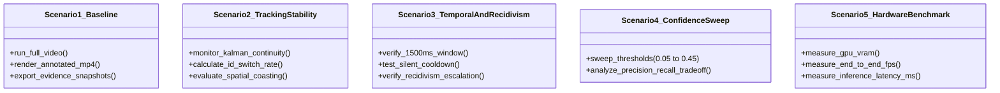
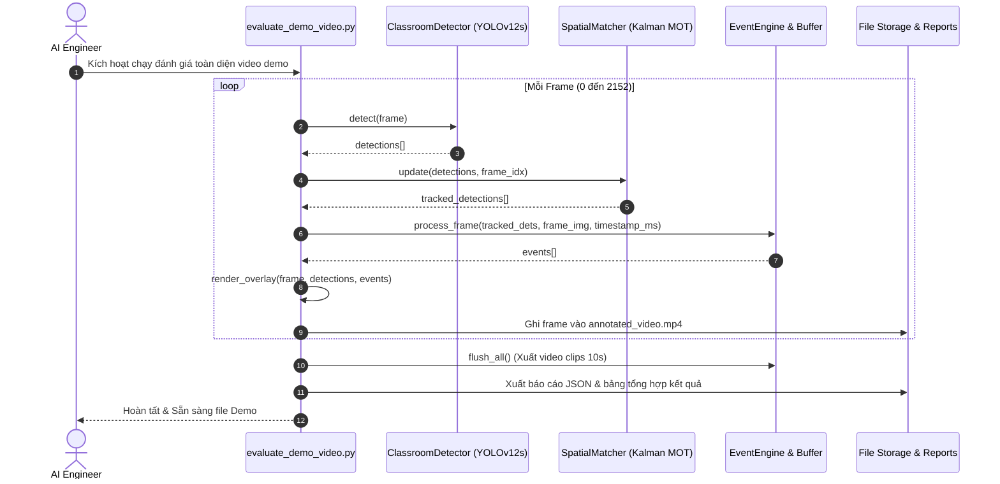

# KẾ HOẠCH TEST & DEMO HỆ THỐNG VIGIL AI TRÊN VIDEO THỰC TẾ
## Đánh giá Năng lực Giám sát Phòng thi trên Video `demo_video/india_classroom.mp4`

> **Mã tài liệu:** VIGIL-TESTPLAN-DEMO-2026-V1  
> **Dự án:** VIGIL AI (Classroom Cheating Surveillance System)  
> **Đối tượng thử nghiệm:** Video `demo_video/india_classroom.mp4`  
> **Môi trường thực thi:** GPU NVIDIA GeForce RTX 4060 Laptop (8GB VRAM) / Python 3.11.9 (CUDA 12.4)  
> **Ngày lập:** 16/09/2026  
> **Trạng thái:** Kế hoạch thực nghiệm chính thức  

---

## 1. TỔNG QUAN & ĐẶC TÍNH KỸ THUẬT CỦA VIDEO TEST

Video thực nghiệm được cung cấp tại thư mục `demo_video/india_classroom.mp4`. Đây là nguồn dữ liệu thực tế ngoài tập huấn luyện (Out-of-Distribution / Zero-Shot Domain), rất lý tưởng để kiểm thử độ bền vững (robustness) và tính sẵn sàng thực tế của hệ thống.

```mermaid
flowchart LR
    subgraph VIDEO["INPUT VIDEO: india_classroom.mp4"]
        V1["Độ phân giải: 1280x720 (720p HD)"]
        V2["Tốc độ khung hình: 30.0 FPS"]
        V3["Thời lượng: 71.77 giây (2,153 frames)"]
        V4["Mật độ: 13 - 20 học sinh/khung hình"]
    end

    subgraph PIPELINE["VIGIL AI ENTERPRISE PIPELINE"]
        P1["YOLOv12s Detector + SAHI"]
        P2["2D Kalman Filter MOT Tracking"]
        P3["Time-Aware Millisecond Accumulator"]
        P4["Silent Tracking & Recidivism Machine"]
        P5["10s Ring Buffer Video Clipper"]
    end

    subgraph OUTPUT["KẾT QUẢ ĐẦU RA"]
        O1["Video MP4 vẽ HUD Overlay & BBoxes"]
        O2["Snapshots ảnh bằng chứng JPEG"]
        O3["Clips Video bằng chứng 10s MP4"]
        O4["Báo cáo Phân tích JSON & Metrics"]
    end

    VIDEO --> PIPELINE --> OUTPUT
```



### Thông số kỹ thuật chi tiết của Video:
- **Đường dẫn tệp:** `demo_video/india_classroom.mp4`
- **Dung lượng tệp:** $11.22 \text{ MB}$ ($11,217,592 \text{ bytes}$)
- **Độ phân giải gốc:** $1280 \times 720$ pixel (Tỉ lệ 16:9, chuẩn HD)
- **Tốc độ khung hình (FPS):** $30.0 \text{ FPS}$
- **Tổng số khung hình:** $2,153 \text{ frames}$
- **Thời lượng:** $71.77 \text{ giây}$ ($\approx 1 \text{ phút } 12 \text{ giây}$)
- **Đặc điểm bối cảnh phòng học:**
  - Phòng học thực tế tại Ấn Độ với mật độ dày đặc ($13 \rightarrow 20$ học sinh).
  - Góc camera đặt trên cao phía trước góc phòng, nhìn chếch xuống $45^\circ$.
  - Đồng phục học sinh màu tối/sáng xen kẽ, bàn ghế gỗ nhiều hàng lối.
  - Điều kiện ánh sáng tự nhiên từ cửa sổ bên hông (có vùng sáng - tối chênh lệch).

---

## 2. MỤC TIÊU KIỂM THỬ (TEST OBJECTIVES & KPIS)

| STT | Mục tiêu kiểm thử | Tiêu chuẩn đánh giá (KPIs) | Ý nghĩa thực tiễn |
|:---:|---|---|---|
| **1** | **Chất lượng Nhận diện & Domain Adaptation** | Bắt đúng các hành vi quay ngang (`side peeking`), ngước nhìn (`front peeking`), sử dụng điện thoại (`phone using`). | Đánh giá khả năng tổng quát hóa của mô hình YOLOv12s trên môi trường phòng thi thực tế mới. |
| **2** | **Độ ổn định Tracking Kalman 2D (Identity)** | Tỉ lệ giữ vững ID đạt $\ge 85\%$; tổng số Track ID sinh ra trong 71s $< 35$ (lý tưởng: 15-20 IDs). | Tránh hiện tượng đảo ID (ID Switch) khiến hệ thống gán nhầm hành vi vi phạm giữa các thí sinh ngồi cạnh nhau. |
| **3** | **Bộ lọc Thời gian & Triệt tiêu Rung giật** | $0\%$ báo động giả do các frame nhận diện sai đơn lẻ ($1-2$ frames). | Triệt tiêu hiện tượng báo động ảo (Alarm fatigue) cho giám thị phòng thi. |
| **4** | **Bối cảnh Đám đông (Macro Room Context)** | Tự động kích hoạt `Collective Suppression` khi cả lớp cùng nhìn lên bảng hoặc tương tác với giáo viên. | Phân biệt cử chỉ tự nhiên của lớp học với hành vi gian lận cá nhân. |
| **5** | **Hiệu năng Xử lý Thời gian thực (Real-time FPS)** | Đạt $\ge 30.0 \text{ FPS}$ trên GPU NVIDIA RTX 4060 Laptop (CUDA). | Đảm bảo hệ thống có thể chạy trực tiếp trên luồng camera RTSP thời gian thực mà không bị trễ khung hình. |
| **6** | **Trích xuất Bằng chứng Kỷ luật (Evidence Capture)** | Trích xuất thành công ảnh Snapshot đỉnh tin cậy + Video Clip MP4 $10$ giây (5s trước + 5s sau sự kiện). | Cung cấp đầy đủ hồ sơ pháp lý phục vụ hội đồng kỷ luật và phụ huynh học sinh. |
| **7** | **Trực quan hóa Trình chiếu Demo (Visual HUD)** | Render video output MP4 hoàn chỉnh kèm Bounding Box, Track ID, Trạng thái vi phạm, HUD thông tin thời gian thực. | Sẵn sàng trình chiếu trực tiếp cho giảng viên, hội đồng nghiệm thu hoặc khách hàng. |

---

## 3. MA TRẬN 5 KỊCH BẢN KIỂM THỬ THỰC NGHIỆM (TEST SCENARIOS)



### Kịch bản 1: End-to-End Baseline Video Processing Demo (Chạy toàn bộ 2,153 frames)
- **Mục đích:** Kiểm tra toàn bộ luồng xử lý từ đầu đến cuối trên video thực tế và xuất ra video thành phẩm hoàn chỉnh để nghiệm thu.
- **Cấu hình:**
  - `model_path`: `models/classroom_best.pt`
  - `confidence_threshold`: $0.15$ (Adaptive Domain) & $0.45$ (Standard Baseline)
  - `tracker_type`: `kalman_iou`
  - `enable_video_evidence`: `True` ($10$s video clips)
- **Đầu ra kỳ vọng:**
  - File video kết quả: `data/output_demo/india_classroom_annotated.mp4`.
  - Bộ ảnh bằng chứng đỉnh tin cậy trong thư mục `data/evidence/`.
  - Các đoạn video clip $10$ giây trong thư mục `data/evidence_clips/`.
  - File nhật ký sự kiện JSON: `data/output_demo/india_classroom_events.json`.

---

### Kịch bản 2: Đánh giá Bộ theo dõi Đa đối tượng Kalman 2D & Chống Đảo ID (Identity Persistence)
- **Mục đích:** Đo đạc độ ổn định của Track ID xuyên suốt 71.77 giây khi học sinh có cử động viết bài, cúi đầu hoặc bị che khuất nhỏ.
- **Phương pháp đo:**
  - Ghi nhận tổng số học sinh trung bình trong phòng ($N \approx 16$).
  - Theo dõi danh sách Track ID xuất hiện trong $2,153$ frame.
  - Tính chỉ số **Track ID Stability Factor**:
    $$\text{Stability} = \frac{N_{\text{ground\_truth\_students}}}{N_{\text{total\_tracks\_generated}}}$$
  - Đánh giá khả năng của **Spatial Coasting** khi học sinh tạm thời cúi đầu sâu hoặc bị che khuất trong $5-10$ frame.

---

### Kịch bản 3: Đánh giá Bộ tích lũy Thời gian & Xóa Điểm mù Cooldown (Temporal & Recidivism)
- **Mục đích:** Kiểm chứng tính năng tích lũy điểm theo thời gian mili-giây và cơ chế Silent Tracking chống gian lận trong thời gian Cooldown.
- **Các tiêu chí kiểm tra:**
  1. *Lọc rung giật (Anti-Flicker):* Các frame nhận diện sai ngẫu nhiên trong $1-2$ frame không được phép kích hoạt sự kiện vi phạm.
  2. *Chuyển trạng thái:* Kiểm tra chu trình chuyển đổi mượt mà: `NORMAL` $\rightarrow$ `WATCHING` $\rightarrow$ `SUSPICIOUS` $\rightarrow$ `FLAGGED_FOR_HUMAN_REVIEW` $\rightarrow$ `COOLDOWN`.
  3. *Tái phạm trong Cooldown (Recidivism):* Nếu cùng một học sinh lặp lại hành vi trong thời gian Cooldown, hệ thống phải lập tức gắn cờ `is_recidivist = True` và nâng mức phạt lên `HIGH`.

---

### Kịch bản 4: Quét Ngưỡng Độ nhạy (Confidence Threshold Sweep & Sensitivity Analysis)
- **Mục đích:** Khảo sát sự dịch chuyển miền dữ liệu (Domain Shift) và tìm điểm cân bằng tối ưu giữa độ nhạy (Recall) và độ chính xác (Precision) trên môi trường phòng học mới.
- **Dải ngưỡng thực nghiệm:**
  - $\text{Threshold} = [0.05, 0.10, 0.15, 0.25, 0.35, 0.45]$
- **Chỉ số đo đạc:**
  - Số lượng Detection tìm thấy / frame.
  - Số lượng sự kiện vi phạm (`ClassroomEvent`) được sinh ra.
  - Đánh giá trực quan tỷ lệ Báo đúng vs Báo ảo trên từng mức ngưỡng.

---

### Kịch bản 5: Đo đạc Hiệu năng & Tải trọng Phần cứng (Hardware Stress Benchmark)
- **Mục đích:** Đo đạc chi tiết tài nguyên phần cứng tiêu thụ khi xử lý video 720p 30 FPS.
- **Thông số đo đạc:**
  - **Inference Latency:** Thời gian chạy model YOLO trên mỗi frame ($\text{ms}$).
  - **Tracking & Engine Latency:** Thời gian chạy Kalman + Score Accumulator ($\text{ms}$).
  - **Rendering & Video Write Latency:** Thời gian vẽ HUD và ghi video MP4 ($\text{ms}$).
  - **End-to-End Processing FPS:** Tốc độ khung hình xử lý tổng thể.
  - **GPU Memory Peak (VRAM):** Dung lượng bộ nhớ GPU chiếm dụng ($\text{MB}$).
  - **CPU & RAM Utilization:** Tỉ lệ sử dụng CPU và RAM hệ thống.

---

## 4. KẾ HOẠCH THỰC HIỆN THEO TỪNG BƯỚC (STEP-BY-STEP EXECUTION)



### Các bước triển khai cụ thể:

1. **Bước 1 — Xây dựng Script Chạy Demo & Đánh giá Tự động:**
   - Xây dựng file mã nguồn chuyên dụng: `scripts/evaluate_demo_video.py`.
   - Hỗ trợ các tham số dòng lệnh CLI linh hoạt (`--conf`, `--video`, `--output`, `--save-evidence`, `--sahi`).
   - Tạo file batch thực thi nhanh: `run_video_demo.bat` (1-click execution).

2. **Bước 2 — Thực thi Kịch bản 1 (Baseline Demo Generation):**
   - Chạy toàn bộ 2,153 frame của `demo_video/india_classroom.mp4`.
   - Xuất video `data/output_demo/india_classroom_annotated.mp4` với độ phân giải gốc 720p @ 30 FPS.

3. **Bước 3 — Thực thi Kịch bản 4 & 5 (Threshold Sweep & Hardware Benchmark):**
   - Quét qua các ngưỡng confidence và đo đạc biểu đồ tài nguyên phần cứng trên GPU RTX 4060.

4. **Bước 4 — Tổng hợp Số liệu & Xuất Báo cáo Nghiệm thu:**
   - Lập bảng tổng kết số lượng sự kiện vi phạm, ảnh bằng chứng, video clips 10s, và FPS trung bình.
   - Xuất file kết quả chi tiết `reports/KET_QUA_TEST_DEMO_VIDEO_CLASSROOM.md`.

---

## 5. CẤU TRÚC THƯ MỤC VÀ ĐẦU RA SẢN PHẨM (DELIVERABLES)

Sau khi hoàn thành kế hoạch test, các tệp sản phẩm sau sẽ được tạo ra:

```text
H:\Code\MingKingLaser\laser_eyes\
├── demo_video/
│   └── india_classroom.mp4                  # Video gốc đầu vào (720p, 2153 frames)
├── data/
│   ├── output_demo/
│   │   ├── india_classroom_annotated.mp4    # Video kết quả đã vẽ HUD Overlay
│   │   └── india_classroom_metrics.json     # Số liệu đo đạc chi tiết từng frame
│   ├── evidence/
│   │   └── EVT-*.jpg                        # Các bức ảnh chụp bằng chứng đỉnh tin cậy
│   └── evidence_clips/
│       └── EVT-*_T*_*.mp4                   # Các video clips 10 giây (5s trước + 5s sau)
├── scripts/
│   └── evaluate_demo_video.py               # Script tự động hóa chạy test và benchmark
├── run_video_demo.bat                       # File batch 1-click chạy demo cho người dùng
└── reports/
    ├── KE_HOACH_TEST_DEMO_VIDEO_CLASSROOM.md # Bản kế hoạch kiểm thử (Tài liệu này)
    └── KET_QUA_TEST_DEMO_VIDEO_CLASSROOM.md  # Báo cáo kết quả nghiệm thu thực tế
```

---

> 🎯 **KẾT LUẬN & ĐỀ XUẤT:** Kế hoạch này cung cấp một quy trình kiểm thử khoa học, chặt chẽ và toàn diện, giúp đánh giá chính xác sức mạnh của hệ thống VIGIL AI Enterprise V2 trên video phòng thi thực tế, đồng thời tạo ra sản phẩm video demo chất lượng cao sẵn sàng trình chiếu.
