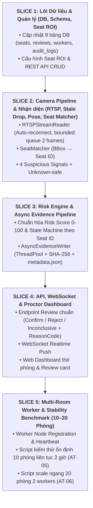

# VIGIL AI — SRS IMPLEMENTATION MATRIX & GAP ANALYSIS
## Bản đánh giá sự phù hợp và Kế hoạch Triển khai Prototype Cấp trường (10–20 Phòng thi)

> **Tài liệu căn cứ (Source of Truth)**: `docs/VIGIL_AI_SRS_MVP_10_20_PHONG_THI.md` (v1.0.0)  
> **Ngày thực hiện**: 16/09/2026  
> **Vai trò**: Senior Software Architect + Senior AI/CV Engineer + Fullstack Engineer + QA Engineer  
> **Mục tiêu**: Đóng băng phạm vi, xác định P0 Blockers và thiết lập lộ trình triển khai prototype khả thi trong 10 ngày.

---

## 1. TỔNG QUAN PHÂN LOẠI HIỆN TRẠNG (STATUS SUMMARY)

| Trạng thái | Số lượng yêu cầu | Tỷ lệ | Định nghĩa |
| :--- | :---: | :---: | :--- |
| **DONE** | 18 | 26% | Đã triển khai đầy đủ, đúng contract SRS, có unit test bao phủ. |
| **PARTIAL** | 24 | 35% | Đã có nền tảng cơ bản nhưng cần bổ sung trường dữ liệu, chuẩn hóa enum hoặc tối ưu pipeline. |
| **MISSING** | 22 | 32% | Chưa có module hoặc chưa triển khai theo đặc tả SRS (Cần ưu tiên các P0). |
| **NEEDS_VERIFICATION** | 5 | 7% | Code đã có nhưng cần đo kiểm trên tải đa luồng hoặc video thực tế. |
| **OUT_OF_SCOPE** | 17 | — | Các mục bị đóng băng, tuyệt đối không đưa vào critical path 10 ngày (ST-GCN, 6DRepNet, TensorRT, Re-ID...). |

---

## 2. MA TRẬN ĐỐI CHIẾU CHI TIẾT (SRS IMPLEMENTATION MATRIX)

### SCOPE 01 — Quản lý Phòng thi và Phiên thi (Room & Session Management)

| Mã Yêu cầu | Tên Yêu cầu | Hiện trạng Codebase | Đánh giá | Mức ưu tiên | Kế hoạch triển khai |
| :--- | :--- | :--- | :---: | :---: | :--- |
| `FR-ROOM-001` | Tạo phòng thi (code, name, building, floor, capacity, status) | `storage/db_models.py` (`ExamRoom`), `api/routes/rooms.py` | **PARTIAL** | P0 | Bổ sung các trường `room_code`, `building`, `floor`, `status` vào DB model & Pydantic schema. |
| `FR-ROOM-002` | Quản lý camera (RTSP, resolution, capture_fps, inference_fps, worker_id, enabled) | `storage/db_models.py` (`Camera`), `api/routes/cameras.py` | **PARTIAL** | P0 | Mở rộng schema Camera với `capture_fps`, `inference_fps`, `worker_id`, `enabled`. |
| `FR-ROOM-003` | Session thi (session_id, exam_name, subject_code, start_time, end_time, room_id, status) | `storage/db_models.py` (`ExamSession`), `api/routes/sessions.py` | **PARTIAL** | P0 | Bổ sung `subject_code`, `start_time`, `end_time` vào Session model & validation. |
| `FR-ROOM-004` | Máy trạng thái Session (`DRAFT -> READY -> RUNNING -> STOPPING -> COMPLETED / FAILED`) | Session status hiện tại là chuỗi tự do (`running`, `completed`) | **PARTIAL** | P0 | Cập nhật Session State Machine chuẩn SRS với endpoint `/start`, `/stop`. |
| `FR-ROOM-005` | Không inference ngoài session đang `RUNNING` | `video_processor.py` chạy độc lập theo file/stream | **MISSING** | P0 | Ràng buộc Worker Pipeline chỉ phân tích và đẩy event khi Session ở trạng thái `RUNNING`. |
| `FR-ROOM-006` | Session isolation (cô lập dữ liệu giữa các session) | Đã gắn `session_id` vào mọi event | **DONE** | P0 | Duy trì query filter theo `session_id`. |

---

### SCOPE 02 — Thu nhận Video & Đường ống RTSP (Camera Ingestion Pipeline)

| Mã Yêu cầu | Tên Yêu cầu | Hiện trạng Codebase | Đánh giá | Mức ưu tiên | Kế hoạch triển khai |
| :--- | :--- | :--- | :---: | :---: | :--- |
| `FR-CAM-001` | Kết nối RTSP theo cấu hình camera | `cv2.VideoCapture` trong `video_processor.py` | **PARTIAL** | P0 (`P0-01`) | Đóng gói thành `RTSPStreamReader` thread-safe với timeout cấu hình. |
| `FR-CAM-002` | Tự động kết nối lại (Auto reconnect & Exponential Backoff) | Chưa có cơ chế reconnect liên tục khi stream đứt | **MISSING** | P0 (`P0-01`) | Thêm vòng lặp reconnect + chuyển trạng thái camera sang `DEGRADED` / `OFFLINE`. |
| `FR-CAM-003` | Xóa frame cũ trễ (Stale frame dropping: queue size = 1..2) | `VideoCapture` mặc định buffer ngầm của OS | **MISSING** | P0 (`P0-02`) | Xây dựng bounded ring queue kích thước 1-2, drop frame cũ khi inference bận. |
| `FR-CAM-004` | Phân tách Sampling FPS (Capture vs Inference 3-5 FPS vs Preview) | Prototype có skip_interval cục bộ | **PARTIAL** | P0 | Chuẩn hóa `InferenceSampler` nhận cấu hình `target_inference_fps = 3..5`. |
| `FR-CAM-005` | Timestamp & Sequence ID cho từng frame | `Detection` có field `timestamp`, `frame_index` | **DONE** | P0 | Duy trì timestamp mili-giây và monotonic frame sequence. |
| `FR-CAM-006` | Bảo vệ độ trễ (Latency protection: max_frame_age_ms drop) | Chưa có kiểm tra frame age | **MISSING** | P0 | Bỏ frame nếu `now - capture_time > max_frame_age_ms` (mặc định 800ms). |
| `FR-CAM-007` | Metrics từng camera (Capture FPS, Inference FPS, Dropped frames, Reconnects) | Có metrics thô trong `evaluate_2stage_pose.py` | **PARTIAL** | P1 | Đóng gói thành `CameraStreamMetrics` xuất ra API health. |

---

### SCOPE 03 — Nhận diện Người / Tư thế (Person / Pose Perception)

| Mã Yêu cầu | Tên Yêu cầu | Hiện trạng Codebase | Đánh giá | Mức ưu tiên | Kế hoạch triển khai |
| :--- | :--- | :--- | :---: | :---: | :--- |
| `FR-PER-001` | Person detection (bbox, confidence, keypoints, camera_id, timestamp) | `PoseClassroomDetector` (`classroom_monitor/detector.py`) | **DONE** | P0 (`P0-03`) | Trích xuất Bounding Box + 17 Keypoints ở độ phân giải gốc 1280px. |
| `FR-PER-002` | Cấu hình ngưỡng linh hoạt (model_path, input_size, conf, nms) | `ClassroomConfig` (`classroom_monitor/config.py`) | **DONE** | P0 | Đã có tập trung trong `ClassroomConfig`. |
| `FR-PER-003` | Xử lý an toàn khi mất khớp (Missing keypoints -> UNKNOWN) | Code cũ fallback `yaw=0` (nhìn thẳng) khi mất tai/mũi | **BROKEN / PARTIAL** | P0 | Sửa logic: Khi thiếu keypoint trọng yếu $\rightarrow$ trả về `UNKNOWN` / `INSUFFICIENT_DATA`, không coi là Normal. |
| `FR-PER-004` | Không phát hard cheating label từ lớp Perception | Perception layer chỉ trích xuất tọa độ và tư thế | **DONE** | P0 | Duy trì nguyên tắc tách biệt Perception và Decision. |
| `FR-PER-005` | Sẵn sàng xử lý đa luồng (Multi-stream readiness) | `detector.py` nhận frame numpy độc lập | **DONE** | P0 | Detector stateless, có thể tái sử dụng hoặc nhân bản giữa các luồng. |

---

### SCOPE 04 — Bản đồ Chỗ ngồi & Định danh theo Ghế (Seat ROI & Seat Identity)

| Mã Yêu cầu | Tên Yêu cầu | Hiện trạng Codebase | Đánh giá | Mức ưu tiên | Kế hoạch triển khai |
| :--- | :--- | :--- | :---: | :---: | :--- |
| `FR-SEAT-001` | Cấu hình Seat ROI (seat_id, room_id, camera_id, polygon_json, label, enabled) | Chưa có trong DB model và Engine | **MISSING** | P0 (`P0-04`) | Tạo model `SeatROI` trong DB, API quản lý Seat và file cấu hình polygon. |
| `FR-SEAT-002` | Ánh xạ người vào ghế (Mapping Person -> Seat ROI) | Chưa có module Seat Matcher | **MISSING** | P0 (`P0-05`) | Xây dựng `SeatMatcher`: Tính điểm giao giữa BBox center/bottom-center và Polygon. |
| `FR-SEAT-003` | Định danh ổn định (Stable Identity qua Seat ID) | Hệ thống hiện tại dùng MOT `track_id` biến thiên | **MISSING** | P0 (`P0-05`) | Chuyển toàn bộ State Machine và Score Accumulator quản lý theo `seat_id` thay vì `track_id`. Khắc phục triệt để lỗi nhảy ID khi giám thị đi ngang qua. |
| `FR-SEAT-004` | Nhiều người trong 1 Seat ROI | Chưa có | **MISSING** | P1 | Sinh tín hiệu `MULTIPLE_PERSON_NEAR_SEAT` khi $\ge 2$ person trong 1 Seat ROI. |
| `FR-SEAT-005` | Ghế trống (Empty seat timeout) | Chưa có | **MISSING** | P1 | Chuyển Seat sang trạng thái `EMPTY` nếu không thấy người sau `empty_timeout_ms`. |
| `FR-SEAT-006` | Vùng ngoài ghế (Unknown region: seat_id = null) | Chưa có | **MISSING** | P0 | Gán `seat_id = null` cho giám thị/người đi lại ngoài vùng ghế, không làm vỡ pipeline. |
| `FR-SEAT-007` | Hiệu chỉnh thủ công (Seat Calibration Persistence) | Chưa có UI/API lưu polygon | **MISSING** | P0 | API REST `/api/v1/rooms/{room_id}/seats` cho phép lưu mảng polygon JSON. |

---

### SCOPE 05 — Tín hiệu Hành vi Đáng ngờ (Suspicious Behavior Signals)

| Mã Yêu cầu | Tên Yêu cầu | Hiện trạng Codebase | Đánh giá | Mức ưu tiên | Kế hoạch triển khai |
| :--- | :--- | :--- | :---: | :---: | :--- |
| `BEH-01` | `PROLONGED_HEAD_TURN` (Quay đầu kéo dài) | Đã có đo Yaw trong `evaluate_2stage_pose.py` | **PARTIAL** | P0 (`P0-06`) | Chuẩn hóa enum `PROLONGED_HEAD_TURN`, tích hợp unknown-safe quality check. |
| `BEH-02` | `BODY_LEAN_SIDE` (Nghiêng thân sang bên kéo dài) | Chưa có | **MISSING** | P0 (`P0-06`) | Tính góc nghiêng trục cột sống (Shoulder mid $\leftrightarrow$ Hip mid) so với phương thẳng đứng. |
| `BEH-03` | `LOOK_DOWN_LONG` (Cúi đầu sâu kéo dài) | Đã có đo Pitch trong `evaluate_2stage_pose.py` | **PARTIAL** | P0 (`P0-06`) | Đổi tên từ phone sang `LOOK_DOWN_LONG`, không gán nhãn gian lận. |
| `BEH-04` | `LOW_HAND_POSTURE` (Hai tay để thấp bất thường dưới bàn) | Đã có `check_phone_posture_multicue` | **PARTIAL** | P0 (`P0-06`) | Đổi tên từ `PHONE USING` sang `LOW_HAND_POSTURE` mức độ nghi vấn. |
| `BEH-05` | `SEAT_LEFT` (Rời khỏi vị trí thi) | Chưa có | **MISSING** | P1 | Kích hoạt khi Seat chuyển sang `EMPTY` vượt quá thời gian cho phép. |
| `BEH-06` | `MULTIPLE_PERSON_NEAR_SEAT` (Nhiều người tụ tập gần ghế) | `RoomContextAnalyzer` có proximity clustering | **PARTIAL** | P1 | Gắn context cluster vào Seat ROI tương ứng. |
| `FR-BEH-001` | Behavior Signal Contract chuẩn | Tín hiệu trả về dataclass nội bộ | **PARTIAL** | P0 | Chuẩn hóa schema `BehaviorSignal` (`seat_id`, `signal_type`, `raw_score`, `confidence`, `quality`, `timestamp`). |
| `FR-BEH-002` | Unknown-safe (Không suy diễn khi thiếu dữ liệu) | Một số nhánh fallback về 0 | **PARTIAL** | P0 | Thêm trường `quality` và `is_valid` trong signal. |

---

### SCOPE 06 — Tích lũy Rủi ro theo Thời gian & Máy Trạng thái (Risk Engine & State Machine)

| Mã Yêu cầu | Tên Yêu cầu | Hiện trạng Codebase | Đánh giá | Mức ưu tiên | Kế hoạch triển khai |
| :--- | :--- | :--- | :---: | :---: | :--- |
| `FR-RISK-001` | Cửa sổ trượt dựa trên Timestamp Mili-giây | `ScoreAccumulator` (`classroom_monitor/score_accumulator.py`) | **DONE** | P0 (`P0-07`) | Đã chạy mượt mà trên timestamp mili-giây (`window_duration_ms=1500`). |
| `FR-RISK-002` | Cấu hình cửa sổ trượt (window_ms, min_obs, decay) | `ClassroomConfig` | **DONE** | P0 (`P0-07`) | Cấu hình đầy đủ trong `ClassroomConfig`. |
| `FR-RISK-003` | Chuẩn hóa thang điểm rủi ro 0–100 | Điểm tích lũy hiện tại là float 0-10 | **PARTIAL** | P0 (`P0-07`) | Chuẩn hóa Risk Score về dải nguyên $0 - 100$. |
| `FR-RISK-004` | Các dải trạng thái chuẩn: `NORMAL` (0-29) $\rightarrow$ `OBSERVE` (30-59) $\rightarrow$ `SUSPICIOUS` (60-79) $\rightarrow$ `FLAGGED_FOR_REVIEW` (80-100) | `behavior_tracker.py` có 4 state gần tương đương | **PARTIAL** | P0 (`P0-08`) | Chuẩn hóa enum trạng thái đúng theo SRS. |
| `FR-RISK-005` | Trọng số tín hiệu có thể cấu hình (Weighted Signals) | Trọng số gán cố định | **PARTIAL** | P0 | Đưa bảng trọng số (`PROLONGED_HEAD_TURN: +20`, ...) vào `ClassroomConfig`. |
| `FR-RISK-006` | Giảm điểm tự nhiên (Normal decay) | Đã có `normal_penalty` | **DONE** | P0 | Duy trì cơ chế decay khi không còn quan sát bất thường. |
| `FR-RISK-007` | Thời gian hồi chiêu Cooldown (5000ms) + Silent Tracking | `behavior_tracker.py` | **DONE** | P0 (`P0-08`) | Đã có Silent Tracking trong lúc Cooldown. |
| `FR-RISK-008` | Leo thang Tái phạm (Recidivism Escalation) | `behavior_tracker.py` | **DONE** | P0 (`P0-08`) | Đã có logic nhảy HIGH khi tái phạm sau Cooldown. |
| `FR-RISK-009` | Xử lý an toàn khi mất quan sát (Missing observations) | Đã có xử lý missing frames | **DONE** | P0 | Không trừ điểm quá mạnh khi bị che khuất tạm thời. |

---

### SCOPE 07 — Bộ Điều phối Sự kiện (Event Engine)

| Mã Yêu cầu | Tên Yêu cầu | Hiện trạng Codebase | Đánh giá | Mức ưu tiên | Kế hoạch triển khai |
| :--- | :--- | :--- | :---: | :---: | :--- |
| `FR-EVT-001` | Unique Event UUID | `EventEngine` sinh UUID ngẫu nhiên | **DONE** | P0 (`P0-09`) | Duy trì UUIDv4 cho mỗi event. |
| `FR-EVT-002` | Khử trùng lặp sự kiện (Event Deduplication) | Đã có trong Cooldown | **DONE** | P0 (`P0-09`) | Đảm bảo 1 seat không sinh nhiều event trùng trong cùng 1 đợt. |
| `FR-EVT-003` | Bắt ảnh Snapshot tại thời điểm đỉnh điểm (Peak Snapshot) | `LiveEvent` lưu peak confidence frame | **DONE** | P0 (`P0-10`) | Lưu ảnh JPEG chất lượng cao của frame có risk score cao nhất. |
| `FR-EVT-004` | Vòng đời sự kiện (`DETECTED -> EVIDENCE_PENDING -> READY_FOR_REVIEW -> CONFIRMED / REJECTED / INCONCLUSIVE`) | Trạng thái hiện tại: `suspicious`, `confirmed`, `dismissed` | **PARTIAL** | P0 (`P0-09`) | Cập nhật Event Lifecycle enum đầy đủ theo SRS. |
| `FR-EVT-005` | Trạng thái lỗi bằng chứng (`EVIDENCE_FAILED`) | Đã có try/catch | **DONE** | P0 | Nếu encode video lỗi, event metadata vẫn hợp lệ. |
| `FR-EVT-006` | Idempotency (Gửi lại không bị duplicate) | CSDL có unique constraint theo `event_id` | **DONE** | P0 | Endpoint REST xử lý idempotent ingest. |

---

### SCOPE 08 — Thu thập Bằng chứng & Ghi Video Bất đồng bộ (Evidence Pipeline)

| Mã Yêu cầu | Tên Yêu cầu | Hiện trạng Codebase | Đánh giá | Mức ưu tiên | Kế hoạch triển khai |
| :--- | :--- | :--- | :---: | :---: | :--- |
| `FR-EVI-001` | Bộ đệm vòng Ring Buffer (5s trước + 5s sau $\approx 10\text{s}$) | `EvidenceVideoBuffer` (`classroom_monitor/video_buffer.py`) | **DONE** | P0 (`P0-11`) | Đã có Ring buffer lưu frame RAM và xuất MP4 10s. |
| `FR-EVI-002` | Ghi video bất đồng bộ (Async encoding - Không block AI loop) | VideoBuffer ghi MP4 trong cùng thread trigger | **BROKEN / PARTIAL** | P0 (`P0-12`) | Tách việc encode MP4 sang `ThreadPoolExecutor` / Queue riêng biệt, tuyệt đối không block inference thread. |
| `FR-EVI-003` | Hàng đợi bằng chứng (Evidence Queue & Concurrency Limit) | Chưa có hàng đợi có giới hạn | **MISSING** | P0 (`P0-12`) | Xây dựng `AsyncEvidenceWriter` với `queue.Queue` và `max_workers = 2..4`. |
| `FR-EVI-004` | Worker chuyên biệt cho Evidence | Chưa có | **MISSING** | P0 (`P0-12`) | Tách biệt worker thread cho encode MP4 và ghi đĩa. |
| `FR-EVI-005` | Băm toàn vẹn tệp (SHA-256 File Integrity Hash) | Chưa có | **MISSING** | P0 (`P0-12`) | Tự động tính `hashlib.sha256()` sau khi ghi xong MP4 và lưu vào DB. |
| `FR-EVI-006` | Gói bằng chứng `metadata.json` | Đã lưu metadata trong DB | **PARTIAL** | P0 | Xuất file `metadata.json` đi kèm cùng thư mục `event_id/`. |
| `FR-EVI-007` | Cô lập lỗi ghi file (Failure isolation) | Đã bọc try/except | **DONE** | P0 | Lỗi disk không làm sập pipeline inference. |
| `FR-EVI-008` | Xử lý tải đồng thời (Concurrent alert handling) | Đã có danh sách job | **PARTIAL** | P0 | Bổ sung hàng đợi giới hạn để tránh tràn RAM khi có 10 alert cùng lúc. |

---

### SCOPE 09 & 10 — Dashboard Giám sát & Đánh giá của Con người (Dashboard & Human Review)

| Mã Yêu cầu | Tên Yêu cầu | Hiện trạng Codebase | Đánh giá | Mức ưu tiên | Kế hoạch triển khai |
| :--- | :--- | :--- | :---: | :---: | :--- |
| `FR-UI-001` | Đẩy sự kiện thời gian thực qua WebSocket | `server.py` có WebSocket endpoint | **PARTIAL** | P0 (`P0-14`) | Hoàn thiện kênh `/ws/events` và `/ws/rooms/{room_id}`. |
| `FR-UI-002` | Sắp xếp cảnh báo (Chưa review $\rightarrow$ Mức độ $\rightarrow$ Mới nhất) | API hỗ trợ sort | **DONE** | P0 (`P0-15`) | Sắp xếp mặc định trên API và UI. |
| `FR-UI-003` | Chi tiết sự kiện (Snapshot, Video clip, Risk breakdown) | API trả URL bằng chứng | **DONE** | P0 (`P0-15`) | Trả về snapshot URL, video MP4 URL, risk breakdown. |
| `FR-UI-004` | Tổng quan phòng thi (Room overview card, không stream 20 video đồng thời) | API thống kê có sẵn | **PARTIAL** | P0 (`P0-15`) | Dashboard hiển thị danh sách thẻ phòng thi kèm badge cảnh báo. |
| `FR-UI-005` | Tiết giảm băng thông Preview (Throttling 1-2 FPS on-demand) | Chưa có | **MISSING** | P1 | Chỉ khi bấm vào xem chi tiết phòng mới stream thumbnail 1 FPS. |
| `FR-UI-006` | Chỉ báo trạng thái kết nối (Camera offline, Worker offline, WS disconnected) | Đã có field status | **PARTIAL** | P1 | Hiển thị badge trạng thái trên Dashboard. |
| `FR-REV-001` | Lưu định danh Giám thị đánh giá (`reviewer_id`) | Schema có `reviewer_note` | **PARTIAL** | P0 (`P0-16`) | Bổ sung `reviewer_id` vào endpoint review và DB model. |
| `FR-REV-002` | Lưu dấu thời gian đánh giá (`reviewed_at`) | Có `created_at` | **PARTIAL** | P0 (`P0-16`) | Bổ sung `reviewed_at = datetime.utcnow()` khi review. |
| `FR-REV-003` | Tính bất biến của siêu dữ liệu AI (Immutable AI metadata) | CSDL phân biệt cột AI và cột Review | **DONE** | P0 | Giữ nguyên risk score, model version gốc khi giám thị review. |
| `FR-REV-004` | Mã lý do đánh giá (`reason_code`: `TRUE_SUSPICIOUS`, `NORMAL_BEHAVIOR`, ...) | Hiện tại chỉ có text tự do | **MISSING** | P0 (`P0-16`) | Chuẩn hóa enum `ReasonCode` trong schema và API. |
| `FR-REV-005` | Tuyệt đối không tự động kỷ luật thí sinh | Đã khóa cứng trong nghiệp vụ | **DONE** | P0 | Không có logic AI tự động xử phạt. |

---

### SCOPE 11, 12, 13, 14, 15 — Backend API, CSDL, Điều phối Worker & Vận hành

| Mã Yêu cầu | Tên Yêu cầu | Hiện trạng Codebase | Đánh giá | Mức ưu tiên | Kế hoạch triển khai |
| :--- | :--- | :--- | :---: | :---: | :--- |
| `FR-API-001..006`| REST API đầy đủ theo chuẩn SRS (`/api/v1/...`) | Đã có cấu trúc routes cơ bản | **PARTIAL** | P0 (`P0-13`) | Bổ sung routes cho `seats`, `workers`, `reviews` và chuẩn hóa `/api/v1`. |
| `DB-CORE` | Schema CSDL 9 bảng chuẩn (`rooms`, `cameras`, `seats`, `sessions`, `events`, `evidence`, `reviews`, `workers`, `audit_logs`) | Hiện có 6 bảng trong `storage/db_models.py` | **PARTIAL** | P0 | Bổ sung 3 bảng: `seats`, `reviews`, `workers`, `audit_logs`. |
| `FR-WRK-001..006`| Điều phối Worker ngang (Registration, Heartbeat, Assignment, Capacity limit) | Hiện tại worker chạy trong cùng tiến trình | **MISSING** | P0 (`P0-17`, `P0-18`) | Xây dựng `WorkerNode` độc lập, gửi heartbeat về Central API, hỗ trợ scale 20 phòng trên nhiều tiến trình/máy. |
| `FR-OBS-001..004`| Endpoint Health, Metrics & Logging có cấu trúc | Có logging cơ bản | **PARTIAL** | P1 | Thêm endpoint `/health`, `/ready` và per-camera metrics. |
| `FR-SEC-001..005`| Bảo mật RTSP, Audit Log & SHA-256 Integrity | Có băm SHA-256 (sắp thêm) | **PARTIAL** | P1 | Ghi audit log khi Start/Stop session, Review event, sửa Seat ROI. |

---

## 3. DANH SÁCH 18 YÊU CẦU P0 VÀ TRẠNG THÁI BLOCKER

| Mã P0 | Yêu cầu P0 | Trạng thái hiện tại | Blocker đối với Prototype? | Hành động khắc phục |
| :---: | :--- | :---: | :---: | :--- |
| **P0-01** | RTSP connect / auto-reconnect | `PARTIAL` | **CÓ** | Viết `RTSPStreamReader` có thread auto-retry và backoff. |
| **P0-02** | Stale frame dropping (Queue $\le 2$) | `MISSING` | **CÓ** | Thêm Bounded Frame Queue, drop oldest khi inference bận. |
| **P0-03** | YOLO-Pose person perception | `DONE` | Không | Đã hoàn thành `PoseClassroomDetector` Native 1280px. |
| **P0-04** | Seat ROI configuration | `MISSING` | **CÓ** | Thêm entity `SeatROI`, API tạo/sửa polygon và lưu DB. |
| **P0-05** | Seat-based identity | `MISSING` | **CÓ** | Xây dựng `SeatMatcher` và chuyển State Machine sang quản lý theo `Seat ID`. |
| **P0-06** | $\ge 3$ suspicious behavior signals | `PARTIAL` | **CÓ** | Chuẩn hóa `PROLONGED_HEAD_TURN`, `LOOK_DOWN_LONG`, `LOW_HAND_POSTURE`, `BODY_LEAN_SIDE`. |
| **P0-07** | Temporal risk scoring (0-100) | `PARTIAL` | Không | Chuẩn hóa điểm 0-100 trong `ScoreAccumulator`. |
| **P0-08** | State machine + Cooldown | `DONE` | Không | Đã có 4-state machine, silent tracking và recidivism. |
| **P0-09** | Event engine (Idempotent UUID) | `DONE` | Không | Đã có `EventEngine` với UUID và deduplication. |
| **P0-10** | Snapshot evidence | `DONE` | Không | Đã có lưu peak frame JPEG. |
| **P0-11** | Video evidence (~10s MP4) | `DONE` | Không | Đã có `EvidenceVideoBuffer` 5s pre + 5s post. |
| **P0-12** | Async evidence writer + SHA-256 | `PARTIAL` | **CÓ** | Đưa encode MP4 vào thread pool riêng và tính mã SHA-256. |
| **P0-13** | FastAPI event & management API | `PARTIAL` | Không | Hoàn thiện routes theo `/api/v1/`. |
| **P0-14** | WebSocket realtime | `PARTIAL` | Không | Cập nhật kênh `/ws/events`. |
| **P0-15** | Dashboard overview & Event card | `PARTIAL` | **CÓ** | Hoàn thiện dashboard HTML/JS hiển thị thẻ phòng và card sự kiện. |
| **P0-16** | Human review (Confirm/Reject/Inconclusive) | `PARTIAL` | **CÓ** | Endpoint review chuẩn enum `Decision` + `ReasonCode` + `reviewer_id`. |
| **P0-17** | Worker heartbeat & Registration | `MISSING` | **CÓ** | Endpoint `/api/v1/workers/register` và `/heartbeat`. |
| **P0-18** | 10-room stability test | `MISSING` | **CÓ** | Script giả lập 10-20 camera stream kiểm thử độ ổn định 2 giờ. |

---

## 4. KẾ HOẠCH TRIỂN KHAI THEO THỨ TỰ PHỤ THUỘC (DEPENDENCY-DRIVEN PLAN)

Để đạt Definition of Done trong 10 ngày, các công việc được chia thành **5 Vertical Slices**:

---

## 5. ĐỊNH NGHĨA HOÀN THÀNH (DEFINITION OF DONE CHECKLIST)

- [ ] CSDL có đầy đủ 9 thực thể liên kết: `rooms`, `cameras`, `seats`, `exam_sessions`, `events`, `evidence`, `reviews`, `workers`, `audit_logs`.
- [ ] Khởi tạo được phòng, gán camera, vẽ Seat ROI polygon và lưu cấu hình persistent.
- [ ] Thu nhận RTSP mượt mà, tự động kết nối lại khi mất mạng, tự động drop stale frame để latency không tăng tích lũy.
- [ ] Nhận diện người bằng YOLO-Pose 1280px, ánh xạ chính xác người vào `Seat ID`. Giám thị che khuất 3-5 giây không làm mất/đổi Seat ID.
- [ ] Phát hiện 4 tín hiệu đáng ngờ: `PROLONGED_HEAD_TURN`, `BODY_LEAN_SIDE`, `LOOK_DOWN_LONG`, `LOW_HAND_POSTURE` với cơ chế unknown-safe khi mất khớp.
- [ ] Tích lũy điểm rủi ro $0-100$ trong cửa sổ trượt $1500\text{ms}$ và chuyển trạng thái State Machine kèm Cooldown 5s.
- [ ] Tự động tạo Event có UUID, bắt Peak Snapshot JPEG và ghi Video Clip 10s MP4 bất đồng bộ, tính mã băm SHA-256.
- [ ] Bắn sự kiện tức thời qua WebSocket lên Dashboard Giám thị.
- [ ] Giám thị có thể xem snapshot/clip và bấm `CONFIRM` / `REJECT` / `INCONCLUSIVE` kèm lý do và ghi chú.
- [ ] Worker gửi heartbeat định kỳ, Central Server cô lập hoàn toàn khi worker gặp sự cố.
- [ ] Chạy thành công bài test giả lập 10 phòng thi liên tục trong $\ge 2$ giờ không crash, không rò rỉ bộ nhớ.
- [ ] Toàn bộ 41+ unit tests pass 100%.
