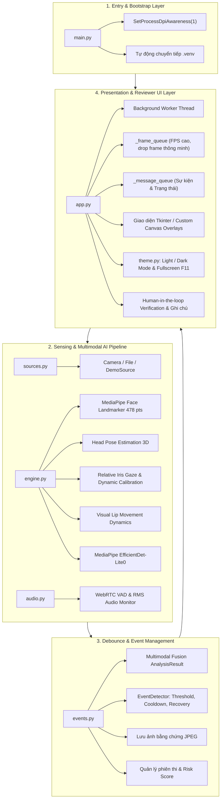

# BÁO CÁO KHẢO SÁT TOÀN DIỆN CODEBASE DỰ ÁN VIGIL AI
## HỆ THỐNG GIÁM SÁT THI TRỰC TUYẾN TỰ ĐỘNG (AI EXAM MONITORING)

**Tên dự án:** VIGIL AI — Local Exam Monitoring MVP  
**Workspace:** `H:\Code\MingKingLaser\laser_eyes`  
**Ngày lập báo cáo:** 24/08/2026  
**Trạng thái hệ thống:** Sẵn sàng vận hành (Production-ready Desktop MVP)

---

## 1. TỔNG QUAN DỰ ÁN & KIẾN TRÚC HỆ THỐNG

### 1.1. Giới thiệu dự án
**VIGIL AI** là hệ thống giám sát thi trực tuyến (Online Exam Proctoring / Cheating Detection) chạy cục bộ (On-device / Edge AI), hoạt động không cần kết nối Internet, đảm bảo 100% tính riêng tư dữ liệu sinh trắc học của thí sinh. Hệ thống kết hợp đa phương thức (Multimodal AI) gồm thị giác máy tính (Computer Vision) và xử lý âm thanh thời gian thực (Acoustic Processing) để phát hiện và cảnh báo các hành vi gian lận thi cử một cách tự động, chính xác và có thể kiểm chứng (Human-in-the-loop).

### 1.2. Cấu trúc thư mục dự án
```text
laser_eyes/
├── main.py                     # Entry point chính của ứng dụng
├── eyes.py                     # Tiện ích minh họa ASCII 3D torus animation
├── requirements.txt            # Danh sách thư viện phụ thuộc
├── setup_env.bat               # Script khởi tạo venv Python 3.12 và cài đặt thư viện
├── run_app.bat                 # Script chạy ứng dụng giao diện chính
├── run_demo.bat                # Script mở thẳng ứng dụng ở chế độ mô phỏng (Demo mode)
├── README.md                   # Tài liệu hướng dẫn sử dụng và giới thiệu MVP
├── .gitignore                  # Cấu hình bỏ qua tệp/thư mục dữ liệu, cache và reports/
│
├── exam_monitor/               # Gói mã nguồn chính của hệ thống giám sát
│   ├── __init__.py
│   ├── app.py                  # Giao diện người dùng Tkinter và bộ điều phối phiên thi
│   ├── engine.py               # Pipeline thị giác máy tính, MediaPipe, Gaze, Head Pose, Overlays
│   ├── audio.py                # Xử lý âm thanh thời gian thực, WebRTC VAD, xác thực giọng nói
│   ├── events.py               # Engine sinh sự kiện, debounce, chống spam cảnh báo, SessionStore
│   ├── models.py               # Data models (AnalysisResult, MonitoringEvent, SessionInfo, Enums)
│   ├── sources.py              # Xử lý luồng đầu vào: Camera trực tiếp, File Video, Kịch bản Demo
│   ├── theme.py                # Định nghĩa bảng màu (Light / Dark) và font chữ chuẩn
│   └── assets/                 # Thư mục lưu trữ model AI chạy offline
│       ├── face_landmarker.task      # MediaPipe Face Landmarker model bundle (478 keypoints 3D)
│       └── efficientdet_lite0.tflite # MediaPipe Object Detector model (EfficientDet-Lite0)
│
├── data/                       # Dữ liệu cục bộ sinh ra trong quá trình vận hành
│   ├── settings.json           # Cấu hình giao diện và ngưỡng thời gian phát hiện
│   ├── sessions/               # Lưu metadata và danh sách vi phạm của từng phiên thi (.json)
│   └── evidence/               # Lưu ảnh chụp bằng chứng vi phạm thời gian thực (.jpg)
│
├── reports/                    # Báo cáo kỹ thuật và khảo sát dự án (đã gitignore)
│   └── codebase_exploration_report.md
│
└── tests/
    └── test_core.py            # Toàn bộ Unit Test kiểm thử logic nghiệp vụ và thuật toán AI
```

### 1.3. Kiến trúc phân lớp (Layered Architecture)
Hệ thống tuân thủ kiến trúc **Modular Desktop Architecture** phân tách rõ ràng các tầng trách nhiệm:



---

## 2. CÔNG NGHỆ VÀ THƯ VIỆN SỬ DỤNG

| Lĩnh vực | Thư viện / Công nghệ | Vai trò & Mục đích sử dụng |
|---|---|---|
| **Ngôn ngữ & Môi trường** | Python 3.12 (64-bit), Windows Batch | Nền tảng thực thi chính, tối ưu hóa trên hệ điều hành Windows |
| **Giao diện Desktop** | `tkinter`, `ttk`, `Pillow (PIL)` | Xây dựng GUI hiện đại, mượt mà, hỗ trợ giao diện Sáng/Tối, render video thời gian thực với bộ lọc LANCZOS, phím tắt F11 |
| **Thị giác máy tính (CV)** | `opencv-python (cv2)` | Thu thập video, tiền xử lý (lật gương, chuẩn hóa kích thước), giải thuật PnP (`cv2.solvePnP`, `cv2.Rodrigues`), vẽ lớp phủ trực quan |
| **Mô hình AI On-device** | `mediapipe` (Tasks Vision API) | Chạy 2 mô hình cục bộ offline: **Face Landmarker** (478 điểm mốc 3D) và **ObjectDetector** (EfficientDet-Lite0) |
| **Tính toán ma trận & Tín hiệu** | `numpy` | Thao tác vector, tính tỷ lệ mống mắt, hình chiếu vô hướng, tích chập (1D convolution) làm mượt chuỗi mở môi, phân vị thống kê |
| **Xử lý âm thanh & VAD** | `sounddevice`, `webrtcvad` | Thu âm micro 16kHz, phân tích mức âm lượng RMS (dB) và phân loại tiếng nói người (Voice Activity Detection) |
| **Lưu trữ & Dữ liệu** | `json`, `csv`, `pathlib` | Quản lý phiên thi, cài đặt hệ thống, xuất báo cáo CSV chuẩn UTF-8-BOM và lưu ảnh bằng chứng JPEG |

---

## 3. PHÂN TÍCH CHI TIẾT CÁC THUẬT TOÁN PHÁT HIỆN GIAN LẬN

### 3.1. Theo dõi ánh nhìn (Relative Gaze Tracking & Dynamic Calibration)
* **Trích xuất điểm mốc mống mắt (Iris Keypoints)**:
  * Sử dụng 478 điểm mốc từ MediaPipe Face Mesh.
  * Mắt trái: Tâm mống mắt `#468`, khóe trong `#33`, khóe ngoài `#133`, mí trên `#159`, mí dưới `#145`.
  * Mắt phải: Tâm mống mắt `#473`, khóe trong `#362`, khóe ngoài `#263`, mí trên `#386`, mí dưới `#374`.
  * Tính tọa độ tương đối của mống mắt bằng hình chiếu vô hướng vector lên trục khóe mắt và trục mí mắt.
* **Hiệu chuẩn động cá nhân hóa (Personalized Calibration)**:
  * Thu thập 36 mẫu trung tính khi thí sinh nhìn thẳng vào màn hình (`|yaw| < 13°`, `|pitch| < 11°`).
  * Xác định gốc tọa độ mắt chuẩn `(baseline_x, baseline_y)` bằng trung vị (`np.median`), loại bỏ sai số do góc đặt camera hoặc dáng mắt riêng.
* **Vùng an toàn hình Ellipse (Safe Ellipse Zone)**:
  * Tín hiệu được làm mượt qua bộ lọc EMA: `smooth = smooth * 0.72 + centered * 0.28`.
  * Điểm số vùng mắt: `score = sqrt((x / 0.30)^2 + (y / 0.34)^2)`.
  * Khi `score > 1.0`, mắt bị xác định là nhìn ra ngoài màn hình thi.
  * **Điểm ưu việt**: Tách biệt hoàn toàn góc quay đầu và hướng mắt, phát hiện chính xác trường hợp giữ thẳng đầu nhưng liếc mắt sang hai bên để xem tài liệu.

### 3.2. Ước lượng tư thế đầu 3D (3D Head Pose Estimation)
* **Khớp mô hình hình học 3D chuẩn**:
  * Sử dụng 6 điểm mốc khuôn mặt: Chóp mũi (`#1`), Cằm (`#152`), Khóe mắt trái (`#33`), Khóe mắt phải (`#263`), Mép miệng trái (`#61`), Mép miệng phải (`#291`).
  * Giả định ma trận camera nội tại với tiêu cự `focal_length = width`.
  * Giải bài toán phối cảnh n điểm bằng `cv2.solvePnP`, phân rã ma trận xoay bằng `cv2.Rodrigues` và `cv2.RQDecomp3x3`.
  * Thu được 3 góc Euler: **Yaw** (quay trái/phải), **Pitch** (cúi/ngửa), **Roll** (nghiêng).
  * Ngưỡng phát hiện lệch đầu: `|yaw| >= 15°` hoặc `|pitch| >= 13°`.

### 3.3. Nhận diện khuôn mặt, vắng mặt và phát hiện nhiều người
* **Theo dõi đa khuôn mặt & Cơ chế Tracking Hold**:
  * Cấu hình nhận diện tối đa 5 khuôn mặt (`num_faces = 5`).
  * Cơ chế **giữ tracking ngắn hạn (0.8s)**: Tránh cảnh báo tức thời khi camera bị chớp tắt hoặc thí sinh nhắm mắt trong tích tắc.
  * Cảnh báo `no_face`: Kích hoạt khi không có khuôn mặt nào duy trì quá 3.0s.
* **Phát hiện nhiều người trong phòng (`multiple_faces`)**:
  * Kết hợp số lượng khuôn mặt phát hiện từ Face Mesh và số người nhận diện từ EfficientDet (`detected_people_count >= 2`).
  * Duy trì trong 0.8s sẽ kích hoạt cảnh báo mức độ **CAO (HIGH)**. Phát hiện được cả trường hợp người lạ đứng sau hỗ trợ thí sinh.

### 3.4. Nhận diện vật thể cấm (Prohibited Object Detection)
* Sử dụng mô hình `efficientdet_lite0.tflite` qua MediaPipe Tasks Vision.
* Danh mục kiểm soát: `["person", "cell phone", "book"]`.
* **Tối ưu hóa hiệu năng**: Nhận diện vật thể chạy chu kỳ mỗi 8 khung hình (`frame_index % 8 == 1`) và giữ bộ đệm trong 1.4s, giảm tải CPU đáng kể mà vẫn đảm bảo độ nhạy cao.

### 3.5. Phát hiện trao đổi / Nói chuyện đa phương thức (Multimodal Speech Detection)
* **Phân tích chuyển động môi (Visual Lip Dynamics)**:
  * Tính tỷ lệ mở miệng giữa mí môi trong (`#13`, `#14`) và bề rộng khóe miệng (`#78`, `#308`).
  * Lưu trữ chuỗi mở miệng trong cửa sổ trượt 2.0s, áp dụng tích chập làm mượt `np.convolve([0.2, 0.6, 0.2])`.
  * Đếm số chu kỳ đóng/mở môi và số lần chuyển đổi trạng thái để phân biệt chuyển động phát âm nhịp nhàng với hành vi ngáp hoặc rung landmark.
* **Phân tích âm thanh (Acoustic WebRTC VAD)**:
  * Thu âm micro 16kHz theo từng khối 20ms, tính mức âm lượng RMS (dB).
  * Phân loại giọng nói bằng `webrtcvad.Vad(aggressiveness=2)`.
* **Hợp nhất đa phương thức (`speech_is_confirmed`)**:
  * Cảnh báo chỉ kích hoạt khi đồng thời có tín hiệu âm thanh VAD và nhịp cử động môi (`visual_score >= 0.26`). Cơ chế này loại bỏ hoàn toàn tiếng ồn môi trường hoặc tiếng ồn xung quanh không do thí sinh phát ra.

---

## 4. QUY TẮC PHÁT HIỆN SỰ KIỆN & CHỐNG SPAM CẢNH BÁO

Hệ thống triển khai bộ điều khiển trạng thái **EventDetector** với 3 thông số kiểm soát chặt chẽ cho từng loại vi phạm:

| Loại vi phạm (`EventType`) | Điều kiện kích hoạt thuật toán | Ngưỡng thời gian (`threshold`) | Thời gian hồi (`cooldown`) | Phục hồi (`recovery`) | Mức độ (`Severity`) | Trọng số rủi ro |
|---|---|---|---|---|---|---|
| **Liếc mắt ngoài màn hình** (`look_away`) | 1 người, đầu thẳng, khoảng cách mống mắt `score > 1.0` | 1.6s | 4.0s | 0.8s | MEDIUM | 18 |
| **Quay đầu khỏi màn hình** (`head_turn`) | 1 người, `\|yaw\| >= 15°` hoặc `\|pitch\| >= 13°` | 1.4s | 4.0s | 0.8s | MEDIUM | 18 |
| **Nghi ngờ nói chuyện** (`talking`) | 1 người, WebRTC VAD bắt tiếng nói + môi cử động phát âm | 1.0s | 5.0s | 1.0s | MEDIUM | 18 |
| **Vắng mặt / Không thấy mặt** (`no_face`) | Không có khuôn mặt nào duy trì liên tục | 3.0s | 5.0s | 1.0s | MEDIUM | 18 |
| **Nhiều người trong phòng** (`multiple_faces`) | Tổng số người phát hiện `detected_people_count >= 2` | 0.8s | 5.0s | 1.0s | HIGH | 32 |
| **Sử dụng vật thể cấm** (`suspicious_object`) | Phát hiện điện thoại hoặc sách/tài liệu (`score >= 0.32`) | 1.0s | 6.0s | 1.2s | HIGH | 32 |
| **Ánh sáng quá yếu** (`low_light`) | Độ sáng trung bình khung hình `< 42.0/255` | 5.0s | 9.0s | 2.0s | LOW | 8 |
| **Camera bị gián đoạn** (`camera_interrupted`) | Luồng camera bị mất tín hiệu hoặc ngắt kết nối | Tức thời | — | — | HIGH | 32 |

### Cơ chế chống spam:
1. **`_emitted_for_episode`**: Mỗi đợt vi phạm liên tục chỉ bắn ra 1 thông báo duy nhất tại thời điểm bắt đầu vi phạm, không spam liên tục mỗi giây.
2. **`recovery_seconds`**: Hệ thống chỉ cho phép kích hoạt cảnh báo mới sau khi thí sinh đã trở lại trạng thái bình thường ổn định.
3. **Chấm điểm rủi ro tổng thể (`risk_score`)**:
   $$\text{risk\_score} = \min\left(100, \sum_{\text{events}} \text{Weight}(\text{severity})\right)$$
   * `< 25`: Bình thường (Màu xanh)
   * `25 - 59`: Cần lưu ý (Màu vàng)
   * `>= 60`: Rủi ro cao / Nghi vấn gian lận nghiêm trọng (Màu đỏ)

---

## 5. ĐÁNH GIÁ TỔNG QUAN VÀ ĐỊNH HƯỚNG PHÁT TRIỂN

### 5.1. Ưu điểm nổi bật
* **Bảo mật và riêng tư 100%**: Xử lý hoàn toàn On-device, không gửi video/âm thanh của thí sinh lên đám mây.
* **Độ chính xác cao & Khử cảnh báo giả**: Hiệu chuẩn mắt cá nhân hóa kết hợp hợp nhất đa phương thức (Audio VAD + Visual Lip).
* **Hiệu năng xuất sắc**: Đạt 30+ FPS trên máy tính thông thường (CPU phổ thông, không cần GPU rời).
* **Kiểm chứng minh bạch**: Tự động lưu ảnh chụp bằng chứng JPEG cho từng sự kiện và hỗ trợ giám thị duyệt xác minh (Human-in-the-loop).
* **Chế độ Demo trực quan**: Tích hợp sẵn 7 kịch bản mô phỏng giúp kiểm thử và trình diễn thuận tiện.

### 5.2. Hạn chế hiện tại
* Chưa có module giám sát màn hình / ứng dụng (System Proctoring / Tab Switching).
* Chưa có module xác thực khuôn mặt 1:1 với ảnh thẻ thí sinh (Face Verification).
* Danh mục vật thể cấm mới hỗ trợ điện thoại và sách; chưa nhận diện được tai nghe không dây / smartwatch.
* Ứng dụng hoạt động theo mô hình Desktop cục bộ đơn lẻ, chưa có Web Dashboard quản trị tập trung.

### 5.3. Đề xuất lộ trình nâng cấp (Roadmap)
1. **Giai đoạn 1**: Bổ sung module giám sát tiến trình và chuyển tab trên hệ điều hành (`pygetwindow`, `psutil` hoặc Lockdown Browser mode).
2. **Giai đoạn 2**: Tích hợp mô hình nhận diện khuôn mặt (ArcFace / InsightFace) để xác thực danh tính thí sinh lúc vào phòng thi.
3. **Giai đoạn 3**: Huấn luyện thêm mô hình YOLOv8-Nano chuyên dụng để phát hiện tai nghe in-ear, thiết bị giấu kín và giấy nháp không tem.
4. **Giai đoạn 4**: Xây dựng Backend FastAPI + WebRTC (aiortc) và Dashboard giám thị trên nền Web (React/Next.js) để phục vụ các kỳ thi trực tuyến quy mô lớn hàng nghìn thí sinh.

---

*Báo cáo được khởi tạo tự động bởi AI Coding Assistant — Hệ thống VIGIL AI.*
