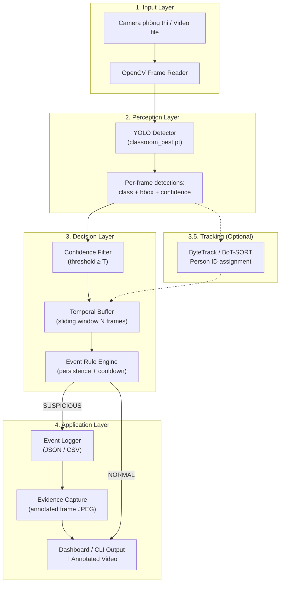

# KẾ HOẠCH TRIỂN KHAI MODULE PHÁT HIỆN GIAN LẬN QUA CAMERA LỚP HỌC

> **HISTORICAL / SUPERSEDED PLAN.** “Production-ready” statements are not current validation. See `docs/PROTOTYPE_CURRENT_STATUS.md`.
## CLASSROOM CHEATING DETECTION — YOLO-BASED PIPELINE

**Dự án:** VIGIL AI — Hệ thống giám sát thi tự động  
**Module mới:** Classroom Cheating Detection (Camera góc rộng lớp học)  
**Ngày lập:** 25/08/2026  
**Trạng thái:** Kế hoạch triển khai — Chờ phê duyệt

---

## 1. TỔNG QUAN & BỐI CẢNH

### 1.1. Module hiện tại — Eyes Gaze (Webcam cá nhân)

Hệ thống VIGIL AI hiện có module **Eyes Gaze Monitoring** đã production-ready, hoạt động trên webcam cá nhân (1 người/camera), sử dụng MediaPipe Face Landmarker + EfficientDet-Lite0 chạy on-device, không cần GPU. Module này phát hiện:
- Liếc mắt, quay đầu, nói chuyện, vắng mặt, nhiều người, vật thể cấm, ánh sáng yếu

### 1.2. Module mới — Classroom Detection (Camera phòng thi)

Mở rộng thêm khả năng phân tích **camera góc rộng phòng thi** (chụp trực diện từ phía trước, khoảng 30 sinh viên/frame) bằng mô hình YOLO object detection huấn luyện trên bộ dữ liệu chuyên biệt.

### 1.3. Dataset thực tế

| Thông số | Giá trị |
|---|---|
| **Tổng ảnh** | **1,693** (train: 1,479 / valid: 130 / test: 84) |
| **Tổng annotations** | ~46,313 bounding boxes (sau khi loại `gesture using`) |
| **Số class** | **5** |
| **Nguồn** | Roboflow — Augmented Dataset v2 (CC BY 4.0) |
| **Góc quay** | Trực diện phía trước lớp học, khoảng 30 người/frame |
| **Format** | YOLO format (images + labels txt) |

### 1.4. Phân bố class sau khi loại `gesture using`

| Class ID | Tên class | Train | Valid | Test | Tổng | Tỷ lệ |
|:---:|---|---:|---:|---:|---:|---:|
| 0 | `back peeking` | 462 | 56 | 28 | 546 | 1.2% |
| 1 | `front peeking` | 14,382 | 1,102 | 922 | 16,406 | 35.4% |
| 2 | `no cheating` | 16,989 | 1,699 | 827 | 19,515 | 42.1% |
| 3 | `phone using` | 1,272 | 132 | 73 | 1,477 | 3.2% |
| 4 | `side peeking` | 7,335 | 604 | 430 | 8,369 | 18.1% |

> [!IMPORTANT]
> Class `gesture using` (class gốc ID 2) đã bị loại bỏ vì chỉ có 3 annotation — không đủ cơ sở để model tổng quát hoá. Script [`delete_class.py`](file:///h:/Code/MingKingLaser/laser_eyes/Exam_Cheating_Merged_Dataset/delete_class.py) đã remap class ID và cập nhật [`data.yaml`](file:///h:/Code/MingKingLaser/laser_eyes/Exam_Cheating_Merged_Dataset/data.yaml).

> [!WARNING]
> **Class imbalance nghiêm trọng:** `back peeking` chỉ chiếm 1.2%, `phone using` chiếm 3.2% — cả hai đều là class quan trọng nhất cho bài toán phát hiện gian lận. Cần chiến lược xử lý imbalance trong quá trình training.

---

## 2. KIẾN TRÚC TỔNG THỂ

### 2.1. Vị trí module mới trong hệ thống

```text
laser_eyes/
├── exam_monitor/          ← Module 1: Eyes Gaze (webcam cá nhân) — ĐÃ CÓ
│   ├── engine.py          ← MediaPipe Face Landmarker + Gaze + Head Pose
│   ├── events.py          ← EventDetector + SessionStore
│   ├── models.py          ← AnalysisResult, MonitoringEvent, EventType
│   ├── app.py             ← Tkinter UI + Background Worker
│   ├── audio.py           ← WebRTC VAD
│   ├── sources.py         ← Camera/Video/Demo sources
│   └── ...
│
├── classroom_monitor/     ← Module 2: Classroom Detection (camera lớp học) — MỚI
│   ├── __init__.py
│   ├── detector.py        ← YOLO inference wrapper
│   ├── tracker.py         ← ByteTrack tracker (optional, nếu kịp)
│   ├── event_engine.py    ← Confidence filter + Temporal buffer + Event rules
│   ├── video_processor.py ← Video/Camera pipeline chính
│   ├── models.py          ← ClassroomDetection, ClassroomEvent, data classes
│   └── config.py          ← Tham số cấu hình tập trung
│
├── classroom_training/    ← Pipeline huấn luyện & đánh giá
│   ├── scripts/
│   │   ├── check_dataset.py      ← Kiểm tra dataset integrity
│   │   ├── visualize_labels.py   ← Vẽ bounding box lên ảnh mẫu
│   │   ├── check_leakage.py      ← Phát hiện data leakage
│   │   ├── train.py              ← Script huấn luyện YOLO
│   │   ├── evaluate.py           ← Đánh giá per-class metrics
│   │   └── error_analysis.py     ← Phân tích lỗi prediction
│   └── configs/
│       └── data.yaml             ← Cấu hình dataset cho YOLO training
│
├── Exam_Cheating_Merged_Dataset/  ← Dataset gốc — ĐÃ CÓ
│   ├── train/images/ + labels/
│   ├── valid/images/ + labels/
│   ├── test/images/ + labels/
│   └── data.yaml
│
└── models/                ← Lưu model weights đã huấn luyện
    └── classroom_best.pt
```

### 2.2. Pipeline xử lý runtime



### 2.3. Tách biệt hoàn toàn với Module Eyes Gaze

| Khía cạnh | Eyes Gaze (Module 1) | Classroom Detection (Module 2) |
|---|---|---|
| **Input** | Webcam cá nhân, 1 người | Camera góc rộng, ~30 người |
| **AI Model** | MediaPipe Face Landmarker + EfficientDet | YOLO (custom trained) |
| **Detection** | Landmarks 478 pts + PnP + Iris | Bounding box + class + confidence |
| **Tracking** | Single-face + hold mechanism | Multi-object (ByteTrack) |
| **Event Engine** | `EventDetector` (debounce + cooldown) | Riêng: Confidence → Temporal → Rule |
| **Package** | `exam_monitor/` | `classroom_monitor/` |

> Hai module **không phụ thuộc lẫn nhau** và có thể chạy độc lập. Tương lai có thể tích hợp chung vào một Dashboard tổng hợp.

---

## 3. GIAI ĐOẠN 1 — DATASET VALIDATION & CHUẨN BỊ (3-4 ngày)

### 3.1. Mục tiêu
Đảm bảo dataset sạch, label đúng, không có data leakage, sẵn sàng cho training.

### 3.2. Công việc chi tiết

#### 3.2.1. `check_dataset.py` — Kiểm tra toàn vẹn dữ liệu

```text
Checklist:
[1] Đếm phân bố 5 class trên train/valid/test
[2] Đối chiếu image ↔ label (mỗi .jpg phải có .txt tương ứng)
[3] Kiểm tra label format (class_id x_center y_center width height)
[4] Phát hiện bounding box bất thường:
    - Box quá nhỏ (width × height < 0.001)
    - Box vượt ngoài [0, 1]
    - File label rỗng (0 annotation)
[5] Xác nhận class_id chỉ thuộc {0, 1, 2, 3, 4}
```

**Output:** Báo cáo text tổng hợp + danh sách file lỗi (nếu có).

#### 3.2.2. `visualize_labels.py` — Kiểm tra trực quan

```text
Checklist:
[1] Random sample 5-10 ảnh/class → vẽ bounding box + class name
[2] Lưu ảnh annotated vào results/dataset_check/
[3] Kiểm tra thủ công:
    - Class ID có đúng không?
    - Bounding box có bao đúng đối tượng không?
    - Có annotation bị gán sai class không?
```

#### 3.2.3. `check_leakage.py` — Phát hiện data leakage

```text
Vấn đề: Dataset từ Roboflow có augmentation.
    original_scene00052.jpg          → train/
    scene00052_augmented_v1.jpg      → valid/  ← LEAK!

Phương pháp:
[1] Trích xuất tên gốc từ filename pattern:
    scene00052_png.rf.09b441fa...jpg → scene00052
[2] Kiểm tra cross-split: cùng scene không được xuất hiện ở cả train và valid/test
[3] Nếu phát hiện leak → báo cáo danh sách + đề xuất di chuyển
```

> [!CAUTION]
> Nếu phát hiện data leakage, **toàn bộ metric đánh giá sẽ bị ảo cao**. Phải sửa trước khi train.

### 3.3. Deliverable Giai đoạn 1

```text
✓ Báo cáo dataset integrity
✓ Ảnh visualize bounding box mẫu (5-10 ảnh/class)
✓ Báo cáo leakage check (pass/fail + danh sách)
✓ Dataset sạch sẵn sàng cho training
```

---

## 4. GIAI ĐOẠN 2 — TRAINING BASELINE & EVALUATION (4-5 ngày)

### 4.1. Mục tiêu
Train model baseline, đánh giá per-class, xác định model có đủ tốt hay cần cải thiện dataset.

### 4.2. Model Selection

| Tiêu chí | Lựa chọn |
|---|---|
| **Framework** | Ultralytics YOLOv8 (hoặc YOLO11 nếu ultralytics đã hỗ trợ) |
| **Model size** | **YOLOv8n** (nano) làm baseline đầu tiên |
| **Pretrained** | COCO pretrained weights (transfer learning) |
| **Lý do chọn nano** | Dataset nhỏ (1,693 ảnh), tránh overfit; inference nhanh trên CPU |

### 4.3. Training Configuration

```python
# classroom_training/scripts/train.py

from ultralytics import YOLO

model = YOLO("yolov8n.pt")  # pretrained COCO

results = model.train(
    data="Exam_Cheating_Merged_Dataset/data.yaml",
    
    # --- Core ---
    epochs=100,
    patience=15,          # early stopping
    batch=16,             # điều chỉnh theo GPU VRAM
    imgsz=640,            # input size chuẩn
    
    # --- Optimization ---
    optimizer="AdamW",
    lr0=0.001,
    lrf=0.01,             # final LR = lr0 × lrf
    weight_decay=0.0005,
    warmup_epochs=5,
    
    # --- Augmentation (đã có augmentation từ Roboflow, giữ mức vừa) ---
    hsv_h=0.015,
    hsv_s=0.4,
    hsv_v=0.3,
    degrees=5.0,
    translate=0.1,
    scale=0.3,
    flipud=0.0,           # không lật dọc (bối cảnh lớp học)
    fliplr=0.5,
    mosaic=0.8,
    mixup=0.1,
    
    # --- Output ---
    project="results/training",
    name="yolov8n_baseline",
    save=True,
    save_period=10,
    plots=True,
    val=True,
)
```

### 4.4. Chiến lược xử lý Class Imbalance

Do `back peeking` (1.2%) và `phone using` (3.2%) quá ít so với `no cheating` (42.1%):

```text
Phương án 1 (Ưu tiên): YOLO built-in class weights
    → Không cần custom code, Ultralytics tự điều chỉnh loss

Phương án 2 (Nếu P1 không đủ): Focal Loss
    → Giảm weight cho easy negatives (no cheating)

Phương án 3 (Nếu vẫn kém): Oversampling
    → Copy ảnh chứa back peeking / phone using vào thư mục train
    → Chỉ copy nguyên ảnh gốc, KHÔNG augment thêm
```

### 4.5. Evaluation — Bắt buộc báo cáo

```text
[1] Overall Metrics:
    - mAP50, mAP50-95, Precision, Recall, F1

[2] Per-Class Metrics (BẮT BUỘC):
    ┌────────────────┬───────────┬────────┬───────┬────┐
    │ Class          │ Precision │ Recall │ mAP50 │ F1 │
    ├────────────────┼───────────┼────────┼───────┼────┤
    │ back peeking   │           │        │       │    │
    │ front peeking  │           │        │       │    │
    │ no cheating    │           │        │       │    │
    │ phone using    │           │        │       │    │
    │ side peeking   │           │        │       │    │
    └────────────────┴───────────┴────────┴───────┴────┘

[3] Confusion Matrix (normalized)
    → Tìm class dễ nhầm: front peeking ↔ side peeking?

[4] Training curves:
    - Loss curves (box_loss, cls_loss, dfl_loss)
    - mAP50 / mAP50-95 theo epoch
    
[5] Inference speed:
    - Preprocessing time
    - Inference time
    - Postprocessing time
    - FPS tổng
```

### 4.6. Error Analysis

```python
# classroom_training/scripts/error_analysis.py

# Chạy inference trên test set, thu thập:
# [1] False Positives: YOLO detect nhưng không có ground truth
# [2] False Negatives: có ground truth nhưng YOLO miss
# [3] Wrong Class: detect đúng vị trí nhưng sai class
# [4] Low IoU: class đúng nhưng bounding box lệch

# Lưu ảnh lỗi + annotation vào:
# results/error_analysis/false_positives/
# results/error_analysis/false_negatives/
# results/error_analysis/wrong_class/
```

### 4.7. Tiêu chí chấp nhận Baseline

```text
Mức TỐI THIỂU để tiếp tục sang Giai đoạn 3:
    mAP50 tổng ≥ 0.60
    Mỗi class phải có Recall ≥ 0.30

Nếu KHÔNG đạt → quay lại:
    Dataset → Visual inspection → Annotation fix → Retrain
```

### 4.8. Model nâng cấp (nếu baseline kém)

```text
Thứ tự thử:
[1] Sửa annotation sai (error analysis)
[2] Thêm augmentation cho class yếu
[3] Tăng lên YOLOv8s (small) — chỉ khi nano quá yếu
[4] Tăng epochs + fine-tune hyperparams

KHÔNG thử nhiều architecture cùng lúc.
```

### 4.9. Deliverable Giai đoạn 2

```text
✓ Model weights: models/classroom_best.pt
✓ Bảng per-class metrics
✓ Confusion matrix
✓ Training curves plots
✓ Error analysis report + ảnh minh hoạ
✓ Quyết định: Tiếp tục hay cần cải thiện dataset
```

---

## 5. GIAI ĐOẠN 3 — EVENT PROCESSING PIPELINE (7-9 ngày)

> [!IMPORTANT]
> **Đây là giai đoạn phức tạp nhất và quan trọng nhất.** YOLO nhận diện được hành vi là một chuyện — xử lý raw detections thành sự kiện gian lận có ý nghĩa là chuyện hoàn toàn khác. Giai đoạn này chia thành **2 phần rõ ràng**.

### 5.0. Bài toán cốt lõi

Khác biệt cơ bản so với module Eyes Gaze hiện tại:

```text
Eyes Gaze (exam_monitor):  1 người → 1 state machine → đơn giản
Classroom (camera rộng): 30 người → 30 state machines đồng thời → PHỨC TẠP
```

Mỗi frame YOLO output ~30 bounding boxes. Giữa 2 frame liên tiếp:
- Cùng 1 người có thể bị detect thành class khác nhau (flickering)
- YOLO có thể miss người (không detect)
- Không biết bbox ở frame N và frame N+1 có phải cùng 1 người không

**5 bài toán logic cần giải quyết:**

| # | Bài toán | Mô tả |
|:---:|---|---|
| 1 | **Spatial Association** | Ai là ai giữa các frame? (không có tracker) |
| 2 | **Behavior State Machine** | Khi nào detection → sự kiện? |
| 3 | **Anti-Flickering** | YOLO nhấp nháy giữa 2 class liên tục |
| 4 | **Crowd Context** | 15/30 người cùng "side peeking" = nhìn bảng, không phải gian lận |
| 5 | **Event Lifecycle** | Sự kiện có đời sống: Create → Update → Escalate → Close |

---

### 5A. GIAI ĐOẠN 3a — YOLO DETECTOR + SPATIAL MATCHER (2-3 ngày)

#### 5A.1. Module `detector.py` — YOLO Inference Wrapper

```python
# classroom_monitor/detector.py

class ClassroomDetector:
    """Wraps YOLO model for classroom cheating detection."""
    
    def __init__(self, model_path: str, confidence: float = 0.50):
        self.model = YOLO(model_path)
        self.confidence = confidence
        self.class_names = [
            "back peeking", "front peeking", "no cheating",
            "phone using", "side peeking"
        ]
    
    def detect(self, frame: np.ndarray) -> list[Detection]:
        """Run inference on a single frame.
        Returns list of Detection(class_id, class_name, confidence, bbox)
        """
        results = self.model(frame, conf=self.confidence, verbose=False)
        # Parse results → list[Detection]
        ...
    
    def detect_cheating_only(self, frame: np.ndarray) -> list[Detection]:
        """Filter: chỉ trả về các detection KHÔNG phải 'no cheating'."""
        return [d for d in self.detect(frame) if d.class_name != "no cheating"]
```

#### 5A.2. Module `spatial_matcher.py` — Bài toán 1: Ai là ai giữa các frame?

Thay vì full tracker (ByteTrack/BoT-SORT), sử dụng **IoU matching lightweight** — tự viết, kiểm soát hoàn toàn, dễ debug:

```python
# classroom_monitor/spatial_matcher.py

class SpatialMatcher:
    """Ghép detection giữa 2 frame liên tiếp bằng IoU overlap.
    
    Lightweight tracker — không cần Re-ID, không cần appearance model.
    Đủ tốt cho camera cố định với sinh viên ngồi tại chỗ.
    """
    
    def __init__(self, iou_threshold: float = 0.30, max_missing_frames: int = 10):
        self.iou_threshold = iou_threshold
        self.max_missing_frames = max_missing_frames
        self.tracks: dict[int, TrackedPerson] = {}
        self.next_track_id = 0
    
    def update(self, detections: list[Detection], frame_idx: int) -> list[TrackedDetection]:
        """Gọi mỗi frame. Ghép detections mới với tracks hiện có.
        
        Ví dụ:
            Frame 100: bbox_1 (200,150,300,400) → track_id=7
            Frame 101: bbox_1 (205,148,305,398) → IoU=0.87 → cùng track_id=7
            Frame 101: bbox_new (800,100,900,350) → track_id=12 (người mới)
        """
        # 1. Tính IoU matrix giữa tracks hiện có ↔ detections mới
        # 2. Greedy matching (hoặc Hungarian assignment)
        # 3. Matched → cập nhật track
        # 4. Unmatched detections → tạo track mới
        # 5. Unmatched tracks → đếm missing frames, xoá nếu > threshold
        ...
    
    @staticmethod
    def _compute_iou(box_a, box_b) -> float:
        """IoU giữa 2 bounding box (x1,y1,x2,y2)."""
        ...

@dataclass
class TrackedPerson:
    track_id: int
    last_bbox: tuple[int, int, int, int]
    last_seen_frame: int
    missing_frames: int = 0

@dataclass
class TrackedDetection:
    """Detection đã được gán track_id."""
    track_id: int
    detection: Detection
```

**Tại sao không dùng ByteTrack ngay?**
```text
IoU Matcher:   ~30 dòng code, kiểm soát 100%, dễ debug, không dependency
ByteTrack:     Cần Ultralytics tracking mode, ràng buộc pipeline, overkill cho MVP

→ Nâng cấp lên ByteTrack sau nếu cần Re-ID hoặc camera chuyển động
```

#### 5A.3. Module `models.py` — Data Classes

```python
# classroom_monitor/models.py

@dataclass
class Detection:
    class_id: int
    class_name: str
    confidence: float
    bbox: tuple[int, int, int, int]  # x1, y1, x2, y2
    frame_index: int
    timestamp: float

@dataclass
class ClassroomEvent:
    event_id: str
    track_id: int               # ID người được theo dõi
    behavior: str               # "back peeking", "phone using", ...
    severity: str               # "HIGH" | "MEDIUM"
    confidence_avg: float       # confidence trung bình toàn bộ event
    confidence_peak: float      # confidence cao nhất (frame tốt nhất)
    start_frame: int
    end_frame: int
    duration_seconds: float
    status: str                 # "suspicious" | "confirmed"
    peak_frame_idx: int         # frame có confidence cao nhất → chụp evidence
    bbox: tuple[int, int, int, int] | None = None
    evidence_frame: np.ndarray | None = None
    room_context: str | None = None  # "cluster_3_people" | "collective_suppressed"
```

#### 5A.4. Deliverable GĐ 3a

```text
✓ detector.py — YOLO wrapper chạy được
✓ spatial_matcher.py — IoU matching giữa frames
✓ models.py — Data classes hoàn chỉnh
✓ Unit tests cho IoU matching
✓ Test: chạy YOLO + matcher trên video → output tracked detections
```

---

### 5B. GIAI ĐOẠN 3b — EVENT INTELLIGENCE ENGINE (5-6 ngày)

> **Phần này cần thực nghiệm nhiều nhất** — các ngưỡng đều cần chạy trên video thật rồi tinh chỉnh.

#### 5B.1. Bài toán 2: Behavior State Machine — Khi nào detection → sự kiện?

Mỗi tracked person có **4-state machine** riêng:

```text
                    detect cheating class
    ┌──────────┐    (confidence ≥ T)       ┌───────────┐
    │          │ ──────────────────────────→│           │
    │  NORMAL  │                            │ WATCHING  │
    │          │ ←──────────────────────────│           │
    └──────────┘   back to "no cheating"    └─────┬─────┘
                   trước khi hết timer            │
                                                  │ score vượt ngưỡng
                                                  │ (ScoreAccumulator)
                                                  ▼
    ┌──────────┐   tiếp tục duy trì        ┌───────────┐
    │          │ ←──────────────────────────│           │
    │CONFIRMED │                            │SUSPICIOUS │──→ TẠO EVENT
    │(severity↑)│                           │           │
    └──────────┘   duration > T_confirm     └─────┬─────┘
                                                  │ trở về "no cheating"
                                                  ▼
                                            ┌───────────┐
                                            │ COOLDOWN  │
                                            │ (đã ghi   │
                                            │  event)   │
                                            └───────────┘
```

```python
# classroom_monitor/behavior_tracker.py

class PersonBehaviorTracker:
    """State machine theo dõi hành vi 1 người qua thời gian."""
    
    def __init__(self, track_id: int):
        self.track_id = track_id
        self.state = "NORMAL"            # NORMAL | WATCHING | SUSPICIOUS | CONFIRMED | COOLDOWN
        self.current_behavior = None
        self.score_accumulator = ScoreAccumulator()
        self.live_event: LiveEvent | None = None
        self.cooldown_until_frame = 0
        self.events_emitted: list[ClassroomEvent] = []
    
    def update(self, detection: Detection | None, frame_idx: int) -> ClassroomEvent | None:
        """Gọi mỗi frame. detection=None nếu người biến mất."""
        
        if self.state == "COOLDOWN" and frame_idx < self.cooldown_until_frame:
            return None
        
        if detection is None:
            return self._handle_missing(frame_idx)
        
        behavior = detection.class_name
        conf = detection.confidence
        self.score_accumulator.add(behavior, conf)
        
        if behavior == "no cheating" or behavior not in CHEATING_CLASSES:
            return self._handle_normal(frame_idx)
        else:
            return self._handle_cheating(behavior, conf, detection, frame_idx)
    
    def _handle_cheating(self, behavior, conf, detection, frame_idx):
        if self.state == "NORMAL":
            self.state = "WATCHING"
            self.current_behavior = behavior
            self.score_accumulator.reset()
            self.score_accumulator.add(behavior, conf)
            return None
        
        elif self.state == "WATCHING":
            if self.score_accumulator.is_suspicious():
                self.state = "SUSPICIOUS"
                self.live_event = LiveEvent(
                    self.track_id, behavior,
                    frame_idx - len(self.score_accumulator.scores),
                    conf
                )
                return self.live_event.to_event()  # TẠO EVENT
            return None
        
        elif self.state == "SUSPICIOUS":
            if self.live_event:
                self.live_event.update(frame_idx, conf)
                if self.live_event.should_escalate():
                    self.state = "CONFIRMED"
                    return self.live_event.to_event()  # CẬP NHẬT EVENT (severity↑)
            return None
    
    def _handle_normal(self, frame_idx):
        if self.state in ("SUSPICIOUS", "CONFIRMED") and self.live_event:
            event = self.live_event.close(frame_idx)
            self.state = "COOLDOWN"
            self.cooldown_until_frame = frame_idx + int(COOLDOWN_SECONDS * FPS)
            self.live_event = None
            self.score_accumulator.reset()
            return event  # ĐÓNG EVENT
        
        if self.state == "WATCHING":
            if not self.score_accumulator.is_suspicious():
                self.state = "NORMAL"
                self.score_accumulator.reset()
        return None
```

#### 5B.2. Bài toán 3: Anti-Flickering — Score Accumulator

YOLO thường xuyên flickering giữa 2 class:

```text
Input:  S S N S S S N S S S   (S=side peeking, N=no cheating)

Đếm liên tục:     2, reset, 3, reset, 3 → KHÔNG BAO GIỜ đạt ngưỡng 5 ❌
Score accumulator: +.8+.8-.3+.8+.8+.8-.3+.9+.8+.8 = 5.9, ratio=80% → SUSPICIOUS ✅
```

```python
# classroom_monitor/score_accumulator.py

class ScoreAccumulator:
    """Tích lũy điểm thay vì đếm frame liên tục.
    
    1 frame "no cheating" giữa 5 frame "side peeking" 
    KHÔNG reset bộ đếm — đây là flickering, không phải thay đổi hành vi.
    """
    
    def __init__(self, window_size: int = 45):  # ~1.5s @ 30fps
        self.scores: deque[float] = deque(maxlen=window_size)
    
    def add(self, behavior: str, confidence: float) -> None:
        if behavior in CHEATING_CLASSES:
            self.scores.append(+confidence)      # tích điểm dương
        else:
            self.scores.append(-0.3)             # trừ nhẹ (cho phép flickering)
    
    def reset(self) -> None:
        self.scores.clear()
    
    @property
    def cumulative_score(self) -> float:
        return sum(self.scores)
    
    @property
    def cheating_ratio(self) -> float:
        """Tỷ lệ frame phát hiện cheating trong window."""
        if not self.scores:
            return 0.0
        positive = sum(1 for s in self.scores if s > 0)
        return positive / len(self.scores)
    
    def is_suspicious(self) -> bool:
        """Kích hoạt khi ĐỦ bằng chứng trong sliding window:
        1. Tỷ lệ frame cheating ≥ 60% trong window
        2. VÀ cumulative score ≥ threshold
        3. VÀ đã thu thập đủ frames tối thiểu
        """
        return (
            self.cheating_ratio >= 0.60
            and self.cumulative_score >= SCORE_THRESHOLD
            and len(self.scores) >= MIN_FRAMES_IN_WINDOW
        )
```

#### 5B.3. Bài toán 4: Crowd Context — Ngữ cảnh lớp học

```text
Tình huống A: 1/30 "side peeking"   → Nghi ngờ CAO
Tình huống B: 15/30 "front peeking" → Có thể nhìn giáo viên → SUPPRESS
Tình huống C: 3 người cạnh nhau cùng "side peeking" → Chép bài → BOOST severity
```

```python
# classroom_monitor/room_context.py

@dataclass
class ContextSignal:
    suppress: bool = False          # True = hành vi tập thể, không phải gian lận
    boost_severity: bool = False    # True = cluster nghi ngờ, tăng severity
    reason: str = ""

class RoomContextAnalyzer:
    """Phân tích ngữ cảnh toàn phòng để điều chỉnh severity."""
    
    def analyze(self, all_detections: list[Detection]) -> ContextSignal:
        total = len(all_detections)
        if total == 0:
            return ContextSignal()
        
        cheating = [d for d in all_detections if d.class_name in CHEATING_CLASSES]
        cheating_ratio = len(cheating) / total
        
        # --- Suppress: >40% cùng hành vi → có thể nhìn bảng/giáo viên ---
        if cheating_ratio > 0.40:
            return ContextSignal(
                suppress=True,
                reason=f"Hành vi tập thể ({cheating_ratio:.0%}) — có thể không phải gian lận"
            )
        
        # --- Boost: cluster 3+ người ngồi gần nhau cùng cheating ---
        clusters = self._find_spatial_clusters(cheating, distance_threshold=150)
        for cluster in clusters:
            if len(cluster) >= 3:
                return ContextSignal(
                    boost_severity=True,
                    reason=f"Nhóm {len(cluster)} người cùng hành vi nghi ngờ gần nhau"
                )
        
        return ContextSignal()
    
    def _find_spatial_clusters(self, detections, distance_threshold):
        """Gom detections gần nhau thành clusters (simple distance-based)."""
        # Tính center mỗi bbox → gom theo khoảng cách Euclidean
        ...
```

#### 5B.4. Bài toán 5: Event Lifecycle — Sự kiện có "đời sống"

```text
CREATED (frame 100)       → behavior: "side peeking", conf: 0.82
    ↓
UPDATED (frame 130)       → duration: 1.0s, conf_avg: 0.84
    ↓
ESCALATED (frame 180)     → severity: MEDIUM → HIGH (kéo dài >5s)
    ↓
CLOSED (frame 200)        → end_frame: 200, total_duration: 3.3s
                            → evidence chụp ở frame 150 (peak confidence)
```

```python
# classroom_monitor/live_event.py

class LiveEvent:
    """Sự kiện đang diễn ra — chưa kết thúc."""
    
    def __init__(self, track_id, behavior, start_frame, confidence):
        self.event_id = uuid.uuid4().hex[:10].upper()
        self.track_id = track_id
        self.behavior = behavior
        self.start_frame = start_frame
        self.end_frame = start_frame
        self.confidences = [confidence]
        self.peak_confidence = confidence
        self.peak_frame = start_frame       # ← frame tốt nhất để chụp evidence
        self.severity = SEVERITY_MAP.get(behavior, "MEDIUM")
        self.is_closed = False
    
    def update(self, frame_idx: int, confidence: float) -> None:
        """Cập nhật event đang diễn ra."""
        self.end_frame = frame_idx
        self.confidences.append(confidence)
        if confidence > self.peak_confidence:
            self.peak_confidence = confidence
            self.peak_frame = frame_idx     # ← frame rõ ràng nhất cho reviewer
    
    @property
    def duration_frames(self) -> int:
        return self.end_frame - self.start_frame
    
    @property
    def duration_seconds(self) -> float:
        return self.duration_frames / FPS
    
    def should_escalate(self) -> bool:
        """Tự nâng severity nếu kéo dài."""
        if self.severity == "MEDIUM" and self.duration_seconds > 5.0:
            self.severity = "HIGH"
            return True
        return False
    
    def close(self, frame_idx: int) -> ClassroomEvent:
        """Đóng event → trả về ClassroomEvent hoàn chỉnh."""
        self.is_closed = True
        self.end_frame = frame_idx
        return self.to_event()
    
    def to_event(self) -> ClassroomEvent:
        return ClassroomEvent(
            event_id=self.event_id,
            track_id=self.track_id,
            behavior=self.behavior,
            severity=self.severity,
            confidence_avg=sum(self.confidences) / len(self.confidences),
            confidence_peak=self.peak_confidence,
            start_frame=self.start_frame,
            end_frame=self.end_frame,
            duration_seconds=self.duration_seconds,
            status="confirmed" if self.severity == "HIGH" else "suspicious",
            peak_frame_idx=self.peak_frame,     # ← CHỤP EVIDENCE Ở ĐÂY
        )
```

> [!TIP]
> **Evidence chụp ở frame có confidence cao nhất** (peak_frame) — không phải frame đầu hay frame cuối. Đây là frame "rõ ràng nhất" cho người review xác minh.

#### 5B.5. Module `event_engine.py` — Orchestrator tổng hợp

```python
# classroom_monitor/event_engine.py

class EventEngine:
    """Orchestrator: kết nối tất cả components xử lý sự kiện.
    
    Pipeline mỗi frame:
    
    Frame → YOLO Detect → Spatial Match → Per-Person Score 
         → Room Context → Event Lifecycle → Output Events
    """
    
    def __init__(self):
        self.matcher = SpatialMatcher()
        self.person_trackers: dict[int, PersonBehaviorTracker] = {}
        self.room_context = RoomContextAnalyzer()
        self.event_buffer: list[ClassroomEvent] = []
    
    def process_frame(
        self, 
        detections: list[Detection], 
        frame_idx: int,
        frame: np.ndarray | None = None,  # để chụp evidence
    ) -> list[ClassroomEvent]:
        """Xử lý 1 frame: detections → events."""
        
        # 1. Spatial Matching — gán track_id cho mỗi detection
        tracked = self.matcher.update(detections, frame_idx)
        
        # 2. Room Context — kiểm tra ngữ cảnh tập thể
        context = self.room_context.analyze(detections)
        
        new_events = []
        
        # 3. Per-Person Processing — mỗi người có state machine riêng
        active_track_ids = set()
        for td in tracked:
            active_track_ids.add(td.track_id)
            
            # Tạo tracker mới nếu chưa có
            if td.track_id not in self.person_trackers:
                self.person_trackers[td.track_id] = PersonBehaviorTracker(td.track_id)
            
            tracker = self.person_trackers[td.track_id]
            event = tracker.update(td.detection, frame_idx)
            
            if event:
                # 4. Áp dụng Room Context
                if context.suppress:
                    event.room_context = context.reason
                    event.status = "suppressed"  # ghi nhận nhưng không cảnh báo
                elif context.boost_severity:
                    event.severity = "HIGH"
                    event.room_context = context.reason
                
                # 5. Gắn evidence frame (frame có peak confidence)
                if frame is not None and event.peak_frame_idx == frame_idx:
                    event.evidence_frame = frame.copy()
                
                new_events.append(event)
        
        # 6. Xử lý người biến mất (tracks không có detection)
        for track_id in list(self.person_trackers.keys()):
            if track_id not in active_track_ids:
                tracker = self.person_trackers[track_id]
                event = tracker.update(None, frame_idx)
                if event:
                    new_events.append(event)
        
        self.event_buffer.extend(new_events)
        return new_events
```

#### 5B.6. Module `video_processor.py` — Pipeline chính

```python
# classroom_monitor/video_processor.py

class VideoProcessor:
    """Pipeline chính: Video → YOLO → EventEngine → Output.
    
    Callback pattern: on_event() để tích hợp với storage layer.
    """
    
    def __init__(self, model_path: str, on_event: Callable = None):
        self.detector = ClassroomDetector(model_path)
        self.event_engine = EventEngine()
        self.on_event = on_event  # callback cho storage layer
    
    def process_video(self, video_path: str, output_path: str = None):
        """Xử lý offline: đọc video → output events + annotated video."""
        cap = cv2.VideoCapture(video_path)
        fps = cap.get(cv2.CAP_PROP_FPS) or 30.0
        frame_idx = 0
        
        while True:
            ok, frame = cap.read()
            if not ok:
                break
            
            # 1. YOLO Detection
            detections = self.detector.detect(frame)
            
            # 2. Event Processing (spatial match + score + context + lifecycle)
            events = self.event_engine.process_frame(detections, frame_idx, frame)
            
            # 3. Callback cho mỗi event mới
            for event in events:
                if self.on_event:
                    self.on_event(event)
            
            # 4. Render annotated frame
            if output_path:
                self._render_frame(frame, detections, events)
            
            frame_idx += 1
        
        cap.release()
        return self.event_engine.event_buffer
    
    def process_camera(self, camera_index: int = 0) -> None:
        """Xử lý real-time từ camera."""
        ...
```

#### 5B.7. Module `config.py` — Tham số tập trung

```python
# classroom_monitor/config.py

# ---- Detection ----
CONFIDENCE_THRESHOLD = 0.50       # Tuned sau evaluation
NMS_IOU_THRESHOLD = 0.45
FPS = 30                          # Video FPS mặc định

# ---- Spatial Matching ----
IOU_MATCH_THRESHOLD = 0.30        # IoU tối thiểu để coi là cùng người
MAX_MISSING_FRAMES = 10           # Số frame cho phép mất track trước khi xoá

# ---- Score Accumulator (Anti-Flickering) ----
SCORE_WINDOW_SIZE = 45            # ~1.5s @ 30fps
SCORE_THRESHOLD = 5.0             # Cumulative score tối thiểu
CHEATING_RATIO_THRESHOLD = 0.60   # ≥60% frame là cheating trong window
MIN_FRAMES_IN_WINDOW = 15         # Tối thiểu 15 frame (~0.5s) trước khi kết luận
NORMAL_PENALTY = -0.3             # Điểm trừ cho frame "no cheating" (flickering tolerance)

# ---- Event Rules ----
COOLDOWN_SECONDS = 5.0            # Sau event, không tạo event trùng trong 5s
ESCALATION_DURATION = 5.0         # Sau 5s liên tục → MEDIUM → HIGH

# ---- Room Context ----
COLLECTIVE_SUPPRESS_RATIO = 0.40  # >40% cùng hành vi → suppress
CLUSTER_DISTANCE_THRESHOLD = 150  # Pixel distance để gom cluster
CLUSTER_MIN_SIZE = 3              # ≥3 người gần nhau → boost severity

# ---- Classes ----
CLASS_NAMES = ["back peeking", "front peeking", "no cheating", "phone using", "side peeking"]
CHEATING_CLASSES = {"back peeking", "front peeking", "phone using", "side peeking"}
NORMAL_CLASSES = {"no cheating"}

# ---- Severity Mapping ----
SEVERITY_MAP = {
    "phone using":  "HIGH",
    "back peeking": "HIGH",
    "side peeking":  "MEDIUM",
    "front peeking": "MEDIUM",
}
```

> [!IMPORTANT]
> **Tất cả ngưỡng trên là giá trị khởi đầu.** Cần chạy trên video thật rồi tinh chỉnh. Đặc biệt `SCORE_THRESHOLD`, `CHEATING_RATIO_THRESHOLD`, và `COLLECTIVE_SUPPRESS_RATIO` sẽ cần nhiều vòng thực nghiệm.

#### 5B.8. Tổng quan Event Processing Pipeline

```text
Frame N từ camera
    │
    ▼
┌─────────────────┐
│ YOLO Detector   │ → 30 bounding boxes + class + confidence
└───────┬─────────┘
        │
        ▼
┌─────────────────────┐
│ Spatial Matcher      │ → Ghép bbox frame N ↔ frame N-1 (IoU)
│ (IoU matching)       │ → Gán track_id cho mỗi person
└───────┬─────────────┘
        │
        ▼
┌─────────────────────────────┐
│ Per-Person Score Accumulator │ → Mỗi track_id có ScoreAccumulator riêng
│ (anti-flickering)            │ → Tích lũy confidence, chống nhấp nháy
└───────┬─────────────────────┘
        │
        ▼
┌─────────────────────────────┐
│ Per-Person State Machine     │ → NORMAL → WATCHING → SUSPICIOUS → CONFIRMED
│ (behavior tracker)           │ → Tạo / cập nhật / escalate / đóng event
└───────┬─────────────────────┘
        │
        ▼
┌─────────────────────────────┐
│ Room Context Analyzer        │ → >40% cùng hành vi? → Suppress!
│ (crowd intelligence)         │ → Cluster gần nhau?  → Boost severity!
└───────┬─────────────────────┘
        │
        ▼
┌─────────────────────────────┐
│ Event Lifecycle Manager      │ → Create / Update / Escalate / Close
│ (LiveEvent)                  │ → Evidence chụp ở peak confidence frame
└───────┬─────────────────────┘
        │
        ▼
   ClassroomEvent → Callback → Storage / API / Dashboard
```

#### 5B.9. Deliverable GĐ 3b

```text
✓ score_accumulator.py — Anti-flickering score tích lũy
✓ behavior_tracker.py — 4-state machine per person
✓ room_context.py — Crowd context analysis
✓ live_event.py — Event lifecycle management
✓ event_engine.py — Orchestrator tổng hợp
✓ video_processor.py — Pipeline chạy end-to-end
✓ config.py — Tham số tập trung, dễ tinh chỉnh
✓ Unit tests cho từng component
✓ Integration test: video → tracked detections → events → evidence
✓ Chạy được: python -m classroom_monitor --input video.mp4
```

---

## 6. GIAI ĐOẠN 4 — TÍCH HỢP, DEMO & BÁO CÁO (3-4 ngày)

### 6.1. Mục tiêu
Hoàn thiện, benchmark, và tạo demo + báo cáo cuối.

### 6.2. Tích hợp entry point

```python
# classroom_monitor/__main__.py (hoặc main_classroom.py ở root)

"""
Usage:
    python -m classroom_monitor --input video.mp4
    python -m classroom_monitor --input video.mp4 --output results/output.mp4
    python -m classroom_monitor --camera 0
    python -m classroom_monitor --input video.mp4 --report results/report.json
"""
```

### 6.3. Output Demo

```text
Input:
    exam_video.mp4 (video phòng thi thực tế hoặc từ test set)

Output:
    [1] output_annotated.mp4
        → Video gốc + bounding box + class label + confidence overlay
        → Highlight đỏ cho hành vi gian lận

    [2] events.json
        [
          {
            "event_id": "EVT001",
            "behavior": "phone using",
            "confidence": 0.91,
            "duration_seconds": 2.4,
            "start_frame": 1520,
            "evidence": "evidence/evt001.jpg",
            "status": "suspicious"
          },
          ...
        ]

    [3] evidence/
        evt001.jpg  — Frame chụp thời điểm phát hiện, có annotation
        evt002.jpg
        ...

    [4] report_summary.txt
        ────────────────────────────────────────
        CLASSROOM CHEATING DETECTION — REPORT
        ────────────────────────────────────────
        Video:          exam_room_cam1.mp4
        Duration:       45:00
        Total Events:   12
        
        Breakdown:
          phone using    : 3 events
          back peeking   : 2 events
          side peeking   : 5 events
          front peeking  : 2 events
        
        Processing:
          FPS:           28.5
          Inference:     12.3ms/frame
        ────────────────────────────────────────
```

### 6.4. Benchmark

```text
Metrics cần đo:
[1] FPS trên CPU (i5/i7 phổ thông)
[2] FPS trên GPU (nếu có CUDA)
[3] Inference latency (ms/frame)
[4] Memory usage (RAM peak)
[5] Event detection delay (thời gian từ hành vi xảy ra → event được tạo)
```

### 6.5. Test trên video chưa dùng khi train

```text
BẮT BUỘC: Chạy pipeline trên ít nhất 1-2 video test set
→ Kiểm tra false positive rate thực tế
→ Kiểm tra event engine có tạo quá nhiều event không
→ Kiểm tra bounding box có ổn định không
```

### 6.6. Deliverable Giai đoạn 4

```text
✓ Entry point chạy được end-to-end
✓ Demo video (annotated output)
✓ Event log + Evidence frames
✓ Benchmark report (FPS, latency)
✓ Tài liệu hướng dẫn sử dụng
✓ Báo cáo kỹ thuật cuối cùng
```

---

## 7. TECH STACK & DEPENDENCIES

### 7.1. Dependencies cần thêm vào `requirements.txt`

```text
# ---- Classroom Cheating Detection ----
ultralytics>=8.2.0        # YOLO framework (bao gồm PyTorch)
torch>=2.0.0              # PyTorch backend
torchvision>=0.15.0       # Vision utilities
lapx>=0.5.0               # ByteTrack dependency (nếu dùng tracker)
```

> [!NOTE]
> `ultralytics` sẽ tự kéo `torch`, `torchvision`, `numpy`, `opencv-python`, `matplotlib`, `tqdm` — hầu hết đã có trong `requirements.txt` hiện tại. Chỉ cần thêm `ultralytics` là đủ.

### 7.2. Hardware Requirements

| Cấu hình | Training | Inference |
|---|---|---|
| **Tối thiểu** | Google Colab Free (T4 GPU) | CPU i5 + 8GB RAM |
| **Khuyến nghị** | GPU NVIDIA ≥ 6GB VRAM | GPU bất kỳ hoặc CPU i7 |
| **Training time (ước lượng)** | ~30-60 phút (100 epochs, T4 GPU, YOLOv8n) | — |

---

## 8. RỦI RO & PHƯƠNG ÁN GIẢM THIỂU

| # | Rủi ro | Mức độ | Phương án giảm thiểu |
|:---:|---|:---:|---|
| 1 | **Class imbalance** — `back peeking` 1.2%, `phone using` 3.2% | 🔴 Cao | Focal loss + class weights + targeted augmentation |
| 2 | **Data leakage** — augmented ảnh cùng gốc ở cả train/valid | 🔴 Cao | `check_leakage.py` trước khi train |
| 3 | **Class confusion** — `front peeking` ↔ `side peeking` | 🟡 TB | Confusion matrix + error analysis → sửa annotation |
| 4 | **False positive cao** — hành vi bình thường bị nhầm là gian lận | 🟡 TB | Temporal filtering + confidence threshold tuning |
| 5 | **Overfit** — dataset nhỏ (1,693 ảnh) | 🟡 TB | YOLOv8n + regularization + early stopping + augmentation |
| 6 | **Scope creep** — thêm tracking, dashboard, cloud... | 🟡 TB | Nghiêm túc bám sát kế hoạch, không thêm Nice-to-have |

---

## 9. ƯU TIÊN TRIỂN KHAI

### MUST HAVE (Bắt buộc)

```text
✓ Dataset validation (check_dataset, visualize, leakage)
✓ YOLO training (baseline YOLOv8n)
✓ Per-class evaluation + Confusion Matrix
✓ Error analysis
✓ Video inference pipeline (offline)
✓ Confidence threshold filtering
✓ Temporal event rule engine
✓ Evidence frame capture
✓ Event log (JSON output)
✓ Annotated output video
✓ Báo cáo kỹ thuật cuối
```

### SHOULD HAVE (Nên có)

```text
○ ByteTrack tracking (person ID)
○ Real-time camera processing
○ FPS benchmark report
○ CLI với argparse (--input, --output, --camera)
○ Simple event history viewer
```

### NICE TO HAVE (Không làm trong phase này)

```text
✗ Re-ID
✗ Multi-camera
✗ Face recognition
✗ Cloud / Docker deployment
✗ Web dashboard
✗ LLM explanation
✗ Tích hợp UI với module Eyes Gaze
✗ Mobile app
```

---

## 10. TIÊU CHÍ HOÀN THÀNH MVP

Hệ thống Classroom Detection được coi là **hoàn thành MVP** khi:

```text
[1] Có model YOLO đã train trên 5 class, weights lưu tại models/classroom_best.pt
[2] Có bảng per-class metrics (Precision, Recall, mAP50, F1) cho cả 5 class
[3] Có pipeline chạy được end-to-end:

    input_video.mp4
         ↓
    YOLO Detection
         ↓
    Confidence Filter
         ↓
    Temporal Buffer
         ↓
    Event Rule Engine
         ↓
    Suspicious Events + Evidence Frames

[4] Output mẫu cho ít nhất 1 video:
    - Annotated video (.mp4)
    - Event log (.json)
    - Evidence frames (.jpg)
    - Summary report (.txt)

[5] Tài liệu kỹ thuật hoàn chỉnh
```

---

## 11. TIMELINE TỔNG HỢP

```text
┌──────────────────────────────────────────────────────────────────┐
│ GIAI ĐOẠN 1: Dataset Validation                  │ ~3-4 ngày    │
│   check_dataset → visualize → leakage            │              │
├──────────────────────────────────────────────────────────────────┤
│ GIAI ĐOẠN 2: Training & Evaluation               │ ~4-5 ngày    │
│   train baseline → per-class eval →              │              │
│   error analysis → retrain (nếu cần)             │              │
├──────────────────────────────────────────────────────────────────┤
│ GIAI ĐOẠN 3a: YOLO Detector + Spatial Matcher    │ ~2-3 ngày    │
│   detector wrapper → IoU matcher → models        │              │
├──────────────────────────────────────────────────────────────────┤
│ GIAI ĐOẠN 3b: Event Intelligence Engine          │ ~5-6 ngày    │
│   score accumulator → behavior state machine →   │              │
│   room context → event lifecycle → orchestrator  │              │
├──────────────────────────────────────────────────────────────────┤
│ GIAI ĐOẠN 4: Integration & Demo                  │ ~3-4 ngày    │
│   entry point → benchmark → demo →              │              │
│   documentation → final report                   │              │
├──────────────────────────────────────────────────────────────────┤
│                              TỔNG CỘNG           │ ~17-22 ngày  │
└──────────────────────────────────────────────────────────────────┘
```

---

## 12. BƯỚC TIẾP THEO SAU KHI PHÊ DUYỆT

Sau khi bạn xác nhận kế hoạch, tôi sẽ bắt đầu **Giai đoạn 1** theo thứ tự:

```text
1. Tạo classroom_training/scripts/check_dataset.py
2. Chạy kiểm tra dataset integrity
3. Tạo classroom_training/scripts/visualize_labels.py
4. Kiểm tra trực quan bounding box
5. Tạo classroom_training/scripts/check_leakage.py
6. Kiểm tra data leakage
7. Báo cáo kết quả Giai đoạn 1
```

---

*Kế hoạch được xây dựng dựa trên phân tích thực tế codebase VIGIL AI, dataset Exam_Cheating_Merged_Dataset, và tài liệu thiết kế hệ thống.*

