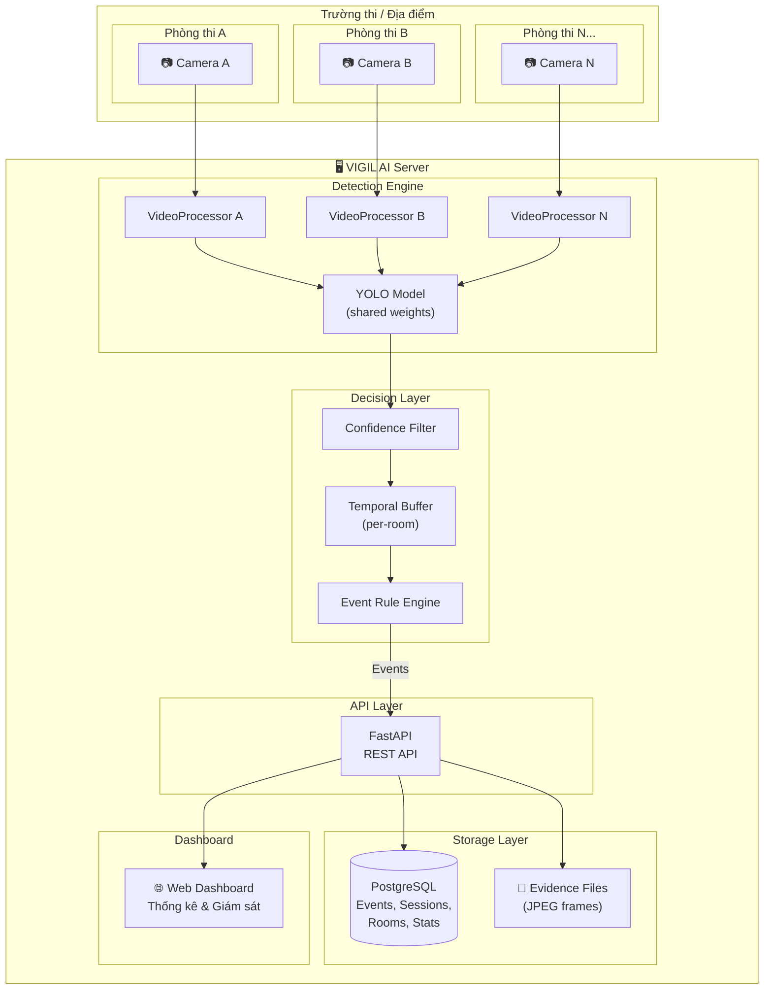
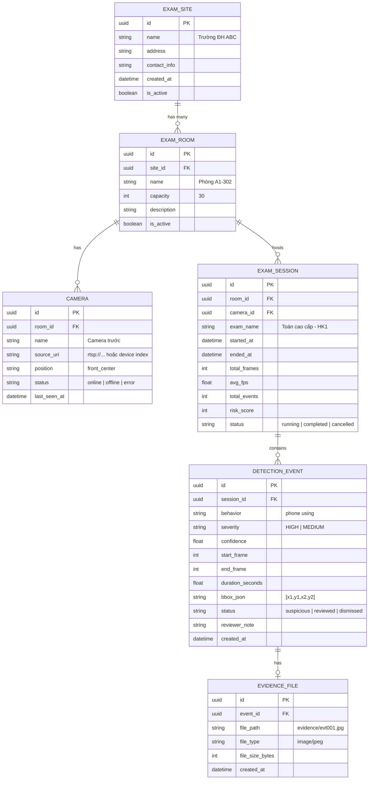

# KẾ HOẠCH TRIỂN KHAI MODULE PHÁT HIỆN GIAN LẬN QUA CAMERA LỚP HỌC

> **HISTORICAL / SUPERSEDED PLAN.** “Production-ready” statements are not current validation. See `docs/PROTOTYPE_CURRENT_STATUS.md`.
## CLASSROOM CHEATING DETECTION — SERVER MULTI-ROOM ARCHITECTURE

**Dự án:** VIGIL AI — Hệ thống giám sát thi tự động  
**Module mới:** Classroom Cheating Detection (Camera góc rộng lớp học)  
**Ngày lập:** 25/08/2026  
**Trạng thái:** Kế hoạch triển khai v2 — Chờ phê duyệt

---

## 1. TỔNG QUAN & BỐI CẢNH

### 1.1. Module hiện tại — Eyes Gaze (Webcam cá nhân)

Hệ thống VIGIL AI hiện có module **Eyes Gaze Monitoring** (package [`exam_monitor/`](file:///h:/Code/MingKingLaser/laser_eyes/exam_monitor)) đã production-ready:
- Webcam cá nhân, 1 người/camera
- MediaPipe Face Landmarker + EfficientDet-Lite0, chạy on-device
- Lưu trữ: JSON files cục bộ ([`SessionStore`](file:///h:/Code/MingKingLaser/laser_eyes/exam_monitor/events.py#L168-L189) → `data/sessions/*.json`)
- UI: Tkinter desktop app

### 1.2. Module mới — Classroom Detection (Server multi-room)

Mở rộng hệ thống sang kiến trúc **server tập trung**, phục vụ **nhiều phòng thi / trường thi** đồng thời:
- Camera góc rộng phòng thi (~30 sinh viên/frame)
- YOLO object detection huấn luyện trên dataset chuyên biệt
- **Database trung tâm** thay cho JSON files cục bộ
- **API Backend** cho phép nhiều client kết nối
- **Dashboard thống kê** theo phòng/trường thi

### 1.3. Thay đổi kiến trúc chính so với plan v1

| Khía cạnh | Plan v1 (Desktop) | Plan v2 (Server) |
|---|---|---|
| **Mô hình triển khai** | App chạy cục bộ | Server phục vụ nhiều phòng |
| **Lưu trữ** | JSON/CSV files | PostgreSQL + file storage |
| **API** | Không có | FastAPI REST API |
| **Dashboard** | CLI output | Web dashboard thống kê |
| **Multi-room** | 1 camera | N cameras / N phòng thi |
| **Thống kê** | Per-session report | Cross-room / cross-site analytics |

### 1.4. Dataset thực tế

| Thông số | Giá trị |
|---|---|
| **Tổng ảnh** | **1,693** (train: 1,479 / valid: 130 / test: 84) |
| **Tổng annotations** | ~46,313 bounding boxes (sau khi loại `gesture using`) |
| **Số class** | **5** (đã loại `gesture using`) |
| **Nguồn** | Roboflow — Augmented Dataset v2 (CC BY 4.0) |
| **Format** | YOLO format (images + labels txt) |

### 1.5. Phân bố class

| ID | Class | Train | Valid | Test | Tổng | Tỷ lệ |
|:---:|---|---:|---:|---:|---:|---:|
| 0 | `back peeking` | 462 | 56 | 28 | 546 | 1.2% |
| 1 | `front peeking` | 14,382 | 1,102 | 922 | 16,406 | 35.4% |
| 2 | `no cheating` | 16,989 | 1,699 | 827 | 19,515 | 42.1% |
| 3 | `phone using` | 1,272 | 132 | 73 | 1,477 | 3.2% |
| 4 | `side peeking` | 7,335 | 604 | 430 | 8,369 | 18.1% |

> [!WARNING]
> **Class imbalance nghiêm trọng:** `back peeking` (1.2%) và `phone using` (3.2%) — hai class quan trọng nhất — chiếm tỷ lệ rất nhỏ.

---

## 2. KIẾN TRÚC TỔNG THỂ

### 2.1. Kiến trúc hệ thống Server Multi-Room



### 2.2. Cấu trúc project mở rộng

```text
laser_eyes/
├── exam_monitor/              ← Module 1: Eyes Gaze — GIỮ NGUYÊN
│   └── ...
│
├── classroom_monitor/         ← Module 2: Classroom Detection — MỚI
│   ├── __init__.py
│   ├── detector.py            ← YOLO inference wrapper
│   ├── tracker.py             ← ByteTrack (optional)
│   ├── event_engine.py        ← Confidence + Temporal + Rules
│   ├── video_processor.py     ← Video/Camera pipeline
│   ├── models.py              ← Detection, ClassroomEvent dataclasses
│   └── config.py              ← Tham số cấu hình
│
├── classroom_training/        ← Pipeline huấn luyện & đánh giá
│   ├── scripts/
│   │   ├── check_dataset.py
│   │   ├── visualize_labels.py
│   │   ├── check_leakage.py
│   │   ├── train.py
│   │   ├── evaluate.py
│   │   └── error_analysis.py
│   └── configs/
│       └── data.yaml
│
├── storage/                   ← Storage Layer — MỚI
│   ├── __init__.py
│   ├── database.py            ← SQLAlchemy engine, session factory
│   ├── db_models.py           ← ORM models (tables)
│   ├── repositories.py        ← CRUD operations (Repository pattern)
│   ├── evidence_store.py      ← File-based evidence management
│   └── migrations/            ← Alembic migrations (optional)
│       └── ...
│
├── api/                       ← API Backend — MỚI
│   ├── __init__.py
│   ├── main.py                ← FastAPI app entry point
│   ├── routes/
│   │   ├── __init__.py
│   │   ├── sites.py           ← CRUD trường thi / địa điểm
│   │   ├── rooms.py           ← CRUD phòng thi
│   │   ├── sessions.py        ← CRUD phiên thi
│   │   ├── events.py          ← Truy vấn sự kiện vi phạm
│   │   ├── cameras.py         ← Quản lý camera
│   │   ├── statistics.py      ← API thống kê tổng hợp
│   │   └── inference.py       ← Trigger inference / stream status
│   ├── schemas.py             ← Pydantic request/response models
│   └── dependencies.py        ← Dependency injection
│
├── dashboard/                 ← Web Dashboard — MỚI
│   ├── index.html
│   ├── css/
│   │   └── dashboard.css
│   └── js/
│       ├── app.js             ← Main dashboard logic
│       ├── charts.js          ← Chart.js / Plotly visualizations
│       └── api_client.js      ← Fetch wrapper cho REST API
│
├── Exam_Cheating_Merged_Dataset/  ← Dataset — ĐÃ CÓ
├── models/                    ← Model weights
│   └── classroom_best.pt
│
└── server.py                  ← Entry point: khởi chạy server
```

### 2.3. Module tách biệt hoàn toàn

```text
exam_monitor/      ← Desktop, Tkinter, JSON storage    (không thay đổi)
classroom_monitor/ ← Detection engine thuần (no DB/API)
storage/           ← Database layer (dùng chung được)
api/               ← REST API (kết nối detection + storage)
dashboard/         ← Web frontend (gọi API)
```

> Mỗi layer có thể test độc lập. `classroom_monitor` không biết về database — nó chỉ output events. `storage` và `api` nhận events và persist.

---

## 3. GIAI ĐOẠN 1 — DATASET VALIDATION & CHUẨN BỊ (3-4 ngày)

*Giữ nguyên từ plan v1 — không thay đổi.*

### 3.1. Mục tiêu
Đảm bảo dataset sạch, label đúng, không data leakage.

### 3.2. Công việc

| Script | Chức năng |
|---|---|
| `check_dataset.py` | Đếm class, kiểm tra image↔label, validate bbox format |
| `visualize_labels.py` | Vẽ bbox lên ảnh mẫu 5-10 ảnh/class |
| `check_leakage.py` | Phát hiện augmented images cùng gốc ở train/valid/test |

> [!CAUTION]
> Filename pattern `scene00052_png.rf.{hash}.jpg` cho thấy khả năng data leakage cao. **Phải kiểm tra trước khi train.**

### 3.3. Deliverable

```text
✓ Báo cáo dataset integrity
✓ Ảnh visualize bbox mẫu
✓ Báo cáo leakage check
✓ Dataset sạch sẵn sàng training
```

---

## 4. GIAI ĐOẠN 2 — TRAINING BASELINE & EVALUATION (4-5 ngày)

*Giữ nguyên từ plan v1 — không thay đổi.*

### 4.1. Mục tiêu
Train YOLOv8n baseline, đánh giá per-class, xác định chất lượng model.

### 4.2. Cấu hình Training

```python
# YOLOv8n, pretrained COCO, 100 epochs, early stopping patience=15
# Augmentation vừa phải (dataset Roboflow đã có augmentation)
# imgsz=640, AdamW, lr0=0.001
```

### 4.3. Evaluation bắt buộc

```text
[1] Per-class: Precision, Recall, mAP50, F1 cho từng class
[2] Confusion Matrix normalized
[3] Training curves (loss, mAP)
[4] Error Analysis (FP, FN, Wrong Class)
[5] Inference speed (ms/frame, FPS)
```

### 4.4. Tiêu chí chấp nhận

```text
mAP50 tổng ≥ 0.60
Mỗi class Recall ≥ 0.30
→ Nếu không đạt: sửa annotation → retrain
```

### 4.5. Deliverable

```text
✓ models/classroom_best.pt
✓ Bảng per-class metrics + Confusion matrix
✓ Error analysis report
```

---

## 5. GIAI ĐOẠN 3 — EVENT PROCESSING PIPELINE (7-9 ngày)

> [!IMPORTANT]
> **Đây là giai đoạn phức tạp nhất và quan trọng nhất.** YOLO nhận diện được hành vi là một chuyện — xử lý raw detections thành sự kiện gian lận có ý nghĩa là chuyện hoàn toàn khác. Giai đoạn này chia thành **2 phần rõ ràng**.

### 5.0. Bài toán cốt lõi

Khác biệt cơ bản so với module Eyes Gaze hiện tại:

```text
Eyes Gaze (exam_monitor):  1 người → 1 state machine → đơn giản
Classroom (camera rộng): 30 người → 30 state machines đồng thời → PHỨC TẠP
```

Mỗi frame YOLO output ~30 bounding boxes. Giữa 2 frame liên tiếp:
- Cùng 1 người có thể bị detect thành class khác nhau (flickering)
- YOLO có thể miss người (không detect)
- Không biết bbox ở frame N và frame N+1 có phải cùng 1 người không

**5 bài toán logic cần giải quyết:**

| # | Bài toán | Mô tả |
|:---:|---|---|
| 1 | **Spatial Association** | Ai là ai giữa các frame? (không có tracker) |
| 2 | **Behavior State Machine** | Khi nào detection → sự kiện? |
| 3 | **Anti-Flickering** | YOLO nhấp nháy giữa 2 class liên tục |
| 4 | **Crowd Context** | 15/30 người cùng "side peeking" = nhìn bảng, không phải gian lận |
| 5 | **Event Lifecycle** | Sự kiện có đời sống: Create → Update → Escalate → Close |

---

### 5A. GIAI ĐOẠN 3a — YOLO DETECTOR + SPATIAL MATCHER (2-3 ngày)

#### `detector.py` — YOLO Inference Wrapper

```python
class ClassroomDetector:
    def __init__(self, model_path, confidence=0.50): ...
    def detect(self, frame) -> list[Detection]: ...
    def detect_cheating_only(self, frame) -> list[Detection]: ...
```

#### `spatial_matcher.py` — Bài toán 1: IoU Matching Lightweight

```python
class SpatialMatcher:
    """Ghép detection giữa 2 frame liên tiếp bằng IoU overlap.
    Lightweight tracker — không cần Re-ID, không cần appearance model.
    Đủ tốt cho camera cố định với sinh viên ngồi tại chỗ.
    """
    def __init__(self, iou_threshold=0.30, max_missing_frames=10): ...
    def update(self, detections, frame_idx) -> list[TrackedDetection]: ...
    # Greedy IoU matching → gán track_id cho mỗi detection
```

#### `models.py` — Data Classes

```python
@dataclass
class Detection:
    class_id: int
    class_name: str          # "back peeking", "phone using", ...
    confidence: float
    bbox: tuple[int, int, int, int]  # x1, y1, x2, y2
    frame_index: int
    timestamp: float

@dataclass
class ClassroomEvent:
    event_id: str
    track_id: int               # ID người được theo dõi
    behavior: str
    severity: str               # "HIGH" | "MEDIUM"
    confidence_avg: float       # confidence trung bình toàn bộ event
    confidence_peak: float      # confidence cao nhất (frame tốt nhất)
    start_frame: int
    end_frame: int
    duration_seconds: float
    status: str                 # "suspicious" | "confirmed" | "suppressed"
    peak_frame_idx: int         # frame có confidence cao nhất → chụp evidence
    bbox: tuple[int, int, int, int] | None = None
    evidence_frame: np.ndarray | None = None
    room_context: str | None = None  # "cluster_3_people" | "collective_suppressed"
```

#### Deliverable GĐ 3a

```text
✓ detector.py — YOLO wrapper chạy được
✓ spatial_matcher.py — IoU matching giữa frames
✓ models.py — Data classes hoàn chỉnh
✓ Unit tests cho IoU matching
```

---

### 5B. GIAI ĐOẠN 3b — EVENT INTELLIGENCE ENGINE (5-6 ngày)

> **Phần này cần thực nghiệm nhiều nhất** — các ngưỡng đều cần chạy trên video thật rồi tinh chỉnh.

#### Bài toán 2: Behavior State Machine — `behavior_tracker.py`

Mỗi tracked person có **4-state machine** riêng:

```text
    NORMAL ──→ WATCHING ──→ SUSPICIOUS ──→ CONFIRMED
       ↑          │              │              │
       └──────────┘              ▼              │
              (reset)        COOLDOWN ←─────────┘
```

```python
class PersonBehaviorTracker:
    """State machine theo dõi hành vi 1 người qua thời gian.
    NORMAL → detect cheating → WATCHING
    WATCHING → score vượt ngưỡng → SUSPICIOUS (tạo event)
    SUSPICIOUS → kéo dài >5s → CONFIRMED (severity↑)
    SUSPICIOUS/CONFIRMED → trở về normal → COOLDOWN (đóng event)
    """
    def __init__(self, track_id: int): ...
    def update(self, detection: Detection | None, frame_idx: int) -> ClassroomEvent | None: ...
```

#### Bài toán 3: Anti-Flickering — `score_accumulator.py`

```text
Input:  S S N S S S N S S S   (S=side peeking, N=no cheating)

Đếm liên tục:     2, reset, 3, reset, 3 → KHÔNG đạt ngưỡng ❌
Score accumulator: +.8+.8-.3+.8+.8+.8-.3+.9+.8+.8 = 5.9, ratio=80% → SUSPICIOUS ✅
```

```python
class ScoreAccumulator:
    """Tích lũy điểm thay vì đếm frame liên tục.
    1 frame "no cheating" giữa 5 frame "side peeking" 
    KHÔNG reset bộ đếm — đây là flickering, không phải thay đổi hành vi.
    """
    def __init__(self, window_size=45):                   # ~1.5s @ 30fps
        self.scores: deque[float] = deque(maxlen=window_size)
    
    def add(self, behavior, confidence):
        if behavior in CHEATING_CLASSES:
            self.scores.append(+confidence)               # tích điểm dương
        else:
            self.scores.append(-0.3)                      # trừ nhẹ (flickering tolerance)
    
    def is_suspicious(self) -> bool:
        """Kích hoạt khi:
        1. Tỷ lệ frame cheating ≥ 60% trong window
        2. VÀ cumulative score ≥ threshold  
        3. VÀ đã thu thập đủ frames tối thiểu (~0.5s)
        """
        ...
```

#### Bài toán 4: Crowd Context — `room_context.py`

```text
Tình huống A: 1/30 "side peeking"   → Nghi ngờ CAO
Tình huống B: 15/30 "front peeking" → Có thể nhìn giáo viên → SUPPRESS
Tình huống C: 3 người cạnh nhau cùng "side peeking" → Chép bài → BOOST severity
```

```python
class RoomContextAnalyzer:
    """Phân tích ngữ cảnh toàn phòng để điều chỉnh severity."""
    def analyze(self, all_detections) -> ContextSignal:
        # >40% cùng hành vi → suppress (hành vi tập thể)
        # Cluster 3+ người gần nhau cùng cheating → boost severity
        ...
```

#### Bài toán 5: Event Lifecycle — `live_event.py`

```text
CREATED (frame 100)   → behavior: "side peeking", conf: 0.82
UPDATED (frame 130)   → duration: 1.0s, conf_avg: 0.84
ESCALATED (frame 180) → severity: MEDIUM → HIGH (kéo dài >5s)
CLOSED (frame 200)    → end_frame: 200, evidence ở frame 150 (peak confidence)
```

```python
class LiveEvent:
    """Sự kiện đang diễn ra — chưa kết thúc."""
    def update(self, frame_idx, confidence):
        # Track peak confidence frame → dùng cho evidence
        if confidence > self.peak_confidence:
            self.peak_confidence = confidence
            self.peak_frame = frame_idx        # ← frame rõ nhất cho reviewer
    
    def should_escalate(self) -> bool:
        # MEDIUM → HIGH nếu kéo dài >5s
    
    def close(self, frame_idx) -> ClassroomEvent:
        # Đóng event → trả về ClassroomEvent hoàn chỉnh
```

> [!TIP]
> **Evidence chụp ở frame có confidence cao nhất** (peak_frame) — không phải frame đầu hay frame cuối. Đây là frame "rõ ràng nhất" cho người review xác minh.

#### `event_engine.py` — Orchestrator tổng hợp

```python
class EventEngine:
    """Orchestrator: kết nối tất cả components xử lý sự kiện."""
    def __init__(self):
        self.matcher = SpatialMatcher()
        self.person_trackers: dict[int, PersonBehaviorTracker] = {}
        self.room_context = RoomContextAnalyzer()
    
    def process_frame(self, detections, frame_idx, frame=None) -> list[ClassroomEvent]:
        # 1. Spatial Matching → gán track_id
        # 2. Room Context → kiểm tra ngữ cảnh tập thể
        # 3. Per-Person Processing → mỗi người có state machine riêng
        # 4. Áp dụng Room Context (suppress / boost)
        # 5. Gắn evidence frame (peak confidence)
        # 6. Xử lý người biến mất
        ...
```

#### `video_processor.py` — Pipeline chính

```python
class VideoProcessor:
    """Pipeline chính: Video → YOLO → EventEngine → Output.
    Callback pattern: on_event() để tích hợp với storage layer.
    """
    def __init__(self, model_path, on_event: Callable = None):
        self.detector = ClassroomDetector(model_path)
        self.event_engine = EventEngine()
        self.on_event = on_event  # callback cho storage layer
    
    def process_video(self, video_path, output_path=None): ...
    def process_camera(self, camera_index=0): ...
```

> [!IMPORTANT]
> **Design decision:** `VideoProcessor` nhận một callback `on_event(event: ClassroomEvent)` thay vì gọi thẳng DB. Điều này giữ detection engine tách biệt khỏi storage — dễ test, dễ tái sử dụng.

#### `config.py` — Tham số tập trung

```python
# ---- Detection ----
CONFIDENCE_THRESHOLD = 0.50       # Tuned sau evaluation
FPS = 30

# ---- Spatial Matching ----
IOU_MATCH_THRESHOLD = 0.30        # IoU tối thiểu cùng người
MAX_MISSING_FRAMES = 10           # Frames cho phép mất track

# ---- Score Accumulator (Anti-Flickering) ----
SCORE_WINDOW_SIZE = 45            # ~1.5s @ 30fps
SCORE_THRESHOLD = 5.0             # Cumulative score tối thiểu
CHEATING_RATIO_THRESHOLD = 0.60   # ≥60% frame cheating trong window
MIN_FRAMES_IN_WINDOW = 15         # ~0.5s tối thiểu
NORMAL_PENALTY = -0.3             # Flickering tolerance

# ---- Event Rules ----
COOLDOWN_SECONDS = 5.0
ESCALATION_DURATION = 5.0         # MEDIUM → HIGH sau 5s

# ---- Room Context ----
COLLECTIVE_SUPPRESS_RATIO = 0.40  # >40% cùng hành vi → suppress
CLUSTER_DISTANCE_THRESHOLD = 150  # Pixel distance gom cluster
CLUSTER_MIN_SIZE = 3              # ≥3 người → boost severity

CHEATING_CLASSES = {"back peeking", "front peeking", "phone using", "side peeking"}
SEVERITY_MAP = {
    "phone using":  "HIGH",
    "back peeking": "HIGH",
    "side peeking":  "MEDIUM",
    "front peeking": "MEDIUM",
}
```

> [!IMPORTANT]
> **Tất cả ngưỡng trên là giá trị khởi đầu.** Cần chạy trên video thật rồi tinh chỉnh. Đặc biệt `SCORE_THRESHOLD`, `CHEATING_RATIO_THRESHOLD`, và `COLLECTIVE_SUPPRESS_RATIO` sẽ cần nhiều vòng thực nghiệm.

#### Tổng quan Event Processing Pipeline

```text
Frame N từ camera
    │
    ▼
┌─────────────────┐
│ YOLO Detector   │ → 30 bounding boxes + class + confidence
└───────┬─────────┘
        │
        ▼
┌─────────────────────┐
│ Spatial Matcher      │ → Ghép bbox frame N ↔ frame N-1 (IoU)
│ (IoU matching)       │ → Gán track_id cho mỗi person
└───────┬─────────────┘
        │
        ▼
┌─────────────────────────────┐
│ Per-Person Score Accumulator │ → Mỗi track_id có ScoreAccumulator riêng
│ (anti-flickering)            │ → Tích lũy confidence, chống nhấp nháy
└───────┬─────────────────────┘
        │
        ▼
┌─────────────────────────────┐
│ Per-Person State Machine     │ → NORMAL → WATCHING → SUSPICIOUS → CONFIRMED
│ (behavior tracker)           │ → Tạo / cập nhật / escalate / đóng event
└───────┬─────────────────────┘
        │
        ▼
┌─────────────────────────────┐
│ Room Context Analyzer        │ → >40% cùng hành vi? → Suppress!
│ (crowd intelligence)         │ → Cluster gần nhau?  → Boost severity!
└───────┬─────────────────────┘
        │
        ▼
┌─────────────────────────────┐
│ Event Lifecycle Manager      │ → Create / Update / Escalate / Close
│ (LiveEvent)                  │ → Evidence chụp ở peak confidence frame
└───────┬─────────────────────┘
        │
        ▼
   ClassroomEvent → Callback → Storage / API / Dashboard
```

#### Deliverable GĐ 3b

```text
✓ score_accumulator.py — Anti-flickering score tích lũy
✓ behavior_tracker.py — 4-state machine per person
✓ room_context.py — Crowd context analysis
✓ live_event.py — Event lifecycle management
✓ event_engine.py — Orchestrator tổng hợp
✓ video_processor.py — Pipeline chạy end-to-end
✓ config.py — Tham số tập trung, dễ tinh chỉnh
✓ Unit tests cho từng component
✓ Integration test: video → tracked detections → events → evidence
✓ Chạy được: python -m classroom_monitor --input video.mp4
```

---

## 6. GIAI ĐOẠN 4 — STORAGE LAYER (3-4 ngày)

### 6.1. Mục tiêu
Xây dựng tầng lưu trữ trung tâm: PostgreSQL cho metadata + file system cho evidence.

### 6.2. Database Schema



### 6.3. SQLAlchemy ORM Models

```python
# storage/db_models.py

from sqlalchemy import Column, String, Integer, Float, DateTime, Boolean, ForeignKey, Text
from sqlalchemy.dialects.postgresql import UUID
from sqlalchemy.orm import DeclarativeBase, relationship
import uuid

class Base(DeclarativeBase):
    pass

class ExamSite(Base):
    __tablename__ = "exam_sites"
    id = Column(UUID(as_uuid=True), primary_key=True, default=uuid.uuid4)
    name = Column(String(255), nullable=False)
    address = Column(Text)
    is_active = Column(Boolean, default=True)
    created_at = Column(DateTime, server_default="now()")
    rooms = relationship("ExamRoom", back_populates="site")

class ExamRoom(Base):
    __tablename__ = "exam_rooms"
    id = Column(UUID(as_uuid=True), primary_key=True, default=uuid.uuid4)
    site_id = Column(UUID(as_uuid=True), ForeignKey("exam_sites.id"))
    name = Column(String(255), nullable=False)
    capacity = Column(Integer)
    is_active = Column(Boolean, default=True)
    site = relationship("ExamSite", back_populates="rooms")
    cameras = relationship("Camera", back_populates="room")
    sessions = relationship("ExamSession", back_populates="room")

class Camera(Base):
    __tablename__ = "cameras"
    id = Column(UUID(as_uuid=True), primary_key=True, default=uuid.uuid4)
    room_id = Column(UUID(as_uuid=True), ForeignKey("exam_rooms.id"))
    name = Column(String(255))
    source_uri = Column(String(500))       # rtsp:// hoặc device index
    position = Column(String(50))          # "front_center", "front_left"
    status = Column(String(20), default="offline")
    room = relationship("ExamRoom", back_populates="cameras")

class ExamSession(Base):
    __tablename__ = "exam_sessions"
    id = Column(UUID(as_uuid=True), primary_key=True, default=uuid.uuid4)
    room_id = Column(UUID(as_uuid=True), ForeignKey("exam_rooms.id"))
    camera_id = Column(UUID(as_uuid=True), ForeignKey("cameras.id"))
    exam_name = Column(String(255))
    started_at = Column(DateTime)
    ended_at = Column(DateTime, nullable=True)
    total_frames = Column(Integer, default=0)
    avg_fps = Column(Float, default=0.0)
    total_events = Column(Integer, default=0)
    risk_score = Column(Integer, default=0)
    status = Column(String(20), default="running")
    room = relationship("ExamRoom", back_populates="sessions")
    events = relationship("DetectionEvent", back_populates="session")

class DetectionEvent(Base):
    __tablename__ = "detection_events"
    id = Column(UUID(as_uuid=True), primary_key=True, default=uuid.uuid4)
    session_id = Column(UUID(as_uuid=True), ForeignKey("exam_sessions.id"))
    behavior = Column(String(50), nullable=False)
    severity = Column(String(10))
    confidence = Column(Float)
    start_frame = Column(Integer)
    end_frame = Column(Integer)
    duration_seconds = Column(Float)
    bbox_json = Column(Text)
    status = Column(String(20), default="suspicious")
    reviewer_note = Column(Text, default="")
    created_at = Column(DateTime, server_default="now()")
    session = relationship("ExamSession", back_populates="events")
    evidence = relationship("EvidenceFile", back_populates="event", uselist=False)

class EvidenceFile(Base):
    __tablename__ = "evidence_files"
    id = Column(UUID(as_uuid=True), primary_key=True, default=uuid.uuid4)
    event_id = Column(UUID(as_uuid=True), ForeignKey("detection_events.id"))
    file_path = Column(String(500))
    file_type = Column(String(50), default="image/jpeg")
    file_size_bytes = Column(Integer)
    created_at = Column(DateTime, server_default="now()")
    event = relationship("DetectionEvent", back_populates="evidence")
```

### 6.4. Repository Pattern

```python
# storage/repositories.py

class EventRepository:
    """CRUD operations cho detection events."""
    
    def create_event(self, session_id, event: ClassroomEvent) -> DetectionEvent: ...
    def get_events_by_session(self, session_id) -> list[DetectionEvent]: ...
    def get_events_by_room(self, room_id, start, end) -> list[DetectionEvent]: ...
    def get_events_by_site(self, site_id, start, end) -> list[DetectionEvent]: ...
    def update_review_status(self, event_id, status, note) -> None: ...

class StatisticsRepository:
    """Truy vấn thống kê tổng hợp."""
    
    def events_count_by_behavior(self, session_id=None, room_id=None, site_id=None) -> dict: ...
    def events_timeline(self, session_id, interval="1min") -> list[dict]: ...
    def risk_score_by_room(self, site_id) -> list[dict]: ...
    def top_violations_by_site(self, site_id, limit=10) -> list[dict]: ...
    def daily_summary(self, site_id, date) -> dict: ...

class SessionRepository:
    def create_session(self, room_id, camera_id, exam_name) -> ExamSession: ...
    def end_session(self, session_id, stats) -> None: ...
    def get_active_sessions(self) -> list[ExamSession]: ...
    def get_sessions_by_room(self, room_id) -> list[ExamSession]: ...
```

### 6.5. Evidence File Management

```python
# storage/evidence_store.py

class EvidenceStore:
    """Quản lý file ảnh bằng chứng trên filesystem."""
    
    def __init__(self, base_dir: str = "data/evidence"):
        # Tổ chức theo: evidence/{site_id}/{room_id}/{session_id}/
        ...
    
    def save_evidence(self, event: ClassroomEvent, frame: np.ndarray) -> str:
        """Lưu frame annotated → trả về file path."""
        ...
    
    def get_evidence_path(self, event_id: str) -> Path: ...
    def cleanup_old_evidence(self, days: int = 90) -> int: ...
```

### 6.6. Kết nối Detection → Storage

```python
# Trong api/ hoặc server.py — kết nối callback

def on_event_detected(event: ClassroomEvent, session_id: str):
    """Callback khi VideoProcessor phát hiện event."""
    # 1. Lưu evidence frame
    evidence_path = evidence_store.save_evidence(event, event.evidence_frame)
    
    # 2. Lưu event vào DB
    db_event = event_repo.create_event(session_id, event)
    
    # 3. Lưu evidence record
    evidence_repo.create_evidence(db_event.id, evidence_path)
    
    # 4. Cập nhật risk score session
    session_repo.update_risk_score(session_id)
```

### 6.7. Deliverable

```text
✓ storage/ package với SQLAlchemy models
✓ Database schema tạo được bằng Base.metadata.create_all()
✓ Repository classes với CRUD operations
✓ Evidence file management
✓ Unit tests cho repositories
```

---

## 7. GIAI ĐOẠN 5 — API BACKEND & DASHBOARD (5-6 ngày)

### 7.1. Mục tiêu
REST API cho dashboard + quản lý phòng thi. Web dashboard hiển thị thống kê real-time.

### 7.2. FastAPI Endpoints

#### Quản lý cấu trúc thi

```text
# Trường thi / Địa điểm
GET    /api/sites                    → Danh sách trường thi
POST   /api/sites                    → Tạo trường thi mới
GET    /api/sites/{site_id}          → Chi tiết trường thi
PUT    /api/sites/{site_id}          → Cập nhật trường thi

# Phòng thi
GET    /api/sites/{site_id}/rooms    → Danh sách phòng thi
POST   /api/sites/{site_id}/rooms    → Tạo phòng thi mới
GET    /api/rooms/{room_id}          → Chi tiết phòng thi
PUT    /api/rooms/{room_id}          → Cập nhật phòng thi

# Camera
GET    /api/rooms/{room_id}/cameras  → Danh sách camera
POST   /api/rooms/{room_id}/cameras  → Đăng ký camera
PUT    /api/cameras/{camera_id}      → Cập nhật camera
```

#### Phiên thi & Sự kiện

```text
# Phiên thi
POST   /api/sessions                 → Bắt đầu phiên thi mới
GET    /api/sessions/{session_id}    → Chi tiết phiên thi
PUT    /api/sessions/{session_id}    → Cập nhật / kết thúc phiên thi
GET    /api/sessions/active          → Danh sách phiên đang chạy

# Sự kiện vi phạm
GET    /api/sessions/{session_id}/events    → Events trong phiên
GET    /api/events/{event_id}               → Chi tiết event
PUT    /api/events/{event_id}/review        → Cập nhật trạng thái review
GET    /api/events/{event_id}/evidence      → Ảnh bằng chứng
```

#### Thống kê

```text
# Thống kê tổng hợp
GET    /api/statistics/summary
       ?site_id=...&room_id=...&date_from=...&date_to=...
       → Tổng events, phân bố theo behavior, risk scores

GET    /api/statistics/timeline
       ?session_id=...&interval=1min
       → Events theo thời gian (cho biểu đồ timeline)

GET    /api/statistics/rooms
       ?site_id=...
       → So sánh risk score giữa các phòng

GET    /api/statistics/behaviors
       ?site_id=...&date_from=...&date_to=...
       → Phân bố hành vi gian lận (pie chart / bar chart)

GET    /api/statistics/daily
       ?site_id=...&date=2026-08-25
       → Tổng kết ngày thi
```

#### Inference Control

```text
# Điều khiển inference
POST   /api/inference/start
       { "camera_id": "...", "session_id": "..." }
       → Bắt đầu xử lý real-time

POST   /api/inference/stop
       { "session_id": "..." }
       → Dừng xử lý

GET    /api/inference/status
       → Trạng thái inference engine (FPS, frame count, ...)

POST   /api/inference/upload
       → Upload video file để xử lý offline
```

### 7.3. Pydantic Schemas

```python
# api/schemas.py

class SiteCreate(BaseModel):
    name: str
    address: str | None = None

class RoomCreate(BaseModel):
    name: str
    capacity: int | None = None

class SessionCreate(BaseModel):
    room_id: uuid.UUID
    camera_id: uuid.UUID
    exam_name: str

class EventResponse(BaseModel):
    event_id: str
    behavior: str
    severity: str
    confidence: float
    duration_seconds: float
    status: str
    evidence_url: str | None
    created_at: datetime

class StatisticsSummary(BaseModel):
    total_events: int
    events_by_behavior: dict[str, int]    # {"phone using": 3, ...}
    events_by_severity: dict[str, int]    # {"HIGH": 5, "MEDIUM": 7}
    risk_score_avg: float
    rooms_monitored: int
    sessions_completed: int

class TimelinePoint(BaseModel):
    timestamp: datetime
    event_count: int
    behaviors: dict[str, int]
```

### 7.4. Web Dashboard

#### Trang chính — Overview

```text
┌─────────────────────────────────────────────────────────────────┐
│  VIGIL AI — Dashboard Giám sát Phòng thi                        │
├─────────────────────────────────────────────────────────────────┤
│                                                                  │
│  ┌─────────┐  ┌─────────┐  ┌─────────┐  ┌─────────┐           │
│  │ 12      │  │ 4       │  │ 28      │  │ 67%     │           │
│  │ Phòng   │  │ Đang    │  │ Sự kiện │  │ Risk    │           │
│  │ thi     │  │ giám sát│  │ hôm nay │  │ Score   │           │
│  └─────────┘  └─────────┘  └─────────┘  └─────────┘           │
│                                                                  │
│  ┌────────────────────────┐  ┌────────────────────────┐        │
│  │ Phân bố hành vi       │  │ Timeline sự kiện       │        │
│  │ (Pie / Donut Chart)   │  │ (Line Chart theo giờ)  │        │
│  │                        │  │                        │        │
│  │ ● phone using   12%   │  │ ▁▂▃▅▇▅▃▂▁▂▃▄▅▇       │        │
│  │ ● back peeking   8%   │  │ 8:00    10:00   12:00  │        │
│  │ ● side peeking  45%   │  │                        │        │
│  │ ● front peeking 35%   │  │                        │        │
│  └────────────────────────┘  └────────────────────────┘        │
│                                                                  │
│  ┌──────────────────────────────────────────────────────┐      │
│  │ Bảng xếp hạng phòng thi theo Risk Score              │      │
│  │                                                        │      │
│  │ # │ Phòng      │ Trường        │ Events │ Risk  │     │      │
│  │ 1 │ A1-302     │ ĐH Bách Khoa │   15   │ 🔴 85 │     │      │
│  │ 2 │ B2-105     │ ĐH Bách Khoa │    8   │ 🟡 52 │     │      │
│  │ 3 │ C1-201     │ ĐH Sư Phạm   │    3   │ 🟢 18 │     │      │
│  └──────────────────────────────────────────────────────┘      │
└─────────────────────────────────────────────────────────────────┘
```

#### Trang chi tiết phòng thi

```text
┌──────────────────────────────────────────────────────────────┐
│ Phòng A1-302 — ĐH Bách Khoa                                  │
├──────────────────────────────────────────────────────────────┤
│                                                                │
│ Phiên thi: Toán cao cấp - HK1 2026                           │
│ Trạng thái: 🟢 Đang giám sát (Camera 1)                      │
│ FPS: 28.5 | Frames: 15,230 | Thời gian: 00:08:27             │
│                                                                │
│ ┌─────────────────────────────────────────────────────┐       │
│ │ Timeline sự kiện (realtime)                          │       │
│ │ ▁▁▁▂▁▁▃▁▁▁▅▁▁▁▂▁▁▁▇▁▁▁▁▃                          │       │
│ │ 08:00         08:04         08:08                    │       │
│ └─────────────────────────────────────────────────────┘       │
│                                                                │
│ ┌─────────────────────────────────────────────────────┐       │
│ │ Danh sách sự kiện                                    │       │
│ │                                                       │       │
│ │ 08:02:15 │ 🔴 phone using  │ conf 0.91 │ 2.4s │ 📷 │       │
│ │ 08:04:33 │ 🟡 side peeking │ conf 0.78 │ 1.8s │ 📷 │       │
│ │ 08:07:12 │ 🔴 back peeking │ conf 0.85 │ 3.1s │ 📷 │       │
│ │                                                       │       │
│ │ [📷] = Click để xem ảnh bằng chứng                   │       │
│ └─────────────────────────────────────────────────────┘       │
└──────────────────────────────────────────────────────────────┘
```

#### Dashboard Technology

```text
Frontend: Vanilla HTML/CSS/JS (tránh build step phức tạp)
Charts:   Chart.js hoặc Plotly.js (CDN)
Styling:  CSS custom (dark mode, glassmorphism, responsive)
Data:     Fetch API → FastAPI REST endpoints
Serve:    FastAPI StaticFiles mount (không cần server riêng)
```

### 7.5. Deliverable

```text
✓ FastAPI app chạy được: uvicorn api.main:app
✓ Toàn bộ REST endpoints cho CRUD + statistics
✓ Web dashboard với overview + room detail + event viewer
✓ Charts: pie chart behaviors, timeline, risk ranking
✓ Evidence image viewer
✓ API docs tự động (Swagger UI tại /docs)
```

---

## 8. GIAI ĐOẠN 6 — TÍCH HỢP, DEMO & BÁO CÁO (3-4 ngày)

### 8.1. Mục tiêu
Kết nối toàn bộ pipeline end-to-end, benchmark, demo, báo cáo.

### 8.2. Entry Point tích hợp

```python
# server.py — Entry point chính

"""
Usage:
    # Khởi chạy server (API + Dashboard + Inference engine)
    python server.py
    
    # Server sẽ chạy tại:
    #   API:       http://localhost:8000/api/
    #   Dashboard: http://localhost:8000/
    #   Docs:      http://localhost:8000/docs
    
    # Xử lý video offline (không cần server)
    python -m classroom_monitor --input video.mp4 --output results/
"""
```

### 8.3. Kịch bản Demo

```text
Demo Scenario:
[1] Khởi chạy server
[2] Tạo trường thi "ĐH Bách Khoa" qua API
[3] Tạo phòng thi "A1-302" với camera
[4] Upload/chỉ định video test → chạy inference
[5] Dashboard hiển thị:
    - Sự kiện phát hiện real-time
    - Biểu đồ phân bố hành vi
    - Timeline events
    - Evidence frames
[6] Kết thúc phiên → xem báo cáo tổng kết
```

### 8.4. Benchmark

```text
[1] Detection: FPS, inference latency (ms/frame)
[2] API: Response time cho thống kê queries
[3] Dashboard: Load time, chart render
[4] Storage: Insert throughput (events/second)
[5] Memory: RAM usage (server + inference)
```

### 8.5. Deliverable cuối cùng

```text
✓ Server chạy end-to-end: Camera → YOLO → DB → Dashboard
✓ Demo video/recording
✓ API documentation (Swagger)
✓ Database schema documentation
✓ Benchmark report
✓ Hướng dẫn triển khai (setup guide)
✓ Báo cáo kỹ thuật cuối cùng
```

---

## 9. TECH STACK TỔNG HỢP

### 9.1. Dependencies cần thêm

```text
# ---- Classroom Detection ----
ultralytics>=8.2.0           # YOLO framework

# ---- API Backend ----
fastapi>=0.110.0             # REST API framework
uvicorn[standard]>=0.29.0    # ASGI server
python-multipart>=0.0.9      # File upload support
pydantic>=2.7.0              # Request/response validation

# ---- Đã có trong requirements.txt ----
SQLAlchemy==2.0.44           # ORM ✓
psycopg2-binary==2.9.11      # PostgreSQL driver ✓
numpy==2.0.2                 # ✓
opencv-python==4.13.0.92     # ✓
matplotlib==3.9.4            # ✓
Pillow==11.3.0               # ✓
PyYAML==6.0.3                # ✓
tqdm==4.67.1                 # ✓
```

### 9.2. Infrastructure

| Component | Development | Production |
|---|---|---|
| **Database** | SQLite (dev nhanh) → PostgreSQL | PostgreSQL |
| **Server** | uvicorn (reload mode) | uvicorn + gunicorn |
| **Evidence Storage** | Local filesystem | Local / S3-compatible |
| **Training** | Colab T4 / Local GPU | — |
| **Inference** | CPU / GPU | Tùy quy mô |

> [!NOTE]
> **Dev workflow:** Bắt đầu với SQLite cho development nhanh (SQLAlchemy trừu tượng hóa DB — switch sang PostgreSQL chỉ cần đổi connection string). Production dùng PostgreSQL.

---

## 10. RỦI RO & GIẢM THIỂU

| # | Rủi ro | Mức | Giảm thiểu |
|:---:|---|:---:|---|
| 1 | Class imbalance trong dataset | 🔴 | Class weights + targeted augmentation |
| 2 | Data leakage (Roboflow augmentation) | 🔴 | `check_leakage.py` trước training |
| 3 | Multi-camera concurrent inference quá tải | 🟡 | Batch inference + shared YOLO model |
| 4 | Database bottleneck khi nhiều events | 🟡 | Batch insert + connection pooling |
| 5 | Dashboard performance với dữ liệu lớn | 🟡 | Pagination + server-side aggregation |
| 6 | Scope creep | 🟡 | Bám sát kế hoạch, bỏ Nice-to-have |

---

## 11. ƯU TIÊN TRIỂN KHAI

### MUST HAVE

```text
✓ Dataset validation & cleaning
✓ YOLO training + per-class evaluation
✓ Detection pipeline (detector + temporal + event engine)
✓ Database schema + ORM models
✓ Evidence file storage
✓ FastAPI REST API (CRUD + events + statistics)
✓ Web Dashboard (overview + room detail + charts)
✓ Annotated output video
✓ Báo cáo kỹ thuật
```

### SHOULD HAVE

```text
○ ByteTrack tracking
○ Real-time camera streaming
○ Event review workflow (mark as reviewed/dismissed)
○ Daily summary report auto-generation
○ FPS benchmark
○ CLI argparse interface
```

### NICE TO HAVE (Không làm phase này)

```text
✗ MediaPipe Pose verification
✗ Re-ID / Face recognition
✗ Multi-camera sync
✗ WebSocket real-time push
✗ Docker deployment
✗ Mobile responsive dashboard
✗ LLM explanation
✗ Export PDF report
```

---

## 12. TIMELINE TỔNG HỢP

```text
┌────────────────────────────────────────────────────────────────┐
│ GĐ 1: Dataset Validation                    │ ~3-4 ngày      │
│   check_dataset → visualize → leakage        │                │
├────────────────────────────────────────────────────────────────┤
│ GĐ 2: Training & Evaluation                 │ ~4-5 ngày      │
│   train YOLO → per-class eval → error        │                │
│   analysis → retrain (nếu cần)               │                │
├────────────────────────────────────────────────────────────────┤
│ GĐ 3a: YOLO Detector + Spatial Matcher      │ ~2-3 ngày      │
│   detector wrapper → IoU matcher → models    │                │
├────────────────────────────────────────────────────────────────┤
│ GĐ 3b: Event Intelligence Engine            │ ~5-6 ngày      │
│   score accumulator → behavior state         │                │
│   machine → room context → event lifecycle   │                │
├────────────────────────────────────────────────────────────────┤
│ GĐ 4: Storage Layer                         │ ~3-4 ngày      │
│   DB schema → ORM → repositories →          │                │
│   evidence store                             │                │
├────────────────────────────────────────────────────────────────┤
│ GĐ 5: API Backend & Dashboard               │ ~5-6 ngày      │
│   FastAPI routes → statistics queries →      │                │
│   web dashboard → charts                     │                │
├────────────────────────────────────────────────────────────────┤
│ GĐ 6: Integration & Demo                    │ ~3-4 ngày      │
│   end-to-end → benchmark → demo →           │                │
│   documentation → final report               │                │
├────────────────────────────────────────────────────────────────┤
│                                TỔNG CỘNG     │ ~25-32 ngày    │
└────────────────────────────────────────────────────────────────┘
```

---

## 13. BƯỚC TIẾP THEO SAU KHI PHÊ DUYỆT

Sau khi xác nhận, tôi bắt đầu **Giai đoạn 1** ngay:

```text
1. classroom_training/scripts/check_dataset.py
2. Kiểm tra dataset integrity
3. classroom_training/scripts/visualize_labels.py  
4. Kiểm tra trực quan bounding box
5. classroom_training/scripts/check_leakage.py
6. Kiểm tra data leakage
7. Báo cáo Giai đoạn 1
```

---

*Kế hoạch v2 — Server Multi-Room Architecture. Xây dựng dựa trên phân tích codebase VIGIL AI, dataset thực tế, và yêu cầu hệ thống server phục vụ nhiều phòng thi.*
